---

tags:
  - AWS

---

# AWS

On this page, we will explain how to configure the AWS cloud provider environment to deploy the Zentyal server.
Requirements

To follow this document, you will need the following:

1. An AWS account.
2. A user with permissions for the following services:
    * Route53 (if the domain is hosted in this service)
    * VPC
    * KMS
    * EC2

# Region

Before starting to create resources, we need to know which is the best region to use. To do this, we will use [this] website, where we can see which region has better latency from our location.


As seen in the image, in my specific case, I have selected all the European regions since I am in Spain. The displayed result indicates that **Paris** is the region with the best latency, therefore, this will be the region where I will deploy the environment.

[this]: https://www.awsspeedtest.com

## VPC

The first service we will configure is [VPC], which is basically a virtual network where we will place our Zentyal server.

[VPC]: https://docs.aws.amazon.com/vpc/latest/userguide/what-is-amazon-vpc.html

We will create a VPC with the following configuration:

* **Name:** VPC-Prod-Zentyal
* **IPv4 CIDR:** 10.0.0.0/16
* **IPv6:** Disabled
* **Tenancy:** Default
* **Tags:**
    * **Name:** VPC-Prod-Zentyal
    * **Env:** Production

!!! note

    Since Zentyal does not allow IPv6, we disable it to avoid possible security breaches.

Below is an image with the configuration.

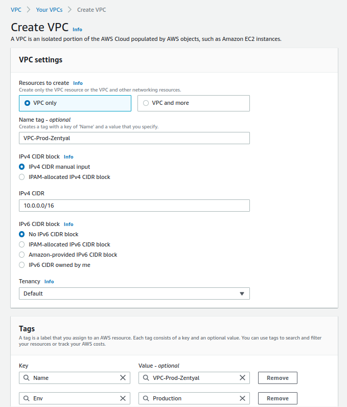

Once it has been created, we can optionally enable the following options:

* DNS hostname
* DNS resolution

### Subnet

Once we have our VPC created, we will proceed to create a public [subnet], which will be where we will locate our Zentyal server.

[subnet]: https://docs.aws.amazon.com/vpc/latest/userguide/configure-subnets.html


The subnet configuration will be:

* **Name:** SUB-Prod-Public-1
* **Availability zone:** eu-west-3a
* **IPv4 CIDR:** 10.0.1.0/24
* **Tags:**
    * **Name:** SUB-Prod-Public-1
    * **Env:** Production

Below is an image with the configuration.

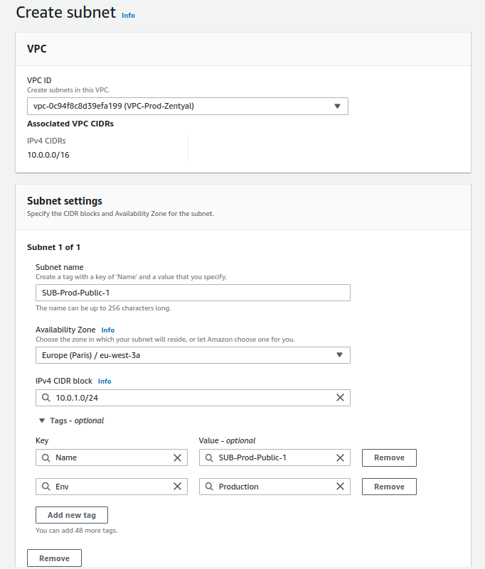

### Gateway

The next thing we'll do is configure an [Internet gateway] for our VPC, so that instances using this subnet can access the internet.

[Internet gateway]: https://docs.aws.amazon.com/vpc/latest/userguide/VPC_Internet_Gateway.html

The Internet gateway will be configured as follows:

* **Name:** GW-Prod-1
* **Tags:**
    * **Env:** Production
    * **Name:** GW-Prod-1

Here is an image of the configuration:

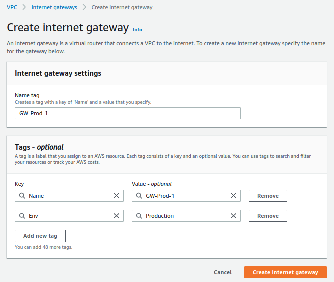

Finally, we will associate the newly created resource with our VPC.

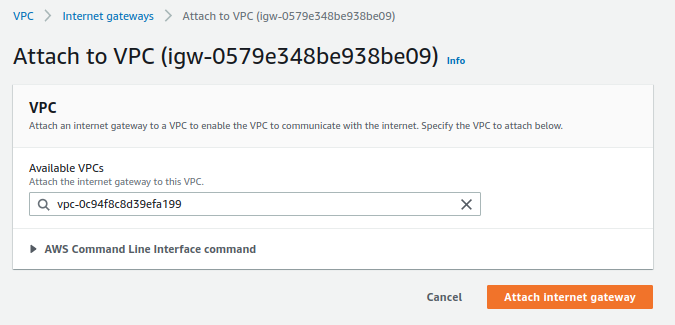

### Routes

Once we have created both the subnet and the gateway, we will need to create or modify the [route table] that AWS creates by default when we create a VPC.

[route table]: https://docs.aws.amazon.com/vpc/latest/userguide/VPC_Route_Tables.html


For this case, we will have to edit the existing resource and perform the following actions:

1. Create the tags as shown in the image:

    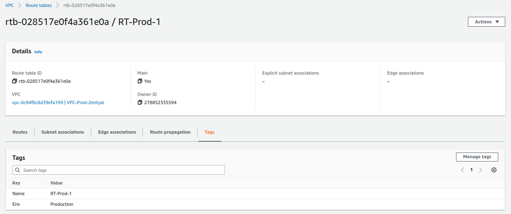

2. Ensure that the subnet is associated:

    

3. Set the gateway to resolve the rest of the network ranges.

    

### Network ACL

The next resource we will modify is the default [network ACL] that AWS creates for us. The rules defined there allow us to deny or allow incoming and outgoing traffic from our subnets.

[network ACL]: https://docs.aws.amazon.com/vpc/latest/userguide/vpc-network-acls.html

Once again, AWS creates a default network ACL for us, which we will modify as follows:

1. Create the tags as shown in the image:

    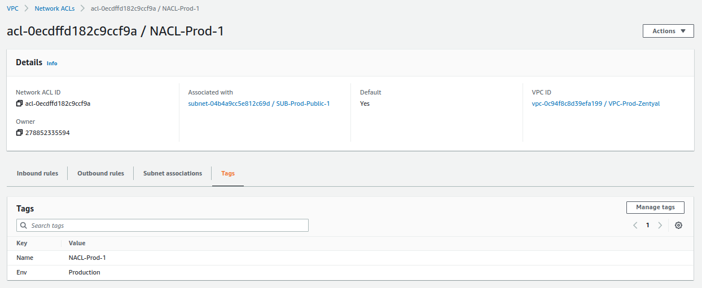

2. Ensure that the subnet is associated:

    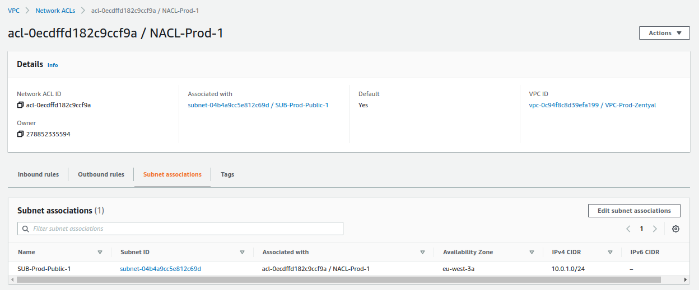

3. Verify that all inbound traffic is allowed:

    

4. Verify that all outbound traffic is allowed:

    

### Security Group

The last resource we will modify in the VPC service is the [security group] that we will associate with the Zentyal server, which is basically a virtual firewall that allows us to establish the allowed ports and IPs.

[security group]: https://docs.aws.amazon.com/AWSEC2/latest/UserGuide/ec2-security-groups.html

For this specific resource, we will do 2 things:

1. We will modify the tags of the resource that AWS created by default when we created the VPC.

    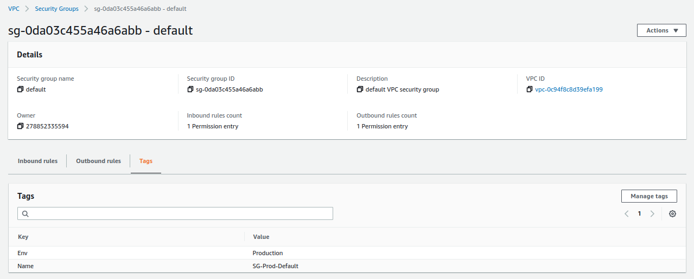

2. We will create a new resource, which will contain the ports that we will allow public access to, which are:

    * **ICMP-IPv4 echo request** -> `ping`
    * **22/TCP** -> SSH.
    * **25/TCP** -> SMTP.
    * **53/UDP** -> DNS.
    * **53/TCP** -> DNS.
    * **143/TCP** -> IMAP.
    * **443/TCP** -> HTTPS.
    * **465/TCP** -> SMTPS.
    * **587/TCP** -> SMTPS con StartTLS.
    * **993/TCP** -> IMAPS.
    * **8443/TCP** -> Zentyal GUI.
    * **11994/UDP** -> OpenVPN.

    The result should be as follows:

    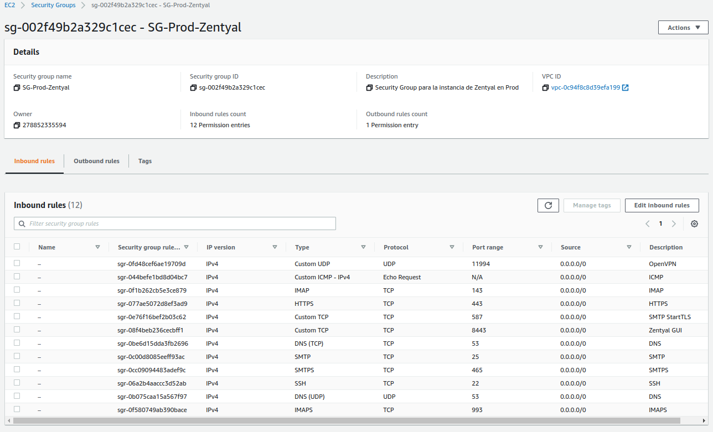

    In addition, we will also set the following tags:

    * **Name**: SG-Prod-Zentyal
    * **Tags**:
        * **Name**: SG-Prod-Zentyal
        * **Env**: Production
        * **Host:** arthas.icecrown.es

    !!! note

        The host 'arthas.icecrown.es' will be the name we give to the Zentyal server.

## EC2

Once we have the network (VPC) set up, we will proceed to create the necessary resources in the [EC2] service.

[EC2]: https://docs.aws.amazon.com/AWSEC2/latest/UserGuide/concepts.html

### Group Placement

The first resource we will create is a [placement group], which will allow us to distribute instances (servers) across different hardware, minimizing potential errors that may arise from AWS.

[placement group]: https://docs.aws.amazon.com/AWSEC2/latest/UserGuide/placement-groups.html

The configuration we will set up is:

* **Name**: GP-Prod-1
* **Placement strategy**: Spread
* **Spread level:** Rack
* **Tags:**
    * **Name**: GP-Prod-1
    * **Env**: Production


### Key Pair

Next, we will create a [key pair], which will allow us to connect to the instance via SSH.

[key pair]: https://docs.aws.amazon.com/AWSEC2/latest/UserGuide/ec2-key-pairs.html

**Considerations:**

* Only during key pair generation will it be possible to download the private key.
* Access to the downloaded private key should be restricted, as this key provides full administrator access to the instance without the need to establish a password (default behavior on AWS Linux instances).
* The permissions the key should have are read-only for the user, in octal notation it is: 0400.

The configuration we will set up is:

* **Name**: KP-Prod-Zentyal
* **Key pair type**: RSA
* **Private ket file format:** .pem
* **Tags:**
    * **Name**: KP-Prod-Zentyal
    * **Env**: Production
    * **Host:** arthas.icecrown.es

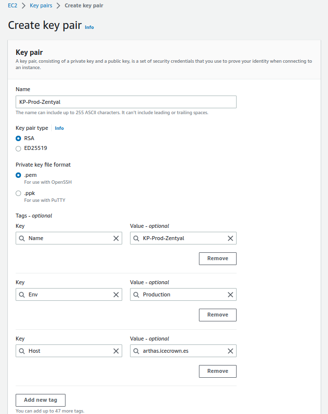

### Network interface

The next resource we will use is to create a [network interface], which will allow us to establish a static IP and associate it with the Zentyal instance, avoiding possible incidents in the most critical module, the network.

[network interface]: https://docs.aws.amazon.com/AWSEC2/latest/UserGuide/using-eni.html

The configuration we will set up is:

* **Name**: NI-Prod-Zentyal
* **Subnet**: SUB-Prod-Public-1
* **Private IPv4 address:** 10.0.1.200
* **Security Group**: SG-Prod-Zentyal
* **Tags:**
    * **Name**: NI-Prod-Zentyal
    * **Env**: Production
    * **Host:** arthas.icecrown.es

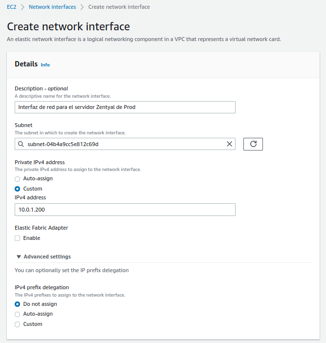
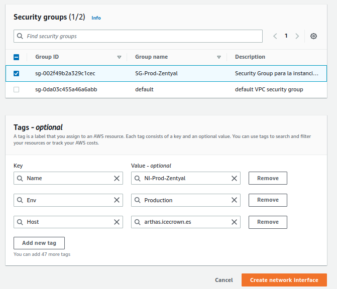

### Instance

Once we have created all the above resources in the EC2 service, we will proceed to create the [compute instance] (server) on which we will install Zentyal.

[compute instance]: https://docs.aws.amazon.com/AWSEC2/latest/UserGuide/concepts.html

**Considerations:**

* Due to the Zentyal modules we will be using, the instance must have a minimum of 4GB of RAM.
* For the project's testing purposes, I have opted for the most economical instance possible, which is of the general type and is called [t3a.medium].
* The instance price can be obtained from [here].
    * In my specific case, the cost per hour (if running) will be '**$0.04**'.
        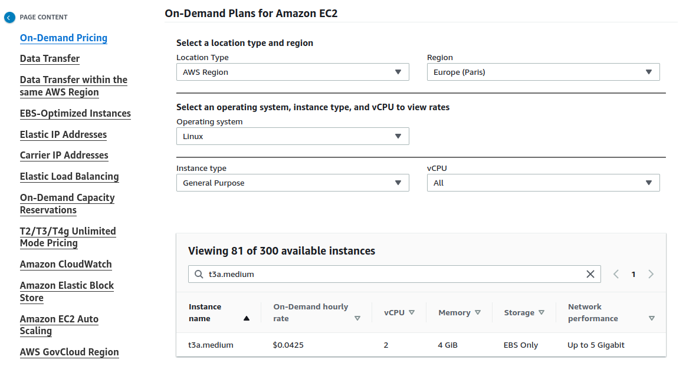
    * Instance price
* I will use 3 EBS (hard disks) volumes to establish the following partitioning:
    * System EBS of 30GB.
    * Email EBS of 10GB.
    * Personal directories and shared resources EBS of 10GB.
* I will enable advanced monitoring since I will use AWS CloudWatch as the monitoring system.

    !!! warning

        This option has an additional cost, which can be checked [here](https://aws.amazon.com/cloudwatch/pricing/).

* The options I will configure and that represent a monthly cost are:
    * Instance type.
    * Root volume.
    * Detailed CloudWatch monitoring.

[t3a.medium]: https://aws.amazon.com/ec2/instance-types/t3/
[here]: https://aws.amazon.com/ec2/pricing/on-demand/

Therefore, the configuration we will define in the service will be:

* **Name**: arthas.icecrown.es
* **AMI**: Ubuntu Server 20.04 LTS (HVM), SSD Volume Type
* **Architecture:** 64-bit (x86)
* **Instance type**: t3a.medium
* **Key pair**: KP-Prod-Zentyal
* **Network settings**:
    * **VPC**: VPC-Prod-Zentyal
    * **Subnet**: SUB-Prod-Public-1
    * **Auto-assign public IP**: Disable
    * **Firewall**: Select existint security group
    * **Network interface:** NI-Prod-Zentyal
* **Configure storage:**
    * **Root volume:** 30 GB, GP3
* **Advanced details:**
    * **Shutdown behavior:** Stop
    * **Termination protection:** Enable
    * **Detailed CloudWatch monitoring:** Enable
    * **Placement group:** GP-Prod-1
* **Tags:**
    * **Name**: arthas.icecrown.es
    * **Env**: Production
    * **Host:** arthas.icecrown.es


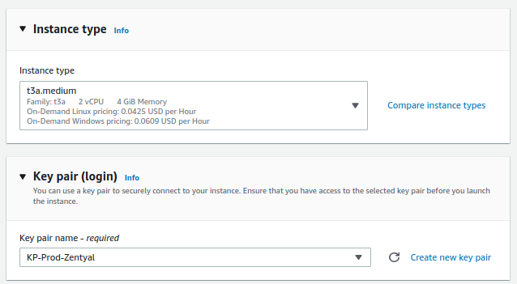


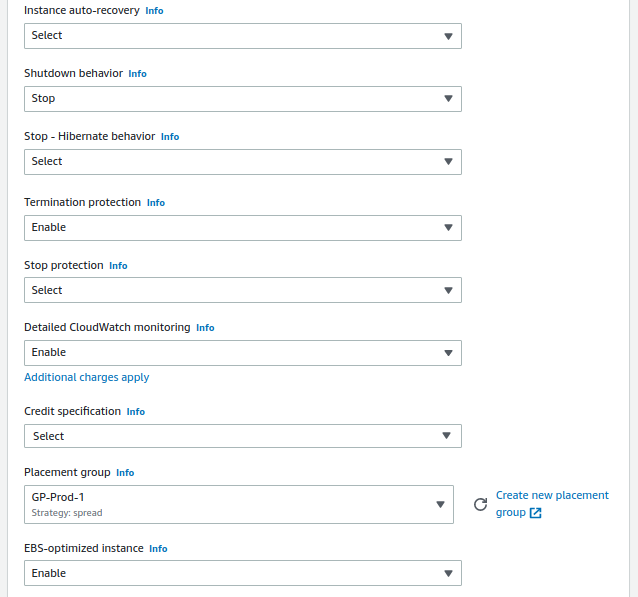

### Volumes

Once we have created the instance, we will proceed to configure the [volumes] (hard drive) of our Zentyal server. In my specific case, I will create two additional volumes, one to host emails and another for personal directories and shared resources. The reason is that it will allow me to define different backup policies at the AWS level, and the data is on separate disks, with the advantages that this entails, such as recovering information in case of human error.

Before proceeding to create the additional volumes, we will set the tags for the system volume associated with the running instance:

* **Name**: EBS-Prod-System-Zentyal
* **Env**: Production
* **Host:** arthas.icecrown.es
* **Type:** System

[volumes]: https://docs.aws.amazon.com/AWSEC2/latest/UserGuide/ebs-volumes.html


Next, we create the additional volumes:

!!! warning

    The volumes must be in the same availability zone as the instance, **eu-west-3a** in my case.

**For mailboxes:**

* **Volume Type:** General Purpose SSD (gp3)
* **Size:** 10GiB
* **IOPS:** 3000
* **Throughput:** 125
* **Availability zone:** eu-west-3a
* **Snapshot ID:** Don't create volume from a snapshot
* **Encryption:** Enabled
    * **KMS key:** (default) aws/ebs
* **Tags:**
    * **Name:** EBS-Prod-Mail-Zentyal
    * **Env**: Production
    * **Host:** arthas.icecrown.es
    * **Type:** Mail

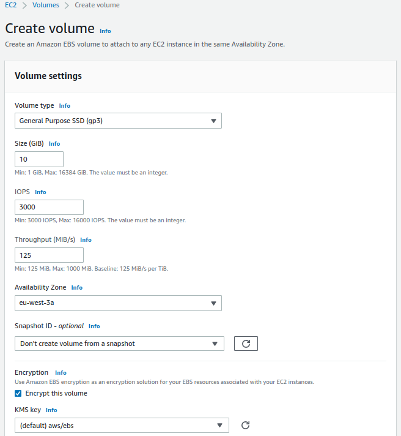
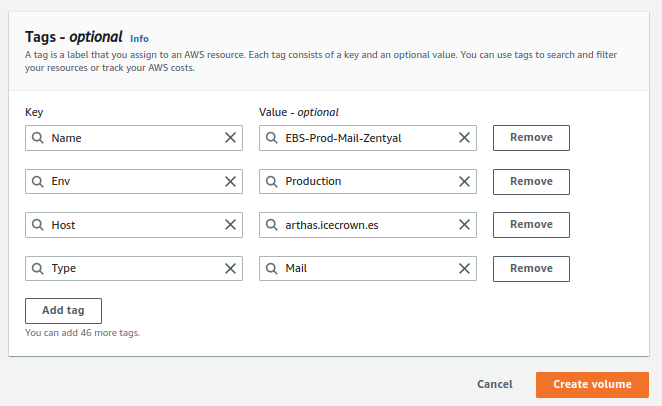

**For personal directories and shared resources:**

* **Volume Type:** General Purpose SSD (gp3)
* **Size:** 10GiB
* **IOPS:** 3000
* **Throughput:** 125
* **Availability zone:** eu-west-3a
* **Snapshot ID:** Don't create volume from a snapshot
* **Encryption:** Enabled
    * **KMS key:** (default) aws/ebs
* **Tags:**
    * **Name:** EBS-Prod-Shares-Zentyal
    * **Env**: Production
    * **Host:** arthas.icecrown.es
    * **Type:** Shares


Finally, we will associate both volumes with the EC2 instance.

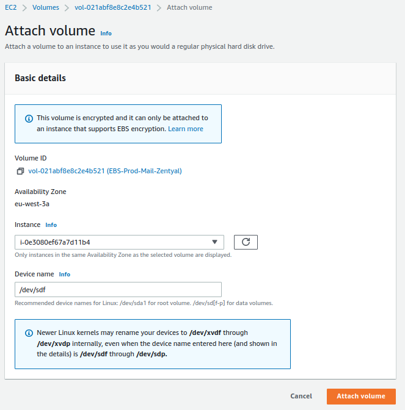


### Elastic IP

The next resource we will create is an [Elastic IP], which is simply a public IPv4 address that we will associate with our instance.

[Elastic IP]: https://docs.aws.amazon.com/AWSEC2/latest/UserGuide/elastic-ip-addresses-eip.html

The tags we will define for the resource are:

* **Name:** EIP-Prod-Zentyal
* **Env**: Production
* **Host:** arthas.icecrown.es


Finally, we associate the newly created resource with the instance.

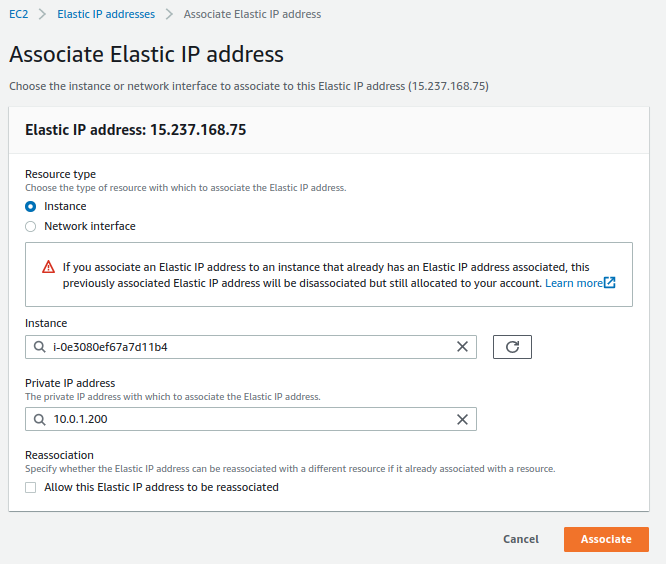

## Route 53

The next necessary action is to create the DNS record in the domain to point to the public IP associated with the instance. In my specific case, I will use the [Route 53] service to create the `A` type DNS record, as this is where I have registered the domain.

[Route 53]: https://docs.aws.amazon.com/Route53/latest/DeveloperGuide/Welcome.html


## Request email sending

To be able to send emails from the Zentyal server through the associated static IP, it is necessary to request AWS to remove the restriction they have by default through a form. To do this, simply follow [this link] where the steps are explained.

[this link]: https://aws.amazon.com/premiumsupport/knowledge-center/ec2-port-25-throttle/

**Considerations about the message:**

* It must be written in English.
* It must be detailed; otherwise, they will request more information or even deny the request.
* Some recommended details are:
    * Usage of the server.
    * Number of users that will use email.
    * Approximate number of emails that will be sent per hour.

An example of the message:

```text linenums="1"
Hi Support team,

We have deployed a new EC2 instance that acts as a Mail server using Zentyal operating system.
Would you mind removing the default restriction so my users can send emails outside, please?

Below you have more information:

* We are a small IT business focused on web development.
* Around 20 users will send and receive emails every day.
* We think we might send around 50 emails per hour.

Kind regards, Daniel.
```

## Saving Plans

Once the server has been created, configured, and thoroughly tested, it is highly recommended to purchase the instance using [Saving Plans], as it will allow us to significantly reduce the cost of using the deployed EC2 instance.

[Saving Plans]: https://aws.amazon.com/savingsplans/?nc1=h_ls
