---

tags:
  - AWS

---

# AWS

En esta página se explicará como configurar el entorno del proveedor cloud AWS para poder desplegar el servidor Zentyal.

## Requisitos

Para poder seguir este documento, se necesitará lo siguiente:

1. Una cuenta en AWS.
2. Un usuario con permisos para los siguientes servicios:
    * Route53 (en caso de tener alojado el dominio en este servicio)
    * VPC
    * KMS
    * EC2

## Región

Antes de empezar a crear los recursos, tenemos que saber cual es la mejor región a usar. Para ello, haremos uso de [esta] página web, donde podremos ver que región tiene una mejora latencia desde nuestra ubicación.

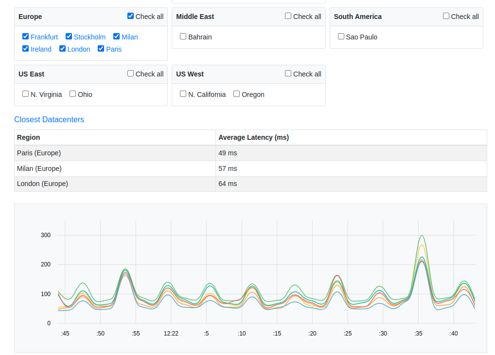

Como se puede ver en la imagen, en mi caso concreto, he seleccionado todas las regiones de Europa, ya que me encuentro en España. El resultado mostrado indica que **Paris** es la región con mejor latencia, por lo tanto, ésta será la región donde desplegaré el entorno.

[esta]: https://www.awsspeedtest.com

## VPC

El primer servicio que configuraremos es [VPC], el cual es básicamente una red virtual donde ubicaremos nuestro servidor Zentyal.

[VPC]: https://docs.aws.amazon.com/es_es/vpc/latest/userguide/what-is-amazon-vpc.html

Vamos a crear una VPC con la siguiente configuración:

* **Name:** VPC-Prod-Zentyal
* **IPv4 CIDR:** 10.0.0.0/16
* **IPv6:** Disabled
* **Tenancy:** Default
* **Tags:**
    * **Name:** VPC-Prod-Zentyal
    * **Env**: Production

!!! nota

    Como Zentyal no permite IPv6, lo deshabilitamos para evitar posibles brechas de seguridad.

A continuación una imagen con la configuración.


Una vez que haya sido creada, podremos habilitar opcionalmente las siguientes opciones:

* DNS hostname
* DNS resolution

### Subnet

Una vez que tenemos nuestra VPC creada, procederemos a crear una [subred] pública, que será donde ubicaremos nuestro servidor Zentyal.

[subred]: https://docs.aws.amazon.com/es_es/vpc/latest/userguide/configure-subnets.html

La configuración de la subnet será:

* **Name**: SUB-Prod-Public-1
* **Availability zone**: eu-west-3a
* **IPv4 CIDR**: 10.0.1.0/24
* **Tags**:
    * **Name**: SUB-Prod-Public-1
    * **Env**: Production

A continuación una imagen con la configuración.


### Gateway

Lo siguiente que haremos será configurar la puerta de enlace de tipo [Internet gateway] para nuestra VPC, de esta forma, las instancias que usen esta subred tendrán acceso a Internet.

[Internet gateway]: https://docs.aws.amazon.com/es_es/vpc/latest/userguide/VPC_Internet_Gateway.html

La configuración de la puerta de enlace será:

* **Name**: GW-Prod-1
* **Tags**:
    * **Env**: Production
    * **Name**: GW-Prod-1

A continuación una imagen con la configuración.

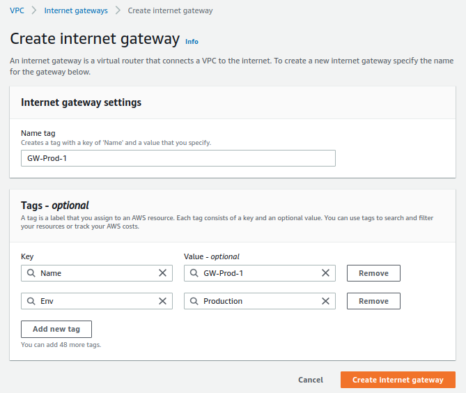

Finalmente, asociaremos el recurso recién creado a nuestra VPC.


### Routes

Una vez que tenemos tanto la subred como la puerta de enlace creadas, tendremos que crear modificar la [tabla de enrutamiento] que AWS nos crea por defecto cuando creamos una VPC.

[tabla de enrutamiento]: https://docs.aws.amazon.com/es_es/vpc/latest/userguide/VPC_Route_Tables.html

Para este caso, tendremos que editar el recurso ya existente y realizar las siguientes acciones:

1. Creamos los tags tal y como muestra la imagen:

    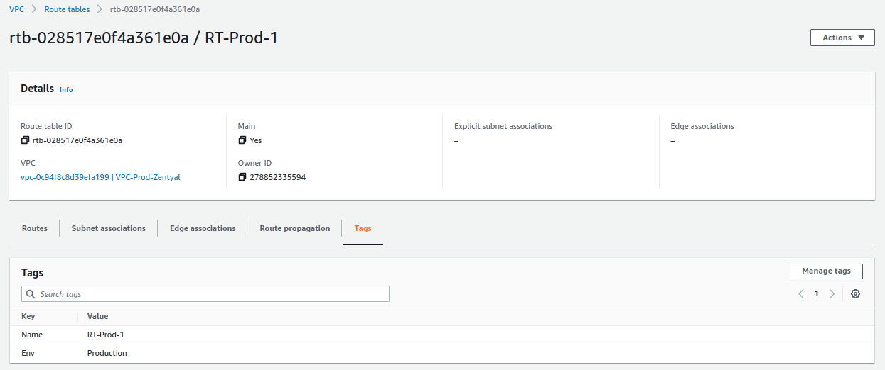

2. Nos aseguramos que la subred esté asociada:

    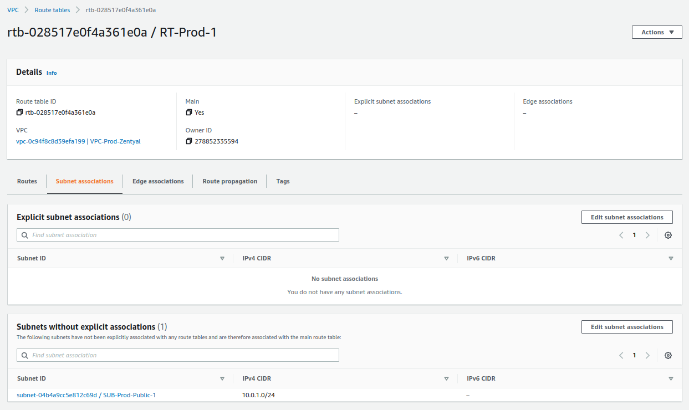

3. Establecemos la puerta de enlace para que resuelva el resto de rangos de red.

    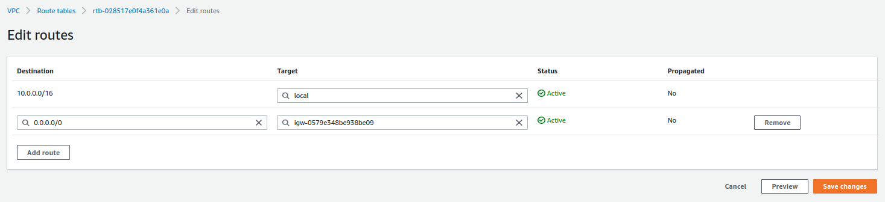

### Network ACL

El siguiente recurso que modificaremos será la [ACL de red] que AWS nos crea por defecto. Las reglas definidas allí nos permiten denegar o permitir el tráfico entrante y saliente de nuestra subnets.

[ACL de red]: https://docs.aws.amazon.com/es_es/vpc/latest/userguide/vpc-network-acls.html

Una vez más, AWS nos crea por defecto una ACL de red, la cual modificaremos de la siguiente manera:

1. Creamos los tags tal y como muestra la imagen:

    

2. Nos aseguramos que la subred esté asociada:

    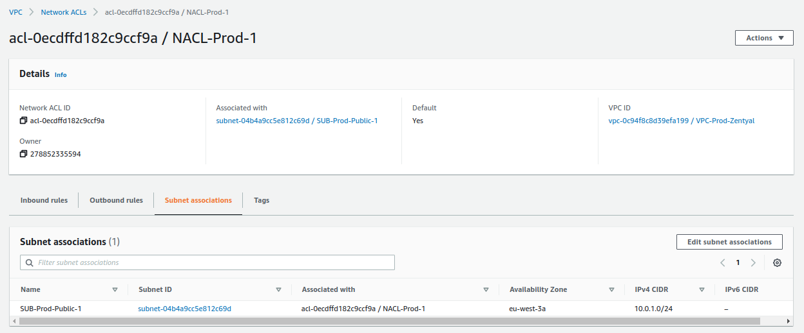

3. Verificamos que todo el tráfico entrante está permitido:

    

4. Verificamos que todo el tráfico saliente está permitido:

    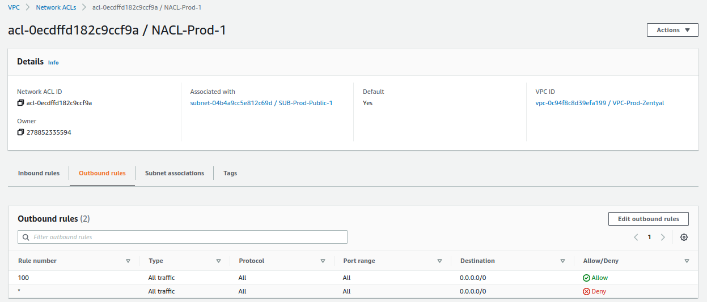

### Security Group

El último recurso que modificaremos en el servicio de VPC es el [grupo de seguridad] que asociaremos al servidor Zentyal, el cual básicamente un firewall virtual que permite establecer los puertos e IPs que se permiten.

[grupo de seguridad]: https://docs.aws.amazon.com/es_es/AWSEC2/latest/UserGuide/ec2-security-groups.html

Para este recurso concreto, haremos 2 cosas:

1. Modificaremos las tags del recurso que creó AWS por defecto cuando creamos la VPC.

    

2. Crearemos un nuevo recurso, el cual contendrá los puertos que permitiremos acceder públicamente, los cuales son:

    * **ICMP-IPv4 echo request** -> Permite poder hacer un `ping` al servidor.
    * **22/TCP** -> SSH.
    * **25/TCP** -> SMTP.
    * **53/UDP** -> DNS.
    * **53/TCP** -> DNS.
    * **143/TCP** -> IMAP.
    * **443/TCP** -> HTTPS.
    * **465/TCP** -> SMTPS.
    * **587/TCP** -> SMTPS con StartTLS.
    * **993/TCP** -> IMAPS.
    * **8443/TCP** -> Zentyal GUI.
    * **11994/UDP** -> OpenVPN.

    El resultado deberá ser el siguiente:

    

    Además, también le establecemos las siguientes tags:

    * **Name**: SG-Prod-Zentyal
    * **Tags**:
        * **Name**: SG-Prod-Zentyal
        * **Env**: Production
        * **Host:** arthas.icecrown.es

    !!! nota

        El host 'arthas.icecrown.es' será el nombre que le daré al servidor Zentyal.

    

    Finalmente, nos aseguraremos de que todo tráfico saliente esté permitido:

    

## EC2

Una vez que tenemos la red (VPC) configurada, procederemos a crear los recursos necesarios en el servicio de [EC2].

[EC2]: https://docs.aws.amazon.com/es_es/AWSEC2/latest/UserGuide/concepts.html

### Group Placement

El primer recurso que crearemos será un [grupo de ubicación], el cual nos permitirá distribuir las instancias (servidores) en hardware distinto, por lo que minimizaremos posibles errores que puedan surgir por parte de AWS.

[grupo de ubicación]: https://docs.aws.amazon.com/es_es/AWSEC2/latest/UserGuide/placement-groups.html

La configuración que estableceremos será:

* **Name**: GP-Prod-1
* **Placement strategy**: Spread
* **Spread level:** Rack
* **Tags:**
    * **Name**: GP-Prod-1
    * **Env**: Production

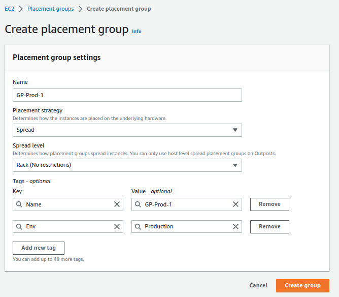

### Key Pair

Después, crearemos un de [pares de claves], las cuales nos permitirán conectarnos a la instancia a través de SSH.

[pares de claves]: https://docs.aws.amazon.com/es_es/AWSEC2/latest/UserGuide/ec2-key-pairs.html

**Consideraciones:**

* Únicamente durante la generación del par de claves será posible descargar la clave privada.
* El acceso a la clave privada descargada deberá estar restringido, ya que con este clave tendremos acceso completo como administrador a la instancia sin necesidad de establecer una contraseña (comportamiento por defecto en las instancias Linux de AWS).
* Los permisos que debe tener la clave son de sólo lectura para el usuario, en notación octal es: **0400**.

La configuración que estableceremos será:

* **Name**: KP-Prod-Zentyal
* **Key pair type**: RSA
* **Private ket file format:** .pem
* **Tags:**
    * **Name**: KP-Prod-Zentyal
    * **Env**: Production
    * **Host:** arthas.icecrown.es


### Network interface

El siguiente recurso que usaremos será crear una [interfaz de red], la cual nos permitirá establecer una IP estática y asociarla con la instancia de Zentyal, evitando así posibles incidencias en el módulo más crítico, el de red.

[interfaz de red]: https://docs.aws.amazon.com/es_es/AWSEC2/latest/UserGuide/using-eni.html

La configuración que estableceremos será:

* **Name**: NI-Prod-Zentyal
* **Subnet**: SUB-Prod-Public-1
* **Private IPv4 address:** 10.0.1.200
* **Security Group**: SG-Prod-Zentyal
* **Tags:**
    * **Name**: NI-Prod-Zentyal
    * **Env**: Production
    * **Host:** arthas.icecrown.es

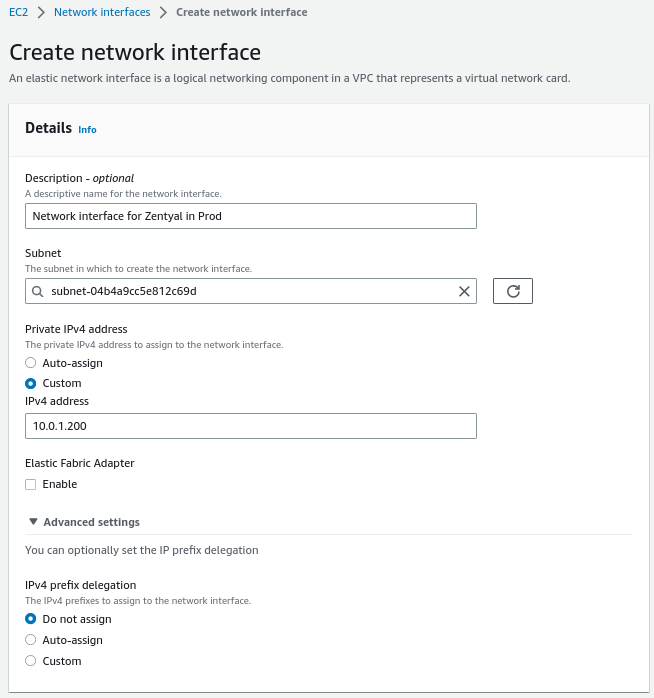


### Instance

Una vez que hemos creado todos los recursos anteriores en el servicio de EC2, procederemos a crear la [instancia de computación] (servidor) sobre el que instalaremos Zentyal.

[instancia de computación]: https://docs.aws.amazon.com/es_es/AWSEC2/latest/UserGuide/concepts.html

**Consideraciones:**

* Debido a los módulos de Zentyal que usaremos, la instancia deberá tener un mínimo de 4GB de RAM.
* Para las pruebas del proyecto, he optado por la instancia más económica posible, que es de tipo general y se llama [t3a.medium].
* El precio de la instancia lo podéis obtener de [aquí].
    * En mi caso concreto, el coste por hora (en caso de estar iniciada) será de '**0.04$**'.
        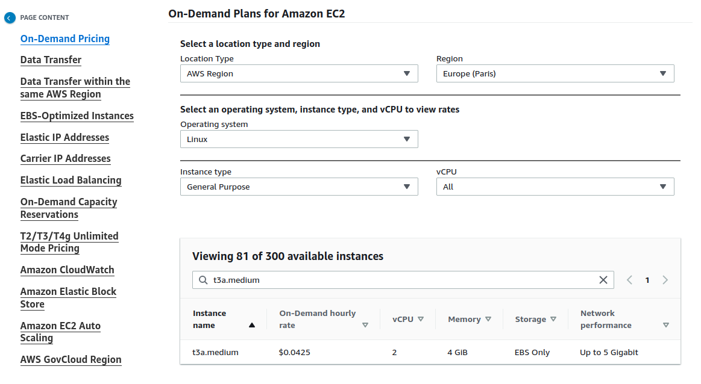
* Usaré 3 volúmenes EBS (discos duros) para establecer el siguiente particionado:
    * EBS del sistema de 30GB.
    * EBS para los emails de 10GB.
    * EBS para los directorios personales y los recursos compartidos de 10GB.
* Habilitaré la monitorización avanzada ya que usaré AWS CloudWatch como sistema de monitorización.

    !!! warning

         Esta opción tiene un coste añadido, el cual se puede consultar [aquí](https://aws.amazon.com/cloudwatch/pricing/).

* Las opciones que configuraré y que suponen un coste mensual son:
    * Instance type.
    * Root volume.
    * Detailed CloudWatch monitoring.

[t3a.medium]: https://aws.amazon.com/ec2/instance-types/t3/
[aquí]: https://aws.amazon.com/ec2/pricing/on-demand/

Por lo tanto, la configuración que definiremos en el servicio será:

* **Name**: arthas.icecrown.es
* **AMI**: Ubuntu Server 20.04 LTS (HVM), SSD Volume Type
* **Architecture:** 64-bit (x86)
* **Instance type**: t3a.medium
* **Key pair**: KP-Prod-Zentyal
* **Network settings**:
    * **VPC**: VPC-Prod-Zentyal
    * **Subnet**: SUB-Prod-Public-1
    * **Auto-assign public IP**: Disable
    * **Firewall**: Select existint security group
    * **Network interface:** NI-Prod-Zentyal
* **Configure storage:**
    * **Root volume:** 30 GB, GP3
* **Advanced details:**
    * **Shutdown behavior:** Stop
    * **Termination protection:** Enable
    * **Detailed CloudWatch monitoring:** Enable
    * **Placement group:** GP-Prod-1
* **Tags:**
    * **Name**: arthas.icecrown.es
    * **Env**: Production
    * **Host:** arthas.icecrown.es


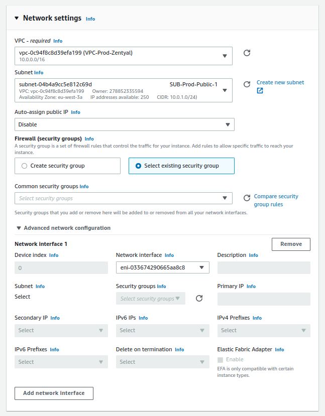


### Volumes

Una vez que tenemos la instancia creada, procederemos a configurar los [volúmenes] (disco duro) de nuestro servidor Zentyal. En mi caso concreto, crearé dos volúmenes adicionales, uno para alojar los emails y otro para los directorios personales y los recursos compartidos. El motivo es que me permitirá definir políticas de copias de seguridad distintas a nivel de AWS, además que los datos están en discos separados, con las ventajas que eso conlleva, como por ejemplo, recuperar información ante un fallo humano.

Antes de proceder a crear los volúmenes adicionales, estableceremos las tags para el volumen del sistema asociado a la instancia en ejecución:

* **Name**: EBS-Prod-System-Zentyal
* **Env**: Production
* **Host:** arthas.icecrown.es
* **Type:** System

[volúmenes]: https://docs.aws.amazon.com/AWSEC2/latest/UserGuide/ebs-volumes.html

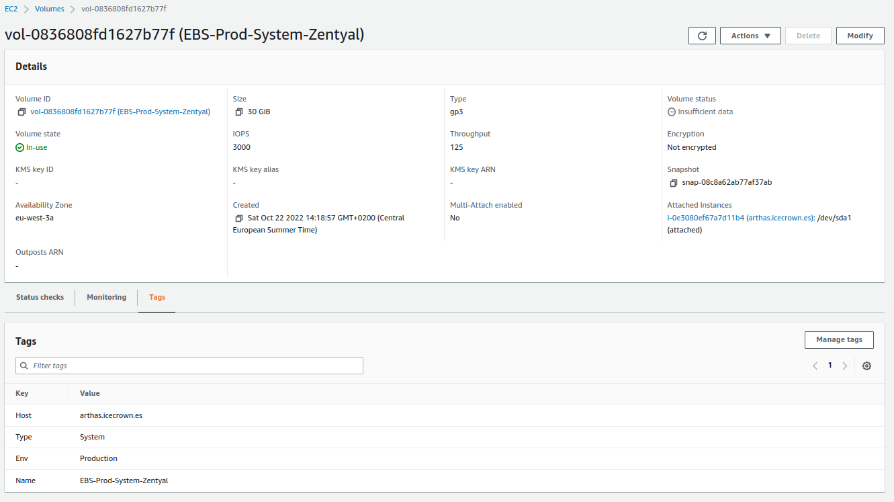

A continuación, creamos los volúmenes adicionales:

!!! warning

    Los volúmenes deberán estar en la misma zona de disponibilidad que la instancia, **eu-west-3a** en mi caso.

**Para los buzones de correo:**

* **Volume Type:** General Purpose SSD (gp3)
* **Size:** 10GiB
* **IOPS:** 3000
* **Throughput:** 125
* **Availability zone:** eu-west-3a
* **Snapshot ID:** Don't create volume from a snapshot
* **Encryption:** Enabled
    * **KMS key:** (default) aws/ebs
* **Tags:**
    * **Name:** EBS-Prod-Mail-Zentyal
    * **Env**: Production
    * **Host:** arthas.icecrown.es
    * **Type:** Mail


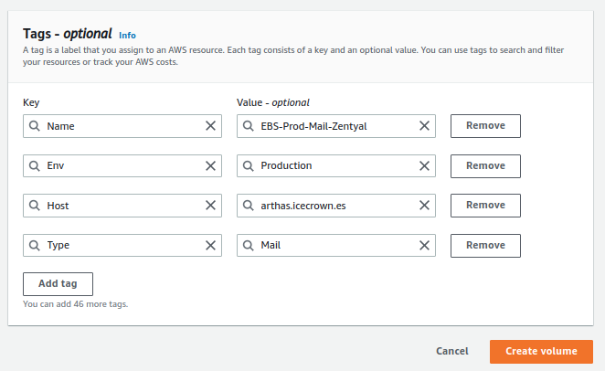

**Para los directorios personales y recursos compartidos:**

* **Volume Type:** General Purpose SSD (gp3)
* **Size:** 10GiB
* **IOPS:** 3000
* **Throughput:** 125
* **Availability zone:** eu-west-3a
* **Snapshot ID:** Don't create volume from a snapshot
* **Encryption:** Enabled
    * **KMS key:** (default) aws/ebs
* **Tags:**
    * **Name:** EBS-Prod-Shares-Zentyal
    * **Env**: Production
    * **Host:** arthas.icecrown.es
    * **Type:** Shares


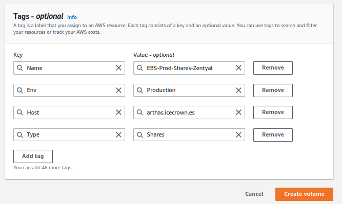

Finalmente, asociaremos ambos volúmenes a la instancia EC2.


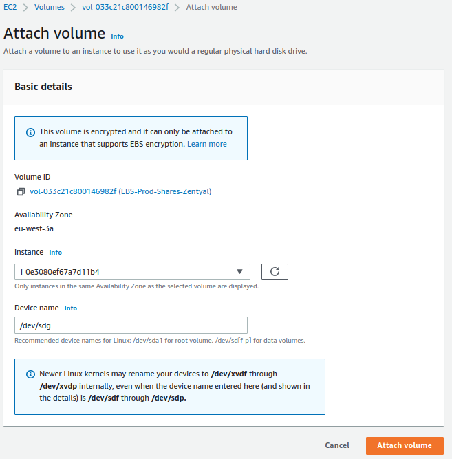

### Elastic IP

El siguiente recurso que crearemos será una [IP elástica], que no es más que una dirección IPv4 pública que asociaremos a nuestra instancia.

[IP elástica]: https://docs.aws.amazon.com/es_es/AWSEC2/latest/UserGuide/elastic-ip-addresses-eip.html

Las tags que definiremos al recurso serán:

* **Name:** EIP-Prod-Zentyal
* **Env**: Production
* **Host:** arthas.icecrown.es

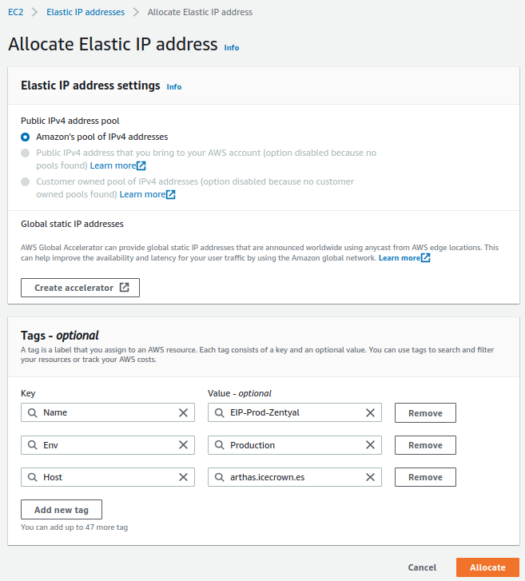

Finalmente, asociamos el recurso recién creado a la instancia.


## Route 53

La siguiente acción necesaria es crear el registro DNS en el dominio para que apunte a la IP pública asociada a la instancia. En mi caso concreto, usaré el servicio [Route 53] para la creación del registro DNS de tipo `A`, ya que es allí donde tengo contratado el dominio.

[Route 53]: https://docs.aws.amazon.com/es_es/Route53/latest/DeveloperGuide/Welcome.html


## Solicitar envió de correos

Para poder enviar emails desde el servidor Zentyal a través de la IP estática asociada, es necesario solicitar a AWS a través de un formulario que nos elimine la restricción que tienen por defecto. Para ello, simplemente hay que seguir [este] enlace donde se explican los pasos.

[este]: https://aws.amazon.com/premiumsupport/knowledge-center/ec2-port-25-throttle/

**Consideraciones sobre el mensaje:**

* Debe estar escrito en Inglés.
* Ha de ser detallado, de lo contrario te solicitarán más información o incluso podrían negar la solicitud.
* Algunos detalles recomendados son:
    * Uso que se le dará al servidor.
    * Número de usuarios que usarán el correo.
    * Número aproximado de emails que se enviarán por hora.

Un ejemplo del mensaje:

```text
Hi Support team,

We have deployed a new EC2 instance that acts as a Mail server using Zentyal operating system.
Would you mind removing the default restriction so my users can send emails outside, please?

Below you have more information:

* We are a small IT business focused on web development.
* Around 20 users will send and receive emails every day.
* We think we might send around 50 emails per hour.

Kind regards, Daniel.
```

## Saving Plans

Una vez que el servidor haya sido creado, configurado y testado en profundidad, es altamente recomendable contratar la instancia usando [Saving Plans], ya que nos permitirá reducir significativamente el coste que supone el uso de la instancia EC2 desplegada.

[Saving Plans]: https://aws.amazon.com/es/savingsplans/?nc1=h_ls
