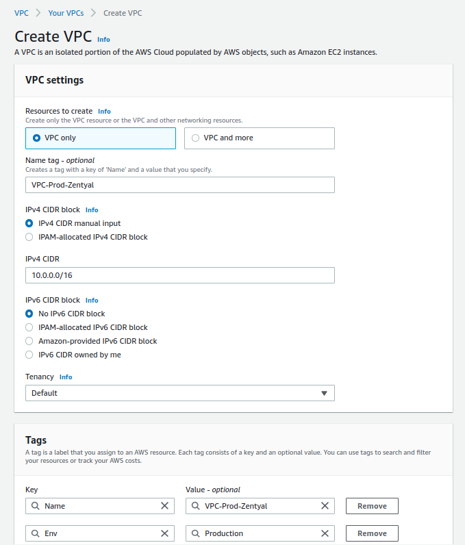
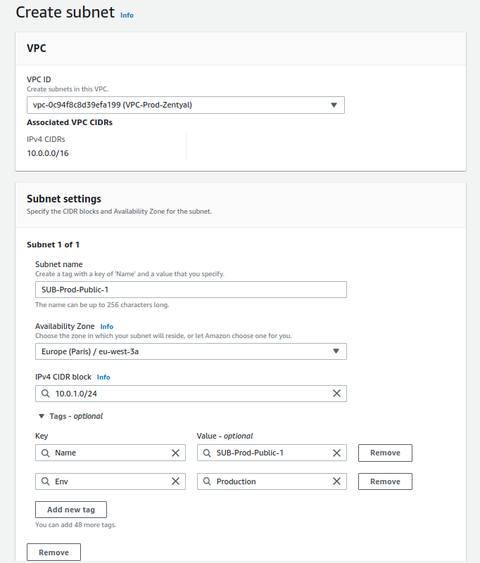
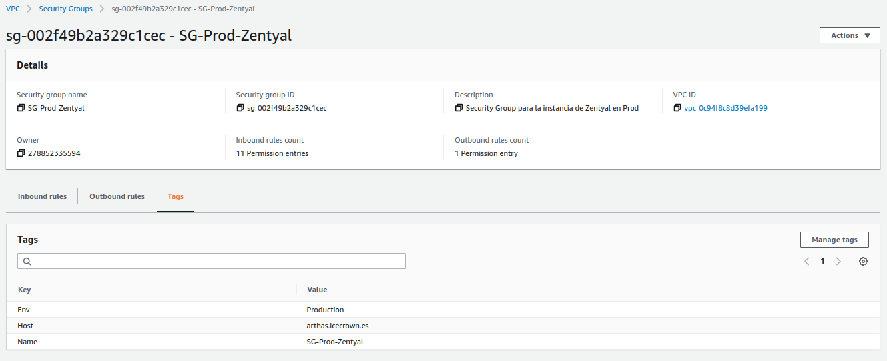
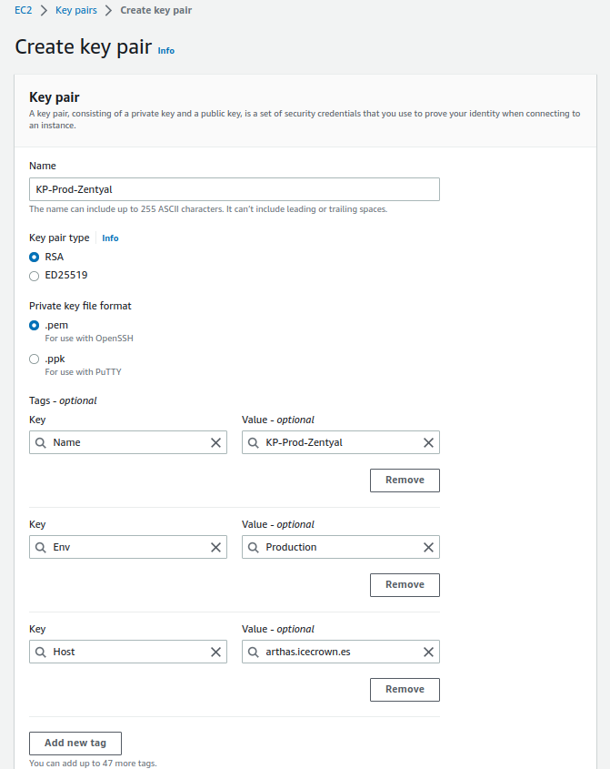

# AWS

A continuación se indican los recursos en AWS necesarios para la configuración del entorno necesario y recomendable para desplegarlas Zentyal.

## Requisitos

* Se ha de tener creada una cuenta de AWS.
* El usuario con el que se realicen las acciones, deberá de tener permisos para los siguientes servicos:
    * Route53
    * VPC
    * KMS
    * EC2
    * SNS
    * CloudWatch

## Región

Antes de empezar a crear los recursos, tenemos que saber cual es la mejor región a usar. Para ello, haremos uso de [esta] página web, donde podremos seleccionar las ubicaciones más próximas geográficamente.


Como se puede ver en la imagen, en mi caso concreto, he selecionado todas las regiones de Europa, ya que me encuentro en España. El resultado mostrado indica que **Paris** es la región con mejor latencia, por lo tanto, ésta será la región donde desplegaré el entorno.

[esta]: https://www.awsspeedtest.com/latency


## VPC

El primer servicio que configuraremos es [AWS VPC], el cual es básicamente una red virtual donde ubicaremos nuestro servidor Zentyal.

[AWS VPC]: https://docs.aws.amazon.com/es_es/vpc/latest/userguide/what-is-amazon-vpc.html

Vamos a crear una VPC con los siguientes requisitos:

* **Name:** VPC-Prod-Zentyal
* **IPv4 CIDR:** 10.0.0.0/16
* **IPv6:** Deshabilitado
* **Tenancy:** Default
* **Tags:**
  * **Env**: Production

**NOTA:** Como Zentyal no permite IPv6, lo deshabilitamos para evitar posibles brechas de seguridad.

A continuación una imagen con la configuración.



Una vez que haya sido creada, podremos habilitar opcionalmente las siguientes opciones:

* DNS hostnames
* DNS resolution

### Subnet

Una vez que tenemos nuestra VPC creada, procederemos a crear [subred] pública, que será donde ubicaremos nuestro servidor Zentyal.

[subred]: https://docs.aws.amazon.com/es_es/vpc/latest/userguide/configure-subnets.html

Los requisitos de la subnet serán:

* **Name**: SUB-Prod-Public-1
* **Availability zone**: eu-west-3a
* **IPv4 CIDR**: 10.0.1.0/24
* **Tags**:
  * **Env**: Production

A continuación una imagen con la configuración.



### Gateway

Lo siguiente que haremos será configurar la puerta de enlace de tipo [Internet gateway] para nuestra VPC.

[Internet gateway]: https://docs.aws.amazon.com/es_es/vpc/latest/userguide/VPC_Internet_Gateway.html

Los requisitos de la subnet serán:

* **Name**: GW-Prod-1
* **Tags**:
  * **Env**: Production

A continuación una imagen con la configuración.


Finalmente, asociaremos el recurso recién creado a nuestra VPC.


### Routes

Una vez que tenemos la subred y la puerta de enlace creadas, tendremos que crear modificar la [tabla de enrutamiento] que AWS nos crea por defecto cuando creamos una VPC.

[tabla de enrutamiento]: https://docs.aws.amazon.com/es_es/vpc/latest/userguide/VPC_Route_Tables.html

Para este caso, tendremos que editar el recurso ya existente y realizar las siguientes acciones:

1. Crear las tags al recurso tal y como muestra la imagen:


2. Asegurar que la subned está asociada.


3. Establecer la puerta de enlace.


### Network ACL

La siguiente recurso que modificaremos será las ACL de red, las cuales nos permiten denegar o permitir el tráfico entrante y saliente de nuestra subnets.

[ACL de red]: https://docs.aws.amazon.com/es_es/vpc/latest/userguide/vpc-network-acls.html

Una vez más, AWS nos crea por defecto una ACL de red. Las modificaciones que tendremos que hacer sobre este recurso son:

1. Crear las tags al recurso tal y como muestra la imagen:


2. Asegurar que la subned está asociada.


3. Verificar que todo el tráfico entrante está permitido:


4. Verificar que todo el tráfico saliente está permitido:


### Security Group

El último recurso que modificaremos es el [grupo de seguridad] que asociaremos al servidor Zentyal, es cual básicamente actua como un firewall virtual.

[grupo de seguridad]: https://docs.aws.amazon.com/es_es/AWSEC2/latest/UserGuide/ec2-security-groups.html

En este recurso concreto, haremos 2 cosas:

1. Modificaremos las tags del recurso que creó AWS por defecto cuando creamos la VPC.
2. Crearemos un nuevo recurso, el cual contendrá los puertos que permitiremos acceder públicamente.

Para la modificación del recurso por defecto, simplemente le estableceremos las etiquetas correctas.


Después, crearemos otro recurso, el cual permitirá el acceso a los siguientes puertos:

* **ICMP-IPv4 echo request** Permite poder hacer un `ping` al servidor.
* **22/TCP** SSH.
* **25/TCP** SMTP.
* **53/UDP** DNS vía UDP.
* **53/TCP** DNS vía TCP.
* **143/TCP** IMAP.
* **443/TCP** HTTPS.
* **465/TCP** SMTPS.
* **587/TCP** SMTPS con StartTLS.
* **993/TCP** IMAPS.
* **1194/TCP** OpenVPN.
* **8443/TCP** Zentyal GUI.


Además, también le establecemos las siguientes etiquetas:

* **Name**: SG-Prod-Zentyal
* **Tags**:
  * **Env**: Production
  * **Host:** arthas.icecrown.es



Finalmente, estableceremos que todo tráfico saliente sea permitido:


## EC2

Una vez que tenemos la red configurada, procederemos a crear los recursos necesarios para poder crear nuestro servidor Zentyal.

### Group Placement

El primer recurso que crearemos será un [grupo de ubicación], el cual nos permitirá distruir nuestras instancias (servidores) en hardware distinto, por lo que minimizaremos posibles errores que puedan surgir por parte de AWS.

[grupo de ubicación]: https://docs.aws.amazon.com/es_es/AWSEC2/latest/UserGuide/placement-groups.html

Los requisitos serán:

* **Name**: GP-Prod-1
* **Placement strategy**: Spread
* **Spread level:** Rack
* **Tags:**
  * **Name**: GP-Prod-1
  * **Env**: Production


### Key Pair

Después, crearemos un [par de claves], las cuales nos permitirán conectarnos a la instancia.

[par de claves]: https://docs.aws.amazon.com/es_es/AWSEC2/latest/UserGuide/ec2-key-pairs.html

Consideraciones

* Durante la generación del par de claves, es el único momento donde podemos descargarnos la clave privada.
* La clave privada descargada ha de ser securizada, ya que con ella es posible conectarse a la instancia sin necesidad de establer una contraseña.
  * Los permisos que debe tener la clave son de sólo lectura para el usuario, que en notación Linux serían: 0400

Los requisitos serán:

* **Name**: KP-Prod-Zentyal
* **Key pair type**: RSA
* **Private ket file format:** .pem
* **Tags:**
  * **Name**: KP-Prod-Zentyal
  * **Env**: Production
  * **Host:** arthas.icecrown.es



### Network interface

El siguiente recurso que usaremos serà crear una [interfaz de red], lo que nos permitirá establecer una IP estática, evitando así posibles incidencias.

Los requisitos serán:

* **Name**: NI-Prod-Zentyal
* **Subnet**: SUB-Prod-Public-1
* **Private IPv4 address:** Custom -> 10.0.1.200
* **Security Group**: SG-Prod-Zentyal
* **Tags:**
  * **Name**: NI-Prod-Zentyal
  * **Env**: Production
  * **Host:** arthas.icecrown.es


### Instance

Una vez que hemos creado todos los recursos anteriores, procederemos a crear el recurso que contendrá nuestro servidor Zentyal, el cual es llamado [instancia de computación].

[instancia de computación]: https://docs.aws.amazon.com/es_es/AWSEC2/latest/UserGuide/concepts.html

**Consideraciones:**

* Para los módulos que voy a usar yo, requiero de un mínimo de 2 vCPU y 4GB de RAM.
  * He optado por la instancia de tipo general [t3a.medium]
* El particionado que voy a definir yo personalmente para mi entorno será el siguiente:
  * Disco del sistema de 30GB.
  * Disco para los emails de 10GB.
  * Disco para los recursos compartidos de 10GB.
* He habilitado la monitorización avanzada ya que usaré AWS CloudWatch como sistema de monitorización.
* Las opciones que he configurado y que presentan costes adicionales son:
  * Instance type.
  * Root volume.
  * Detailed CloudWatch monitoring.

Los requisitos serán:

* **Name**: arthas.icecrown.es
* **AMI**: Ubuntu Server 20.04 LTS (HVM), SSD Volume Type
* **Architecture:** 64-bit (x86)
* **Instance type**: t3a.medium
* **Key pair**: KP-Prod-Zentyal
* **Network settings**:
  * **VPC**: VPC-Prod-Zentyal
  * **Subnet**: SUB-Prod-Public-1
  * **Auto-assign public IP**: Disable
  * **Firewall**: Select existint security group
  * **Network interface:** NI-Prod-Zentyal
* **Configure storage:**
  * **Root volume:** 30 GB, GP3
* **Advanced details:**
  * **Shutdown behavior:** Stop
  * **Termination protection:** Enable
  * **Detailed CloudWatch monitoring:** Enable
  * **Placement group:** GP-Prod-1
* **Tags:**
  * **Name**: arthas.icecrown.es
  * **Env**: Production
  * **Host:** arthas.icecrown.es


### Volumes

Una vez que tenemos la instancia creada, tendremos que definir las etiquetas de nuestro volumen como mínimo. En mi caso, crearé adicionalmente 2 volúmenes donde se ubicarán los buzones de correo y los recursos compartidos.

Para la modificación del volumen root asociado a la instancia, simplemente le estableceré las siguientes etiquetas:

* **Name**: EBS-Prod-System-Zentyal
* **Env**: Production
* **Host:** arthas.icecrown.es
* **Type:** System


A continuación, crearé dos volúmenes con los siguientes requisitos:

**Para los buzones de correo:**
* **Volume Type:** General Purpose SSD (gp3)
* **Size:** 10GiB
* **IOPS:** 3000
* **Throughput:** 125
* **Availability zone:** eu-west-3a
* **Snapshot ID:** Don't create volume from a snapshot
* **Encryption:** Enabled
  * **KMS key:** (default) aws/ebs
* **Tags:**
  * **Name:** EBS-Prod-Mail-Zentyal
  * **Env**: Production
  * **Host:** arthas.icecrown.es
  * **Type:** Mail


**Para los recursos compartidos:**
* **Volume Type:** General Purpose SSD (gp3)
* **Size:** 10GiB
* **IOPS:** 3000
* **Throughput:** 125
* **Availability zone:** eu-west-3a
* **Snapshot ID:** Don't create volume from a snapshot
* **Encryption:** Enabled
  * **KMS key:** (default) aws/ebs
* **Tags:**
  * **Name:** EBS-Prod-Shares-Zentyal
  * **Env**: Production
  * **Host:** arthas.icecrown.es
  * **Type:** Shares


Finalmente, asociaremos ambos volúmenes a la instancia EC2.


### Elastic IP

El siguiente recurso que crearemos será una [IP elástica], que no es más que una dirección IPv4 pública que asociaremos a nuestra instancia.

[IP elástica]: https://docs.aws.amazon.com/es_es/AWSEC2/latest/UserGuide/elastic-ip-addresses-eip.html

Las etiquetas que definiremos al recurso serán:

* **Name:** EIP-Prod-Zentyal
* **Env**: Production
* **Host:** arthas.icecrown.es


Finalmente, asociamos el recurso recién creado a la instancia.


## Route 53

La siguiente acción necesaria es crear el registro DNS en el dominio para que apunte a nuestra Elastic IP recién creada.

En mi caso concreto, usaré Route 53 para la creación del registro DNS de tipo `A`.


## Solicitar envio de correos

Para poder enviar emails desde el servidor Zentyal a través de la IP estática, es necesario solicitar a AWS a través de un formulario que nos elimine la restricción que tienen por defecto. Para ello, simplemente hay que seguir [este] enlace donde se explican los pasos.

[este]: https://aws.amazon.com/premiumsupport/knowledge-center/ec2-port-25-throttle/

**Consideraciones:**

* El mensaje ha de ser escrito en Inglés.
* El mensaje ha de ser detallado, de lo contrario te solicitarán más información o incluso podrían negar la request.
  * Es altamente recomendable indicar el número aproximado de emails que se enviarán por hora.

Un ejemplo podría ser:

```
Hi Support team,

We have deployed a new EC2 instance that acts as a Mail server using Zentyal operating system. Would you mind removing the default restriction so my users can send emails outside, please?

Below you have more information:

* We are a small IT business focused on web development.
* Around 20 users will send and receive emails every day.
* We think we might be sending around 50 emails per hour.

Kind regards, Daniel.
```

## Saving Plans

Una vez que el servidor haya sido creado, y que éste sea considerado estable, es altamente recomendable contratar la instancia usando [Saving Plans], lo que nos permitirá reducir el coste que supone el uso de la instancia EC2 desplegada.

[Saving Plans]: https://aws.amazon.com/es/savingsplans/?nc1=h_ls
