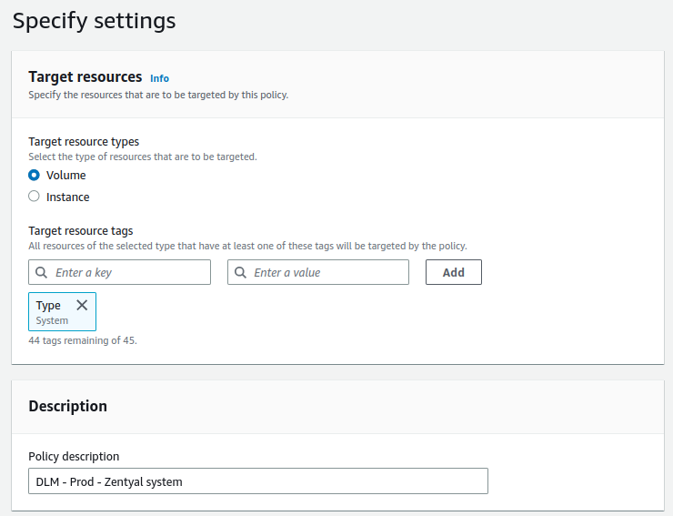
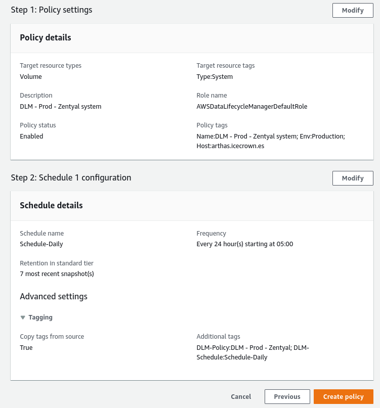
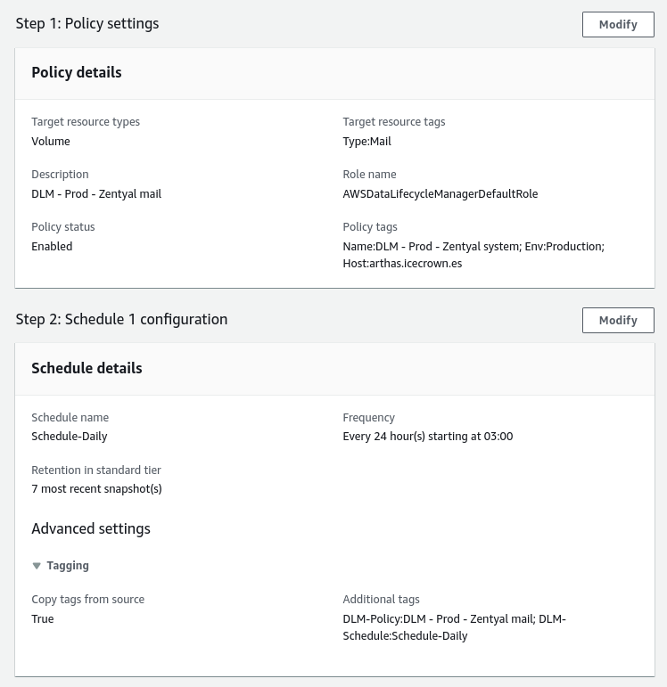

---

tags:
  - AWS

---

# Backup

Several options for backing up this project will be explained on this page.

!!! note

    They should also be valid for deployments on other infrastructures.

As logic dictates, every production server should have a backup system that guarantees the recovery of the system and its data in the face of catastrophic events or human errors.

There are several possibilities for implementing backups for this project:

1. [AWS DLM] (EBS volume snapshots).
2. [Backup de configuración] functionality.
3. [Backup] module.
4. Scripting.

[AWS DLM]: https://docs.aws.amazon.com/AWSEC2/latest/UserGuide/snapshot-lifecycle.html
[Backup de configuración]: https://doc.zentyal.org/en/backup-conf.html
[Backup]: https://doc.zentyal.org/en/backup.html

In my case, I will use the following options:

* **AWS DLM** for the 3 EBS volumes, as it will allow us to restore our Zentyal server or data quickly and easily. Additionally, it would also allow us to set up other environments such as staging or testing using an identical configuration.
* **Backup de configuración** functionality, we will automate the use of this functionality to always have a version with the module configurations available.

## AWS DLM

Through the [DLM] functionality of the EC2 service, we will take a daily snapshot of the 3 volumes, which will ensure that the information is safeguarded in AWS. This functionality takes a snapshot of the volume, which are incremental snapshots.

!!! warning

    Its use will involve an additional monthly cost, which we can see [here].

[here]: https://aws.amazon.com/en/ebs/pricing/

The hours at which I will set up the snapshots are:

* **02:00 AM** for the email volume.
* **03:00 AM** for the shared resource volume.
* **04:00 AM** for the system volume.

!!! note

    It is important that the system snapshot is taken before the Zentyal automatic updates (05:30 AM in my case).

[DLM]: https://docs.aws.amazon.com/AWSEC2/latest/UserGuide/snapshot-lifecycle.html

### DLM on the system volume

The first rule we will create will be for the system volume. This rule will consist of the following:

* The tag used to identify the EBS disk will be: `Type = System`.
* The set time will be 05:00 **UTC**.

Below are the actions to implement the DLM rule:

1. From the EC2 service, we go to `Elastic Block Store -> Lifecycle Manager`.
2. We create a policy of type `EBS snapshot policy`:

    
    
    

    Summary of the configuration:

    

3. Finally, we confirm its operation. To do this, from the EC2 service, we go to `Elastic Block Store -> Snapshots`:

    

### DLM on the email volume

The second rule we will create will be for the email volume. This rule will consist of the following:

* The tag used to identify the EBS disk will be: `Type = Mail`.
* The set time will be 03:00 **UTC**.

Below are the actions to implement the DLM rule:

1. From the EC2 service, we go to `Elastic Block Store -> Lifecycle Manager`.
2. We create a policy of type `EBS snapshot policy`:

    
    
    

    Summary of the configuration:

    

3. Finally, we confirm its operation. To do this, from the EC2 service, we go to `Elastic Block Store -> Snapshots`:

    

### DLM on the shared resource volume

The last rule we will create will be for the shared resource volume. This rule will consist of the following:

* The tag used to identify the EBS disk will be: `Type = Shares`.
* The set time will be 04:00 **UTC**.

Below are the steps to implement the DLM rule:

1. From the EC2 service, go to `Elastic Block Store -> Lifecycle Manager`.
2. Create an `EBS snapshot policy`:

    
    
    

    Summary of the configuration:

    

3. Finally, confirm its operation by going to `Elastic Block Store -> Snapshots` from the EC2 service:

    

## Configuration backup functionality

This functionality allows us to have a backup of the Zentyal configuration, which offers multiple advantages such as:

1. Rollback of the Zentyal module configuration.
2. Possibility of creating identical servers for other environments such as staging or testing.
3. A sort of versioning for the Zentyal configuration.

!!! warning

    This functionality does not store user data such as personal directories, shared resources or emails, but only stores the configuration for each module - including domain controller objects such as users or groups -.

To implement this functionality, we will define a scheduled task that will run daily at 02:30 AM.

The steps to implement it are:

1. From the CLI, test the command that performs the backup and executes the scheduled task:

    ```sh linenums="1"
    sudo /usr/share/zentyal/make-backup --description "CLI backup on `date '+%d-%m-%Y'`"
    ```

2. Once it has finished, log in to the Zentyal GUI and go to `System -> Configuration Backup` to confirm that the backup is detected by Zentyal and can be downloaded.

    

3. Once its operation is confirmed, create the scheduled task to run daily at 02:30 AM. To do this, create the configuration file in `/etc/cron.d/custom-backup_conf` with the following content:

    ```text linenums="1"
    ## Configuration backup created on 12-02-2023 by Daniel
    30 02 * * * root /usr/share/zentyal/make-backup --description "Cronjob backup on `date '+\%d-\%m-\%Y'`" >/dev/null 2>&1
    ```

4. Finally, check the scheduled task:

    

    !!! note

        The time is different because I modified it to verify its operation without having to wait until 02:30 AM.

