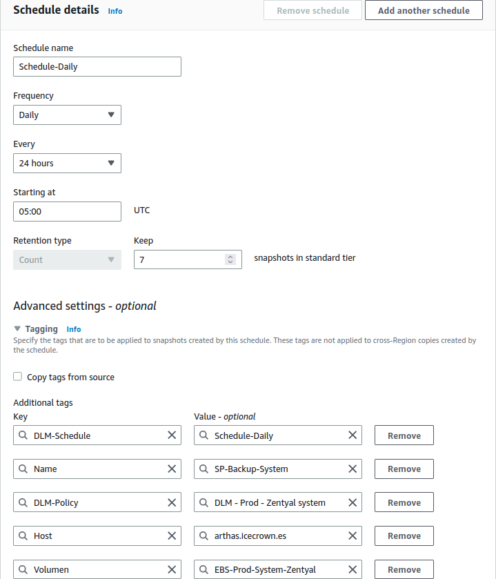
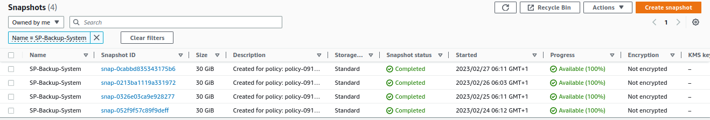
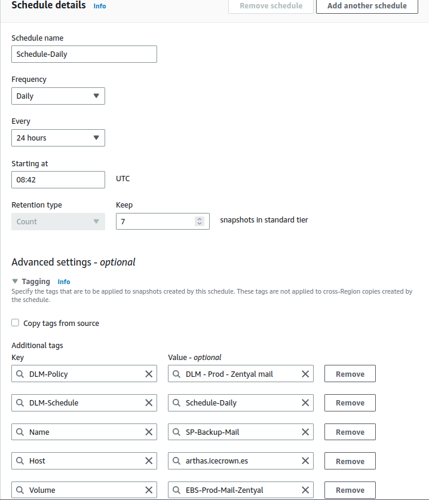
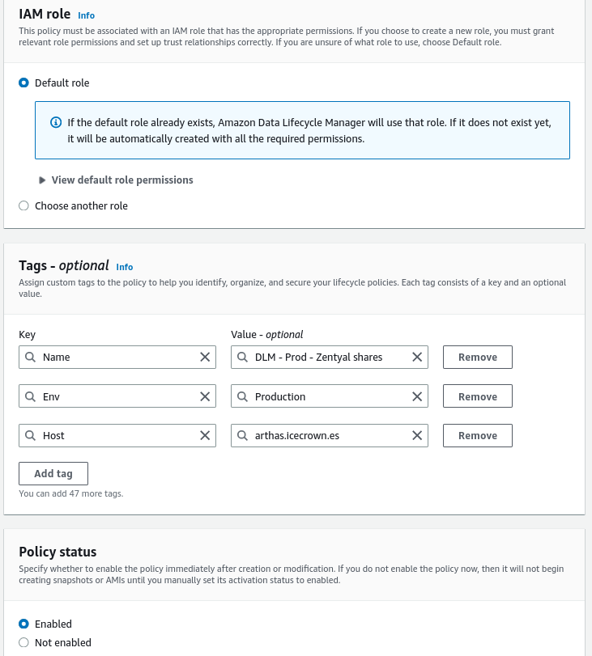
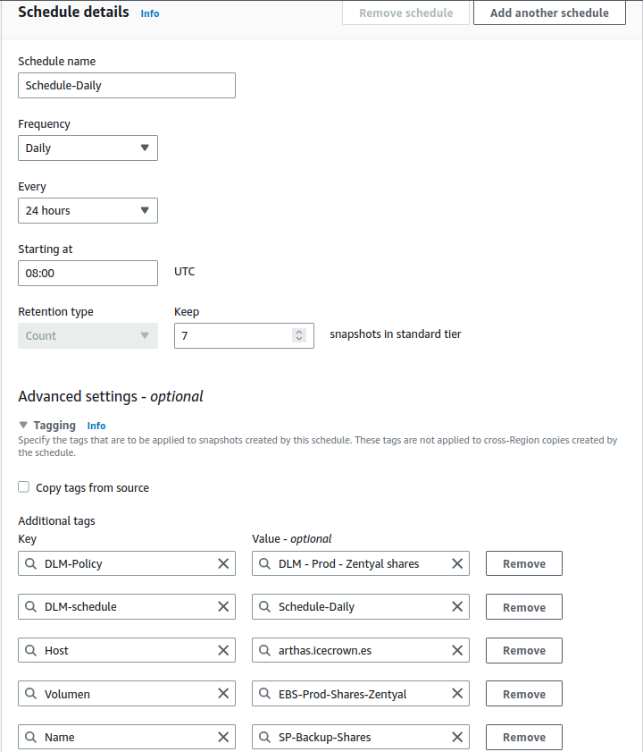
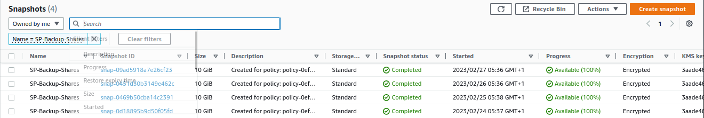

# Backup

En este documento se explicarán varios opciones para la realización de copias de seguridad para este proyecto, aunque también son válidas para despliegues en otras infraestructuras.

Como es lógico, todo servidor de producción debe tener un sistema de copias de seguridad que garantice la recuperación del sistema y de sus datos ante eventos catastróficos o errores humanos.

Las posibilidades de implementación de copias de seguridad para este proyecto son varias:

1. [AWS DLM] (snapshots de los volúmenes EBS).
2. Funcionalidad de [backup de configuración].
3. Módulo de [backup].
4. Scripting.

[AWS DLM]: https://docs.aws.amazon.com/es_es/AWSEC2/latest/UserGuide/snapshot-lifecycle.html
[backup de configuración]: https://doc.zentyal.org/es/backup-conf.html
[backup]: https://doc.zentyal.org/es/backup.html

En el caso de este proyecto, usaremos las opciones:

* **AWS DLM** para los 3 volúmenes EBS, ya que nos permitirá restaurar nuestro servidor Zentyal o los datos de forma rápida y sencilla. Además, que también nos permitiría montar otros entornos como staging o testing usando una configuración idéntica.
* Funcionalidad de **backup de configuración**, automatizaremos el uso de esta funcionalidad para tener siempre disponibles una versión con la configuración de los módulos.

## AWS DLM

Mediante la funcionalidad [DLM] del servicio de EC2 realizaremos una snapshot diaria de los 3 volúmenes, lo que nos asegurará tener la información a resguardo en AWS. Esta funcionalidad lo que hace es hacer una snapshot sobre el/los volúmenes, las cuales son snapshots incrementales. Su uso supondrá un coste mensual adicional, el cual podemos ver [aquí].

[aquí]: https://aws.amazon.com/es/ebs/pricing/

Las horas en las que estableceré las snapshots serán:

* **02:00 AM** para el volumen de los correos.
* **03:00 AM** para el volumen de los recursos compartidos.
* **04:00 AM** para el volumen del sistema.
    * **NOTA:** Es importante que se realice antes de las actualizaciones automáticas de Zentyal (05:30 AM en nuestro caso).

[DLM]: https://docs.aws.amazon.com/es_es/AWSEC2/latest/UserGuide/snapshot-lifecycle.html

### DLM sobre el volumen del sistema

La primera regla que crearemos será la del volumen del sistema. Esta regla constará de lo siguiente:

* La etiqueta usada para identificar el disco EBS será: `Type = System`.
* La hora establecida serán las 05:00 UTC, aunque para confirmar su funcionamiento en el último paso, la cambiaré temporalmente.

A continuación las acciones a realizar para implementar la regla DLM:

1. Desde el servicio de EC2 vamos a `Elastic Block Store -> Lifecycle Manager`.
2. Creamos una política de tipo `EBS snapshot policy`:

    
    
    

    Resumen de las configuración:

    

3. Finalmente, confirmamos su funcionamiento, para ello, desde el servicio de EC2 vamos a `Elastic Block Store -> Snapshots`:

    

### DLM sobre el volumen de los correos

La segunda regla que crearemos será la del volumen de los correos. Esta regla constará de lo siguiente:

* La etiqueta usada para identificar el disco EBS será: `Type = Mail`.
* La hora establecida serán las 03:00 UTC, aunque para confirmar su funcionamiento en el último paso, la cambiaré temporalmente.

A continuación las acciones a realizar para implementar la regla DLM:

1. Desde el servicio de EC2 vamos a `Elastic Block Store -> Lifecycle Manager`.
2. Creamos una política de tipo `EBS snapshot policy`:

    
    
    

    Resumen de las configuración:

    

3. Finalmente, confirmamos su funcionamiento, para ello, desde el servicio de EC2 vamos a `Elastic Block Store -> Snapshots`:

    

### DLM sobre el volumen de los recursos compartidos

La última regla que crearemos será la del volumen de los recursos compartidos. Esta regla constará de lo siguiente:

* La etiqueta usada para identificar el disco EBS será: `Type = Shares`.
* La hora establecida serán las 04:00 UTC, aunque para confirmar su funcionamiento en el último paso, la cambiaré temporalmente.

A continuación las acciones a realizar para implementar la regla DLM:

1. Desde el servicio de EC2 vamos a `Elastic Block Store -> Lifecycle Manager`.
2. Creamos una política de tipo `EBS snapshot policy`:

    
    
    

    Resumen de las configuración:

    

3. Finalmente, confirmamos su funcionamiento, para ello, desde el servicio de EC2 vamos a `Elastic Block Store -> Snapshots`:

    

## Funcionalidad backup de configuración

Esta funcionalidad nos permitirá tener una copia de seguridad de la configuración de Zentyal, lo que nos ofrece múltiples ventajas como:

1. Rollback de la configuración de los módulos de Zentyal.
2. Posibilidad de crear servidores idénticos para otros entornos como staging o testing.
3. Una especia de versionado de la configuración de Zentyal.

**IMPORTANTE:** Esta funcionalidad no almacena los datos de los usuarios como sus directorios personales, los recursos compartidos o los emails, sino que simplemente almacena la configuración para cada módulo - incluyendo los objectos del controlador de dominio como usuarios o grupos -.

Para la implementación de esta funcionalidad definiremos una tarea programada, la cual se ejecutará diariamente a las 02:30 AM.

Las acciones que realizaremos para la implementación son:

1. Desde la CLI, probamos el comando que realiza la copia de seguridad y será el que ejecute la tarea programa:

    ```sh
    sudo /usr/share/zentyal/make-backup --description "CLI backup on `date '+%d-%m-%Y'`"
    ```

2. Una vez que haya terminado, nos logeamos en la interfaz gráfica de Zentyal y vamos a `System -> Configuration Backup` para confirmar que el backup es detectado por Zentyal y que se puede descargar.

    

3. Una vez confirmado su funcionamiento, creamos la tarea programada para que se ejecute diariamente a las 02:30 AM. Para ello, creamos el archivo de configuración en `/etc/cron.d/custom-backup_conf` con el siguiente contenido:

    ```sh
    ## Configuration backup created on 12-02-2023 by Daniel
    30 02 * * * root /usr/share/zentyal/make-backup --description "Cronjob backup on `date '+\%d-\%m-\%Y'`" >/dev/null 2>&1
    ```

4. Finalmente, revisamos que la tarea programada:

    

    **NOTA:** La hora es distinta porque la modifiqué para poder verificar su funcionamiento inmediatamente para no tener que esperar a las 02:30 AM.
