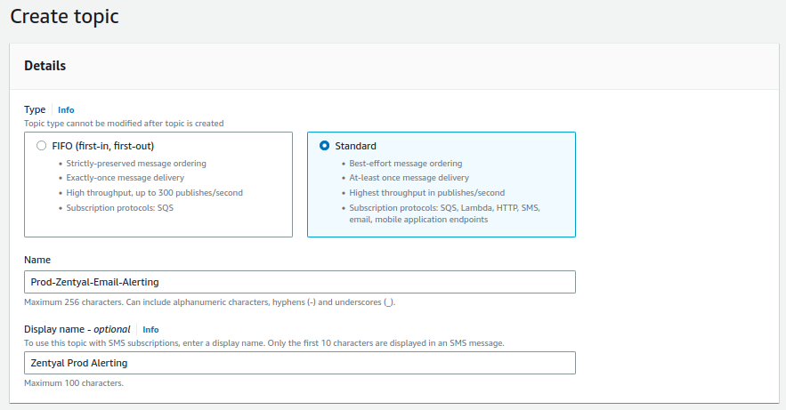
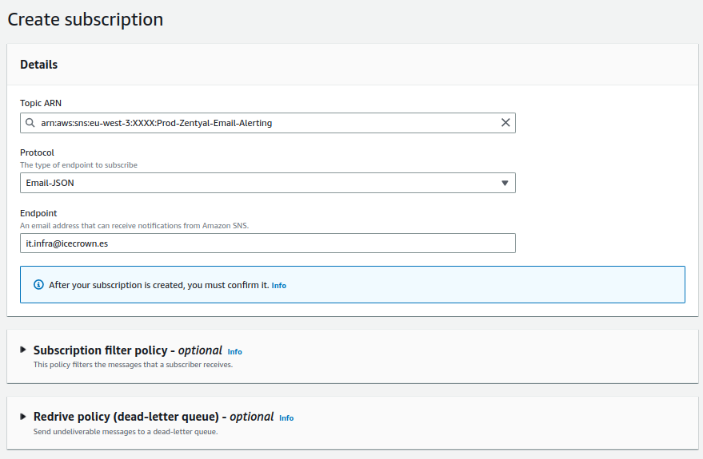
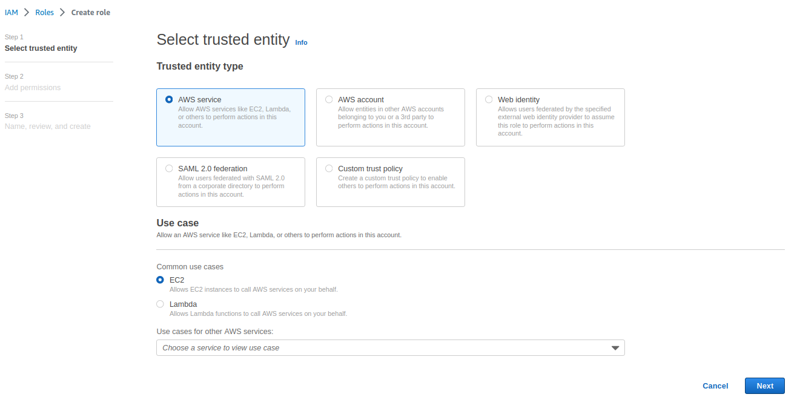
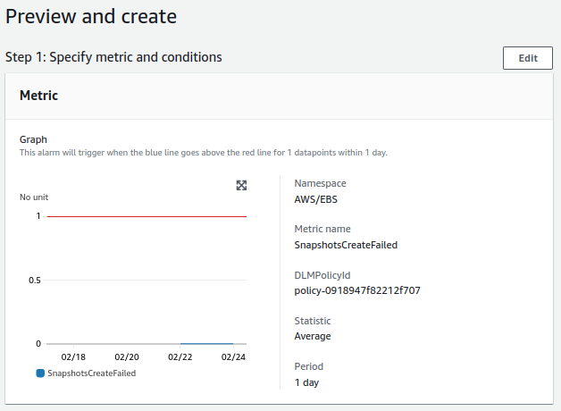
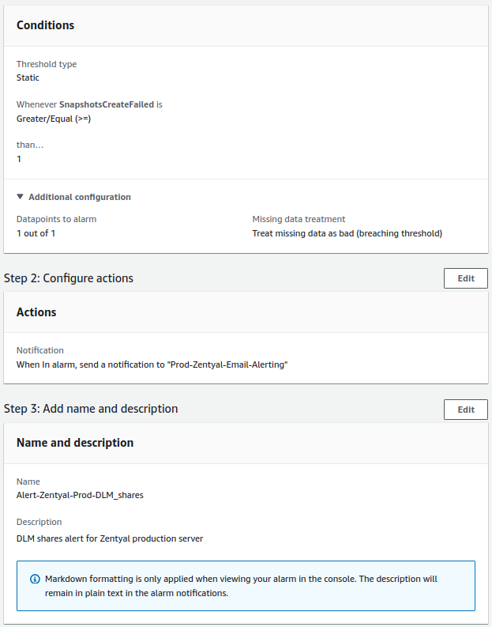

---

tags:
  - AWS

---

# Monitorización

En esta página configuraremos un sistema de monitorización para nuestro servidor Zentyal usando el servicio de AWS [Cloudwatch]. Además, también haremos uso del servicio de AWS SSM [Parameter Store] para alojar la configuración del agente de Cloudwatch en nuestro servidor y finalmente, del servicio AWS [SNS] para las notificaciones de las alertas.

!!! warning

    La implementación de estos servicios tendrán un coste adicional mensual.

[Cloudwatch]: https://docs.aws.amazon.com/es_es/AmazonCloudWatch/latest/monitoring/WhatIsCloudWatch.html
[Parameter Store]: https://docs.aws.amazon.com/es_es/systems-manager/latest/userguide/systems-manager-parameter-store.html
[SNS]: https://docs.aws.amazon.com/es_es/sns/latest/dg/welcome.html

## SNS

Para notificar cualquier alerta que se dispare en CloudWatch haremos uso del servicio SNS, el cual envíará un email a una cuenta de correo. En mi caso, usaré la cuenta creada de `it.infra@icecrown.es`.

1. Vamos a `SNS` y creamos un *topic* llamado `Prod-Zentyal-Email-Alerting`:

    
    

2. Creamos una *subscription* para la cuenta de correo que recibirá las notificaciones:

    

3. Finalmente, esperamos a que nos llegue la invitación a la cuenta de correo para activar la suscripción.

    

    !!! nota

        Al tener habilitado la lista gris, nos tardará en llegar unos minutos.

## SSM Parameter Store

Para monitorizar los recursos del servidor Zentyal usaremos el servicio AWS Cloudwatch, cuyo archivo de configuración almacenaremos en SSM Parameter store.

La configuración que especificaré será:

* La ruta completa al parámetro se llamará `/zentyal/prod/cloudwatch-config`
* El namespace en Cloudwatch se llamará `CWA-Prod-Zentyal`.
* El intervalo de las métricas será de `60` segundos.
* Se configurarán métricas adicionales para:
    * RAM
    * Swap
    * Disco.
* Los 3 volúmenes EBS se incluirán en las métricas de disco.
* Se monitorizará también el log `/var/log/zentyal/zentyal.log`, el cual tendrá una retención de 7 días.
* El grupo de logs en CloudWatch se llamará `CWAL-Prod-Zentyal`.

!!! info

    Para añadir configuraciones adicionales o resolver dudas, [aquí] tenemos la referencia de la configuración.

[aquí]: https://docs.aws.amazon.com/AmazonCloudWatch/latest/monitoring/CloudWatch-Agent-Configuration-File-Details.html#CloudWatch-Agent-Configuration-File-Metricssection

A continuación se indican las acciones a realizar:

1. Nos ubicamos en la región donde tenemos la instancia, que en mi caso es Paris.
2. Vamos a `AWS Systems Manager -> Parameter Store -> Create parameter`.
3. Creamos el *parámetro*:

    

4. Añadimos la configuración del agente en la sección de `Value`:

    ```json
    {
        "agent": {
            "metrics_collection_interval": 60,
            "run_as_user": "root"
        },
        "metrics": {
            "namespace": "CWA-Prod-Zentyal",
            "aggregation_dimensions": [
                [
                    "InstanceId"
                ]
            ],
            "append_dimensions": {
            "AutoScalingGroupName": "${aws:AutoScalingGroupName}",
            "ImageId": "${aws:ImageId}",
            "InstanceId": "${aws:InstanceId}",
            "InstanceType": "${aws:InstanceType}"
            },
            "metrics_collected": {
                "mem": {
                    "measurement": [
                        "used_percent",
                        "used",
                        "free",
                        "total",
                        "cached",
                        "buffered"
                    ],
                    "metrics_collection_interval": 60
                },
                "swap": {
                    "measurement": [
                        "used_percent",
                        "used",
                        "free"
                    ],
                    "metrics_collection_interval": 60
                },
                "disk": {
                    "measurement": [
                        "used_percent",
                        "used",
                        "free",
                        "total",
                        "inodes_used",
                        "inodes_free",
                        "inodes_total"
                    ],
                    "metrics_collection_interval": 60,
                    "ignore_file_system_types": [
                        "tmpfs",
                        "vfat",
                        "devtmps"
                    ],
                    "resources": [
                    "/",
                    "/var/vmail",
                    "/home"
                    ]
                },
                "statsd": {
                    "metrics_aggregation_interval": 60,
                    "metrics_collection_interval": 60,
                    "service_address": ":8125"
                }
            }
        },
        "logs": {
            "logs_collected": {
                "files": {
                    "collect_list": [
                        {
                            "file_path": "/var/log/zentyal/zentyal.log",
                            "log_group_name": "CWAL-Prod-Zentyal",
                            "log_stream_name": "{instance_id}",
                            "retention_in_days": 7,
                            "timezone": "UTC"
                        }
                    ]
                }
            },
            "log_stream_name": "Stream-Prod-Zentyal",
            "force_flush_interval" : 15
        }
    }
    ```

5. Con el parámetro creado, crearemos una política de IAM que permita el acceso desde la instancia EC2 al parámetro recién creado. Para ello vamos a `IAM -> Policies`
6. Creamos una política que tenga el siguiente contenido:

    ```json
    {
        "Version": "2012-10-17",
        "Statement": [
            {
                "Sid": "ParameterStoreZentyal1",
                "Effect": "Allow",
                "Action": [
                    "ssm:GetParameterHistory",
                    "ssm:GetParametersByPath",
                    "ssm:GetParameters",
                    "ssm:GetParameter"
                ],
                "Resource": [
                    "arn:aws:ssm:eu-west-3:*:parameter/zentyal/prod/cloudwatch-config"
                ]
            },
            {
                "Sid": "ParameterStoreZentyal2",
                "Effect": "Allow",
                "Action": "ssm:DescribeParameters",
                "Resource": "*"
            }
        ]
    }
    ```

    

7. Creamos otra política que permita subir el archivo de log a Cloudwatch:

    ```json
    {
        "Version": "2012-10-17",
        "Statement": [
            {
                "Sid": "ZentyalCloudWatchLogs",
                "Effect": "Allow",
                "Action": [
                    "logs:CreateLogGroup",
                    "logs:CreateLogStream",
                    "logs:PutLogEvents",
                    "logs:DescribeLogStreams"
                ],
                "Resource": [
                    "arn:aws:logs:eu-west-3:*:*"
                ]
            }
        ]
    }
    ```

    

8. Creamos un rol donde asociaremos las políticas recién creadas y también, la existente llamada `CloudWatchAgentServerPolicy`. Para ello vamos a `IAM -> Roles`:

    
    
    

9. Finalmente, asociamos el rol recién creado a la instancia de Zentyal. Para ello vamos a `EC2 -> Actions -> Security -> Modify IAM role`:

    

## Cloudwatch

Una vez que tenemos el entorno de AWS listo, procederemos a instalar y configurar el agente de CloudWatch para monitorizar el servidor y el archivo de log principal de Zentyal.

1. Descargamos el paquete `.deb` del agente de CloudWatch en nuestro servidor Zentyal:

    ```sh
    sudo curl "https://s3.amazonaws.com/amazoncloudwatch-agent/debian/amd64/latest/amazon-cloudwatch-agent.deb" -o "/opt/amazon-cloudwatch-agent.deb"
    ```

2. Instalamos el paquete:

    ```sh
    sudo dpkg -i -E /opt/amazon-cloudwatch-agent.deb
    ```

3. Descargamos también el archivo comprimido que contiene el binario de AWS para la CLI:

    ```sh
    sudo curl "https://awscli.amazonaws.com/awscli-exe-linux-x86_64.zip" -o "/opt/awscliv2.zip"
    ```

4. Instalamos el paquete `unzip` para poder descomprimir el archivo:

    ```sh
    sudo apt update
    sudo apt install -y unzip
    ```

5. Descomprimimos el archivo y lo instalamos:

    ```sh
    sudo unzip /opt/awscliv2.zip -d /opt/aws/
    sudo /opt/aws/aws/install
    ```

6. Configuramos el agente de CloudWatch:

    ```sh
    sudo amazon-cloudwatch-agent-ctl -a fetch-config -m ec2 -s -c ssm:/zentyal/prod/cloudwatch-config
    ```

7. Confirmamos que el servicio esté activo:

    ```sh
    sudo /opt/aws/amazon-cloudwatch-agent/bin/amazon-cloudwatch-agent-ctl -a status
    ```

    El resultado que he obtenido:

    ```json
    {
    "status": "running",
    "starttime": "2023-02-25T09:59:17+00:00",
    "configstatus": "configured",
    "version": "1.247357.0b252275"
    }
    ```

8. Tras esperar un par de minutos, vamos a `CloudWatch -> All metrics` y comprobamos que el namespace con las métricas personalizas se hayan creado:

    
    

9. Finalmente, revisamos también que se esté monitorizando el archivo de log de Zentyal, para ello vamos a `CloudWatch -> Log groups`:

    
    

### Logs

Con el archivo principal de Zentyal monitorizado por CloudWatch, vamos a crear un filtro de métrica que compruebe si el archivo de log contiene el evento `ERROR>`. La finalidad es poder crear una alerta que notifique vía email a través de AWS SNS cuando se produzca este tipo de eventos.

1. Vamos a `CloudWatch -> Metric filters` y creamos el filtro:

    
    

2. Una vez creado el filtro y pasado un par de minutos para que CloudWatch recolecte información.

3. Finalmente, verificamos que desde `CloudWatch -> All metrics` tenemos la métrica disponible:

    

    !!! nota

        El tipo de métrica mostrado en la imagen es de tipo `Number` como se puede ver en la parte superior.

### Dashboard

Una vez confirmado el funcionamiento del sistema de monitorización, podremos crear un dashboard que agrupe las métricas más importantes desde `CloudWatch -> Dashboard`. A continuación un ejemplo sencillo:


### Alertas

Lo último que haremos sobre el sistema de monitorización será crear las alertas. Todas las alertas que configuraremos se harán desde `CloudWatch -> All alarm` y serán las siguientes:

* **CPU:**
    * La comprobación se hará cada minuto.
    * El valor de la alerta para que se disparé será superior a 80%.
    * Para que se envía una notificación, la alerta tendrá que producirse 3 veces consecutivas.
* **RAM:**
    * La comprobación se hará cada minuto.
    * El valor de la alerta para que se disparé será superior a 80%.
    * Para que se envía una notificación, la alerta tendrá que producirse 3 veces consecutivas.
* **Disco de sistema:**
    * La comprobación se hará cada minuto.
    * El valor de la alerta para que se disparé será superior a 80%.
    * Para que se envía una notificación, la alerta tendrá que producirse 3 veces consecutivas.
* **Disco de los correos:**
    * La comprobación se hará cada minuto.
    * El valor de la alerta para que se disparé será superior a 80%.
    * Para que se envía una notificación, la alerta tendrá que producirse 3 veces consecutivas.
* **Disco de de los recursos compartidos:**
    * La comprobación se hará cada minuto.
    * El valor de la alerta para que se disparé será superior a 80%.
    * Para que se envía una notificación, la alerta tendrá que producirse 3 veces consecutivas.
* **DLM para el sistema:**
    * La comprobación se hará una vez al día.
    * El valor de la alerta para que se disparé será igual o superior a 1.
    * Para que se envía una notificación, la alerta tendrá que producirse una única vez.
* **DLM para el correo:**
    * La comprobación se hará una vez al día.
    * El valor de la alerta para que se disparé será igual o superior a 1.
    * Para que se envía una notificación, la alerta tendrá que producirse una única vez.
* **DLM para el recursos compartidos:**
    * La comprobación se hará una vez al día.
    * El valor de la alerta para que se disparé será igual o superior a 1.
    * Para que se envía una notificación, la alerta tendrá que producirse una única vez.
* **Comprobaciones fallidas de EC2:**
    * La comprobación se hará cada minuto.
    * El valor de la alerta para que se disparé será superior a 80%.
    * Para que se envía una notificación, la alerta tendrá que producirse 3 veces consecutivas.
* **Comprobaciones fallidas de la instancia:**
    * La comprobación se hará cada minuto.
    * El valor de la alerta para que se disparé será superior a 80%.
    * Para que se envía una notificación, la alerta tendrá que producirse 3 veces consecutivas.
* **Errores en el log de Zentyal:**
    * La comprobación se hará una vez al día.
    * El valor de la alerta para que se disparé será igual o superior a 1.
    * Para que se envía una notificación, la alerta tendrá que producirse una única vez.

#### CPU


#### RAM


#### Disco - Sistema


#### Disco - Mail


#### Disco - Shares


#### DLM - Sistema




#### DLM - Mail


#### DLM - Shares




#### EC2 - System


#### EC2 - Instance


#### Log de Zentyal


