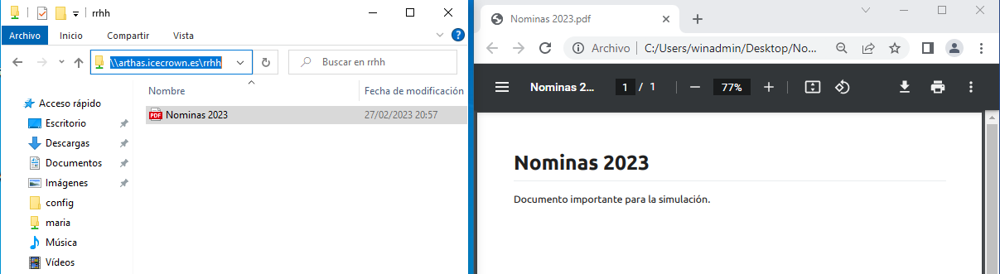
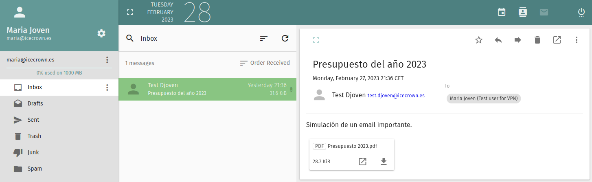
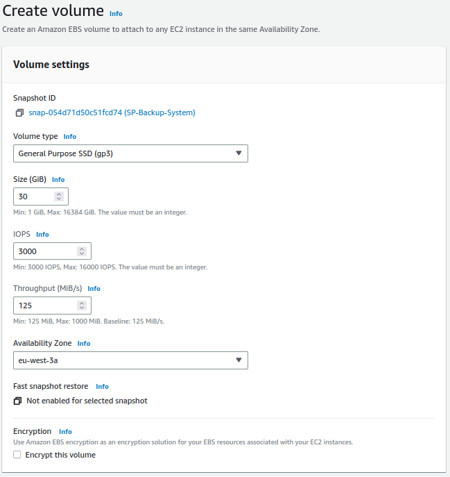
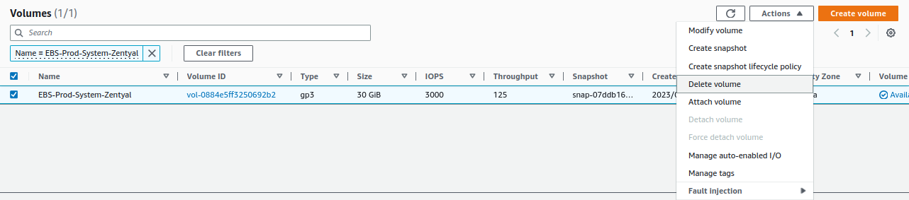

---

tags:
  - AWS

---

# Recovery

On this page, we will explain the three possible scenarios regarding recoveries, from the "most" probable to the "least". In all three cases, we will use the DLM backup policies defined on the [backup] page.

[backup]: https://zentyal-aws.projects.djoven.es/en/backup/#aws-dlm

## Shared resources

In this section, I will simulate that a user has deleted an important file named `Nomimas 2023.pdf` in a shared resource called `rrhh`. The general process will be as follows:

1. We will check the existence of the resource and then delete it.
2. We will create an EBS volume from the latest available snapshot.
3. We will mount the volume in a temporary location.
4. We will restore the deleted file.
5. We will verify that the user has the file again and that it is accessible.
6. We will unmount and delete the volume.

To simulate the loss of the important document, I will simply connect with the user, check the existence of the document, and delete it.

1. With the user, we will check the existence of the document in the shared resource:

    

2. We will delete the resource:

    

With the simulated disaster, we will proceed with its recovery.

1. From `EC2 -> Elastic Block Store -> Snapshots -> Create volume from snapshot`, we select the latest snapshot and create a volume:

    

2. We configure the temporary volume:

    !!! warning

        It must be created in the same availability zone.

    
    

3. We verify that the volume has been successfully created and is available:

    

4. We attach the volume to the instance, for that, we go to `Actions -> Attach volume`:

    

5. We connect via SSH to the server and verify that the operating system detects the new volume:

    ```sh linenums="1"
    lsblk
    ```

    In my environment, the volume has been mounted as `nvme3n1p1`:

    ```text linenums="1"
    NAME         MAJ:MIN RM  SIZE RO TYPE MOUNTPOINT
    nvme0n1      259:0    0   30G  0 disk
    ├─nvme0n1p1  259:2    0 29.9G  0 part /
    ├─nvme0n1p14 259:3    0    4M  0 part
    └─nvme0n1p15 259:4    0  106M  0 part /boot/efi
    nvme2n1      259:1    0   10G  0 disk
    └─nvme2n1p1  259:5    0   10G  0 part /home
    nvme1n1      259:6    0   10G  0 disk
    └─nvme1n1p1  259:7    0   10G  0 part /var/vmail
    nvme3n1      259:8    0   10G  0 disk
    └─nvme3n1p1  259:9    0   10G  0 part
    ```

6. We create a temporary directory where we will mount the new disk:

    ```sh linenums="1"
    sudo mkdir -v /mnt/shares-recovery
    ```

7. We mount the volume:

    ```sh linenums="1"
    sudo mount /dev/nvme3n1p1 /mnt/shares-recovery
    ```

8. We search for the document in the shared resource `rrhh` in the directory where we mounted the temporary disk:

    ```sh linenums="1"
    sudo find /mnt/shares-recovery/samba/shares/rrhh/ -type f -exec ls -l {} \;
    ```

    Example on my server:

    ```text linenums="1"
    -rwxrwx---+ 1 ICECROWN\maria ICECROWN\domain users 21377 Feb 27 20:57 '/mnt/shares-recovery/samba/shares/rrhh/Nominas 2023.pdf'
    ```

9. Once the file has been identified, we proceed with its restoration:

    ```sh linenums="1"
    cp -vp /mnt/shares-recovery/samba/shares/rrhh/Nominas\ 2023.pdf /home/samba/shares/rrhh/
    ```

    !!! warning

        It is important to use the `-p` option to preserve the file permissions, otherwise, the user won't be able to access it.


10. From the user, we verify that the file was recovered and that it is accessible:

    

11. Once we have confirmed the restoration of the file, we proceed to unmount the disk and delete the temporary directory created:

    ```sh linenums="1"
    sudo umount -v /mnt/shares-recovery
    sudo rmdir -v /mnt/shares-recovery
    ```

12. We detach the EBS volume from the instance, for that, we go to `Actions -> Detach volume`:

    

13. Finally, we delete the EBS volume from `Actions -> Delete volume`:

    

## Emails

The objective of this section is to simulate that a user named `maria` has deleted an email called `Presupuesto 2023` with an attachment. The general process is very similar to the previous one, which consists of:

1. We will check the existence of the email and then delete it.
2. We will create an EBS volume from the latest available snapshot.
3. We will mount the volume in a temporary location.
4. We will restore the deleted email.
5. We will check that the user has access to the email again.
6. We will unmount and delete the volume.

To simulate the loss of an important email, I will use the webmail to check the email and then delete it.

1. We log in with the user and check the email:

    

2. We delete the email:

    
    

Now that we have simulated the disaster, we will proceed to perform the necessary actions to recover the email.

1. From `EC2 -> Elastic Block Store -> Snapshots -> Create volume from snapshot` we select the latest snapshot and create a volume:

    

2. We configure the temporary volume:

    !!! warning

        It must be created in the same availability zone.

    
    

3. We verify that the volume has been created successfully and is available:

    

4. We attach the volume to the instance, for this, we go to `Actions -> Attach volume`:

    

5. We connect via SSH to the server and check that the operating system detects the new volume:

    ```sh linenums="1"
    lsblk
    ```

    In my environment, the volume has been mounted as `nvme3n1p1`:

    ```text linenums="1"
    NAME         MAJ:MIN RM  SIZE RO TYPE MOUNTPOINT
    nvme1n1      259:0    0   10G  0 disk
    └─nvme1n1p1  259:1    0   10G  0 part /var/vmail
    nvme0n1      259:2    0   30G  0 disk
    ├─nvme0n1p1  259:5    0 29.9G  0 part /
    ├─nvme0n1p14 259:6    0    4M  0 part
    └─nvme0n1p15 259:7    0  106M  0 part /boot/efi
    nvme2n1      259:3    0   10G  0 disk
    └─nvme2n1p1  259:4    0   10G  0 part /home
    nvme3n1      259:8    0   10G  0 disk
    └─nvme3n1p1  259:9    0   10G  0 part
    ```

6. We create a temporary directory where we will mount the new disk:

    ```sh linenums="1"
    sudo mkdir -v /mnt/mail-recovery
    ```

7. We mount the volume:

    ```sh linenums="1"
    sudo mount /dev/nvme3n1p1 /mnt/mail-recovery
    ```

8. We search for the email of the user `maria` in the directory where we have mounted the temporary disk:

    ```sh linenums="1"
    sudo find /mnt/mail-recovery/icecrown.es/maria/ -type f -exec ls -l {} \;
    ```

    Example on my server:

    ```text linenums="1"
    -rw------- 1 ebox ebox 2180 Feb 27 21:36 /mnt/mail-recovery/icecrown.es/maria/Maildir/dovecot.index.cache
    -rw------- 1 ebox ebox 384 Feb 27 21:33 /mnt/mail-recovery/icecrown.es/maria/Maildir/dovecot.list.index.log
    -rw------- 1 ebox ebox 8 Feb 27 21:33 /mnt/mail-recovery/icecrown.es/maria/Maildir/dovecot-uidvalidity
    -rw------- 1 ebox ebox 102 Feb 27 21:36 /mnt/mail-recovery/icecrown.es/maria/Maildir/dovecot-uidlist
    -rw------- 1 ebox ebox 24 Feb 27 21:36 /mnt/mail-recovery/icecrown.es/maria/Maildir/maildirsize
    -r--r--r-- 1 ebox ebox 0 Feb 27 21:33 /mnt/mail-recovery/icecrown.es/maria/Maildir/dovecot-uidvalidity.63fd1386
    -rw------- 1 ebox ebox 31900 Feb 27 21:36 '/mnt/mail-recovery/icecrown.es/maria/Maildir/cur/1677530165.M104169P13132.arthas,S=31900,W=32366:2,S'
    -rw------- 1 ebox ebox 1124 Feb 27 21:37 /mnt/mail-recovery/icecrown.es/maria/Maildir/dovecot.index.log
    ```

9. Once the email has been identified, we proceed to restore it:

    ```sh linenums="1"
    sudo cp -vp '/mnt/mail-recovery/icecrown.es/maria/Maildir/cur/1677530165.M104169P13132.arthas,S=31900,W=32366:2,S' /var/vmail/icecrown.es/maria/Maildir/cur/
    ```

    !!! warning

         It is important to use the `-p` option to preserve the file permissions, otherwise, the user will not be able to access it. Additionally, it will also be important to restore it in the same directory, which in my case is: `icecrown.es/maria/Maildir/cur/`.

10. From the user's email account, we verify that we have successfully recovered it along with its attachment.

    
    

11. Once the email has been successfully restored, we proceed to unmount the disk and delete the temporary directory created:

    ```sh linenums="1"
    sudo umount -v /mnt/mail-recovery
    sudo rmdir -v /mnt/mail-recovery
    ```

12. We detach the EBS volume from the instance, for this, we go to `Actions -> Detach volume`:

    

13. Finally, we delete the EBS volume from  `Actions -> Delete volume`:

    

## System

For this section, I will simulate that the system has become completely inoperable because a system administrator has accidentally deleted the `zentyal-core` package. The general process is as follows:

1. We will cause the disaster.
2. We will create an EBS volume from the latest available snapshot.
3. We will replace the instance volume with the new one.
4. We will check that the server is back up and running.
5. We will delete the original volume.

To simulate the disaster, I will delete the `zentyal-core` package.

1. We will log in to the server via SSH and check the status of the Zentyal packages:

    ```sh linenums="1"
    dpkg -l | egrep 'zen(buntu|tyal)-'
    ```

    The result obtained in my case:

    ```text linenums="1"
    ii  zentyal-antivirus                     7.0.2                             all          Zentyal - Antivirus
    ii  zentyal-ca                            7.0.1                             all          Zentyal - Certification Authority
    ii  zentyal-core                          7.0.5                             all          Zentyal - Core
    ii  zentyal-dns                           7.0.2                             all          Zentyal - DNS Server
    ii  zentyal-firewall                      7.0.0                             all          Zentyal - Firewall
    ii  zentyal-mail                          7.0.2                             all          Zentyal - Mail
    ii  zentyal-mailfilter                    7.0.0                             all          Zentyal - Mail Filter
    ii  zentyal-network                       7.0.0                             all          Zentyal - Network Configuration
    ii  zentyal-ntp                           7.0.0                             all          Zentyal - NTP Service
    ii  zentyal-openvpn                       7.0.0                             all          Zentyal - VPN
    ii  zentyal-samba                         7.0.1                             all          Zentyal - Domain Controller and File Sharing
    ii  zentyal-software                      7.0.0                             all          Zentyal - Software Management
    ii  zentyal-sogo                          7.0.0                             all          Zentyal - Web Mail
    ```

2. We will remove the `zentyal-core` package to cause instability:

    ```sh linenums="1"
    sudo apt remove -y zentyal-core
    ```

3. Finally, we confirm that the modules have been uninstalled, leaving the server inoperable:

    ```sh linenums="1"
    dpkg -l | egrep 'zen(buntu|tyal)-'
    ```

    The result obtained in my case:

    ```text linenums="1"
    rc  zentyal-antivirus                     7.0.2                             all          Zentyal - Antivirus
    rc  zentyal-ca                            7.0.1                             all          Zentyal - Certification Authority
    rc  zentyal-core                          7.0.5                             all          Zentyal - Core
    rc  zentyal-dns                           7.0.2                             all          Zentyal - DNS Server
    rc  zentyal-firewall                      7.0.0                             all          Zentyal - Firewall
    rc  zentyal-mail                          7.0.2                             all          Zentyal - Mail
    rc  zentyal-mailfilter                    7.0.0                             all          Zentyal - Mail Filter
    rc  zentyal-network                       7.0.0                             all          Zentyal - Network Configuration
    rc  zentyal-ntp                           7.0.0                             all          Zentyal - NTP Service
    rc  zentyal-openvpn                       7.0.0                             all          Zentyal - VPN
    rc  zentyal-samba                         7.0.1                             all          Zentyal - Domain Controller and File Sharing
    rc  zentyal-software                      7.0.0                             all          Zentyal - Software Management
    rc  zentyal-sogo                          7.0.0                             all          Zentyal - Web Mail
    ```

With the disaster properly implemented, we will proceed to restore it using the latest available snapshot.

1. From `EC2 -> Elastic Block Store -> Snapshots -> Create volume from snapshot`, we select the latest snapshot and create a volume:

    

2. We configure the volume:

    !!! warning

        It must be created in the same availability zone.

    
    

3. We verify that the volume has been successfully created and is available:

    

4. We stop the EC2 instance by going to `EC2 -> Instances -> Instance state`:

    

5. Once stopped, we get the system volume mount point from `EC2 -> Elastic Block Store -> Volumes` (option **Attached instances**):

    

6. We detach the unstable EBS from the system from `Actions -> Detach volume`:

    

7. We attach the new volume created in step 2 from `Actions -> Detach volume`:

    
    

    !!! warning

        The mount point (Device name) must be the same as obtained in step 5.

8. We start the instance from `EC2 -> Instances -> Instance state`:

    

9. We connect to the instance and check that the packages are properly installed again:

    ```sh linenums="1"
    dpkg -l | egrep 'zen(buntu|tyal)-'
    ```

    The result obtained in my case:

    ```text linenums="1"
    ii  zentyal-antivirus                     7.0.2                             all          Zentyal - Antivirus
    ii  zentyal-ca                            7.0.1                             all          Zentyal - Certification Authority
    ii  zentyal-core                          7.0.5                             all          Zentyal - Core
    ii  zentyal-dns                           7.0.2                             all          Zentyal - DNS Server
    ii  zentyal-firewall                      7.0.0                             all          Zentyal - Firewall
    ii  zentyal-mail                          7.0.2                             all          Zentyal - Mail
    ii  zentyal-mailfilter                    7.0.0                             all          Zentyal - Mail Filter
    ii  zentyal-network                       7.0.0                             all          Zentyal - Network Configuration
    ii  zentyal-ntp                           7.0.0                             all          Zentyal - NTP Service
    ii  zentyal-openvpn                       7.0.0                             all          Zentyal - VPN
    ii  zentyal-samba                         7.0.1                             all          Zentyal - Domain Controller and File Sharing
    ii  zentyal-software                      7.0.0                             all          Zentyal - Software Management
    ii  zentyal-sogo                          7.0.0                             all          Zentyal - Web Mail
    ```

10. We delete the unstable EBS volume by going to `EC2 -> Elastic Block Store -> Volumes -> Delete volume`:

    

11. Finally, we modify the `Name` tag of the new volume from `Tags -> Manage tags`:

    
    
