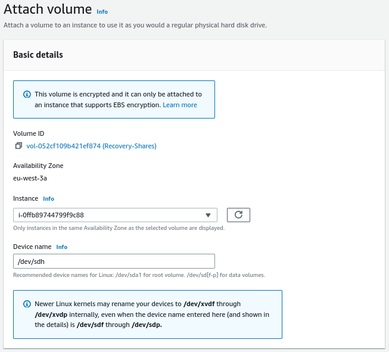
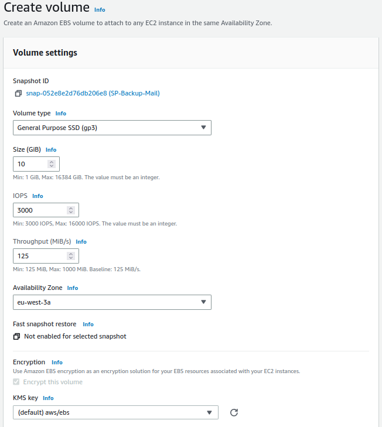
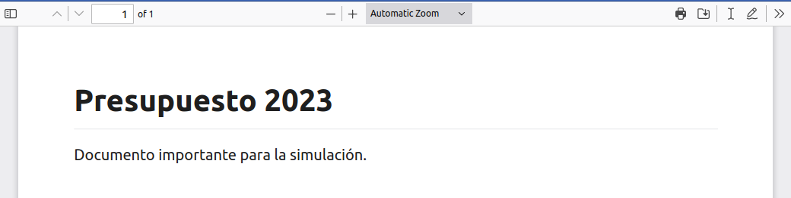
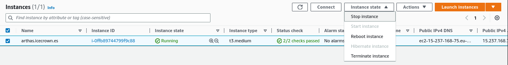
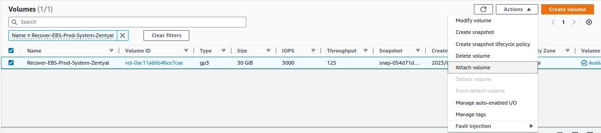
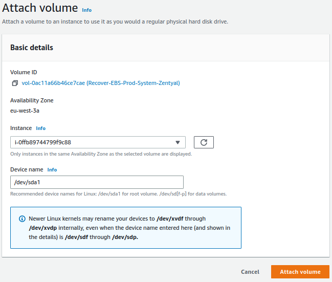

# Recovery

En este documento se explicarán las tres casuísticas relativas a recoveries que pueden darse, desde la 'más' probable hasta la 'menos'. En los tres casos se harán uso de las políticas de copias de seguridad DLM definidas en el documento de backup.

## Recursos compartidos

En este apartado simularé que un usuario ha eliminado un archivo importante llamado `Nomimas 2023.pdf` en un recurso compartido llamado `rrhh`. El proceso general consistirá en:

1. Comprobaremos la existencia del recurso y posteriormente lo eliminaremos.
2. Crearemos un volumen EBS de la última snapshot disponible.
3. Montaremos el volumen en una ubicación temporal.
4. Restauraremos el archivo eliminado.
5. Comprobaremos que el usuario vuelve a tener el archivo y que éste es accesible.
6. Desmontamos y eliminamos el volumen.

Para simular la pérdida del documento importante, simplemente me conectaré con el usuario, comprobaré la existencia del documento y lo eliminaré.

1. Con el usuario comprobamos la existencia del documento en el recurso compartido:

    

2. Eliminamos el recurso:

    

Con el desastre simulado, procederemos a su recuperación.

1. Desde `EC2 -> Elastic Block Store -> Snapshots -> Create volume from snapshot` seleccionamos la última snapshot:

    

2. Configuramos el volumen temporal:

    **NOTA:** Deberá crearse en la misma zona de disponibilidad.

    
    

3. Verificamos que el volumen haya sido creado con éxito y que esté disponible:

    

4. Asociamos el volumen a la instancia, para ello, vamos a `Actions -> Attach volume`:

    

5. Nos conectamos vía SSH al servidor y verificamos que el sistema operativo detecta el nuevo volumen:

    ```sh
    lsblk
    ```

    En mi entorno, el volumen ha sido montado como `nvme3n1p1`:

    ```text
    NAME         MAJ:MIN RM  SIZE RO TYPE MOUNTPOINT
    nvme0n1      259:0    0   30G  0 disk
    ├─nvme0n1p1  259:2    0 29.9G  0 part /
    ├─nvme0n1p14 259:3    0    4M  0 part
    └─nvme0n1p15 259:4    0  106M  0 part /boot/efi
    nvme2n1      259:1    0   10G  0 disk
    └─nvme2n1p1  259:5    0   10G  0 part /home
    nvme1n1      259:6    0   10G  0 disk
    └─nvme1n1p1  259:7    0   10G  0 part /var/vmail
    nvme3n1      259:8    0   10G  0 disk
    └─nvme3n1p1  259:9    0   10G  0 part
    ```

6. Creamos un directorio temporal donde montaremos el nuevo disco:

    ```sh
    sudo mkdir -v /mnt/shares-recovery
    ```

7. Montamos el volumen:

    ```sh
    sudo mount /dev/nvme3n1p1 /mnt/shares-recovery
    ```

8. Buscamos el documento en el recurso compartido `rrhh` en el directorio donde hemos montado el disco temporal:

    ```sh
    sudo find /mnt/shares-recovery/samba/shares/rrhh/ -type f -exec ls -l {} \;
    ```

    Ejemplo en mi servidor:

    ```text
    -rwxrwx---+ 1 ICECROWN\maria ICECROWN\domain users 21377 Feb 27 20:57 '/mnt/shares-recovery/samba/shares/rrhh/Nominas 2023.pdf'
    ```

9. Una vez identificado el archivo, procedemos a su restauración:

    ```sh
    cp -vp /mnt/shares-recovery/samba/shares/rrhh/Nominas\ 2023.pdf /home/samba/shares/rrhh/
    ```

    **NOTA:** Es importante que usemos la opción `-p` para preservar los permisos del archivo, de lo contrario, el usuario no podrá acceder a el.

10. Desde el usuario, comprobaremos que el archivo fue recuperado y que es accesible:

    

11. Una vez la hayamos terminado con la restauración, procedemos a desmontar el disco y eliminar el directorio temporal creado:

    ```sh
    sudo umount -v /mnt/shares-recovery
    sudo rmdir -v /mnt/shares-recovery
    ```

12. Desvinculamos el volumen EBS de la instancia, para ello, vamos a `Actions -> Detach volume`:

    

13. Finalmente, eliminamos el volumen EBS:

    

## Correos

El objetivo de este apartado es simular que un usuario llamado `maria` a eliminado un email llamado `Presupuesto 2023` con un adjunto. El proceso general es muy similar al anterior, que consiste de forma general en:

1. Comprobaremos la existencia del email y posteriormente lo eliminaremos.
2. Crearemos un volumen EBS de la última snapshot disponible.
3. Montaremos el volumen en una ubicación temporal.
4. Restauraremos el email eliminado.
5. Comprobaremos que el usuario vuelve a tener acceso al email.
6. Desmontamos y eliminamos el volumen.

Para simular la pérdida de un email importante, usaré el webmail para verificar el correo y posteriormente, lo eliminaré.

1. Nos logeamos con el usuario y verificamos el email:

    

2. Eliminamos el email:

    
    

Ahora que tenemos simulado el desastre, procederemos a realizar las acciones necesarias para recuperar el email.

1. Desde `EC2 -> Elastic Block Store -> Snapshots -> Create volume from snapshot` seleccionamos la última snapshot:

    

2. Configuramos el volumen temporal:

    **NOTA:** Deberá crearse en la misma zona de disponibilidad.

    
    

3. Verificamos que el volumen haya sido creado con éxito y que esté disponible:

    

4. Asociamos el volumen a la instancia, para ello, vamos a `Actions -> Attach volume`:

    

5. Nos conectamos vía SSH al servidor y verificamos que el sistema operativo detecta el nuevo volumen:

    ```sh
    lsblk
    ```

    En mi entorno, el volumen ha sido montado como `nvme3n1p1`:

    ```text
    NAME         MAJ:MIN RM  SIZE RO TYPE MOUNTPOINT
    nvme1n1      259:0    0   10G  0 disk
    └─nvme1n1p1  259:1    0   10G  0 part /var/vmail
    nvme0n1      259:2    0   30G  0 disk
    ├─nvme0n1p1  259:5    0 29.9G  0 part /
    ├─nvme0n1p14 259:6    0    4M  0 part
    └─nvme0n1p15 259:7    0  106M  0 part /boot/efi
    nvme2n1      259:3    0   10G  0 disk
    └─nvme2n1p1  259:4    0   10G  0 part /home
    nvme3n1      259:8    0   10G  0 disk
    └─nvme3n1p1  259:9    0   10G  0 part
    ```

6. Creamos un directorio temporal donde montaremos el nuevo disco:

    ```sh
    sudo mkdir -v /mnt/mail-recovery
    ```

7. Montamos el volumen:

    ```sh
    sudo mount /dev/nvme3n1p1 /mnt/mail-recovery
    ```

8. Buscamos el correo del usuario `maria` en el directorio donde hemos montado el disco temporal:

    ```sh
    sudo find /mnt/mail-recovery/icecrown.es/maria/ -type f -exec ls -l {} \;
    ```

    Ejemplo en mi servidor:

    ```text
    -rw------- 1 ebox ebox 2180 Feb 27 21:36 /mnt/mail-recovery/icecrown.es/maria/Maildir/dovecot.index.cache
    -rw------- 1 ebox ebox 384 Feb 27 21:33 /mnt/mail-recovery/icecrown.es/maria/Maildir/dovecot.list.index.log
    -rw------- 1 ebox ebox 8 Feb 27 21:33 /mnt/mail-recovery/icecrown.es/maria/Maildir/dovecot-uidvalidity
    -rw------- 1 ebox ebox 102 Feb 27 21:36 /mnt/mail-recovery/icecrown.es/maria/Maildir/dovecot-uidlist
    -rw------- 1 ebox ebox 24 Feb 27 21:36 /mnt/mail-recovery/icecrown.es/maria/Maildir/maildirsize
    -r--r--r-- 1 ebox ebox 0 Feb 27 21:33 /mnt/mail-recovery/icecrown.es/maria/Maildir/dovecot-uidvalidity.63fd1386
    -rw------- 1 ebox ebox 31900 Feb 27 21:36 '/mnt/mail-recovery/icecrown.es/maria/Maildir/cur/1677530165.M104169P13132.arthas,S=31900,W=32366:2,S'
    -rw------- 1 ebox ebox 1124 Feb 27 21:37 /mnt/mail-recovery/icecrown.es/maria/Maildir/dovecot.index.log
    ```

9. Una vez identificado el correo, procedemos a su restauración:

    ```sh
    sudo cp -vp '/mnt/mail-recovery/icecrown.es/maria/Maildir/cur/1677530165.M104169P13132.arthas,S=31900,W=32366:2,S' /var/vmail/icecrown.es/maria/Maildir/cur/
    ```

    Es importante que se use la opción `-p` para preservar los permisos del archivo, de lo contrario, el usuario no podrá acceder a el. Además, también será importante que la restauración se haga en el mismo directorio, que en mi caso es: `icecrown.es/maria/Maildir/cur/`.

10. Desde la cuenta del usuario de correo, verificamos que lo hemos recuperado junto con su adjunto.

    
    

11. Una vez restaurado con éxito el email, procedemos a desmontar el disco y eliminar el directorio temporal creado:

    ```sh
    sudo umount -v /mnt/mail-recovery
    sudo rmdir -v /mnt/mail-recovery
    ```

12. Desvinculamos el volumen EBS de la instancia, para ello, vamos a `Actions -> Detach volume`:

    

13. Finalmente, eliminamos el volumen EBS:

    

## Sistema

Para este apartado simularé que el sistema ha quedado totalmente inoperativo debido a que un administrador de sistemas ha eliminado accidentalmente el paquete `zentyal-core`. El proceso general consiste en:

1. Provocaremos el desastre.
2. Crearemos un volumen EBS de la última snapshot disponible.
3. Reemplazaremos el volumen de la instancia.
4. Comprobaremos que el servidor vuelve a estar operativo.
5. Eliminamos el volumen original.

Para simular el desastre, lo que haré será eliminar el paquete `zentyal-core`.

1. Nos logeamos en el servidor a través de SSH y comprobamos el estado de los paquetes de Zentyal:

    ```sh
    dpkg -l | egrep 'zen(buntu|tyal)-'
    ```

    El resultado obtenido en mi caso:

    ```text
    ii  zentyal-antivirus                     7.0.2                             all          Zentyal - Antivirus
    ii  zentyal-ca                            7.0.1                             all          Zentyal - Certification Authority
    ii  zentyal-core                          7.0.5                             all          Zentyal - Core
    ii  zentyal-dns                           7.0.2                             all          Zentyal - DNS Server
    ii  zentyal-firewall                      7.0.0                             all          Zentyal - Firewall
    ii  zentyal-mail                          7.0.2                             all          Zentyal - Mail
    ii  zentyal-mailfilter                    7.0.0                             all          Zentyal - Mail Filter
    ii  zentyal-network                       7.0.0                             all          Zentyal - Network Configuration
    ii  zentyal-ntp                           7.0.0                             all          Zentyal - NTP Service
    ii  zentyal-openvpn                       7.0.0                             all          Zentyal - VPN
    ii  zentyal-samba                         7.0.1                             all          Zentyal - Domain Controller and File Sharing
    ii  zentyal-software                      7.0.0                             all          Zentyal - Software Management
    ii  zentyal-sogo                          7.0.0                             all          Zentyal - Web Mail
    ```

2. Eliminamos el paquete `zentyal-core` para causar la inestabilidad:

    ```sh
    sudo apt remove -y zentyal-core
    ```

3. Finalmente, confirmamos que los módulos se han desinstalado, dejando el servidor ha quedado inoperativo:

    ```sh
    dpkg -l | egrep 'zen(buntu|tyal)-'
    ```

    ```text
    rc  zentyal-antivirus                     7.0.2                             all          Zentyal - Antivirus
    rc  zentyal-ca                            7.0.1                             all          Zentyal - Certification Authority
    rc  zentyal-core                          7.0.5                             all          Zentyal - Core
    rc  zentyal-dns                           7.0.2                             all          Zentyal - DNS Server
    rc  zentyal-firewall                      7.0.0                             all          Zentyal - Firewall
    rc  zentyal-mail                          7.0.2                             all          Zentyal - Mail
    rc  zentyal-mailfilter                    7.0.0                             all          Zentyal - Mail Filter
    rc  zentyal-network                       7.0.0                             all          Zentyal - Network Configuration
    rc  zentyal-ntp                           7.0.0                             all          Zentyal - NTP Service
    rc  zentyal-openvpn                       7.0.0                             all          Zentyal - VPN
    rc  zentyal-samba                         7.0.1                             all          Zentyal - Domain Controller and File Sharing
    rc  zentyal-software                      7.0.0                             all          Zentyal - Software Management
    rc  zentyal-sogo                          7.0.0                             all          Zentyal - Web Mail
    ```

Con el desastre correctamente implementado, procederemos a restaurarlo a través de la última snapshot disponible.

1. Desde `EC2 -> Elastic Block Store -> Snapshots -> Create volume from snapshot` seleccionamos la última snapshot:

    

2. Configuramos el volumen:

    **NOTA:** Deberá crearse en la misma zona de disponibilidad.

    
    

3. Verificamos que el volumen haya sido creado con éxito y que esté disponible:

    

4. Paramos la instancia EC2, para ello, vamos a `EC2 -> Instances -> Instance state`:

    

5. Una vez parada, obtenemos el punto de montaje del volumen del sistema desde `EC2 -> Elastic Block Store -> Volumes` (opción **Attached instances**):

    

6. Desvinculamos el EBS del sistema desde `Actions -> Detach volume`:

    

7. Asociamos el volumen creado en el paso 2 desde `Actions -> Detach volume`::

    
    

8. Iniciamos la instancia desde `EC2 -> Instances -> Instance state`:

    

9. Nos conectamos a la instancia y verificamos que volvemos a tener los paquetes correctamente instalados:

    ```sh
    dpkg -l | egrep 'zen(buntu|tyal)-'
    ```

    El resultado obtenido en mi caso:

    ```text
    ii  zentyal-antivirus                     7.0.2                             all          Zentyal - Antivirus
    ii  zentyal-ca                            7.0.1                             all          Zentyal - Certification Authority
    ii  zentyal-core                          7.0.5                             all          Zentyal - Core
    ii  zentyal-dns                           7.0.2                             all          Zentyal - DNS Server
    ii  zentyal-firewall                      7.0.0                             all          Zentyal - Firewall
    ii  zentyal-mail                          7.0.2                             all          Zentyal - Mail
    ii  zentyal-mailfilter                    7.0.0                             all          Zentyal - Mail Filter
    ii  zentyal-network                       7.0.0                             all          Zentyal - Network Configuration
    ii  zentyal-ntp                           7.0.0                             all          Zentyal - NTP Service
    ii  zentyal-openvpn                       7.0.0                             all          Zentyal - VPN
    ii  zentyal-samba                         7.0.1                             all          Zentyal - Domain Controller and File Sharing
    ii  zentyal-software                      7.0.0                             all          Zentyal - Software Management
    ii  zentyal-sogo                          7.0.0                             all          Zentyal - Web Mail
    ```

10. Eliminamos el volumen EBS inestable, para ello vamos a `EC2 -> Elastic Block Store -> Volumes -> Delete volume`:

    

11. Finalmente, modificamos la etiqueta `Name` del nuevo volumen desde `Tags -> Manage tags`:

    
    
