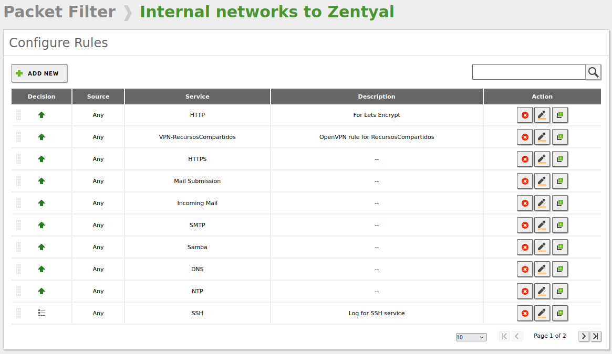
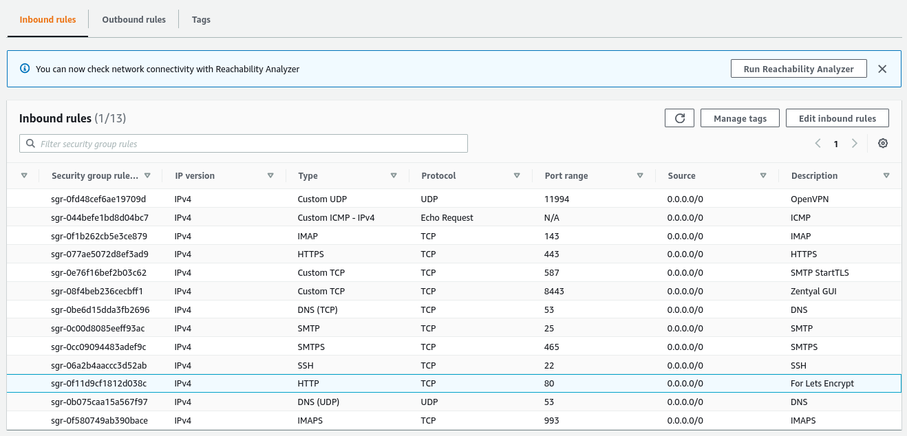
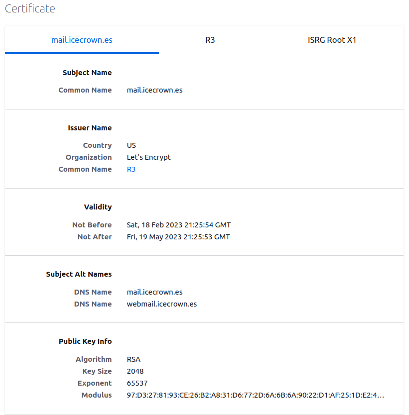

---

tags:
  - Zentyal

---

# Certificates

By default, Zentyal uses self-signed certificates for its modules, including the use of the CA module. This situation causes warnings to be displayed, for example, when using mail clients or when accessing the webadmin or webmail. Therefore, this page will show how to generate recognized certificates issued by Let's Encrypt.

The actions I will take for the project are:

1. I will issue 2 certificates, with one of them having two subdomains:
    * Webadmin module: `arthas.icecrown.es`
    * Mail and webmail module: `mail.icecrown.es` and `webmail.icecrown.es`
2. I will use the HTTP challenge type.
3. I will use the email account `it.infra@icecrown.es` as the email address to receive notifications from Let's Encrypt.

[challenge]: https://letsencrypt.org/docs/challenge-types/

Here are the actions to be performed before generating the certificates:

1. Install the necessary packages for generating certificates.

    ```sh linenums="1"
    sudo apt update
    sudo apt install -y certbot python3-certbot-apache
    ```

2. Create a temporary rule in the Zentyal firewall and AWS security group that allows the HTTP protocol so that the certificate can be issued:

    For the Zentyal firewall:
    

    For the AWS security group:
    

    !!! nota

        We can remove this rule once we have issued the certificates or keep it to avoid having to re-establish it when it is time to renew the certificates.

3. Create the email account that will receive notifications.

    

4. Verify that we can resolve the subdomains in question from the outside:

    ```sh linenums="1"
    dig arthas.icecrown.es @8.8.8.8
    dig mail.icecrown.es @8.8.8.8
    dig webmail.icecrown.es @8.8.8.8
    ```

    The result I obtained in my case is:

    ```text linenums="1"
    ## Webadmin
    ; <<>> DiG 9.16.1-Ubuntu <<>> arthas.icecrown.es @8.8.8.8
    ;; global options: +cmd
    ;; Got answer:
    ;; ->>HEADER<<- opcode: QUERY, status: NOERROR, id: 25953
    ;; flags: qr rd ra; QUERY: 1, ANSWER: 1, AUTHORITY: 0, ADDITIONAL: 1

    ;; OPT PSEUDOSECTION:
    ; EDNS: version: 0, flags:; udp: 512
    ;; QUESTION SECTION:
    ;arthas.icecrown.es.		IN	A

    ;; ANSWER SECTION:
    arthas.icecrown.es.	120	IN	A	15.237.168.75

    ;; Query time: 20 msec
    ;; SERVER: 8.8.8.8#53(8.8.8.8)
    ;; WHEN: Sat Feb 18 22:20:39 CET 2023
    ;; MSG SIZE  rcvd: 63


    ## Mail
    ; <<>> DiG 9.16.1-Ubuntu <<>> mail.icecrown.es @8.8.8.8
    ;; global options: +cmd
    ;; Got answer:
    ;; ->>HEADER<<- opcode: QUERY, status: NOERROR, id: 37980
    ;; flags: qr rd ra; QUERY: 1, ANSWER: 2, AUTHORITY: 0, ADDITIONAL: 1

    ;; OPT PSEUDOSECTION:
    ; EDNS: version: 0, flags:; udp: 512
    ;; QUESTION SECTION:
    ;mail.icecrown.es.		IN	A

    ;; ANSWER SECTION:
    mail.icecrown.es.	300	IN	CNAME	arthas.icecrown.es.
    arthas.icecrown.es.	120	IN	A	15.237.168.75

    ;; Query time: 16 msec
    ;; SERVER: 8.8.8.8#53(8.8.8.8)
    ;; WHEN: Sat Feb 18 22:20:39 CET 2023
    ;; MSG SIZE  rcvd: 82


    ## Webmail
    ; <<>> DiG 9.16.1-Ubuntu <<>> webmail.icecrown.es @8.8.8.8
    ;; global options: +cmd
    ;; Got answer:
    ;; ->>HEADER<<- opcode: QUERY, status: NOERROR, id: 45405
    ;; flags: qr rd ra; QUERY: 1, ANSWER: 2, AUTHORITY: 0, ADDITIONAL: 1

    ;; OPT PSEUDOSECTION:
    ; EDNS: version: 0, flags:; udp: 512
    ;; QUESTION SECTION:
    ;webmail.icecrown.es.		IN	A

    ;; ANSWER SECTION:
    webmail.icecrown.es.	300	IN	CNAME	arthas.icecrown.es.
    arthas.icecrown.es.	120	IN	A	15.237.168.75

    ;; Query time: 28 msec
    ;; SERVER: 8.8.8.8#53(8.8.8.8)
    ;; WHEN: Sat Feb 18 22:20:40 CET 2023
    ;; MSG SIZE  rcvd: 85
    ```

## Webadmin

To generate the certificate for the **Webadmin** (administration panel), we will use the package `python3-certbot-apache` instead of `python3-certbot-nginx` because Zentyal runs Nginx in a customized way, which causes errors when generating certificates.

1. Generate the certificate:

    ```sh linenums="1"
    sudo certbot certonly \
        --apache \
        --preferred-challenges http \
        -m it.infra@icecrown.es \
        --agree-tos \
        -d arthas.icecrown.es
    ```

    An example of the result:

    ```text linenums="1"
    Saving debug log to /var/log/letsencrypt/letsencrypt.log
    Plugins selected: Authenticator apache, Installer apache
    Obtaining a new certificate
    Performing the following challenges:
    http-01 challenge for arthas.icecrown.es
    Enabled Apache rewrite module
    Waiting for verification...
    Cleaning up challenges

    IMPORTANT NOTES:
    - Congratulations! Your certificate and chain have been saved at:
    /etc/letsencrypt/live/arthas.icecrown.es/fullchain.pem
    Your key file has been saved at:
    /etc/letsencrypt/live/arthas.icecrown.es/privkey.pem
    Your cert will expire on 2023-05-19. To obtain a new or tweaked
    version of this certificate in the future, simply run certbot
    again. To non-interactively renew *all* of your certificates, run
    "certbot renew"
    - If you like Certbot, please consider supporting our work by:

    Donating to ISRG / Let's Encrypt:   https://letsencrypt.org/donate
    Donating to EFF:                    https://eff.org/donate-le
    ```

2. With the generated certificate, we will need to modify the configuration template ([stub]) of the module so that this change persists in future updates of the module by Zentyal. To do this, we will create the necessary directories:

    ```sh linenums="1"
    sudo mkdir -vp /etc/zentyal/stubs/core
    ```

3. Copy the template to modify:

    ```sh linenums="1"
    sudo cp -v /usr/share/zentyal/stubs/core/nginx.conf.mas /etc/zentyal/stubs/core/
    ```

4. Modify the following configuration parameters in the newly copied template:

    ```text linenums="1"
    ## Custom certificates issued on 18-02-2023 by Daniel
    # ssl_certificate <% $zentyalconfdir %>ssl/ssl.pem;
    # ssl_certificate_key <% $zentyalconfdir %>ssl/ssl.pem;
    ssl_certificate  /etc/letsencrypt/live/arthas.icecrown.es/fullchain.pem;
    ssl_certificate_key /etc/letsencrypt/live/arthas.icecrown.es/privkey.pem;
    ```

5. Optionally, I will also modify the following configuration parameters, whose values have been generated from [this] website.

    ```text linenums="1"
    ## Custom configuration applied on 18-02-2023 by Daniel
    ## https://ssl-config.mozilla.org/#server=nginx&version=1.17.7&config=intermediate&openssl=1.1.1k&hsts=false&ocsp=false&guideline=5.6
    # ssl_protocols TLSv1 TLSv1.1 TLSv1.2;
    # ssl_ciphers "ECDHE-RSA-AES128-GCM-SHA256:ECDHE-ECDSA-AES128-GCM-SHA256:ECDHE-RSA-AES256-GCM-SHA384:ECDHE-ECDSA-AES256-GCM-SHA384:DHE-RSA-AES128-GCM-SHA256:DHE-DSS-AES128-GCM-SHA256:kEDH+AESGCM:ECDHE-RSA-AES128-SHA256:ECDHE-ECDSA-AES128-SHA256:ECDHE-RSA-AES128-SHA:ECDHE-ECDSA-AES128-SHA:ECDHE-RSA-AES256-SHA384:ECDHE-ECDSA-AES256-SHA384:ECDHE-RSA-AES256-SHA:ECDHE-ECDSA-AES256-SHA:DHE-RSA-AES128-SHA256:DHE-RSA-AES128-SHA:DHE-DSS-AES128-SHA256:DHE-RSA-AES256-SHA256:DHE-DSS-AES256-SHA:DHE-RSA-AES256-SHA:!aNULL:!eNULL:!EXPORT:!DES:!RC4:!3DES:!MD5:!PSK";
    # ssl_prefer_server_ciphers on;
    ssl_protocols TLSv1.2 TLSv1.3;
    ssl_ciphers ECDHE-ECDSA-AES128-GCM-SHA256:ECDHE-RSA-AES128-GCM-SHA256:ECDHE-ECDSA-AES256-GCM-SHA384:ECDHE-RSA-AES256-GCM-SHA384:ECDHE-ECDSA-CHACHA20-POLY1305:ECDHE-RSA-CHACHA20-POLY1305:DHE-RSA-AES128-GCM-SHA256:DHE-RSA-AES256-GCM-SHA384;
    ssl_prefer_server_ciphers off;
    ```

6. Stop the Webadmin module, reload Systemd, and then restart it to apply these changes.

    ```sh linenums="1"
    sudo zs webadmin stop
    sudo systemctl daemon-reload
    sudo zs webadmin restart
    ```

7. Finally, access the webadmin to confirm that the certificate is correct.

    

[stub]: https://doc.zentyal.org/en/appendix-c.html#stubs
[this]: https://ssl-config.mozilla.org/#server=nginx&version=1.17.7&config=intermediate&openssl=1.1.1k&hsts=false&ocsp=false&guideline=5.6

## Mail y Webmail

For the **Mail** and **Webmail** modules, I will use the same certificate, meaning that the certificate will be issued with 2 subdomains instead of 1.

We will generate the certificate:

```sh linenums="1"
sudo certbot certonly \
    --apache \
    --preferred-challenges http \
    -m it.infra@icecrown.es \
    --agree-tos \
    -d mail.icecrown.es \
    -d webmail.icecrown.es
```

An example of the result:

```text linenums="1"
Saving debug log to /var/log/letsencrypt/letsencrypt.log
Plugins selected: Authenticator apache, Installer apache
Obtaining a new certificate
Performing the following challenges:
http-01 challenge for mail.icecrown.es
http-01 challenge for webmail.icecrown.es
Enabled Apache rewrite module
Waiting for verification...
Cleaning up challenges

IMPORTANT NOTES:
- Congratulations! Your certificate and chain have been saved at:
/etc/letsencrypt/live/mail.icecrown.es/fullchain.pem
Your key file has been saved at:
/etc/letsencrypt/live/mail.icecrown.es/privkey.pem
Your cert will expire on 2023-05-19. To obtain a new or tweaked
version of this certificate in the future, simply run certbot
again. To non-interactively renew *all* of your certificates, run
"certbot renew"
- If you like Certbot, please consider supporting our work by:

Donating to ISRG / Let's Encrypt:   https://letsencrypt.org/donate
Donating to EFF:                    https://eff.org/donate-le
```

With the certificate correctly generated, I will proceed to configure both modules to use it.

### Webmail

For this module, it will not be necessary to edit a stub, but instead we will simply need to modify the Apache configuration file.

1. We modify the configuration file `/etc/apache2/sites-available/default-ssl.conf`:

    ```text linenums="1"
    ## Custom certificates issued on 18-02-2023 by Daniel
    # SSLCertificateFile	/etc/ssl/certs/ssl-cert-snakeoil.pem
    # SSLCertificateKeyFile /etc/ssl/private/ssl-cert-snakeoil.key
    SSLCertificateFile  /etc/letsencrypt/live/mail.icecrown.es/fullchain.pem
    SSLCertificateKeyFile /etc/letsencrypt/live/mail.icecrown.es/privkey.pem
    ```

2. Optionally, I will also add the following configuration parameters to the end of the configuration file. The values of the parameters have been generated from [this] website.

    ```text linenums="1"
    ## Custom configuration applied on 18-02-2023 by Daniel
    ## https://ssl-config.mozilla.org/#server=apache&version=2.4.41&config=intermediate&openssl=1.1.1k&hsts=false&ocsp=false&guideline=5.6
    SSLProtocol             all -SSLv3 -TLSv1 -TLSv1.1
    SSLCipherSuite          ECDHE-ECDSA-AES128-GCM-SHA256:ECDHE-RSA-AES128-GCM-SHA256:ECDHE-ECDSA-AES256-GCM-SHA384:ECDHE-RSA-AES256-GCM-SHA384:ECDHE-ECDSA-CHACHA20-POLY1305:ECDHE-RSA-CHACHA20-POLY1305:DHE-RSA-AES128-GCM-SHA256:DHE-RSA-AES256-GCM-SHA384
    SSLHonorCipherOrder     off
    SSLSessionTickets       off
    ```

3. We restart the Apache service:

    ```sh linenums="1"
    sudo systemctl restart apache2
    ```

4. Finally, we access the webadmin to confirm that the certificate is correct:

    

[stub]: https://doc.zentyal.org/en/appendix-c.html#stubs
[this]: https://ssl-config.mozilla.org/#server=apache&version=2.4.41&config=intermediate&openssl=1.1.1k&hsts=false&ocsp=false&guideline=5.6

### Mail

For this module, we will need to modify two templates ([stubs]), one for the SMTP service (Postfix) and another for IMAP/POP3 (Dovecot):

* main.cf.mas
* dovecot.conf.mas

The actions to be performed are:

1. We create the directory where we will place the templates:

    ```sh linenums="1"
    sudo mkdir -vp /etc/zentyal/stubs/mail
    ```

2. We will copy the templates to be modified:

    ```sh linenums="1"
    sudo sudo cp -v /usr/share/zentyal/stubs/mail/{main.cf,dovecot.conf}.mas /etc/zentyal/stubs/mail/
    ```

3. We modify the `main.cf.mas` template for the Postfix service (SMTP):

    ```text linenums="1"
    ## Custom certificates issued on 18-02-2023 by Daniel
    # smtpd_tls_key_file  = <% $keyFile  %>
    # smtpd_tls_cert_file = <% $certFile %>
    smtpd_tls_key_file  = /etc/letsencrypt/live/mail.icecrown.es/privkey.pem
    smtpd_tls_cert_file = /etc/letsencrypt/live/mail.icecrown.es/fullchain.pem
    ```

4. We modify the other `dovecot.conf.mas` template for the Dovecot service (IMAP/POP3):

    ```text linenums="1"
    ## Custom certificates issued on 18-02-2023 by Daniel
    # ssl_cert =</etc/dovecot/private/dovecot.pem
    # ssl_key =</etc/dovecot/private/dovecot.pem
    ssl_key  =</etc/letsencrypt/live/mail.icecrown.es/privkey.pem
    ssl_cert =</etc/letsencrypt/live/mail.icecrown.es/fullchain.pem
    ```

5. We restart the mail module to apply the changes:

    ```sh linenums="1"
    sudo zs mail restart
    ```

6. Finally, we confirm that both services are correctly using the new certificate. To perform this action, we can use a mail client like Thunderbird or the `openssl` command as in my case:

    ```sh linenums="1"
    openssl s_client -starttls smtp -showcerts -connect mail.icecrown.es:465 -servername mail.icecrown.es
    openssl s_client -showcerts -connect mail.icecrown.es:993 -servername mail.icecrown.es
    ```

    The result obtained in my case has been:

    ```text linenums="1"
    ## SMTP
    CONNECTED(00000003)
    depth=2 C = US, O = Internet Security Research Group, CN = ISRG Root X1
    verify return:1
    depth=1 C = US, O = Let's Encrypt, CN = R3
    verify return:1
    depth=0 CN = mail.icecrown.es
    verify return:1
    ---
    Certificate chain
    0 s:CN = mail.icecrown.es
    i:C = US, O = Let's Encrypt, CN = R3


    ## IMAP
    CONNECTED(00000003)
    depth=2 C = US, O = Internet Security Research Group, CN = ISRG Root X1
    verify return:1
    depth=1 C = US, O = Let's Encrypt, CN = R3
    verify return:1
    depth=0 CN = mail.icecrown.es
    verify return:1
    ---
    Certificate chain
    0 s:CN = mail.icecrown.es
    i:C = US, O = Let's Encrypt, CN = R3
    ```

[stub]: https://doc.zentyal.org/en/appendix-c.html#stubs
