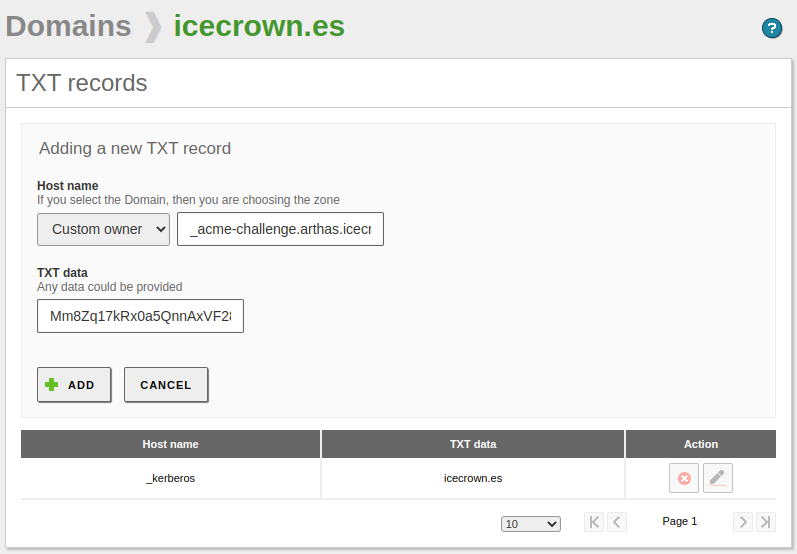
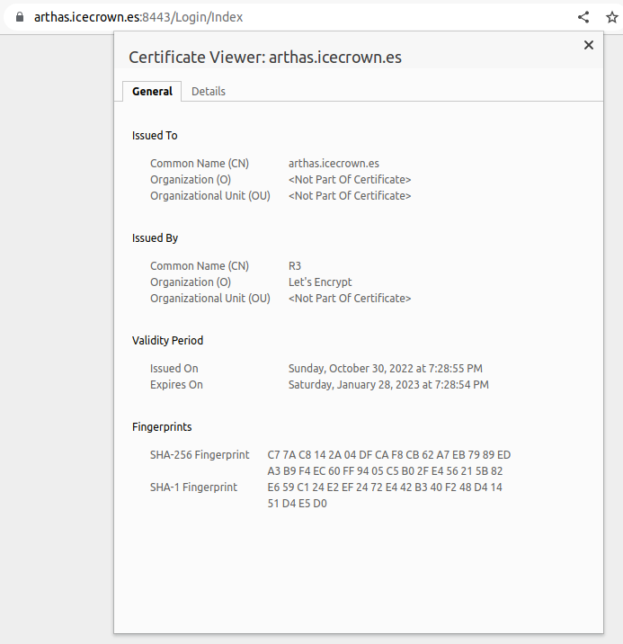
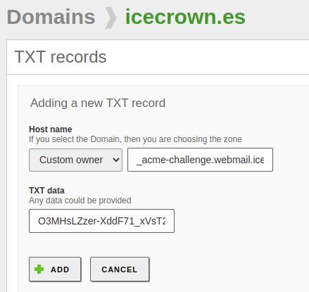
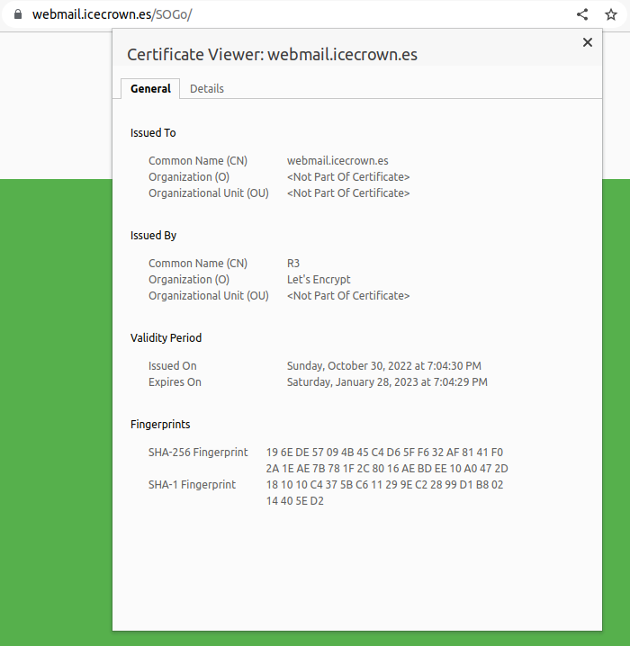
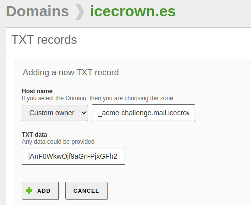

# Certificados

Llegados a este punto y antes de proceder a la securización del servicio de correo, lo que haremos será generar los certificados de los módulos: `Webadmin`, `Correo` y `Webmail` usando una entidad certificadora (CA) reconocida, que en mi caso será [Let's Encrypt].

En mi caso concreto, en lugar de generar un único certificado que contenga los tres subdominios, generaré un certificado por subdominio, de esta forma, en caso de haber un problema con la renovación o de querer cambiar de subdominio para un módulo concreto, las acciones a realizar serán menos complejas.

Mencionar addicionalmente que en mi caso concreto, procederé a expedir los certificados usando un registro `TXT` en el DNS en lugar de usar el protocolo `HTTP`.

A continuación se indican las acciones a realizar antes de proceder a la generación de los certificados.

1. Instalaremos el paquete necesario para la generación de los certificados:

    ```bash
    sudo apt update
    sudo apt install certbot
    ```

2. Comprobaremos que desde el exterior podemos resolver los subdominios:

    ```bash
    dig arthas.icecrown.es @8.8.8.8
    dig mail.icecrown.es @8.8.8.8
    dig webmail.icecrown.es @8.8.8.8
    ```

## Webadmin

Para generar el certificado para el **Webadmin (panel de administración)** realizaremos lo siguiente:

1. Generaremos el certificado:

    ```bash
    certbot certonly --manual --preferred-challenges dns -m it.infra@icecrown.es -d arthas.icecrown.es --agree-tos
    ```

    Un ejemplo del resultado:

    ```bash
    Saving debug log to /var/log/letsencrypt/letsencrypt.log
    Plugins selected: Authenticator manual, Installer None
    Obtaining a new certificate
    Performing the following challenges:
    dns-01 challenge for arthas.icecrown.es

    - - - - - - - - - - - - - - - - - - - - - - - - - - - - - - - - - - - - - - - -
    NOTE: The IP of this machine will be publicly logged as having requested this
    certificate. If you're running certbot in manual mode on a machine that is not
    your server, please ensure you're okay with that.

    Are you OK with your IP being logged?
    - - - - - - - - - - - - - - - - - - - - - - - - - - - - - - - - - - - - - - - -
    (Y)es/(N)o: yes

    - - - - - - - - - - - - - - - - - - - - - - - - - - - - - - - - - - - - - - - -
    Please deploy a DNS TXT record under the name
    _acme-challenge.arthas.icecrown.es with the following value:

    E4arl9mX3nv4ljiIySbZtZmzA_8vC7dN1Nbg9RmT6AQ

    Before continuing, verify the record is deployed.
    - - - - - - - - - - - - - - - - - - - - - - - - - - - - - - - - - - - - - - - -
    Press Enter to Continue
    ```

2. Sin cerrar la terminal donde nos pide que creemos el registro `TXT`, vamos al panel de administración de Zentyal y añadimos el registro desde `DNS -> icecrown.es -> TXT records`:

    

3. Revisamos que se pueda resolver desde fuera el nuevo registro:

    ```bash
    dig TXT _acme-challenge.webmail.icecrown.es @8.8.8.8 +short
        "E4arl9mX3nv4ljiIySbZtZmzA_8vC7dN1Nbg9RmT6AQ"
    ```

4. De vuelta a la terminal, confirmamos la validación del certificado. Si todo va bien, nos mostrará un resultado como el siguiente:

    ```bash
    IMPORTANT NOTES:
    - Congratulations! Your certificate and chain have been saved at:
    /etc/letsencrypt/live/arthas.icecrown.es/fullchain.pem
    Your key file has been saved at:
    /etc/letsencrypt/live/arthas.icecrown.es/privkey.pem
    Your cert will expire on 2023-01-28. To obtain a new or tweaked
    version of this certificate in the future, simply run certbot
    again. To non-interactively renew *all* of your certificates, run
    "certbot renew"
    - If you like Certbot, please consider supporting our work by:

    Donating to ISRG / Let's Encrypt:   https://letsencrypt.org/donate
    Donating to EFF:                    https://eff.org/donate-le
    ```

5. Después, tendremos que modificar una plantilla de configuración ([stub](https://doc.zentyal.org/en/appendix-c.html#stubs)) del módulo, para que dicho cambio sea persistente ante futuras actualizaciones del módulo por parte de Zentyal. Para ello, crearemos el siguiente directorio:

    ```bash
    mkdir -vp /etc/zentyal/stubs/core
    ```

6. Copiaremos la plantilla a modificar:

    ```bash
    cp -v /usr/share/zentyal/stubs/core/nginx.conf.mas /etc/zentyal/stubs/core/
    ```

7. Modificaremos los siguientes parámetros de configuración de la plantilla copiada:

    ```bash
    ssl_certificate  /etc/letsencrypt/live/arthas.icecrown.es/fullchain.pem;
    ssl_certificate_key /etc/letsencrypt/live/arthas.icecrown.es/privkey.pem;
    ```

6. Opcionalmente, también podremos modificar algunos parámetros de configuración adicionales. El valor de estos parámetros han sido generados desde [esta](https://ssl-config.mozilla.org/#server=nginx&version=1.17.7&config=intermediate&openssl=1.1.1k&hsts=false&ocsp=false&guideline=5.6) página web.

    ```bash
    ## https://ssl-config.mozilla.org/#server=nginx&version=1.17.7&config=intermediate&openssl=1.1.1k&hsts=false&ocsp=false&guideline=5.6
    ## intermediate configuration
    ssl_protocols TLSv1.2 TLSv1.3;
    ssl_ciphers ECDHE-ECDSA-AES128-GCM-SHA256:ECDHE-RSA-AES128-GCM-SHA256:ECDHE-ECDSA-AES256-GCM-SHA384:ECDHE-RSA-AES256-GCM-SHA384:ECDHE-ECDSA-CHACHA20-POLY1305:ECDHE-RSA-CHACHA20-POLY1305:DHE-RSA-AES128-GCM-SHA256:DHE-RSA-AES256-GCM-SHA384;
    ssl_prefer_server_ciphers off;
    ```

7. Recargaremos Systemd y reiniciamos el módulo para que se apliquen los cambios:

    ```bash
    sudo systemctl daemon-reload
    sudo zs webadmin restart
    ```

8. Finalmente, nos logeamos al Webmail para confirmar que el certificado cargue correctamente.

    

## Webmail

Para generar el certificado para el **Webmail** realizaremos lo siguiente:

1. Generaremos el certificado:

    ```bash
    certbot certonly --manual --preferred-challenges dns -m it.infra@icecrown.es -d webmail.icecrown.es --agree-tos
    ```

    Un ejemplo del resultado:

    ```bash
    Saving debug log to /var/log/letsencrypt/letsencrypt.log
    Plugins selected: Authenticator manual, Installer None
    Obtaining a new certificate
    Performing the following challenges:
    dns-01 challenge for webmail.icecrown.es

    - - - - - - - - - - - - - - - - - - - - - - - - - - - - - - - - - - - - - - - -
    NOTE: The IP of this machine will be publicly logged as having requested this
    certificate. If you're running certbot in manual mode on a machine that is not
    your server, please ensure you're okay with that.

    Are you OK with your IP being logged?
    - - - - - - - - - - - - - - - - - - - - - - - - - - - - - - - - - - - - - - - -
    (Y)es/(N)o: yes

    - - - - - - - - - - - - - - - - - - - - - - - - - - - - - - - - - - - - - - - -
    Please deploy a DNS TXT record under the name
    _acme-challenge.webmail.icecrown.es with the following value:

    O3MHsLZzer-XddF71_xVsT2tjAMVw6Jzri2pfzI5umk

    Before continuing, verify the record is deployed
    ```

2. Sin cerrar la terminal donde nos pide que creemos el registro `TXT`, vamos al panel de administración de Zentyal y añadimos el registro desde `DNS -> icecrown.es -> TXT records`:

    

3. Revisamos que se pueda resolver desde fuera:

    ```bash
    dig TXT _acme-challenge.webmail.icecrown.es @8.8.8.8 +short
        "O3MHsLZzer-XddF71_xVsT2tjAMVw6Jzri2pfzI5umk"
    ```

4. De vuelta a la terminal, confirmamos la validación del certificado. Si todo va bien, nos mostrará un resultado como el siguiente:

    ```bash
    IMPORTANT NOTES:
    - Congratulations! Your certificate and chain have been saved at:
    /etc/letsencrypt/live/webmail.icecrown.es/fullchain.pem
    Your key file has been saved at:
    /etc/letsencrypt/live/webmail.icecrown.es/privkey.pem
    Your cert will expire on 2023-01-28. To obtain a new or tweaked
    version of this certificate in the future, simply run certbot
    again. To non-interactively renew *all* of your certificates, run
    "certbot renew"
    - If you like Certbot, please consider supporting our work by:

    Donating to ISRG / Let's Encrypt:   https://letsencrypt.org/donate
    Donating to EFF:                    https://eff.org/donate-le
    ```

5. Después, modificaremos los siguientes parámetros en el archivo de configuración `/etc/apache2/sites-available/default-ssl.conf` para establecer el nuevo certificado:

    ```bash
    SSLCertificateFile  /etc/letsencrypt/live/webmail.icecrown.es/fullchain.pem
    SSLCertificateKeyFile /etc/letsencrypt/live/webmail.icecrown.es/privkey.pem
    ```

6. Opcionalmente, también podremos modificar algunos parámetros de configuración adicionales. El valor de estos parámetros han sido generados desde [esta](https://ssl-config.mozilla.org/#server=apache&version=2.4.41&config=intermediate&openssl=1.1.1k&hsts=false&ocsp=false&guideline=5.6) página web.

    ```bash
    # https://ssl-config.mozilla.org/#server=apache&version=2.4.41&config=intermediate&openssl=1.1.1k&hsts=false&ocsp=false&guideline=5.6
    # intermediate configuration
    SSLProtocol             all -SSLv3 -TLSv1 -TLSv1.1
    SSLCipherSuite          ECDHE-ECDSA-AES128-GCM-SHA256:ECDHE-RSA-AES128-GCM-SHA256:ECDHE-ECDSA-AES256-GCM-SHA384:ECDHE-RSA-AES256-GCM-SHA384:ECDHE-ECDSA-CHACHA20-POLY1305:ECDHE-RSA-CHACHA20-POLY1305:DHE-RSA-AES128-GCM-SHA256:DHE-RSA-AES256-GCM-SHA384
    SSLHonorCipherOrder     off
    SSLSessionTickets       off
    ```

7. Reiniciamos el servicio para que se apliquen los cambios:

    ```bash
    sudo systemctl restart apache2
    ```

    **NOTA:** No es necesario reiniciar el módulo de Sogo, ya que Zentyal por el momento no gestiona este archivo de configuración.

8. Finalmente, nos logeamos al Webmail para confirmar que el certificado cargue correctamente.

    

## Correo

Para generar el certificado para el **Correo** realizaremos lo siguiente:

1. Generaremos el certificado:

    ```bash
    certbot certonly --manual --preferred-challenges dns -m it.infra@icecrown.es -d mail.icecrown.es --agree-tos
    ```

    Un ejemplo del resultado:

    ```bash
    Saving debug log to /var/log/letsencrypt/letsencrypt.log
    Plugins selected: Authenticator manual, Installer None
    Obtaining a new certificate
    Performing the following challenges:
    dns-01 challenge for mail.icecrown.es

    - - - - - - - - - - - - - - - - - - - - - - - - - - - - - - - - - - - - - - - -
    NOTE: The IP of this machine will be publicly logged as having requested this
    certificate. If you're running certbot in manual mode on a machine that is not
    your server, please ensure you're okay with that.

    Are you OK with your IP being logged?
    - - - - - - - - - - - - - - - - - - - - - - - - - - - - - - - - - - - - - - - -
    (Y)es/(N)o: yes

    - - - - - - - - - - - - - - - - - - - - - - - - - - - - - - - - - - - - - - - -
    Please deploy a DNS TXT record under the name
    _acme-challenge.mail.icecrown.es with the following value:

    jAnF0WkwOjf9aGn-PjxGFh2_yYJf2SkbuR2yag7elks

    Before continuing, verify the record is deployed
    ```

2. Sin cerrar la terminal donde nos pide que creemos el registro `TXT`, vamos al panel de administración de Zentyal y añadimos el registro desde `DNS -> icecrown.es -> TXT records`:

    

3. Revisamos que se pueda resolver desde fuera:

    ```bash
    dig TXT _acme-challenge.mail.icecrown.es @8.8.8.8 +short
        "O3MHsLZzer-PjxGFh2_yYJf2SkbuR2yag7elks"
    ```

4. De vuelta a la terminal, confirmamos la validación del certificado. Si todo va bien, nos mostrará un resultado como el siguiente:

    ```bash
    IMPORTANT NOTES:
    - Congratulations! Your certificate and chain have been saved at:
    /etc/letsencrypt/live/mail.icecrown.es/fullchain.pem
    Your key file has been saved at:
    /etc/letsencrypt/live/mail.icecrown.es/privkey.pem
    Your cert will expire on 2023-01-28. To obtain a new or tweaked
    version of this certificate in the future, simply run certbot
    again. To non-interactively renew *all* of your certificates, run
    "certbot renew"
    - If you like Certbot, please consider supporting our work by:

    Donating to ISRG / Let's Encrypt:   https://letsencrypt.org/donate
    Donating to EFF:                    https://eff.org/donate-le
    ```

5. Después, tendremos que modificar un par de plantillas de configuración ([stubs](https://doc.zentyal.org/en/appendix-c.html#stubs)) del módulo, para que dicho cambio sea persistente ante futuras actualizaciones del módulo por parte de Zentyal. Para ello, crearemos el siguiente directorio:

    ```bash
    mkdir -vp /etc/zentyal/stubs/mail
    ```

6. Copiaremos las plantillas a modificar:

    ```bash
    sudo cp -v /usr/share/zentyal/stubs/mail/dovecot.conf.mas /etc/zentyal/stubs/mail/
    sudo cp -v /usr/share/zentyal/stubs/mail/main.cf.mas /etc/zentyal/stubs/mail/
    ```

7. Modificaremos los siguientes parámetros de configuración de las plantillas copiadas:

    ```bash
    ## Archivo: /etc/zentyal/stubs/mail/main.cf.mas
    my $certFile = '/etc/letsencrypt/live/mail.icecrown.es/fullchain.pem';
    my $keyFile  = '/etc/letsencrypt/live/mail.icecrown.es/privkey.pem';

    ## Archivo: /etc/zentyal/stubs/mail/dovecot.conf.mas
    ssl_cert =</etc/letsencrypt/live/mail.icecrown.es/fullchain.pem
    ssl_key =</etc/letsencrypt/live/mail.icecrown.es/privkey.pem
    ```

8. Reiniciaremos el módulo para aplicar estos cambios:

    ```bash
    sudo zs mail restart
    ```

9. Finalmente, confirmaremos que tanto el servicio de Postfix (SMTP) como Dovecot (IMAP/POP3) del módulo de correo están usando los certificados. Para realizar dicha acción, podremos usar cliente de correo como Thunderbird o el comando `openssl`:

    ```bash
    openssl s_client -showcerts -connect mail.icecrown.es:993 -servername mail.icecrown.es
        ## Resultado de ejemplo
        CONNECTED(00000003)
        depth=2 C = US, O = Internet Security Research Group, CN = ISRG Root X1
        verify return:1
        depth=1 C = US, O = Let's Encrypt, CN = R3
        verify return:1
        depth=0 CN = mail.icecrown.es
        verify return:1
        ---
        Certificate chain
        0 s:CN = mail.icecrown.es
        i:C = US, O = Let's Encrypt, CN = R3

    openssl s_client -starttls smtp -showcerts -connect mail.icecrown.es:25 -servername mail.icecrown.es
        ## Resultado de ejemplo
        CONNECTED(00000003)
        depth=2 C = US, O = Internet Security Research Group, CN = ISRG Root X1
        verify return:1
        depth=1 C = US, O = Let's Encrypt, CN = R3
        verify return:1
        depth=0 CN = mail.icecrown.es
        verify return:1
        ---
        Certificate chain
        0 s:CN = mail.icecrown.es
        i:C = US, O = Let's Encrypt, CN = R3
    ```
