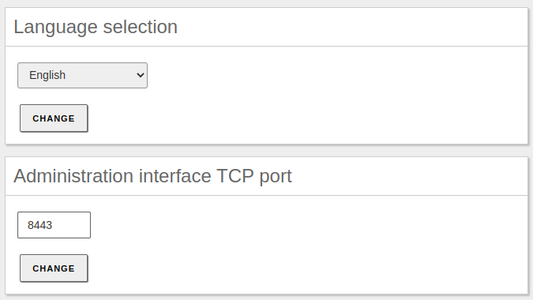
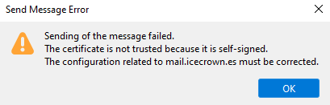
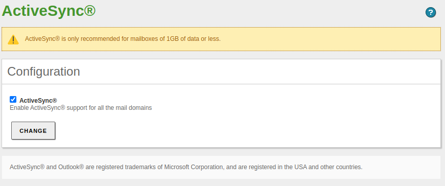
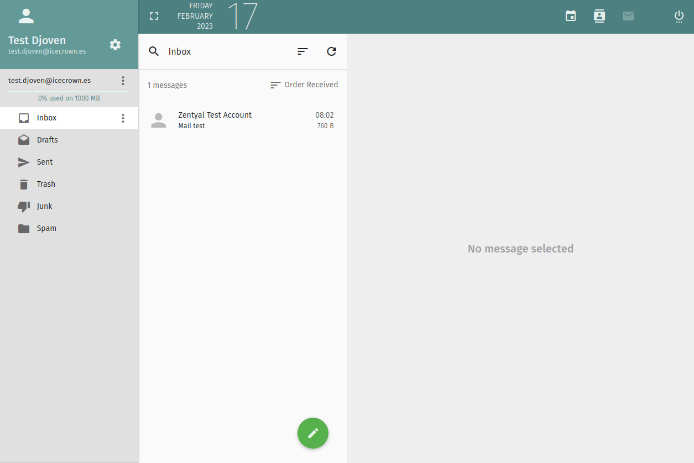
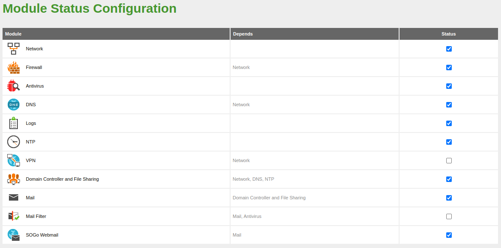
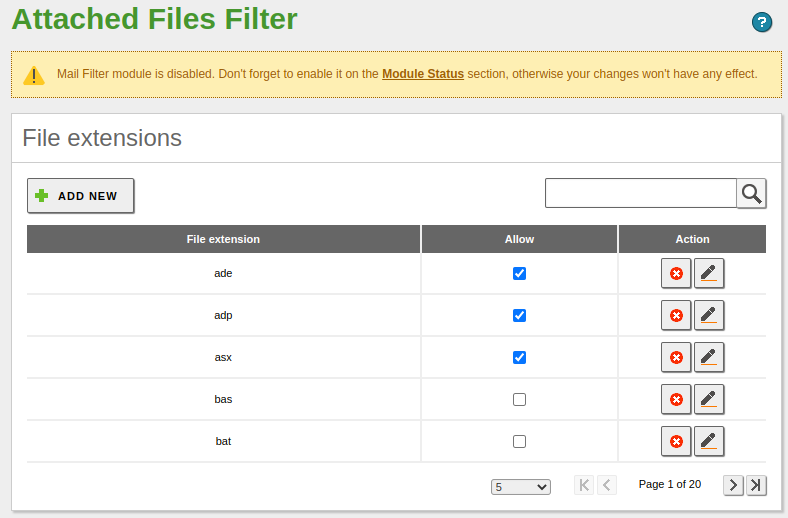
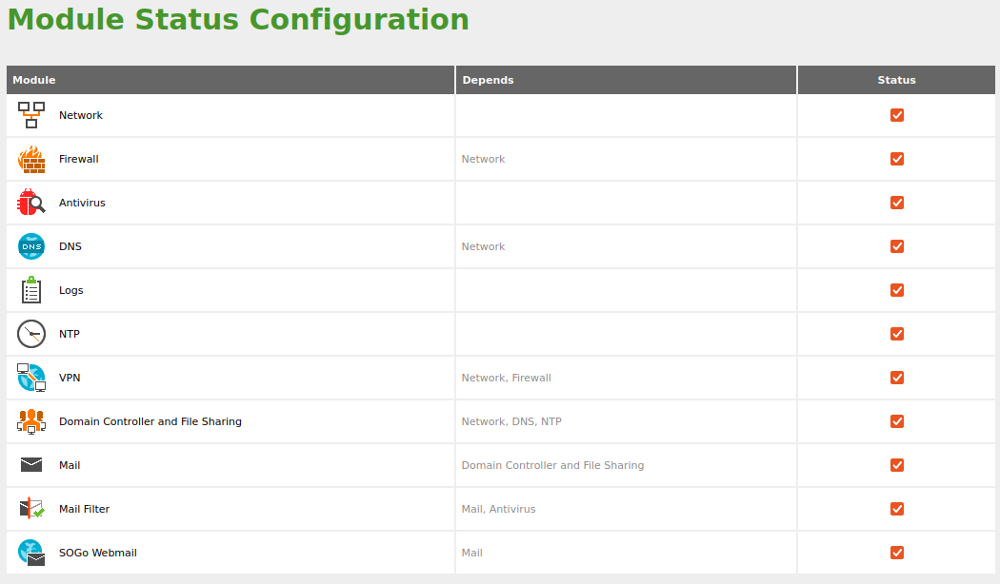
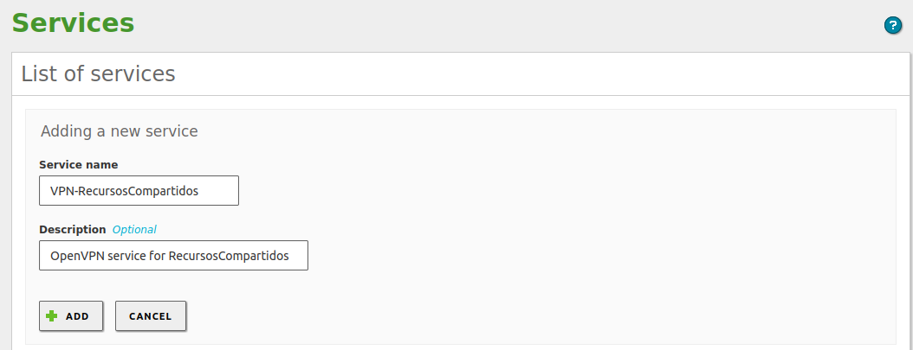
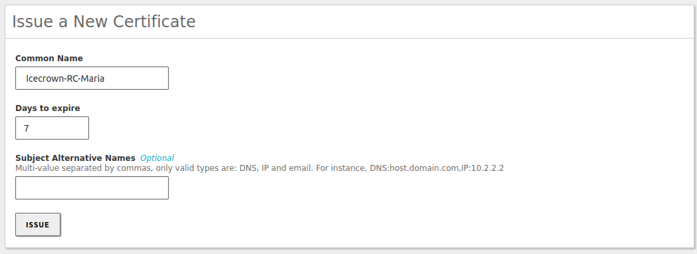

---

tags:
  - Zentyal

---

# Zentyal Configuration

This page will cover the configuration of the Zentyal server to act as a mail and file sharing server.

## Objectives

The objectives that will be accomplished are:

* (Optional) Uninstallation of Snap.
* (Optional) Additional configuration of local system users:
    * Modification of the prompt.
    * Modifications to the history.
    * Configuration for the vim editor.
* Creation of a SWAP partition.
* Configuration of additional EBS volumes.
* Implementation of quotas in the file system.
* Configuration of the following Zentyal modules:
    * [Network](https://doc.zentyal.org/en/firststeps.html#network-configuration-with-zentyal)
    * [Logs](https://doc.zentyal.org/en/logs.html)
    * [Firewall](https://doc.zentyal.org/en/firewall.html)
    * [Software](https://doc.zentyal.org/en/software.html)
    * [NTP](https://doc.zentyal.org/en/ntp.html)
    * [DNS](https://doc.zentyal.org/en/dns.html)
    * [Controlador de dominio](https://doc.zentyal.org/en/directory.html)
    * [Correo](https://doc.zentyal.org/en/mail.html)
    * [Webmail](https://doc.zentyal.org/en/mail.html#webmail)
    * [Antivirus](https://doc.zentyal.org/en/antivirus.html)
    * [Mailfilter](https://doc.zentyal.org/en/mailfilter.html)
    * [CA](https://doc.zentyal.org/en/ca.html)
    * [OpenVPN](https://doc.zentyal.org/en/vpn.html)

At the end of this document, the Zentyal server will be ready to use, although in subsequent documents we will continue to establish additional configurations such as the configuration of Let's Encrypt issued certificates or highly recommended options such as hardening of the mail service.

## Optional Configuration

In this section, various optional configurations will be made on the Zentyal server, so it can be skipped and move on to the 'Previous Configuration' section.
Snap

Since Zentyal does not use Snap, we will proceed with its uninstallation.

1. Stop the service:

    ```sh linenums="1"
    sudo systemctl stop snapd snapd.socket
    ```

2. Remove the package:

    ```sh linenums="1"
    sudo apt remove --purge -y snapd
    ```

3. Remove the directories that remain in the file system:

    ```sh linenums="1"
    sudo rm -rf /root/snap/
    ```

### Prompt

To improve the user experience when performing tasks from the CLI, we will enable prompt colors for existing and future local users.

```sh linenums="1"
for user in /root /home/ubuntu /home/djoven /etc/skel/; do
    sudo sed -i 's/#force_color_prompt/force_color_prompt/' $user/.bashrc
done
```

### History

In order to store more information in the personal history of users and also have a timestamp indicating the date and time a certain command was executed, we will add a series of additional options to both existing and future local users.

```sh linenums="1"
for user in /root /home/ubuntu /home/djoven /etc/skel/; do

sudo tee -a $user/.bashrc &>/dev/null <<EOF
## Custom options
HISTTIMEFORMAT="%F %T  "
PROMPT_COMMAND='history -a'
HISTIGNORE='clear:history'
EOF

sudo sed -i -e 's/HISTCONTROL=.*/HISTCONTROL=ignoreboth/' \
            -e 's/HISTSIZE=.*/HISTSIZE=1000/' \
            -e 's/HISTFILESIZE=.*/HISTFILESIZE=2000/' \
        $user/.bashrc
done
```

### Vim

We will add a simple custom configuration for the `vim` text editor for both existing and future users. This configuration will establish the following:

* Tabulation of 2 spaces.
* Enables syntax highlighting.
* Displays line numbers.
* Uses the 'desert' color scheme.
* Configures the editor to use Yaml files.

To set up the configuration, simply create a file called `.vimrc` in the users' home directory.
Previous Configuration

```sh linenums="1"
for user in /root /home/ubuntu /home/djoven /etc/skel; do

sudo tee -a $user/.vimrc &>/dev/null <<EOF
set tabstop=2
syntax on
set number
color desert
set shiftwidth=2
auto FileType yaml,yml setlocal ai ts=2 sw=2 et
EOF

done
```

## Previous Configuration

The previous configurations will be made before configuring the Zentyal modules. Except for the `Additional EBS Volumes` section, which is optional, the rest should be implemented.


### SWAP Partition

It is highly recommended to configure a SWAP partition on the server to increase server availability in case of RAM-related spikes. The actions we will take are documented [here](https://aws.amazon.com/premiumsupport/knowledge-center/ec2-memory-swap-file/).

1. Create an empty 4GB file, which will be the size of our SWAP partition:

    ```sh linenums="1"
    sudo dd if=/dev/zero of=/swapfile1 bs=128M count=32
    ```

2. Set the permissions for the file:

    ```sh linenums="1"
    sudo chmod 0600 /swapfile1
    ```

3. Set the file as a SWAP area:

    ```sh linenums="1"
    sudo mkswap /swapfile1
    ```

4. Enable the SWAP partition temporarily:

    ```sh linenums="1"
    sudo swapon /swapfile1
    ```

5. Verify that the system recognizes the new SWAP partition by running the following commands:

    ```sh linenums="1"
    sudo swapon -s
    sudo free -m
    ```

    The result we should get is:

    ```text linenums="1"
    ## Comando 'swapon'
    Filename				Type		Size	  Used	  Priority
    /swapfile1             	file    	4194300	     0	        -2

    ## comando 'free'
                    total        used        free      shared  buff/cache   available
    Mem:           3875        1218         209           2        2447        2396
    Swap:          4095           0        4095
    ```

6. Set the partition in the /etc/fstab configuration file so that it persists after the server restarts:

    ```sh linenums="1"
    echo -e '\n## SWAP partition 4GB\n/swapfile1 swap swap defaults 0 0' | sudo tee -a /etc/fstab
    ```

7. Finally, check that the new entry in the file does not contain syntax errors:

    ```sh linenums="1"
    sudo mount -a
    ```

### Additional EBS volumes

In case we have added additional EBS volumes - as in my case for mailboxes and shared resources -, we will proceed to configure and mount them on the server.

!!! note

    For the mount point of shared resources, `/home/samba/` could be used instead of `/home/`. However, using `/home/samba/` the personal directories of domain users (shared in '*H*' letter by default) would not be stored in the EBS volume.

1. List the volumes with the command:

    ```sh linenums="1"
    lsblk
    ```

    In my specific case, it shows the following result:

    ```text linenums="1"
    NAME         MAJ:MIN RM  SIZE RO TYPE MOUNTPOINT
    nvme1n1      259:0    0   10G  0 disk
    nvme0n1      259:1    0   30G  0 disk
    ├─nvme0n1p1  259:2    0 29.9G  0 part /
    ├─nvme0n1p14 259:3    0    4M  0 part
    └─nvme0n1p15 259:4    0  106M  0 part /boot/efi
    nvme2n1      259:5    0   10G  0 disk
    ```

2. Create a single partition that occupies the entire disk on the nvme1n1 and nvme2n1 volumes:

    ```sh linenums="1"
    for disk in nvme1n1 nvme2n1; do
        echo -e 'n\np\n\n\n\nt\n8e\nw' | sudo fdisk /dev/$disk
    done
    ```

    !!! info

        '8e' sets the partition label as 'Linux'.

3. Verify that the partitions have been created correctly:

    ```sh linenums="1"
    lsblk
    ```

    In my specific case, it shows the following result:

    ```text linenums="1"
    NAME         MAJ:MIN RM  SIZE RO TYPE MOUNTPOINT
    nvme1n1      259:0    0   10G  0 disk
    └─nvme1n1p1  259:7    0   10G  0 part
    nvme0n1      259:1    0   30G  0 disk
    ├─nvme0n1p1  259:2    0 29.9G  0 part /
    ├─nvme0n1p14 259:3    0    4M  0 part
    └─nvme0n1p15 259:4    0  106M  0 part /boot/efi
    nvme2n1      259:5    0   10G  0 disk
    └─nvme2n1p1  259:8    0   10G  0 part
    ```

4. Set ext4 as the file system for the new partitions:

    ```sh linenums="1"
    for disk in nvme1n1p1 nvme2n1p1; do
        sudo mkfs -t ext4 /dev/$disk
    done
    ```

5. Verify that everything went well with the command:

    ```sh linenums="1"
    lsblk -f
    ```

    In my specific case, it shows the following result:

    ```text linenums="1"
    NAME         FSTYPE LABEL           UUID                                 FSAVAIL FSUSE% MOUNTPOINT
    nvme1n1
    └─nvme1n1p1  ext4                   28e5471e-8fc1-48b5-8729-778c56a19b90
    nvme0n1
    ├─nvme0n1p1  ext4   cloudimg-rootfs 418a4763-c829-4fb6-b538-9a38158da803   26.8G     7% /
    ├─nvme0n1p14
    └─nvme0n1p15 vfat   UEFI            CBF7-D252                              99.2M     5% /boot/efi
    nvme2n1
    └─nvme2n1p1  ext4                   e903ff6f-c431-4e3a-92a1-9f476c66b3be
    ```

6. Create the directory where the EBS volume for mailboxes will be mounted:

    ```sh linenums="1"
    sudo mkdir -v -m0775 /var/vmail
    ```

7. Temporarily mount the EBS volume that will contain the shared resources:

    ```sh linenums="1"
    sudo mount /dev/nvme2n1p1 /mnt
    ```

8. Copy the content of the /home/ directory to the temporary directory where we have mounted the EBS volume:

    ```sh linenums="1"
    sudo cp -aR /home/* /mnt/
    ```

9. Unmount the EBS volume:

    ```sh linenums="1"
    sudo umount /mnt
    ```

10. Obtain the identifier (UUID) of the volumes:

    ```sh linenums="1"
    sudo sudo blkid | egrep "nvme[12]n1p1"
    ```

    In my specific case, it shows the following result:

    ```sh linenums="1"
    /dev/nvme2n1p1: UUID="28e5471e-8fc1-48b5-8729-778c56a19b90" TYPE="ext4" PARTUUID="558dd3b7-01"
    /dev/nvme1n1p1: UUID="e903ff6f-c431-4e3a-92a1-9f476c66b3be" TYPE="ext4" PARTUUID="446d2929-01"
    ```

    !!! warning

        Remember that the volume for mailboxes was mounted first, so its mount point is `/dev/nvme1n1p1`.

11. Set the EBS volume mounting in the `/etc/fstab` file:

    !!! warning

        You will have to change the value of the `UUID` parameter to your value obtained in step 7.

12. Mount the volumes to verify that there are no syntax errors in the file from the previous step:

    ```sh linenums="1"
    sudo mount -a
    ```

13. Finally, confirm that they have been mounted correctly by running the following commands:

    ```sh linenums="1"
    mount | egrep 'nvme[12]n1p1'
    df -h
    ```

    In my specific case, it shows the following result:

    ```sh linenums="1"
    ## Comando 'mount'
    /dev/nvme2n1p1 on /var/vmail type ext4 (rw,nosuid,nodev,noexec,relatime)
    /dev/nvme1n1p1 on /home type ext4 (rw,nosuid,nodev,noexec,relatime)

    ## Comando 'df'
    Filesystem       Size  Used Avail Use% Mounted on
    /dev/root         29G  7.9G   21G  28% /
    devtmpfs         1.9G     0  1.9G   0% /dev
    tmpfs            1.9G  4.0K  1.9G   1% /dev/shm
    tmpfs            388M  2.6M  386M   1% /run
    tmpfs            5.0M     0  5.0M   0% /run/lock
    tmpfs            1.9G     0  1.9G   0% /sys/fs/cgroup
    /dev/nvme2n1p1   9.8G   17M  9.3G   1% /var/vmail
    /dev/nvme1n1p1   9.8G  228K  9.3G   1% /home
    /dev/nvme0n1p15  105M  5.2M  100M   5% /boot/efi
    ```

### Quota

To be able to use the quotas that Zentyal allows setting to limit the use of information that a domain user can store on the server, as well as for the maximum mailbox size, it is necessary to install a series of packages and enable their use on the disk.

!!! note

    It is not necessary to enable the quota on the disk that contains the mailboxes, since Zentyal manages them differently.

1. Install the following packages required for AWS instances:

    ```sh linenums="1"
    sudo apt update
    sudo apt install -y quota quotatool linux-modules-extra-aws
    ```

2. Set the additional mount options on the EBS volume for shared resources, to do this, edit the configuration file /etc/fstab:

    ```sh linenums="1"
    ## AWS EBS - Shares
    UUID=28e5471e-8fc1-48b5-8729-778c56a19b90	/home	ext4	defaults,noexec,nodev,nosuid,usrjquota=quota.user,grpjquota=quota.group,jqfmt=vfsv0 0 2
    ```

    !!! info

        The added options are: `usrjquota`, `grpjquota`, and `jqfmt`.

3. Restart the server so that the latest kernel is loaded and we can securely enable quotas:

    ```sh linenums="1"
    sudo reboot
    ```

4. Add the Quota module to the kernel:

    ```sh linenums="1"
    sudo modprobe quota_v2
    ```

5. Persist the previous change:

    ```sh linenums="1"
    echo 'quota_v2' | sudo tee -a /etc/modules
    ```

6. Let the system check quotas and create the necessary files:

    ```sh linenums="1"
    sudo quotacheck -vugmf /home
    ```

    The result I obtained in my case was:

    ```text linenums="1"
    quotacheck: Scanning /dev/nvme1n1p1 [/home] done
    quotacheck: Checked 8 directories and 18 files
    ```

## Configuration of the modules

From this point on, we will be able to install, configure and check the Zentyal modules.


### General

First of all, what we need to do is configure the Zentyal base from the `System -> General` menu.

1. We will set the language of the administration panel and the port on which the webadmin module will listen:

    

2. Then, from the same panel, we set the server name and domain:

    

    !!! warning

        Once we enable the domain controller module, these 2 values cannot be changed.

### Logs module

Initially, we will enable the available 'domains', change the retention time to 30 days for the firewall and 90 for the administration panel changes as well as administrator logins:


### Firewall module

For our network configuration (internal) and the modules we will use, the firewall sections we will use are:

* Filtering rules from internal networks to Zentyal
* Filtering rules from traffic coming out from Zentyal

The default policies in both firewall sections are secure; however, we will add a `LOG` rule for SSH connections as it is always a good idea to have as much information as possible about this critical service. To do this, we will go to F`irewall -> Packet Filter -> Filtering rules from internal networks to Zentyal` and add the following rule:


Resulting in the following rules:


**Considerations:**

1. It is important that the new rule goes above the rule that accepts the SSH connection; otherwise, it will never be executed as when a rule is fulfilled, the rest are not analyzed.
2. Remember that in addition to this firewall, we also have the one from AWS (Security Group associated with the instance), so we will have to make sure that both firewalls have the same rules.
3. It could be configured in the Zentyal firewall to allow all traffic and then, from the security group, be more restrictive, or vice versa. However, it is recommended to configure both equally.

### Software module

In order to have our server updated, we will enable and set the time at which automatic updates will be installed. In addition, we will proceed to install the modules we are going to use.

1. From the `Software Management -> Settings` menu, we set the automatic update configurations:

    

    !!! nota

        It is highly recommended to set a time that is after the server backups such as snapshots, so we have a stable restoration point in case an update causes a critical incident.


2. Then, from the `Software Management -> Zentyal Components` menu, we will proceed to install **only** the modules we are going to use:

    

    !!! info

        After the modules are installed, multiple rules will be automatically created in the `Filtering rules from internal networks to Zentyal` section of the firewall to allow access to these modules.


### NTP module

The first of the newly installed modules that we are going to configure is [NTP]. We will set the time zone and the geographically

[NTP]: https://doc.zentyal.org/en/ntp.html

1. Let's go to `System -> Date/Time` and set the time zone:

    

2. Enable the option that allows syncing time with external servers:

    

3. Modify the default NTP servers to the official ones we have available on [this] website:

    

4. Finalmente, habilitamos el módulo de NTP desde `Modules Status`:

    

[this]: https://www.pool.ntp.org/en

### DNS module

The next module we will proceed to configure is the [DNS] module, which is critical for the functioning of the domain controller module and, by dependency, also the mail module.

[DNS]: https://doc.zentyal.org/en/dns.html

The configuration we will establish will be minimal, since we will manage the DNS record management from the administration panel where we have registered the domain - Route 53 in my case -.

1. We create the domain, which must match the one created in `System -> General`. To do this, from the side menu we select `DNS`:

    

2. Next, we check that the server's IP address has been successfully registered to the domain, by going to the `Domain IP Addresses` field of the newly created domain:

    

3. We also check that the IP has been registered for the server name. In this case, the field is `Hostnames -> IP Address`:

    

4. Next, we create additional alias records from `Hostnames -> Alias`. In my case, I will create two records related to email: **mail** and **webmail**.

    

5. We set the DNS forwarders, which in this case will be those of [Cloudflare] and [Quad9]:

    

6. Once the module configuration has been established, we proceed to enable it from `Modules Status`:

    

7. Finally, we check that we can resolve the configured DNS records from the server itself. To do this, we will run the following commands:

    ```sh linenums="1"
    ## For the domain
    dig icecrown.es

    ## For the server hostname
    dig arthas.icecrown.es

    ## For the alias
    dig mail.icecrown.es
    dig webmail.icecrown.es
    ```

    Below are the results I have obtained:

    ```text linenums="1"
    ## For the domain
    ; <<>> DiG 9.16.1-Ubuntu <<>> icecrown.es
    ;; global options: +cmd
    ;; Got answer:
    ;; ->>HEADER<<- opcode: QUERY, status: NOERROR, id: 11829
    ;; flags: qr aa rd ra; QUERY: 1, ANSWER: 1, AUTHORITY: 0, ADDITIONAL: 1

    ;; OPT PSEUDOSECTION:
    ; EDNS: version: 0, flags:; udp: 4096
    ; COOKIE: 517f093b1a488a630100000063ef1e5f33c655878c47e480 (good)
    ;; QUESTION SECTION:
    ;icecrown.es.			IN	A

    ;; ANSWER SECTION:
    icecrown.es.		259200	IN	A	10.0.1.200

    ;; Query time: 0 msec
    ;; SERVER: 127.0.0.1#53(127.0.0.1)
    ;; WHEN: Fri Feb 17 07:27:43 CET 2023
    ;; MSG SIZE  rcvd: 84


    ## For the server hostname
    ; <<>> DiG 9.16.1-Ubuntu <<>> arthas.icecrown.es
    ;; global options: +cmd
    ;; Got answer:
    ;; ->>HEADER<<- opcode: QUERY, status: NOERROR, id: 53740
    ;; flags: qr aa rd ra; QUERY: 1, ANSWER: 1, AUTHORITY: 0, ADDITIONAL: 1

    ;; OPT PSEUDOSECTION:
    ; EDNS: version: 0, flags:; udp: 4096
    ; COOKIE: 0a10fe5bc110fbe20100000063ef1e79cd9a2652e62e1cba (good)
    ;; QUESTION SECTION:
    ;arthas.icecrown.es.		IN	A

    ;; ANSWER SECTION:
    arthas.icecrown.es.	259200	IN	A	10.0.1.200

    ;; Query time: 0 msec
    ;; SERVER: 127.0.0.1#53(127.0.0.1)
    ;; WHEN: Fri Feb 17 07:28:09 CET 2023
    ;; MSG SIZE  rcvd: 91


    ## For the 'mail' alias
    ; <<>> DiG 9.16.1-Ubuntu <<>> mail.icecrown.es
    ;; global options: +cmd
    ;; Got answer:
    ;; ->>HEADER<<- opcode: QUERY, status: NOERROR, id: 62966
    ;; flags: qr aa rd ra; QUERY: 1, ANSWER: 2, AUTHORITY: 0, ADDITIONAL: 1

    ;; OPT PSEUDOSECTION:
    ; EDNS: version: 0, flags:; udp: 4096
    ; COOKIE: c5ac7f415fe066aa0100000063ef1e9c7e18da9abf7650f1 (good)
    ;; QUESTION SECTION:
    ;mail.icecrown.es.		IN	A

    ;; ANSWER SECTION:
    mail.icecrown.es.	259200	IN	CNAME	arthas.icecrown.es.
    arthas.icecrown.es.	259200	IN	A	10.0.1.200

    ;; Query time: 0 msec
    ;; SERVER: 127.0.0.1#53(127.0.0.1)
    ;; WHEN: Fri Feb 17 07:28:44 CET 2023
    ;; MSG SIZE  rcvd: 110


    ## For the 'webmail' alias
    ; <<>> DiG 9.16.1-Ubuntu <<>> webmail.icecrown.es
    ;; global options: +cmd
    ;; Got answer:
    ;; ->>HEADER<<- opcode: QUERY, status: NOERROR, id: 40072
    ;; flags: qr aa rd ra; QUERY: 1, ANSWER: 2, AUTHORITY: 0, ADDITIONAL: 1

    ;; OPT PSEUDOSECTION:
    ; EDNS: version: 0, flags:; udp: 4096
    ; COOKIE: a1ff85fe806432700100000063ef1eb9ff2777f239f7c9a3 (good)
    ;; QUESTION SECTION:
    ;webmail.icecrown.es.		IN	A

    ;; ANSWER SECTION:
    webmail.icecrown.es.	259200	IN	CNAME	arthas.icecrown.es.
    arthas.icecrown.es.	259200	IN	A	10.0.1.200

    ;; Query time: 0 msec
    ;; SERVER: 127.0.0.1#53(127.0.0.1)
    ;; WHEN: Fri Feb 17 07:29:13 CET 2023
    ;; MSG SIZE  rcvd: 113
    ```

    As can be seen, the `status` for all is '**NOERROR**' and the '**ANSWER SECTION**' shows the DNS records in question.

[Cloudflare]: https://www.cloudflare.com/
[Quad9]: https://www.quad9.net/

At this point, the module would be configured in Zentyal. However, we still need to create the records with the server's public IP address in the DNS provider so that they are visible externally. Here are the steps to perform for AWS Route53:

1. Go to `Route 53 -> Hosted zones -> domain` and create the same records as in Zentyal but with the public IP:

    

2. We wait a few minutes for them to replicate globally.

3. Finally, we check the resolution of the records:

    ```sh linenums="1"
    ## For the domain
    dig @8.8.8.8 icecrown.es

    ## For the server name
    dig @8.8.8.8 arthas.icecrown.es

    ## ParFor the alias
    dig @8.8.8.8 mail.icecrown.es
    dig @8.8.8.8 webmail.icecrown.es
    ```

    A continuación, los resultados que he obtenido:

    ```text linenums="1"
    ## For the domain
    ; <<>> DiG 9.16.1-Ubuntu <<>> @8.8.8.8 icecrown.es
    ; (1 server found)
    ;; global options: +cmd
    ;; Got answer:
    ;; ->>HEADER<<- opcode: QUERY, status: NOERROR, id: 7888
    ;; flags: qr rd ra; QUERY: 1, ANSWER: 1, AUTHORITY: 0, ADDITIONAL: 1

    ;; OPT PSEUDOSECTION:
    ; EDNS: version: 0, flags:; udp: 512
    ;; QUESTION SECTION:
    ;icecrown.es.			IN	A

    ;; ANSWER SECTION:
    icecrown.es.		60	IN	A	15.237.168.75

    ;; Query time: 16 msec
    ;; SERVER: 8.8.8.8#53(8.8.8.8)
    ;; WHEN: Fri Feb 17 07:30:36 CET 2023
    ;; MSG SIZE  rcvd: 56


    ## For the server name
    ; <<>> DiG 9.16.1-Ubuntu <<>> @8.8.8.8 arthas.icecrown.es
    ; (1 server found)
    ;; global options: +cmd
    ;; Got answer:
    ;; ->>HEADER<<- opcode: QUERY, status: NOERROR, id: 33376
    ;; flags: qr rd ra; QUERY: 1, ANSWER: 1, AUTHORITY: 0, ADDITIONAL: 1

    ;; OPT PSEUDOSECTION:
    ; EDNS: version: 0, flags:; udp: 512
    ;; QUESTION SECTION:
    ;arthas.icecrown.es.		IN	A

    ;; ANSWER SECTION:
    arthas.icecrown.es.	120	IN	A	15.237.168.75

    ;; Query time: 36 msec
    ;; SERVER: 8.8.8.8#53(8.8.8.8)
    ;; WHEN: Fri Feb 17 07:30:56 CET 2023
    ;; MSG SIZE  rcvd: 63


    ## For the 'mail' alias
    ; <<>> DiG 9.16.1-Ubuntu <<>> @8.8.8.8 mail.icecrown.es
    ; (1 server found)
    ;; global options: +cmd
    ;; Got answer:
    ;; ->>HEADER<<- opcode: QUERY, status: NOERROR, id: 46107
    ;; flags: qr rd ra; QUERY: 1, ANSWER: 2, AUTHORITY: 0, ADDITIONAL: 1

    ;; OPT PSEUDOSECTION:
    ; EDNS: version: 0, flags:; udp: 512
    ;; QUESTION SECTION:
    ;mail.icecrown.es.		IN	A

    ;; ANSWER SECTION:
    mail.icecrown.es.	300	IN	CNAME	arthas.icecrown.es.
    arthas.icecrown.es.	120	IN	A	15.237.168.75

    ;; Query time: 16 msec
    ;; SERVER: 8.8.8.8#53(8.8.8.8)
    ;; WHEN: Fri Feb 17 07:31:29 CET 2023
    ;; MSG SIZE  rcvd: 82


    ## For the 'webmail' alias
    ; <<>> DiG 9.16.1-Ubuntu <<>> @8.8.8.8 webmail.icecrown.es
    ; (1 server found)
    ;; global options: +cmd
    ;; Got answer:
    ;; ->>HEADER<<- opcode: QUERY, status: NOERROR, id: 9490
    ;; flags: qr rd ra; QUERY: 1, ANSWER: 2, AUTHORITY: 0, ADDITIONAL: 1

    ;; OPT PSEUDOSECTION:
    ; EDNS: version: 0, flags:; udp: 512
    ;; QUESTION SECTION:
    ;webmail.icecrown.es.		IN	A

    ;; ANSWER SECTION:
    webmail.icecrown.es.	300	IN	CNAME	arthas.icecrown.es.
    arthas.icecrown.es.	120	IN	A	15.237.168.75

    ;; Query time: 36 msec
    ;; SERVER: 8.8.8.8#53(8.8.8.8)
    ;; WHEN: Fri Feb 17 07:31:59 CET 2023
    ;; MSG SIZE  rcvd: 85
    ```

After confirming the domain's functioning both internally (from Zentyal) and externally, the DNS module will be correctly configured, and we can proceed with the next module.

### Mail module

With the domain controller module configured, we can now configure the [mail] module, as it depends on the former to be enabled first. In my specific case, I will establish the following optional settings:

* The postmaster user will be `postmaster@icecrown.es`.
* I will set 1GB as the default quota for mailboxes.
* The maximum size of an accepted message will be 25MB.
* Emails deleted in mailboxes will be automatically purged after 90 days.
* Emails in the spam folder will be automatically deleted after 90 days.
* Mail account synchronization through Fetchmail will be done every 5 minutes.
* Only IMAPS and POP3S protocols will be allowed.
* Fetchmail and Sieve will be disabled, as I won't be using them initially.
* The greylist will be enabled, and forwarding time will be reduced to 24 hours, with a 30-day deletion period.

[mail]: https://doc.zentyal.org/en/mail.html

Here are the steps to configure the module:

1. Create the virtual mail domain, which will be the same as the domain configured in the DNS module. From the left-hand side menu, go to `Mail -> Virtual Mail Domains`:

    

2. Establish the optional restrictive configurations mentioned from `Mail -> General`:

    

3. Disable Fetchmail and Sieve:

    

4. Enable the greylist from `Mail -> Greylist`:

    

5. Enable the module:

    

6. Create the `MX` type record in the domain. In my case, I will do it from Route53:

    


    Additionally, I will also create it in Zentyal, but as it is an alias, it will have to be done using the CLI:

    ```sh linenums="1"
    sudo samba-tool dns add 127.0.0.1 icecrown.es icecrown.es MX "mail.icecrown.es 10" -U zenadmin
    ```

7. Check the new DNS record both internally and externally:

    ```sh linenums="1"
    dig MX icecrown.es
    dig @8.8.8.8 MX icecrown.es
    ```

    The result I get is:

    ```text linenums="1"
    ## Internal query
    ; <<>> DiG 9.16.1-Ubuntu <<>> MX icecrown.es
    ;; global options: +cmd
    ;; Got answer:
    ;; ->>HEADER<<- opcode: QUERY, status: NOERROR, id: 432
    ;; flags: qr aa rd ra; QUERY: 1, ANSWER: 1, AUTHORITY: 0, ADDITIONAL: 1

    ;; OPT PSEUDOSECTION:
    ; EDNS: version: 0, flags:; udp: 4096
    ; COOKIE: 7d99083c5d639dad0100000063ef22121ec656087bc76972 (good)
    ;; QUESTION SECTION:
    ;icecrown.es.			IN	MX

    ;; ANSWER SECTION:
    icecrown.es.		900	IN	MX	10 mail.icecrown.es.

    ;; Query time: 8 msec
    ;; SERVER: 127.0.0.1#53(127.0.0.1)
    ;; WHEN: Fri Feb 17 07:43:30 CET 2023
    ;; MSG SIZE  rcvd: 89


    ## External query
    ; <<>> DiG 9.16.1-Ubuntu <<>> @8.8.8.8 MX icecrown.es
    ; (1 server found)
    ;; global options: +cmd
    ;; Got answer:
    ;; ->>HEADER<<- opcode: QUERY, status: NOERROR, id: 28263
    ;; flags: qr rd ra; QUERY: 1, ANSWER: 1, AUTHORITY: 0, ADDITIONAL: 1

    ;; OPT PSEUDOSECTION:
    ; EDNS: version: 0, flags:; udp: 512
    ;; QUESTION SECTION:
    ;icecrown.es.			IN	MX

    ;; ANSWER SECTION:
    icecrown.es.		300	IN	MX	10 mail.icecrown.es.

    ;; Query time: 36 msec
    ;; SERVER: 8.8.8.8#53(8.8.8.8)
    ;; WHEN: Fri Feb 17 07:44:00 CET 2023
    ;; MSG SIZE  rcvd: 61
    ```

8. Create the `postmaster@icecrown.es` user specified in step 2 and also a test user, which in my case will be named `test.djoven`. To do this, go to `Users and Computers -> Manage`:

    
    

Finally, we will test with a mail client (Thunderbird in my case) that we can configure the account of the test user created:

1. Configure a new account in Thunderbird:

    

2. Set the connection data with the SMTPS and IMAPS service:

    

    !!! warning

        You must change the authentication type to '**Normal password**', otherwise authentication will fail.


3. After confirming the configuration, the following warning message about the certificate will appear, which is normal, as it is a self-signed certificate by Zentyal:

    

4. Once the security exception is confirmed, we should be able to see the email account:

    

5. Send a test email to ourselves and another to an external account to confirm the module's operation.

    !!! nota

        When we try to send the message, we will receive an error again due to the self-signed certificate, so we will have to confirm it again.


    

    

6. If everything went well, we should have received the email both internally and externally, and also in the `/var/log/mail.log` log we should see similar records as:

    ```text linenums="1"
    Feb 17 07:02:41 ip-10-0-1-200 postfix/smtpd[27139]: connect from 36.red-45-4-127.staticip.rima-tde.net[88.6.127.36]
    Feb 17 07:02:41 ip-10-0-1-200 postfix/smtpd[27139]: 958BDFEEFC: client=36.red-45-4-127.staticip.rima-tde.net[88.6.127.36], sasl_method=PLAIN, sasl_username=test.
    djoven@icecrown.es
    Feb 17 07:02:41 ip-10-0-1-200 postfix/cleanup[27145]: 958BDFEEFC: message-id=<17715909-c13a-eed6-7f23-18f697740075@icecrown.es>
    Feb 17 07:02:41 ip-10-0-1-200 postfix/qmgr[24894]: 958BDFEEFC: from=<test.djoven@icecrown.es>, size=681, nrcpt=2 (queue active)
    Feb 17 07:02:41 ip-10-0-1-200 dovecot: lda(test.djoven@icecrown.es)<27148><b1LEMJEm72MMagAAcf9/Kw>: msgid=<17715909-c13a-eed6-7f23-18f697740075@icecrown.es>: sav
    ed mail to INBOX

    Feb 17 07:02:41 ip-10-0-1-200 postfix/pipe[27146]: 958BDFEEFC: to=<test.djoven@icecrown.es>, relay=dovecot, delay=0.29, delays=0.24/0.01/0/0.03, dsn=2.0.0, status=sent (delivered via dovecot service)

    Feb 17 07:02:41 ip-10-0-1-200 postfix/smtpd[27139]: disconnect from 36.red-45-4-127.staticip.rima-tde.net[88.6.127.36] ehlo=2 starttls=1 auth=1 mail=1 rcpt=2 data=1 quit=1 commands=9
    Feb 17 07:02:42 ip-10-0-1-200 dovecot: imap-login: Disconnected (no auth attempts in 1 secs): user=<>, rip=88.6.127.36, lip=10.0.1.200, TLS handshaking: SSL_accept() failed: error:14094412:SSL routines:ssl3_read_bytes:sslv3 alert bad certificate: SSL alert number 42, session=<mXZJ5t/0eLxYBn8k>

    Feb 17 07:02:42 ip-10-0-1-200 postfix/smtp[27147]: 958BDFEEFC: to=<external-account>, relay=gmail-smtp-in.l.google.com[74.125.133.27]:25, delay=1, delays=0.24/0.01/0.08/0.67, dsn=2.0.0, status=sent (250 2.0.0 OK  1676617362 n13-20020adfe34d000000b002c56af91a8esi3912146wrj.115 - gsmtp)

    Feb 17 07:02:42 ip-10-0-1-200 postfix/qmgr[24894]: 958BDFEEFC: removed
    ```

    !!! success

        As can be seen, the status of both emails is `sent`.

At this point, the mail module should be fully functional. However, it is not yet secured, so it is advisable not to use it yet until at least the Mailfilter module has been configured and enabled. Additionally, there is another page in this project called [Hardening](https://zentyal-aws.projects.djoven.es/en/zentyal-hardening/#mail-module) where the module's security will be further increased.

Also, note that if the server is installed in the AWS cloud provider, sending emails is not allowed by default (check the next to last section of the [AWS](https://zentyal-aws.projects.djoven.es/en/aws-configuration/#request-email-sending) page).

### Webmail Module

The next module to configure will be the [Webmail] (Sogo), which will allow us to manage our email account from a web browser. Additionally, from the webmail, a user can change their password.

[Webmail]: https://doc.zentyal.org/en/mail.html#webmail

1. We enable the [ActiveSync] protocol from Mail -> ActiveSync in case users want to synchronize their mobile devices.

    

2. We enable the module.

    

3. We check that we can access the login page from a web browser with the URL: https://arthas.icecrown.es/SOGo:

    !!! warning

        It will show a warning message due to the certificate used by the service, which is normal since it is self-signed.

    

4. Once we accept the exception, we should be able to see the login page:

    

5. We log in with the test user to confirm that authentication works correctly and that we can see our mailbox.

    

    !!! warning

        If we do not see the mailbox, it is possible that we are experiencing an existing bug, which occurs when the insecure mail protocols are not configured, and the certificate used is self-signed. To solve this, see the section `IMAPS` on the [bug fixing] page.

6. Finally, we try to send another email to ourselves to verify integration with the email module.

    

[ActiveSync]: https://doc.zentyal.org/en/mail.html#activesync-support
[bug fixing]: https://zentyal-aws.projects.djoven.es/en/zentyal-bug-fixing/#imaps

At this point, the module is fully functional; however, I will set the following optional configurations:

* I will enable the option of automatic messages for vacations since it is disabled by default.
* I will initially set the number of workers (processes) that the module will use to 8.

The following actions should be taken to apply the optional configurations:

1. We create the directory that will make the changes to the configuration templates (stubs) persistent against module updates.

    ```sh linenums="1"
    sudo mkdir -vp /etc/zentyal/stubs/sogo
    ```

2. We copy the Sogo configuration template `sogo.conf.mas`.

    ```sh linenums="1"
    sudo cp -v /usr/share/zentyal/stubs/sogo/sogo.conf.mas /etc/zentyal/stubs/sogo/
    ```

3. We set the parameter `SOGoVacationEnabled` to `YES` in the newly copied template.

    ```sh linenums="1"
    sudo sed -i 's/SOGoVacationEnabled.*/SOGoVacationEnabled = YES;/' /etc/zentyal/stubs/sogo/sogo.conf.mas
    ```

4. We restart the Webmail module to apply the change.

    ```sh linenums="1"
    sudo zs sogo restart
    ```

5. We log in to the Webadmin again and verify that the option is now available under `Preferences -> Mail`.

    

6. We set the value of prefork in the configuration file `/etc/zentyal/sogo.conf`.

    ```sh linenums="1"
    sed -i 's/#sogod_prefork.*/sogod_prefork=8/' /etc/zentyal/sogo.conf
    ```

    If we have many concurrent users using the module, it is possible that Sogo cannot manage all requests properly, so it will be necessary to increase this value. To detect this scenario, we simply need to search for records in the Sogo log located at `/var/log/sogo/sogo.log` similar to the following:

    ```sh linenums="1"
    sogod [3252]: [ERROR] <0x0x55c9db827250[WOWatchDog]> No child available to handle incoming request!
    ```

7. We restart the Webmail module to apply the change.

    ```sh linenums="1"
    sudo zs sogo restart
    ```

8. Finally, we check that the service has been started with the new value applied.

    ```sh linenums="1"
    ps -ef | grep sogod | head -1
    ```

    In my case, the result obtained from the command was:

    ```sh linenums="1"
    sogo 24430 1 0 00:40 ? 00:00:00 /usr/sbin/sogod -WOWorkersCount 8 -WOPidFile /var/run/sogo/sogo.pid -WOLogFile /var/log/sogo/sogo.log
    ```

### Antivirus Module

The next module we will configure is the [Antivirus]. Although this module consumes a lot of RAM, it is necessary for the analysis of the emails managed by the mailfilter module.

[Antivirus]: https://doc.zentyal.org/en/antivirus.html

The configuration that we can define for this module from the Zentyal administration panel in the Development version is nonexistent. Therefore, we can only enable the module and verify that the signature database is up-to-date.

1. We enable the module.

    

2. We update the signature database.

    ```sh linenums="1"
    sudo freshclam -v
    ```

3. We confirm that the module is active.

    ```sh linenums="1"
    sudo zs antivirus status
    ```

If using a commercial version, we will have the following additional functionalities described [here]:

* System analysis.
* Live monitoring of directories.

[here]: https://doc.zentyal.org/en/antivirus.html#configuracion-del-modulo-antivirus

### Mailfilter module

After enabling the Antivirus, we will proceed to configure the [Mailfilter] module, which will allow us to considerably increase the security of the organization's email service.

The configuration that I will apply will be:

* I will use the email account `issues@icecrown.es` for notifications of problematic emails.
* I will set the threshold for emails considered as SPAM to 5.
* I will also set the auto-learn threshold to 5.
* I will add the domain to the whitelist.
* Except for the incorrect header policy, all other policies will be denied.
* I will disable certain extensions that can pose a security risk.

[Mailfilter]: https://doc.zentyal.org/en/mailfilter.html

Here are the steps to configure the module:

1. We enable the services of this module and set an email address for non-spam problematic emails from `Mail filter -> SMTP Mail Filter`:

    

2. We set the default policies regarding the behavior of the module in response to certain events:

    

3. We set the antispam policies from `Mail Filter -> Antispam`:

    

4. Optionally, we can add our domain to the whitelist so that it is not processed by the Mailfilter module:

    

5. We disable the following extensions from `Mail Filter -> Files ACL -> File extensions`:

    * bas
    * bat
    * cmd
    * dll
    * exe
    * ini
    * msi
    * reg
    * sh

    

6. We enable the module:

    

7. We create the email account that we established in step 1 from `Users and Computers -> Manage`:

    

8. We send a simple email from an external domain and check in the log file `/var/log/mail.log` that the module has analyzed it through the Amavis service:

    ```text linenums="1" hl_lines="15"
    Feb 18 11:18:57 arthas postfix/smtpd[18582]: connect from mail-lj1-f176.google.com[209.85.208.176]
    Feb 18 11:18:57 arthas postgrey[16618]: action=pass, reason=client whitelist, client_name=mail-lj1-f176.google.com, client_address=209.85.208.176/32, sender=some-account@gmail.com, recipient=test.djoven@icecrown.es
    Feb 18 11:18:57 arthas postfix/smtpd[18582]: A69DDFEF59: client=mail-lj1-f176.google.com[209.85.208.176]
    Feb 18 11:18:57 arthas postfix/cleanup[18587]: A69DDFEF59: message-id=<CAHOKk5tCux0aM8WgNr_RQJ7YXBr1H6Er37AT5j9vvyJ1ZORSKw@mail.gmail.com>
    Feb 18 11:18:57 arthas postfix/qmgr[18435]: A69DDFEF59: from=<some-account@gmail.com>, size=2749, nrcpt=1 (queue active)
    Feb 18 11:18:57 arthas amavis[18438]: (18438-01) ESMTP :10024 /var/lib/amavis/amavis-20230218T111857-18438-QzIlgFHk: <some-account@gmail.com> -> <test.djoven@icecrown.es> SIZE=2749 Received: from mail.icecrown.es ([127.0.0.1]) by localhost (arthas.icecrown.es [127.0.0.1]) (amavisd-new, port 10024) with ESMTP for <test.djoven@icecrown.es>; Sat, 18 Feb 2023 11:18:57 +0100 (CET)
    Feb 18 11:18:57 arthas amavis[18438]: (18438-01) Checking: O_3VfGJTdv4Z [127.0.0.1] <some-account@gmail.com> -> <test.djoven@icecrown.es>
    Feb 18 11:18:59 arthas amavis[18591]: (18438-01) SA info: util: setuid: ruid=128 euid=128 rgid=136 136 egid=136 136
    Feb 18 11:19:02 arthas postfix/smtpd[18592]: connect from localhost.localdomain[127.0.0.1]
    Feb 18 11:19:02 arthas postfix/smtpd[18592]: 8975FFEF70: client=localhost.localdomain[127.0.0.1]
    Feb 18 11:19:02 arthas postfix/cleanup[18587]: 8975FFEF70: message-id=<CAHOKk5tCux0aM8WgNr_RQJ7YXBr1H6Er37AT5j9vvyJ1ZORSKw@mail.gmail.com>
    Feb 18 11:19:02 arthas postfix/qmgr[18435]: 8975FFEF70: from=<some-account@gmail.com>, size=3762, nrcpt=1 (queue active)

    Feb 18 11:19:02 arthas amavis[18438]: (18438-01) O_3VfGJTdv4Z FWD from <some-account@gmail.com> -> <test.djoven@icecrown.es>, BODY=7BIT 250 2.0.0 from MTA(smtp:[127.0.0.1]:10025): 250 2.0.0 Ok: queued as 8975FFEF70
    Feb 18 11:19:02 arthas amavis[18438]: (18438-01) Passed CLEAN, [127.0.0.1] <some-account@gmail.com> -> <test.djoven@icecrown.es>, Message-ID: <CAHOKk5tCux0aM8WgNr_RQJ7YXBr1H6Er37AT5j9vvyJ1ZORSKw@mail.gmail.com>, Hits: -5.947
    Feb 18 11:19:02 arthas postfix/smtp[18588]: A69DDFEF59: to=<test.djoven@icecrown.es>, relay=127.0.0.1[127.0.0.1]:10024, delay=4.9, delays=0.07/0.01/0.01/4.9, dsn=2.0.0, status=sent (250 2.0.0 from MTA(smtp:[127.0.0.1]:10025): 250 2.0.0 Ok: queued as 8975FFEF70)

    Feb 18 11:19:02 arthas postfix/qmgr[18435]: A69DDFEF59: removed

    Feb 18 11:19:02 arthas dovecot: lda(test.djoven@icecrown.es)<18594><u/B4JBam8GOiSAAAcf9/Kw>: msgid=<CAHOKk5tCux0aM8WgNr_RQJ7YXBr1H6Er37AT5j9vvyJ1ZORSKw@mail.gmail.com>: saved mail to INBOX
    Feb 18 11:19:02 arthas postfix/pipe[18593]: 8975FFEF70: to=<test.djoven@icecrown.es>, relay=dovecot, delay=0.09, delays=0.03/0.01/0/0.05, dsn=2.0.0, status=sent (delivered via dovecot service)

    Feb 18 11:19:02 arthas postfix/qmgr[18435]: 8975FFEF70: removed
    ```

    As you can see, the message arrived from a Gmail account, was analyzed by the '**Amavis**' service, which scored it with '**-5.947**' and deemed it good, so the message arrived in the internal user's mailbox.

9. Once we confirm that emails are properly received, we will proceed to verify the functioning of the module by sending another email with an attachment whose extension is `.sh` - denied in step 5 - from an external account. Here are the log records regarding the success of the block in `/var/log/mail.log`:

    ```text linenums="1" hl_lines="25 30"
    Feb 18 11:31:30 arthas postfix/smtpd[18720]: connect from mail-lj1-f171.google.com[209.85.208.171]
    Feb 18 11:31:30 arthas postgrey[16618]: action=pass, reason=client whitelist, client_name=mail-lj1-f171.google.com, client_address=209.85.208.171/32, sender=some-account@gmail.com, recipient=test.djoven@icecrown.es
    Feb 18 11:31:30 arthas postfix/smtpd[18720]: 79C12FEF59: client=mail-lj1-f171.google.com[209.85.208.171]
    Feb 18 11:31:30 arthas postfix/cleanup[18722]: 79C12FEF59: message-id=<CAHOKk5uyuTatJ4c7_qp9oZsovphBziK_YDbUfHtO7Jkg89P5yQ@mail.gmail.com>
    Feb 18 11:31:30 arthas postfix/qmgr[18435]: 79C12FEF59: from=<some-account@gmail.com>, size=3158, nrcpt=1 (queue active)

    Feb 18 11:31:30 arthas amavis[18438]: (18438-02) ESMTP :10024 /var/lib/amavis/amavis-20230218T111857-18438-QzIlgFHk: <some-account@gmail.com> -> <test.djoven@icecrown.es> SIZE=3158 Received: from mail.icecrown.es ([127.0.0.1]) by localhost (arthas.icecrown.es [127.0.0.1]) (amavisd-new, port 10024) with ESMTP for <test.djoven@icecrown.es>; Sat, 18 Feb 2023 11:31:30 +0100 (CET)
    Feb 18 11:31:30 arthas amavis[18438]: (18438-02) Checking: BVbKQQ9S3o7N [127.0.0.1] <some-account@gmail.com> -> <test.djoven@icecrown.es>
    Feb 18 11:31:30 arthas amavis[18438]: (18438-02) p.path BANNED:1 test.djoven@icecrown.es: "P=p004,L=1,M=multipart/mixed | P=p003,L=1/2,M=application/x-shellscript,T=asc,N=sample-script.sh", matching_key="(?^i:\\.sh$)"

    Feb 18 11:31:30 arthas postfix/smtpd[18725]: connect from localhost.localdomain[127.0.0.1]
    Feb 18 11:31:30 arthas postfix/smtpd[18725]: AA4D5FEF71: client=localhost.localdomain[127.0.0.1]
    Feb 18 11:31:30 arthas postfix/cleanup[18722]: AA4D5FEF71: message-id=<VABVbKQQ9S3o7N@arthas.icecrown.es>
    Feb 18 11:31:30 arthas postfix/smtpd[18725]: disconnect from localhost.localdomain[127.0.0.1] ehlo=1 mail=1 rcpt=1 data=1 quit=1 commands=5
    Feb 18 11:31:30 arthas postfix/qmgr[18435]: AA4D5FEF71: from=<postmaster@arthas.icecrown.es>, size=4373, nrcpt=1 (queue active)

    Feb 18 11:31:30 arthas amavis[18438]: (18438-02) yMQxchA40B3f(BVbKQQ9S3o7N) SEND from <postmaster@arthas.icecrown.es> -> <issues@icecrown.es>, ENVID=AM.yMQxchA40B3f.20230218T103130Z@arthas.icecrown.es 250 2.0.0 from MTA(smtp:[127.0.0.1]:10025): 250 2.0.0 Ok: queued as AA4D5FEF71
    Feb 18 11:31:30 arthas postfix/smtpd[18725]: connect from localhost.localdomain[127.0.0.1]
    Feb 18 11:31:30 arthas postfix/smtpd[18725]: B0E32FEF75: client=localhost.localdomain[127.0.0.1]
    Feb 18 11:31:30 arthas postfix/cleanup[18722]: B0E32FEF75: message-id=<VSBVbKQQ9S3o7N@arthas.icecrown.es>
    Feb 18 11:31:30 arthas postfix/smtpd[18725]: disconnect from localhost.localdomain[127.0.0.1] ehlo=1 mail=1 rcpt=1 data=1 quit=1 commands=5
    Feb 18 11:31:30 arthas postfix/qmgr[18435]: B0E32FEF75: from=<>, size=6606, nrcpt=1 (queue active)

    Feb 18 11:31:30 arthas amavis[18438]: (18438-02) jkDgUKQwzSN1(BVbKQQ9S3o7N) SEND from <> -> <some-account@gmail.com>, BODY=7BIT ENVID=AM.jkDgUKQwzSN1.20230218T103130Z@arthas.icecrown.es 250 2.0.0 from MTA(smtp:[127.0.0.1]:10025): 250 2.0.0 Ok: queued as B0E32FEF75
    Feb 18 11:31:30 arthas amavis[18438]: (18438-02) Blocked BANNED (application/x-shellscript,.asc,sample-script.sh), [127.0.0.1] <some-account@gmail.com> -> <test.djoven@icecrown.es>, Message-ID: <CAHOKk5uyuTatJ4c7_qp9oZsovphBziK_YDbUfHtO7Jkg89P5yQ@mail.gmail.com>, Hits: -
    Feb 18 11:31:30 arthas postfix/smtp[18723]: 79C12FEF59: to=<test.djoven@icecrown.es>, relay=127.0.0.1[127.0.0.1]:10024, delay=0.29, delays=0.08/0.01/0/0.2, dsn=2.5.0, status=sent (250 2.5.0 Ok, id=18438-02, BOUNCE)
    Feb 18 11:31:30 arthas postfix/qmgr[18435]: 79C12FEF59: removed

    Feb 18 11:31:30 arthas dovecot: lda(issues@icecrown.es)<18727><zrubKwKp8GMnSQAAcf9/Kw>: msgid=<VABVbKQQ9S3o7N@arthas.icecrown.es>: saved mail to INBOX
    Feb 18 11:31:30 arthas postfix/pipe[18726]: AA4D5FEF71: to=<issues@icecrown.es>, relay=dovecot, delay=0.07, delays=0.02/0.01/0/0.04, dsn=2.0.0, status=sent (delivered via dovecot service)
    Feb 18 11:31:30 arthas postfix/qmgr[18435]: AA4D5FEF71: removed

    Feb 18 11:31:31 arthas postfix/smtp[18728]: B0E32FEF75: to=<some-account@gmail.com>, relay=gmail-smtp-in.l.google.com[173.194.76.27]:25, delay=0.47, delays=0.02/0.01/0.08/0.36, dsn=2.0.0, status=sent (250 2.0.0 OK  1676716291 o14-20020a5d62ce000000b002c58cc4a950si7000660wrv.22 - gsmtp)
    Feb 18 11:31:31 arthas postfix/qmgr[18435]: B0E32FEF75: removed
    ```

    As can be seen, the email from a GMail account arrived at the server, the Amavis service analyzed it and denied it due to the extension of the attached file. Then it notified `issues@icecrown.es` and finally returned the email to the external account.

10. Finally, we confirm that the `issues@icecrown.es` account has an email with our latest test.

    

At this point, our email service is secure enough to be used in production. However, it is highly recommended to configure at least **SPF** and **DKIM**, and ideally, **DMARC**. These security configurations are discussed on the [Hardening](https://zentyal-aws.projects.djoven.es/en/zentyal-hardening/#mail-module) page. Additionally, it is also recommended to establish certificates issued by recognized certification authorities such as Let's Encrypt. Again, this will be addressed on another page of the project, specifically in [Certificates](https://zentyal-aws.projects.djoven.es/en/zentyal-certificates/).

### CA module

In order to use the OpenVPN module, we need to configure the [CA] module beforehand, which is extremely easy to set up.

1. We create our certification entity from `Certificate Authority -> General`:

    

2. Finally, we save changes for our CA to be created.

    !!! info

        This module cannot be '*enabled*' like the others.

Additionally, it is possible to issue certificates for the modules we are using with the correct CommonName, however, since we are going to issue certificates recognized through Let's Encrypt, we will not use such functionality. If you want to use it, you would have to go to `Certificate Authority -> Services` as indicated below:


[CA]: https://doc.zentyal.org/en/ca.html

### OpenVPN Module

The last module we will configure will be [OpenVPN]. The purpose of using this module is to allow domain users to securely access the shared resources configured in the domain controller module from any location.

[OpenVPN]: https://doc.zentyal.org/en/vpn.html

The settings I will establish are:

* As an additional security measure, access will only be allowed using certificates with the CommonName prefix: Icecrown-RC-.
* The VPN connection prefix certificate will have a validity of 120 days. However, it should be noted that setting this value will force us to perform maintenance tasks every 4 months.
* A different VPN port and address than the default will be used.

The following steps need to be performed to configure the module:

1. Create the certificate that we will use as the name. To do this, go to `Certificate Authority -> General`:

    

2. Create the VPN connection from `VPN -> Servers`:

    

3. Configure the connection from `VPN -> Servers -> Configuration`:

    
    

4. Confirm that the server's internal network is configured in the VPN connection by going to `VPN -> Servers -> Advertised networks`:

    

5. Enable the module:

    

6. Create a network service with the defined VPN connection port:

    
    

    !!! warning

        Remember that the protocol is **UDP**.

7. Finally, create a rule in the Zentyal firewall that allows the connection and save changes:

    

With the module now configured, we create a certificate, user, and shared resource to confirm the full functionality of this module. To do so, follow these steps:

1. Create a certificate:

    

2. Create a domain user:

    

3. Create a shared folder with read and write permissions for the test user:

    
    

4. Save changes.

5. Download a bundle with the VPN connection configuration for the client by going to `VPN -> Servers -> Download client bundle`:

    !!! note

        For this specific example, I will use a Windows 10 machine with OpenVPN already installed for the client.

    

6. Copy the bundle to the client from where you want to establish the VPN connection and configure the OpenVPN client:

    

7. Establish the connection from the OpenVPN client. If everything went well, we should be able to see similar logs in the Zentyal VPN connection log file called `/var/log/openvpn/Icecrown-RecursosCompartidos.log`:

    ```text linenums="1"
    Sat Feb  4 20:51:33 2023 88.6.127.36:35754 TLS: Initial packet from [AF_INET]88.6.127.36:35754 (via [AF_INET]10.0.1.200%ens5), sid=7c56b72b 70d7b663
    Sat Feb  4 20:51:33 2023 88.6.127.36:35754 VERIFY OK: depth=1, C=ES, ST=Spain, L=Zaragoza, O=Icecrown CA, CN=Icecrown CA Authority Certificate
    Sat Feb  4 20:51:33 2023 88.6.127.36:35754 VERIFY X509NAME OK: C=ES, ST=Spain, L=Zaragoza, O=Icecrown CA, CN=Icecrown-RC-Maria
    Sat Feb  4 20:51:33 2023 88.6.127.36:35754 VERIFY OK: depth=0, C=ES, ST=Spain, L=Zaragoza, O=Icecrown CA, CN=Icecrown-RC-Maria
    Sat Feb  4 20:51:33 2023 88.6.127.36:35754 peer info: IV_VER=2.6.0
    Sat Feb  4 20:51:33 2023 88.6.127.36:35754 peer info: IV_PLAT=win
    Sat Feb  4 20:51:33 2023 88.6.127.36:35754 peer info: IV_TCPNL=1
    Sat Feb  4 20:51:33 2023 88.6.127.36:35754 peer info: IV_MTU=1600
    Sat Feb  4 20:51:33 2023 88.6.127.36:35754 peer info: IV_NCP=2
    Sat Feb  4 20:51:33 2023 88.6.127.36:35754 peer info: IV_CIPHERS=AES-256-GCM:AES-128-GCM
    Sat Feb  4 20:51:33 2023 88.6.127.36:35754 peer info: IV_PROTO=478
    Sat Feb  4 20:51:33 2023 88.6.127.36:35754 peer info: IV_LZ4=1
    Sat Feb  4 20:51:33 2023 88.6.127.36:35754 peer info: IV_LZ4v2=1
    Sat Feb  4 20:51:33 2023 88.6.127.36:35754 peer info: IV_LZO=1
    Sat Feb  4 20:51:33 2023 88.6.127.36:35754 peer info: IV_COMP_STUB=1
    Sat Feb  4 20:51:33 2023 88.6.127.36:35754 peer info: IV_COMP_STUBv2=1
    Sat Feb  4 20:51:33 2023 88.6.127.36:35754 peer info: IV_GUI_VER=OpenVPN_GUI_11
    Sat Feb  4 20:51:33 2023 88.6.127.36:35754 peer info: IV_SSO=openurl,webauth,crtext
    Sat Feb  4 20:51:33 2023 88.6.127.36:35754 WARNING: 'tun-mtu' is used inconsistently, local='tun-mtu 1532', remote='tun-mtu 1500'
    Sat Feb  4 20:51:33 2023 88.6.127.36:35754 WARNING: 'cipher' is present in local config but missing in remote config, local='cipher AES-256-CBC'
    Sat Feb  4 20:51:33 2023 88.6.127.36:35754 Control Channel: TLSv1.3, cipher TLSv1.3 TLS_AES_256_GCM_SHA384, 4096 bit RSA
    Sat Feb  4 20:51:33 2023 88.6.127.36:35754 [Icecrown-RC-Maria] Peer Connection Initiated with [AF_INET]88.6.127.36:35754 (via [AF_INET]10.0.1.200%ens5)
    Sat Feb  4 20:51:33 2023 Icecrown-RC-Maria/88.6.127.36:35754 MULTI_sva: pool returned IPv4=192.168.210.2, IPv6=(Not enabled)
    Sat Feb  4 20:51:34 2023 Icecrown-RC-Maria/88.6.127.36:35754 PUSH: Received control message: 'PUSH_REQUEST'
    Sat Feb  4 20:51:34 2023 Icecrown-RC-Maria/88.6.127.36:35754 SENT CONTROL [Icecrown-RC-Maria]: 'PUSH_REPLY,route 10.0.1.0 255.255.255.0,route-gateway 192.168.210.1,ping 10,ping-restart 120,ifconfig 192.168.210.2 255.255.255.0,peer-id 0,cipher AES-256-GCM' (status=1)
    Sat Feb  4 20:51:34 2023 Icecrown-RC-Maria/88.6.127.36:35754 Data Channel: using negotiated cipher 'AES-256-GCM'
    Sat Feb  4 20:51:34 2023 Icecrown-RC-Maria/88.6.127.36:35754 Outgoing Data Channel: Cipher 'AES-256-GCM' initialized with 256 bit key
    Sat Feb  4 20:51:34 2023 Icecrown-RC-Maria/88.6.127.36:35754 Incoming Data Channel: Cipher 'AES-256-GCM' initialized with 256 bit key
    Sat Feb  4 20:51:34 2023 Icecrown-RC-Maria/88.6.127.36:35754 MULTI: Learn: 00:ff:83:a2:23:96 -> Icecrown-RC-Maria/88.6.127.36:35754
    ```

8. Once the connection is established, from the file browser, we will set the server URL, which in my case is: `\\arthas.icecrown.es`. Then, it will ask us for the user credentials.

    

9. After logging in, we should see the user's personal directory and shared resources.

    

10. Add a file to the `Maria` and `rrhh` resources and verify its creation from the Zentyal server CLI:

    ```sh linenums="1"
    ls -l /home/maria/test-file-1.txt
        -rwxrwx--x+ 1 ICECROWN\maria ICECROWN\domain users 0 Feb  4 20:56 /home/maria/test-file-1.txt

    ls -l /home/samba/shares/rrhh/test-file-2.txt
        -rwxrwx---+ 1 ICECROWN\maria ICECROWN\domain users 0 Feb  4 20:56 /home/samba/shares/rrhh/test-file-2.txt
    ```

At this point, the server would be ready for production use. However, as mentioned several times, it is highly recommended to perform certain additional tasks such as:

* Use certificates issued by recognized certification authorities.
* Secure the email service with SPF, DKIM, and DMARC.
* Set restrictions on domain user passwords.
* Create a backup policy.
* Monitor the server.
* Know and schedule maintenance tasks.

All these configurations will be explained on other pages of the project (see top menu).
