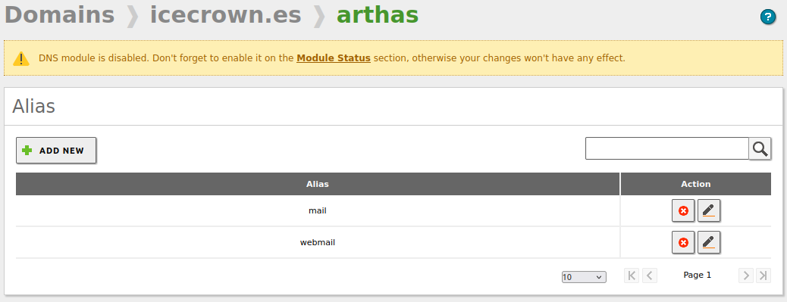
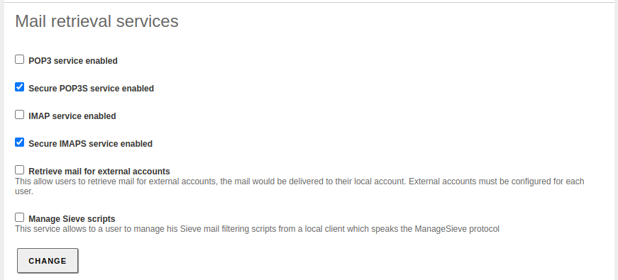
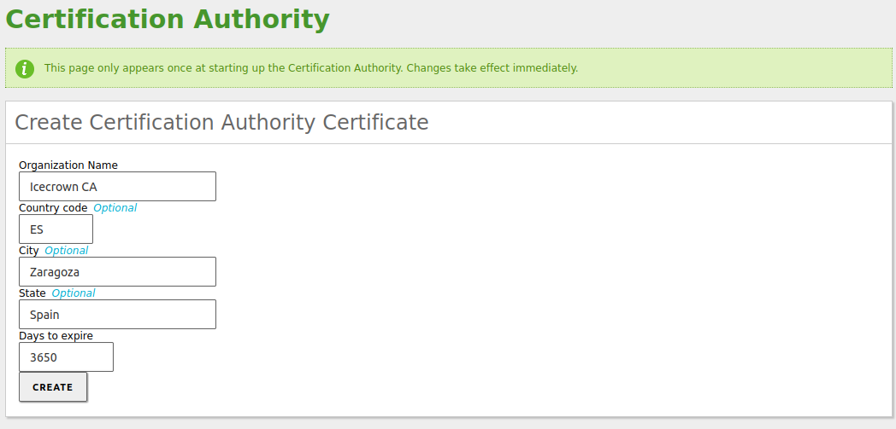
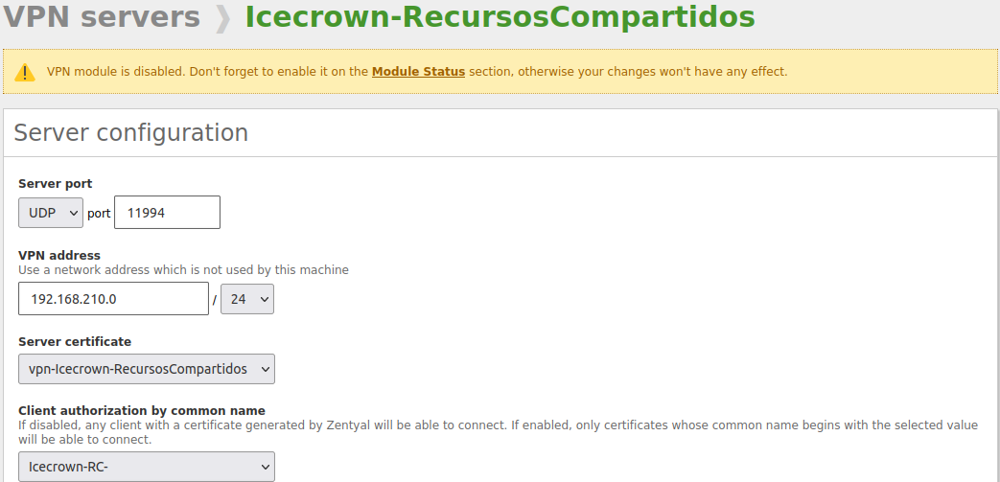
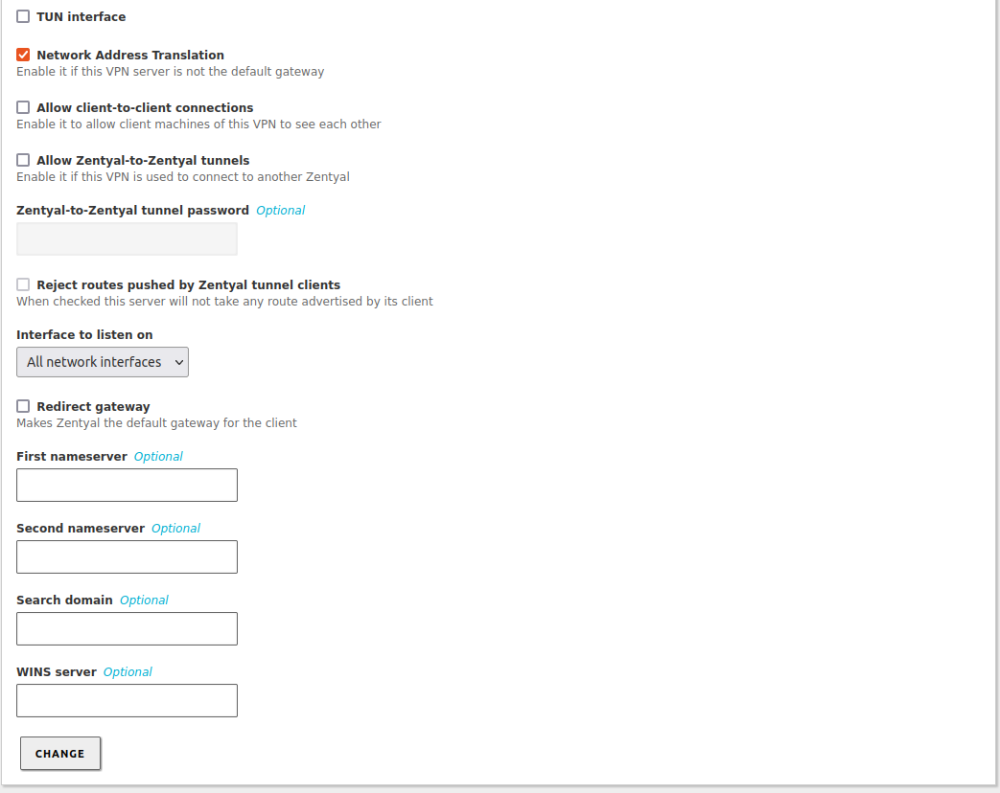
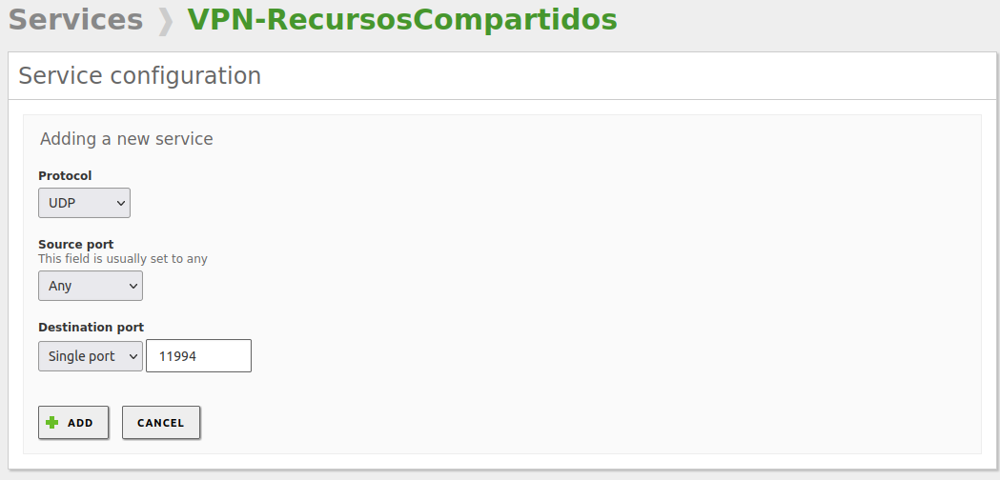
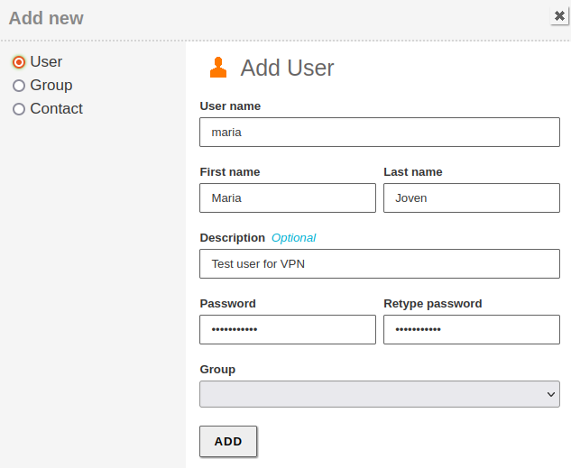

# Configuración de Zentyal

En este documento se abordará la configuración del servidor Zentyal para que actúe como servidor de correo y compartición de ficheros.

Las objetivos que se realizarán serán:

1. (Opcional) Desinstalación de Snap.
2. (Opcional) Configuración adicional de los usuarios locales del sistema:
    * Modificación del Prompt.
    * Modificaciones sobre el historial.
    * Configuración para el editor `vim`.
3. Creación de una partición SWAP.
4. Configuración de los volúmenes EBS adicionales.
5. Implementación de quotas en el sistema de archivo.
6. Configuración de los siguientes módulos de Zentyal:
    * Logs
    * Firewall
    * Software
    * NTP
    * DNS
    * Controlador de dominio
    * Correo
    * Webmail
    * Antivirus
    * Mailfilter
    * CA
    * OpenVPN

Al término de este documento, el servidor Zentyal quedará listo para usarse, aunque en siguientes documentos seguiremos estableciendo configuraciones adicionales como la configuración de certificados emitidos por Let's Encrypt o configuraciones opciones pero altamente recomendables como por ejemplo, hardening del servicio de correo.

## Configuración opcional

En esta sección se realizarán las configuraciones opcionales sobre el servidor Zentyal, por lo que se puede omitir e ir a la sección `Configuración previa`.

### Snap

Como Zentyal no usa Snap, procederemos a su desinstalación.

1. Paramos el servicio:

    ```sh
    sudo systemctl stop snapd snapd.socket
    ```

2. Eliminamos el paquete:

    ```sh
    sudo apt remove --purge -y snapd
    ```

3. Eliminamos los directorios que quedan en el sistema de archivos:

    ```sh
    sudo rm -rf /root/snap/
    ```

### Prompt

Para mejorar la experiencia de usuario cuando realizamos tareas desde la CLI, procederemos a habilitar el color del prompt para los usuarios locales existentes y futuros.

```sh
for user in /root /home/ubuntu /home/djoven /etc/skel/; do
    sudo sed -i 's/#force_color_prompt/force_color_prompt/' $user/.bashrc
done
```

### Historial

Con la finalidad de almacenar más información en el historial personal de los usuarios y que además, haya un timestamp que indique la fecha y hora en la que fue ejecutado determinado comando, añadiremos una serie de opciones adicionales a los usuarios locales tanto existentes como futuros.

```sh
for user in /root /home/ubuntu /home/djoven /etc/skel/; do

sudo tee -a $user/.bashrc &>/dev/null <<EOF
## Custom options
HISTTIMEFORMAT="%F %T  "
PROMPT_COMMAND='history -a'
HISTIGNORE='clear:history'
EOF

sudo sed -i -e 's/HISTCONTROL=.*/HISTCONTROL=ignoreboth/' \
            -e 's/HISTSIZE=.*/HISTSIZE=1000/' \
            -e 's/HISTFILESIZE=.*/HISTFILESIZE=2000/' \
        $user/.bashrc
done
```

### Vim

Añadiremos una configuración personalizada sencilla para el editor de textos `vim` tanto para los usuarios existentes como futuros. Esta configuración establecerá lo siguiente:

* Tabulación de 2 espacios.
* Habilita el resaltado de sintaxis.
* Muestra el número de la líneas.
* Usa el esquema de color 'desert'
* Configura el editor para usar archivos Yaml.

Para establecer la configuración, simplemente habrá que crear un archivo llamado `.vimrc` en el directorio personal de los usuarios.

```sh
for user in /root /home/ubuntu /home/djoven /etc/skel; do

sudo tee -a $user/.vimrc &>/dev/null <<EOF
set tabstop=2
syntax on
set number
color desert
set shiftwidth=2
auto FileType yaml,yml setlocal ai ts=2 sw=2 et
EOF

done
```

## Configuración previa

A continuación se realizan las configuraciones previas a la configuración de los módulos de Zentyal. Salvo el apartado de `Volúmenes EBS adicionales`, que sería opcional, el resto deberían de implementarse.

### Partición SWAP

Es altamente recomendable configurar una partición SWAP en el servidor para incrementar la disponibilidad del servidor en caso de picos relacionados con la memoria RAM. Las acciones que realizaremos están documentadas [aquí](https://aws.amazon.com/premiumsupport/knowledge-center/ec2-memory-swap-file/).

1. Creamos un archivo vacío de 4GB, que será el tamaño de nuestra partición SWAP:

    ```sh
    sudo dd if=/dev/zero of=/swapfile1 bs=128M count=32
    ```

2. Establecemos los permisos para el archivo:

    ```sh
    sudo chmod 0600 /swapfile1
    ```

3. Establecemos el archivo como una área de SWAP:

    ```sh
    sudo mkswap /swapfile1
    ```

4. Habilitamos la partición SWAP de forma temporal:

    ```sh
    sudo swapon /swapfile1
    ```

5. Verificamos que el sistema reconoce la nueva partición SWAP ejecutando los siguientes comandos:

    ```sh
    sudo swapon -s
    sudo free -m
    ```

    El resultado que deberíamos obtener es:

    ```sh
    ## Comando 'swapon'
    Filename				Type		Size	Used	Priority
    /swapfile1                             	file    	4194300	0	-2

    ## comando 'free'
                    total        used        free      shared  buff/cache   available
    Mem:           3875        1218         209           2        2447        2396
    Swap:          4095           0        4095
    ```

6. Establecemos la partición en el archivo de configuración `/etc/fstab` para que persista ante el reinicio del servidor:

    ```sh
    echo -e '\n## SWAP partition 4GB\n/swapfile1 swap swap defaults 0 0' | sudo tee -a /etc/fstab
    ```

7. Finalmente, comprobamos que la nueva entrada en el archivo no contenga errores de sintaxis:

    ```sh
    sudo mount -a
    ```

### Volúmenes EBS adicionales

En caso de que hayamos añadido volúmenes EBS adicionales - como ha sido mi caso para los buzones de correo y recursos compartidos -, procederemos a configurarlos y montarlos en el servidor.

**NOTA:** Para el punto de montaje de los recursos compartidos, podría usar `/home/samba/` en lugar de `/home/`. El motivo es que si un usuario quiere almacenar información en su directorio compartido personal (letra '*H*' por defecto), ésta información no se almacenaría en el volumen EBS adicional, ya que los directorios personales se crean en `/home/` y no en `/home/samba/`.

1. Listamos los volúmenes con el comando:

    ```sh
    lsblk
    ```

    En mi caso concreto, me muestra el siguiente resultado:

    ```sh
        NAME         MAJ:MIN RM  SIZE RO TYPE MOUNTPOINT
        nvme1n1      259:0    0   10G  0 disk
        nvme0n1      259:1    0   30G  0 disk
        ├─nvme0n1p1  259:2    0 29.9G  0 part /
        ├─nvme0n1p14 259:3    0    4M  0 part
        └─nvme0n1p15 259:4    0  106M  0 part /boot/efi
        nvme2n1      259:5    0   10G  0 disk
    ```

2. En los volúmenes `nvme1n1` y `nvme2n1` creamos una única partición que ocupe todo el disco:

    ```sh
    for disk in nvme1n1 nvme2n1; do
        echo -e 'n\np\n\n\n\nt\n8e\nw' | sudo fdisk /dev/$disk
    done
    ```

    **NOTA:** '8e' estable como etiqueta 'Linux' a la partición.

3. Revisamos que se hayan creado las particiones correctamente:

    ```sh
    lsblk
    ```

    En mi caso concreto, me muestra el siguiente resultado:

    ```sh
        NAME         MAJ:MIN RM  SIZE RO TYPE MOUNTPOINT
        nvme1n1      259:0    0   10G  0 disk
        └─nvme1n1p1  259:7    0   10G  0 part
        nvme0n1      259:1    0   30G  0 disk
        ├─nvme0n1p1  259:2    0 29.9G  0 part /
        ├─nvme0n1p14 259:3    0    4M  0 part
        └─nvme0n1p15 259:4    0  106M  0 part /boot/efi
        nvme2n1      259:5    0   10G  0 disk
        └─nvme2n1p1  259:8    0   10G  0 part
    ```

4. Establecemos como sistema de archivos `ext4` a las nuevas particiones:

    ```sh
    for disk in nvme1n1p1 nvme2n1p1; do
        sudo mkfs -t ext4 /dev/$disk
    done
    ```

5. Volvemos a revisar que todo haya ido bien con el comando:

    ```sh
    lsblk -f
    ```

    En mi caso concreto, me muestra el siguiente resultado:

    ```sh
        NAME         FSTYPE LABEL           UUID                                 FSAVAIL FSUSE% MOUNTPOINT
        nvme1n1
        └─nvme1n1p1  ext4                   28e5471e-8fc1-48b5-8729-778c56a19b90
        nvme0n1
        ├─nvme0n1p1  ext4   cloudimg-rootfs 418a4763-c829-4fb6-b538-9a38158da803   26.8G     7% /
        ├─nvme0n1p14
        └─nvme0n1p15 vfat   UEFI            CBF7-D252                              99.2M     5% /boot/efi
        nvme2n1
        └─nvme2n1p1  ext4                   e903ff6f-c431-4e3a-92a1-9f476c66b3be
    ```

6. Creamos el directorio donde se montará el volumen EBS para los buzones de correo:

    ```sh
    sudo mkdir -v -m0775 /var/vmail
    ```

7. Obtenemos el identificador (UUID) de los volúmenes:

    ```sh
    sudo sudo blkid | egrep "nvme[12]n1p1"
    ```

    En mi caso concreto, me muestra el siguiente resultado:

    ```sh
    /dev/nvme2n1p1: UUID="28e5471e-8fc1-48b5-8729-778c56a19b90" TYPE="ext4" PARTUUID="558dd3b7-01"
    /dev/nvme1n1p1: UUID="e903ff6f-c431-4e3a-92a1-9f476c66b3be" TYPE="ext4" PARTUUID="446d2929-01"
    ```

    **NOTA:** Recordad que el volumen para los mailboxes fue montado primero, por lo que su punto de montaje es `/dev/nvme1n1p1`.

8. Montamos temporalmente el volumen EBS que contendrá los recursos compartidos:

    ```sh
    sudo mount /dev/nvme2n1p1 /mnt
    ```

9. Copiamos el contenido del directorio `/home/` al directorio temporal donde hemos montado el volumen EBS:

    ```sh
    sudo cp -aR /home/* /mnt/
    ```

10. Desmontamos el volumen EBS:

    ```sh
    sudo umount /mnt
    ```

11. Establecemos en el archivo `/etc/fstab` el montaje de los volúmenes EBS:

    ```sh
    ## AWS EBS - Mailboxes
    UUID=e903ff6f-c431-4e3a-92a1-9f476c66b3be /var/vmail ext4 defaults,noexec,nodev,nosuid 0 2

    ## AWS EBS - Shares
    UUID=28e5471e-8fc1-48b5-8729-778c56a19b90 /home ext4 defaults,noexec,nodev,nosuid 0 2
    ```

    **NOTA:** Tendréis que cambiar el valor del parámetro `UUID` por vuestro valor obtenido en el paso 7.

12. Montamos los volúmenes manualmente para verificar que no hay errores de sintaxis en el archivo del paso anterior:

    ```sh
    sudo mount -a
    ```

13. Finalmente, confirmamos que se hayan montado bien ejecutando los siguientes comandos:

    ```sh
    mount | egrep 'nvme[12]n1p1'
    df -h
    ```

    En mi caso concreto, me muestra el siguiente resultado:

    ```sh
    ## Comando 'mount'
    /dev/nvme2n1p1 on /var/vmail type ext4 (rw,nosuid,nodev,noexec,relatime)
    /dev/nvme1n1p1 on /home type ext4 (rw,nosuid,nodev,noexec,relatime)

    ## Comando 'df'
    Filesystem       Size  Used Avail Use% Mounted on
    /dev/root         29G  7.9G   21G  28% /
    devtmpfs         1.9G     0  1.9G   0% /dev
    tmpfs            1.9G  4.0K  1.9G   1% /dev/shm
    tmpfs            388M  2.6M  386M   1% /run
    tmpfs            5.0M     0  5.0M   0% /run/lock
    tmpfs            1.9G     0  1.9G   0% /sys/fs/cgroup
    /dev/nvme2n1p1   9.8G   17M  9.3G   1% /var/vmail
    /dev/nvme1n1p1   9.8G  228K  9.3G   1% /home
    /dev/nvme0n1p15  105M  5.2M  100M   5% /boot/efi
    ```

### Quota

**>>TODO<<**
Como Zentyal nos permite establecer quotas tanto a nivel de buzón de correo como de usuario del dominio, procederemos a instalar y configurar esta funcionalidad para las particiones `/home/` y `/var/vmail/` creadas en el apartado anterior.

1. Instalamos los siguientes paquetes requeridos para instances en AWS:

    ```sh
    sudo apt update
    sudo apt install -y quota quotatool linux-modules-extra-aws
    ```

2. Establecemos las opciones de montaje adicionales en el volumen EBS de los recursos compartidos, para ello, editamos el archivo de configuración `/etc/fstab`:

    ```sh
    ## AWS EBS - Shares
    UUID=28e5471e-8fc1-48b5-8729-778c56a19b90	/home	ext4	defaults,noexec,nodev,nosuid,usrjquota=quota.user,grpjquota=quota.group,jqfmt=vfsv0 0 2
    ```

    **NOTA:** Las opciones añadidas son: `usrjquota`, `grpjquota` y `jqfmt`.

3. Reiniciamos el servidor para que nos cargue el último kernel y podamos habilitar de forma seguridad las quotas:

    ```sh
    sudo reboot
    ```

4. Añadimos el módulo de Quota al kernel:

    ```sh
    sudo modprobe quota_v2
    ```

5. Persistimos el cambio anterior:

    ```sh
    echo 'quota_v2' | sudo tee -a /etc/modules
    ```

7. Dejamos que el sistema compruebe las quotas y cree los archivos pertinentes:

    ```sh
    sudo quotacheck -vugmf /home
    ```

    El resultado que he obtenido en mi caso ha sido:

    ```sh
    quotacheck: Scanning /dev/nvme1n1p1 [/home] done
    quotacheck: Checked 8 directories and 18 files
    ```

## Configuración de los módulos

En esta sección se instalarán los módulos de Zentyal, configurarán y comprobarán.

### General

Lo primero de todo que debemos hacer es configurar la base de Zentyal desde el menú `System -> General`.

1. Estableceremos el idioma del panel de administración así como el puerto por el cual escuchará el módulo *webadmin*:

    

2. Después, desde el mismo panel, establecemos el nombre del servidor y el dominio:

    **NOTA:** En el momento que habilitemos el módulo de controlador de dominio, estos 2 valores no podrán cambiar.

    

### Módulo de Logs

Inicialmente, habilitaremos los dos 'dominios' que hay disponibles, cambiaremos el tiempo de retención a 30 días para el firewall y 90 para los cambios del panel de administración así como login de los administradores:


### Módulo de Cortafuegos

Para la configuración de red que tenemos (interna) y los módulos que usaremos, las secciones del firewall que usaremos son:

* Filtering rules from internal networks to Zentyal
* Filtering rules from traffic coming out from Zentyal

Las políticas definidas por defecto en ambas secciones del firewall son seguras, no obstante, procederemos a añadir una regla de tipo `LOG` para las conexiones por SSH, ya que siempre es buena idea tener la mayor información posible sobre este servicio tan crítico. Para ello, iremos a `Firewall -> Packet Filter -> Filtering rules from internal networks to Zentyal` y añadiremos la siguiente regla:


Quedando como resultado las siguientes reglas:


**Consideraciones:**

1. Es importante que la nueva regla vaya por encima de la regla que acepta la conexión SSH, de lo contrario nunca se ejecutará, ya que cuando una regla se cumple, no se siguen analizando el resto.
2. Recordad que a parte de este firewall, también tenemos el de AWS (Security Group asociado a la instancia), por lo que tendremos que asegurarnos que ambos firewall tienen las mismas reglas, aunque también se podría configurar en uno de ellos que se permita todo y que el otro se haga cargo de las reglas.

### Módulo de Software

Con la finalidad de tener nuestro servidor actualizado, habilitaremos y estableceremos la hora en la que se instalarán las actualizaciones automáticamente. Además, procederemos a instalar los módulos que vamos a usar.

1. Desde el menú `Software Management -> Settings`, establecemos las configuraciones de las actualizaciones automáticas:

    **NOTA:** Es conveniente que la hora sea posterior a posibles snapshots del servidor, así tenemos un punto de restauración estable en caso de incidencia crítica causado por la actualización de un paquete.

    

2. Después, desde el menú `Software Management -> Zentyal Components` procederemos a instalar **únicamente** los módulos que vamos a usar:

    

### Módulo de NTP

El primero de los módulos recién instalado que vamos a configurar es [NTP], en el estableceremos la zona horaria y los servidores NTP oficiales más próximos geográficamente donde está ubicado el servidor.

[NTP]: https://doc.zentyal.org/es/ntp.html

1. Vamos a `System -> Date/Time` y establecemos la zona horaria:

    

2. Habilitamos la opción que permite sincronizar la hora con servidores externos:

    

3. Modificamos los servidores NTP establecidos por defecto, por los oficiales que tenemos disponibles en [esta](https://www.pool.ntp.org/en) web:

    

4. Finalmente, habilitamos el módulo de NTP desde `Modules Status`:

    

### Módulo de DNS

El siguiente módulo que procederemos a configurar será el [DNS], el cual es crítico para el funcionamiento del módulo de controlador de dominio y por dependencia, el de correo también.

[DNS]: https://doc.zentyal.org/es/dns.html

La configuración que estableceremos será mínima, ya que la gestión de los registros DNS la gestionaremos desde el panel de administración donde tenemos contratado el dominio - Route 53 en mi caso -.

1. Creamos el dominio, el cual debe ser el mismo que el que configuramos inicialmente desde `System -> General`. Para ello, desde el menú lateral seleccionamos `DNS`:

    

2. Después, comprobaremos que la IP del servidor se haya creado con éxito al dominio, para ello vamos al campo `Domain IP Addresses` del dominio recién creado:

    

3. Lo siguiente que revisaremos será que la IP del nombre del servidor también haya sido creado con éxito. En este caso, el campo es `Hostnames -> IP Address`:

    

4. A continuación, crearemos los registros adicionales de tipo alias desde `Hostnames -> Alias`. En mi caso, crearé dos registros relativos al correo: `mail` y `webmail`.

    

5. Los servidores DNS forwarders que estableceré en mi caso serán los de [Cloudflare] y [Quad9]:

    

6. Una ves establecida la configuración del módulo, procederemos a habilitarlo desde `Modules Status`:

    

7. Finalmente, comprobaremos que podemos resolver los registros DNS configurados desde el propio servidor. Para ello, ejecutaremos los siguientes comandos:

    ```sh
    ## Para el dominio
    dig icecrown.es

    ## Para el nombre del servidor
    dig arthas.icecrown.es

    ## Para los alias
    dig mail.icecrown.es
    dig webmail.icecrown.es
    ```

    A continuación, los resultados que he obtenido:

    ```text
    ## Para el dominio
    ; <<>> DiG 9.16.1-Ubuntu <<>> icecrown.es
    ;; global options: +cmd
    ;; Got answer:
    ;; ->>HEADER<<- opcode: QUERY, status: NOERROR, id: 11829
    ;; flags: qr aa rd ra; QUERY: 1, ANSWER: 1, AUTHORITY: 0, ADDITIONAL: 1

    ;; OPT PSEUDOSECTION:
    ; EDNS: version: 0, flags:; udp: 4096
    ; COOKIE: 517f093b1a488a630100000063ef1e5f33c655878c47e480 (good)
    ;; QUESTION SECTION:
    ;icecrown.es.			IN	A

    ;; ANSWER SECTION:
    icecrown.es.		259200	IN	A	10.0.1.200

    ;; Query time: 0 msec
    ;; SERVER: 127.0.0.1#53(127.0.0.1)
    ;; WHEN: Fri Feb 17 07:27:43 CET 2023
    ;; MSG SIZE  rcvd: 84


    ## Para el nombre del servidor
    ; <<>> DiG 9.16.1-Ubuntu <<>> arthas.icecrown.es
    ;; global options: +cmd
    ;; Got answer:
    ;; ->>HEADER<<- opcode: QUERY, status: NOERROR, id: 53740
    ;; flags: qr aa rd ra; QUERY: 1, ANSWER: 1, AUTHORITY: 0, ADDITIONAL: 1

    ;; OPT PSEUDOSECTION:
    ; EDNS: version: 0, flags:; udp: 4096
    ; COOKIE: 0a10fe5bc110fbe20100000063ef1e79cd9a2652e62e1cba (good)
    ;; QUESTION SECTION:
    ;arthas.icecrown.es.		IN	A

    ;; ANSWER SECTION:
    arthas.icecrown.es.	259200	IN	A	10.0.1.200

    ;; Query time: 0 msec
    ;; SERVER: 127.0.0.1#53(127.0.0.1)
    ;; WHEN: Fri Feb 17 07:28:09 CET 2023
    ;; MSG SIZE  rcvd: 91


    ## Para el alias 'mail'
    ; <<>> DiG 9.16.1-Ubuntu <<>> mail.icecrown.es
    ;; global options: +cmd
    ;; Got answer:
    ;; ->>HEADER<<- opcode: QUERY, status: NOERROR, id: 62966
    ;; flags: qr aa rd ra; QUERY: 1, ANSWER: 2, AUTHORITY: 0, ADDITIONAL: 1

    ;; OPT PSEUDOSECTION:
    ; EDNS: version: 0, flags:; udp: 4096
    ; COOKIE: c5ac7f415fe066aa0100000063ef1e9c7e18da9abf7650f1 (good)
    ;; QUESTION SECTION:
    ;mail.icecrown.es.		IN	A

    ;; ANSWER SECTION:
    mail.icecrown.es.	259200	IN	CNAME	arthas.icecrown.es.
    arthas.icecrown.es.	259200	IN	A	10.0.1.200

    ;; Query time: 0 msec
    ;; SERVER: 127.0.0.1#53(127.0.0.1)
    ;; WHEN: Fri Feb 17 07:28:44 CET 2023
    ;; MSG SIZE  rcvd: 110


    ## Para el alias 'webmail'
    ; <<>> DiG 9.16.1-Ubuntu <<>> webmail.icecrown.es
    ;; global options: +cmd
    ;; Got answer:
    ;; ->>HEADER<<- opcode: QUERY, status: NOERROR, id: 40072
    ;; flags: qr aa rd ra; QUERY: 1, ANSWER: 2, AUTHORITY: 0, ADDITIONAL: 1

    ;; OPT PSEUDOSECTION:
    ; EDNS: version: 0, flags:; udp: 4096
    ; COOKIE: a1ff85fe806432700100000063ef1eb9ff2777f239f7c9a3 (good)
    ;; QUESTION SECTION:
    ;webmail.icecrown.es.		IN	A

    ;; ANSWER SECTION:
    webmail.icecrown.es.	259200	IN	CNAME	arthas.icecrown.es.
    arthas.icecrown.es.	259200	IN	A	10.0.1.200

    ;; Query time: 0 msec
    ;; SERVER: 127.0.0.1#53(127.0.0.1)
    ;; WHEN: Fri Feb 17 07:29:13 CET 2023
    ;; MSG SIZE  rcvd: 113
    ```

    Como se puede apreciar, el `status` de todos es '**NOERROR**' y en '**ANSWER SECTION**' muestra los registros DNS en cuestión.

[Cloudflare]: https://www.cloudflare.com/es-es/
[Quad9]: https://www.quad9.net/es/

Llegados a este punto, el módulo estaría configurado en Zentyal, no obstante, todavía queda crear los registros con la IP pública del servidor en el proveedor DNS para que estos sean visibles externamente. A continuación los pasos a realizar para AWS Route53:

1. Vamos a `Route 53 -> Hosted zones -> dominio` y creamos los mismos registros que en Zentyal pero con la IP pública:

    

2. Esperamos unos minutos para que puedan replicarse globalmente.

3. Finalmente, comprobamos la resolución de los registros:

    ```sh
    ## Para el dominio
    dig @8.8.8.8 icecrown.es

    ## Para el nombre del servidor
    dig @8.8.8.8 arthas.icecrown.es

    ## Para los alias
    dig @8.8.8.8 mail.icecrown.es
    dig @8.8.8.8 webmail.icecrown.es
    ```

    A continuación, los resultados que he obtenido:

    ```text
    ## Para el dominio
    ; <<>> DiG 9.16.1-Ubuntu <<>> @8.8.8.8 icecrown.es
    ; (1 server found)
    ;; global options: +cmd
    ;; Got answer:
    ;; ->>HEADER<<- opcode: QUERY, status: NOERROR, id: 7888
    ;; flags: qr rd ra; QUERY: 1, ANSWER: 1, AUTHORITY: 0, ADDITIONAL: 1

    ;; OPT PSEUDOSECTION:
    ; EDNS: version: 0, flags:; udp: 512
    ;; QUESTION SECTION:
    ;icecrown.es.			IN	A

    ;; ANSWER SECTION:
    icecrown.es.		60	IN	A	15.237.168.75

    ;; Query time: 16 msec
    ;; SERVER: 8.8.8.8#53(8.8.8.8)
    ;; WHEN: Fri Feb 17 07:30:36 CET 2023
    ;; MSG SIZE  rcvd: 56


    ## Para el nombre del servidor
    ; <<>> DiG 9.16.1-Ubuntu <<>> @8.8.8.8 arthas.icecrown.es
    ; (1 server found)
    ;; global options: +cmd
    ;; Got answer:
    ;; ->>HEADER<<- opcode: QUERY, status: NOERROR, id: 33376
    ;; flags: qr rd ra; QUERY: 1, ANSWER: 1, AUTHORITY: 0, ADDITIONAL: 1

    ;; OPT PSEUDOSECTION:
    ; EDNS: version: 0, flags:; udp: 512
    ;; QUESTION SECTION:
    ;arthas.icecrown.es.		IN	A

    ;; ANSWER SECTION:
    arthas.icecrown.es.	120	IN	A	15.237.168.75

    ;; Query time: 36 msec
    ;; SERVER: 8.8.8.8#53(8.8.8.8)
    ;; WHEN: Fri Feb 17 07:30:56 CET 2023
    ;; MSG SIZE  rcvd: 63


    ## Para el alias 'mail'
    ; <<>> DiG 9.16.1-Ubuntu <<>> @8.8.8.8 mail.icecrown.es
    ; (1 server found)
    ;; global options: +cmd
    ;; Got answer:
    ;; ->>HEADER<<- opcode: QUERY, status: NOERROR, id: 46107
    ;; flags: qr rd ra; QUERY: 1, ANSWER: 2, AUTHORITY: 0, ADDITIONAL: 1

    ;; OPT PSEUDOSECTION:
    ; EDNS: version: 0, flags:; udp: 512
    ;; QUESTION SECTION:
    ;mail.icecrown.es.		IN	A

    ;; ANSWER SECTION:
    mail.icecrown.es.	300	IN	CNAME	arthas.icecrown.es.
    arthas.icecrown.es.	120	IN	A	15.237.168.75

    ;; Query time: 16 msec
    ;; SERVER: 8.8.8.8#53(8.8.8.8)
    ;; WHEN: Fri Feb 17 07:31:29 CET 2023
    ;; MSG SIZE  rcvd: 82


    ## Para el alias 'webmail'
    ; <<>> DiG 9.16.1-Ubuntu <<>> @8.8.8.8 webmail.icecrown.es
    ; (1 server found)
    ;; global options: +cmd
    ;; Got answer:
    ;; ->>HEADER<<- opcode: QUERY, status: NOERROR, id: 9490
    ;; flags: qr rd ra; QUERY: 1, ANSWER: 2, AUTHORITY: 0, ADDITIONAL: 1

    ;; OPT PSEUDOSECTION:
    ; EDNS: version: 0, flags:; udp: 512
    ;; QUESTION SECTION:
    ;webmail.icecrown.es.		IN	A

    ;; ANSWER SECTION:
    webmail.icecrown.es.	300	IN	CNAME	arthas.icecrown.es.
    arthas.icecrown.es.	120	IN	A	15.237.168.75

    ;; Query time: 36 msec
    ;; SERVER: 8.8.8.8#53(8.8.8.8)
    ;; WHEN: Fri Feb 17 07:31:59 CET 2023
    ;; MSG SIZE  rcvd: 85
    ```

Tras confirmar el funcionamiento del dominio tanto internamente (desde Zentyal) como externamente, el módulo de DNS estará correctamente configurado y podremos proseguir con el siguiente módulo.

### Módulo de Controlador de dominio

Una vez tenemos el módulo de DNS configurado, es el turno de configurar el [controlador de dominio]. En mi caso concreto, estableceré las configuraciones opcionales:

* Añadiré una descripción a la configuración y confirmaré que los perfiles móviles están deshabilitados.
* Estableceré una quota por defecto de 1GB para los usuarios del dominio (únicamente afectará a sus directorios personales).
* Confirmaré que el PAM está deshabilitado, ya que no quiero que ningún usuario del dominio pueda hacer login mediante SSH o FTP.

[controlador de dominio]: https://doc.zentyal.org/es/directory.html

A continuación las acciones a realizar para configurar el módulo:

1. Modificamos la descripción del servidor desde `Domain -> Server description`.

    

2. Establecemos el valor que tendrá la quota por defecto para los nuevos usuarios del dominio desde `Users and Computers -> User Template`:

    

3. Revisamos que el PAM está deshabilitado desde `Users and Computers -> LDAP Settings`:

    

4. Habilitamos el módulo:

    

5. Una vez que el módulo haya sido guardado y por ende, el controlador de dominio provisionado, comprobaremos que la estructura por defecto se creó con éxito. Para ello, vamos a `Users and Computers -> Manage`:

    

6. La última acción que realizaré sobre este módulo por el momento será crear un nuevo usuario administrador del dominio, en mi caso se llamará `zenadmin` y deberá ser miembro del grupo de administradores `Domain Admins`:

    

### Módulo de Correo

Teniendo configurado el módulo de controlador de dominio, ya podremos configurar el módulo de [correo], ya que por dependencia requiere que el anterior esté habilitado previamente. En mi caso concreto, estableceré las siguientes configuraciones opcionales:

* El usuario postmaster será 'postmaster@icecrown.es'.
* Estableceré 1GB como quota por defecto para los buzones de correo.
* El tamaño máximo de un mensaje aceptado será de 25MB.
* Los emails eliminados en los buzones será purgados automáticamente pasados 90 días.
* Los correos en la carpeta de spam será borrados automáticamente pasados 90 días.
* La sincronización de cuentas de correo external mediante Fetchmail se harán cada 5 minutos.
* Únicamente se permitirá los protocolos IMAPS y POP3S.
* Fetchmail y Sieve estarán deshabilitados, ya que inicialmente no los usaré.
* Se habilitará la lista gris, además, se reducirán a 24 horas para el reenvío de los emails y 30 días como periodo de borrado de borrado de entradas.

[correo]: https://doc.zentyal.org/es/mail.html

A continuación las acciones a realizar para configurar el módulo:

1. Creamos el dominio virtual de correo, que será el mismo que el dominio configurado en el módulo de DNS. Desde el menú lateral izquierdo iremos a `Mail -> Virtual Mail Domains`:

    

2. Establecemos las configuraciones restrictivas opcionales mencionadas desde `Mail -> General`:

    

3. Deshabilitamos Fetchmail y Sieve:

    

4. También habilitamos la lista gris desde `Mail -> Greylist`:

    

5. Habilitamos el módulo:

    

6. Creamos el registro de tipo `MX` en el dominio, que en mi caso, lo haré desde Route53:

    


    Adicionalmente, también lo crearé en Zentyal, no obstante, al ser un alias habrá que hacerlo usando la CLI:

    ```sh
    sudo samba-tool dns add 127.0.0.1 icecrown.es icecrown.es MX "mail.icecrown.es 10" -U zenadmin
    ```

7. Comprobamos el nuevo registro DNS tanto interna como externamente:

    ```sh
    dig MX icecrown.es
    dig @8.8.8.8 MX icecrown.es
    ```

    En resultado que obtengo:

    ```text
    ## Consulta interna
    ; <<>> DiG 9.16.1-Ubuntu <<>> MX icecrown.es
    ;; global options: +cmd
    ;; Got answer:
    ;; ->>HEADER<<- opcode: QUERY, status: NOERROR, id: 432
    ;; flags: qr aa rd ra; QUERY: 1, ANSWER: 1, AUTHORITY: 0, ADDITIONAL: 1

    ;; OPT PSEUDOSECTION:
    ; EDNS: version: 0, flags:; udp: 4096
    ; COOKIE: 7d99083c5d639dad0100000063ef22121ec656087bc76972 (good)
    ;; QUESTION SECTION:
    ;icecrown.es.			IN	MX

    ;; ANSWER SECTION:
    icecrown.es.		900	IN	MX	10 mail.icecrown.es.

    ;; Query time: 8 msec
    ;; SERVER: 127.0.0.1#53(127.0.0.1)
    ;; WHEN: Fri Feb 17 07:43:30 CET 2023
    ;; MSG SIZE  rcvd: 89


    ## Consulta externa
    ; <<>> DiG 9.16.1-Ubuntu <<>> @8.8.8.8 MX icecrown.es
    ; (1 server found)
    ;; global options: +cmd
    ;; Got answer:
    ;; ->>HEADER<<- opcode: QUERY, status: NOERROR, id: 28263
    ;; flags: qr rd ra; QUERY: 1, ANSWER: 1, AUTHORITY: 0, ADDITIONAL: 1

    ;; OPT PSEUDOSECTION:
    ; EDNS: version: 0, flags:; udp: 512
    ;; QUESTION SECTION:
    ;icecrown.es.			IN	MX

    ;; ANSWER SECTION:
    icecrown.es.		300	IN	MX	10 mail.icecrown.es.

    ;; Query time: 36 msec
    ;; SERVER: 8.8.8.8#53(8.8.8.8)
    ;; WHEN: Fri Feb 17 07:44:00 CET 2023
    ;; MSG SIZE  rcvd: 61
    ```

8. Creamos el usuario `postmaster@icecrown.es` especificado en el paso 2 y también un usuario de pruebas, que en mi caso se llamará `test.djoven` . Para ello, iremos a `Users and Computers -> Manage`:

    
    

Finalmente, probaremos con un cliente de correo (Thunderbird en mi caso) a que podemos configurar la cuenta del usuario de pruebas creado:

1. Configuramos una nueva cuenta en Thunderbird:

    

2. Establecemos los datos de conexión con el servicio SMTPS e IMAPS:

    

    **NOTA:** Hay que cambiar el tipo de autenticación a '**Normal password**', de lo contrario fallará la autenticación.

3. Tras confirmar la configuración, nos saldrá el siguiente mensaje de advertencia por el certificado, el cual es normal, ya que es un certificado auto-firmado por Zentyal:

    

4. Una vez confirmada la excepción de seguridad, deberíamos de poder ver la cuenta de correo:

    

5. Enviamos un email de prueba a nosotros mismos y otro a una cuenta externa para confirmar el funcionamiento del módulo. Cuando tratemos de enviar el mensaje, recibiremos un error debido a que el certificado es autofirmado, por lo que tendremos que hacerlo también.

    

    

6. Si todo fue bien, deberíamos de haber recibido el email tanto en la cuenta interna como externa y además, en el log `/var/log/mail.log` deberíamos de ver registros similares a:

    ```text
    Feb 17 07:02:41 ip-10-0-1-200 postfix/smtpd[27139]: connect from 36.red-45-4-127.staticip.rima-tde.net[88.6.127.36]
    Feb 17 07:02:41 ip-10-0-1-200 postfix/smtpd[27139]: 958BDFEEFC: client=36.red-45-4-127.staticip.rima-tde.net[88.6.127.36], sasl_method=PLAIN, sasl_username=test.
    djoven@icecrown.es
    Feb 17 07:02:41 ip-10-0-1-200 postfix/cleanup[27145]: 958BDFEEFC: message-id=<17715909-c13a-eed6-7f23-18f697740075@icecrown.es>
    Feb 17 07:02:41 ip-10-0-1-200 postfix/qmgr[24894]: 958BDFEEFC: from=<test.djoven@icecrown.es>, size=681, nrcpt=2 (queue active)
    Feb 17 07:02:41 ip-10-0-1-200 dovecot: lda(test.djoven@icecrown.es)<27148><b1LEMJEm72MMagAAcf9/Kw>: msgid=<17715909-c13a-eed6-7f23-18f697740075@icecrown.es>: sav
    ed mail to INBOX

    Feb 17 07:02:41 ip-10-0-1-200 postfix/pipe[27146]: 958BDFEEFC: to=<test.djoven@icecrown.es>, relay=dovecot, delay=0.29, delays=0.24/0.01/0/0.03, dsn=2.0.0, status=sent (delivered via dovecot service)

    Feb 17 07:02:41 ip-10-0-1-200 postfix/smtpd[27139]: disconnect from 36.red-45-4-127.staticip.rima-tde.net[88.6.127.36] ehlo=2 starttls=1 auth=1 mail=1 rcpt=2 data=1 quit=1 commands=9
    Feb 17 07:02:42 ip-10-0-1-200 dovecot: imap-login: Disconnected (no auth attempts in 1 secs): user=<>, rip=88.6.127.36, lip=10.0.1.200, TLS handshaking: SSL_accept() failed: error:14094412:SSL routines:ssl3_read_bytes:sslv3 alert bad certificate: SSL alert number 42, session=<mXZJ5t/0eLxYBn8k>

    Feb 17 07:02:42 ip-10-0-1-200 postfix/smtp[27147]: 958BDFEEFC: to=<external-account>, relay=gmail-smtp-in.l.google.com[74.125.133.27]:25, delay=1, delays=0.24/0.01/0.08/0.67, dsn=2.0.0, status=sent (250 2.0.0 OK  1676617362 n13-20020adfe34d000000b002c56af91a8esi3912146wrj.115 - gsmtp)

    Feb 17 07:02:42 ip-10-0-1-200 postfix/qmgr[24894]: 958BDFEEFC: removed
    ```

    **NOTA:** Como se puede ver, el status es `sent` para ambos emails.

Llegados a este punto, el módulo de correo debería ser totalmente funcional, no obstante, todavía está sin securizar, por lo que es conveniente no usarlo todavía hasta al menos, haber configurado y habilitado el módulo de Mailfilter. Adicionalmente, habrá otro apartado en este proyecto llamado '**hardening**' donde se incrementará todavía más la seguridad del módulo.

Mencionar también que si el servidor lo instalasteis en el proveedor cloud AWS, recordad que por defecto Amazon no permite enviar emails (revisar la última sección del apartado 'AWS').

### Módulo de Webmail

El siguiente módulo a configurar será el [Webmail] (Sogo), el cual nos permitirá gestionar nuestra cuenta de correo y el cambio de contraseña del usuario en cuestión, desde un navegador web sin necesidad de usar un cliente de correo.

[Webmail]: https://doc.zentyal.org/es/mail.html#cliente-de-webmail

1. Habilitamos el protocolo [ActiveSync] desde `Mail -> ActiveSync`:

    

2. Habilitamos el módulo:

    

3. Comprobamos que podemos acceder a la página de login desde un navegador web con la URL: <https://arthas.icecrown.es/SOGo>:

    **NOTA:** Nos mostrará un mensaje de advertencia por el certificado que usa el servicio, el cual eso auto-firmado:

    

4. Una vez permitido el acceso a pesar del mensaje de advertencia, deberíamos de ver el login del Webmail:

    

5. Nos logeamos con el usuario de prueba para confirmar que la autenticación funciona correctamente:

    

    **NOTA:** Si no vemos el buzón de correo, es posible que estemos experimentando un bug en el código. Ver el documento `bug fixing`.

6. Finalmente, tratamos de enviar otro email a nosotros mismos para verificar la integración con el módulo de correo:

    

[ActiveSync]: https://doc.zentyal.org/es/mail.html#soporte-activesync

Llegados a este punto, el módulo es totalmente funcional, no obstante, estableceré las siguientes configuraciones opcionales:

* Habilitaré la opción de mensajes automáticos para las vacaciones, ya que por defecto está deshabilitado.
* Estableceré inicialmente a 8 el número de workers (procesos) que usará el módulo.

A continuación las acciones a realizar para aplicar las configuraciones opcionales:

1. Creamos el directorio que hará de los cambios sobre las plantillas de configuración (stubs) sean permanentes para el módulo:

    ```sh
    sudo mkdir -vp /etc/zentyal/stubs/sogo
    ```

2. Copiamos la plantilla de configuración de Sogo `sogo.conf.mas`:

    ```sh
    sudo cp -v /usr/share/zentyal/stubs/sogo/sogo.conf.mas /etc/zentyal/stubs/sogo/
    ```

3. Establecemos el parámetro `SOGoVacationEnabled` a `YES` en la plantilla recién copiada:

    ```sh
    sudo sed -i 's/SOGoVacationEnabled.*/SOGoVacationEnabled = YES;/' /etc/zentyal/stubs/sogo/sogo.conf.mas
    ```

4. Reiniciamos el módulo de Webmail para aplicar el cambio:

    ```sh
    sudo zs sogo restart
    ```

5. Nos logeamos en el Webadmin nuevamente y verificamos que desde `Preferences -> Mail` ya tenemos la opción disponible:

    

6. Establecemos el valor del prefork en el archivo de configuración `/etc/zentyal/sogo.conf`:

    ```sh
    sed -i 's/#sogod_prefork.*/sogod_prefork=8/' /etc/zentyal/sogo.conf
    ```

    Si tenemos muchos usuarios concurrentes usando el módulo, es posible que Sogo no pueda gestionar bien todas las peticiones, por lo que será necesario incrementar este valor. Para detectar esta casuística, simplemente habrá que buscar registros en el log de Sogo ubicado en `/var/log/sogo/sogo.log` similares a la siguiente:

    ```sh
    sogod [3252]: [ERROR] <0x0x55c9db827250[WOWatchDog]> No child available to handle incoming request!
    ```

7. Reiniciamos el módulo de Webmail para aplicar el cambio:

    ```sh
    sudo zs sogo restart
    ```

8. Finalmente, comprobamos que el servicio se levanto con el nuevo valor aplicado:

    ```sh
    ps -ef | grep sogod | head -1
    ```

    En mi caso, el resultado obtenido del comando ha sido:

    ```sh
    sogo 24430 1 0 00:40 ? 00:00:00 /usr/sbin/sogod -WOWorkersCount 8 -WOPidFile /var/run/sogo/sogo.pid -WOLogFile /var/log/sogo/sogo.log
    ```

### Módulo de Antivirus

El siguiente módulo que configuraremos será el [Antivirus]. Si bien es cierto que este módulo consume mucha RAM, es necesario para el análisis de los emails que gestiona el módulo de correo.

[Antivirus]: https://doc.zentyal.org/es/antivirus.html

La configuración que podemos definir a este módulo desde el panel de administración de Zentyal en la versión Development es inexistente, por lo que sólo podremos habilitar el módulo y comprobar que la base de datos de firma está actualizada.

1. Habilitamos el módulo:

    

2. Actualizamos la base de datos de firmas:

    ```sh
    sudo freshclam -v
    ```

3. Confirmamos que el módulo esté activo:

    ```sh
    sudo zs antivirus status
    ```

En caso de usar una versión comercial, tendremos las siguientes funcionalidades adicionales descritas [aquí]:

* Análisis del sistema.
* Monitorización en directo de directorios.

[aquí]: https://doc.zentyal.org/es/antivirus.html#configuracion-del-modulo-antivirus

### Módulo de Mailfilter

Tras tener habilitado el Antivirus, procederemos a configurar el módulo de [Mailfilter], el cual nos va a permitir incrementar considerablemente la seguridad sobre el servicio de correo de la organización.

La configuración que aplicaré será:

* Usaré la cuenta de correo 'issues@icecrown.es' para las notificaciones de correos problemáticos.
* Estableceré en 5 el umbral de emails considerados SPAM.
* También estaré a 5 el umbral de auto-learn.
* El dominio lo añadiré a la lista gris.
* Salvo la política de cabeceras incorrectas, el resto serán denegadas.
* Deshabilitaremos ciertas extensiones que pueden ocasionar distintos vectores de ataque.

[Mailfilter]: https://doc.zentyal.org/es/mailfilter.html

A continuación las acciones a realizar para configurar el módulo:

1. Habilitamos los servicios de este módulo y estableceremos un correo electrónico para emails problemáticos que no sean spam:

    

2. Establecemos las políticas antispam:

    

3. Añadimos nuestro dominio a la lista blanca para que no sea procesado por el módulo de Mailfilter:

    

4. Establecemos las políticas por defecto relativas al comportamiento del módulo ante ciertos eventos:

    

5. Deshabilitamos las siguientes extensiones desde `Mail Filter -> Files ACL -> File extensions`:

    * bas
    * bat
    * cmd
    * dll
    * exe
    * ini
    * msi
    * reg
    * sh

    

6. Habilitamos el módulo:

    

7. Creamos la cuenta de correo que hemos establecido en el paso 1 desde `Users and Computers -> Manage`: **>>TODO<<**

    IMG

8. Nos enviamos un email sencillo desde un dominio externo y revisamos en el archivo de log `/var/log/mail.log` que el módulo lo haya analizado a través del servicio Amavis:

    ```sh
    Nov  5 10:39:31 arthas amavis[9409]: (09409-01) 9Vx6OoIz2Q4W FWD from <someuser@gmail.com> -> <postmaster@icecrown.es>, BODY=7BIT 250 2.0.0 from MTA(smtp:[127.0.0.1]:10025): 250 2.0.0 Ok: queued as 8EA3743DEF

    Nov  5 10:39:31 arthas amavis[9409]: (09409-01) Passed CLEAN, [127.0.0.1] <someuser@gmail.com> -> <postmaster@icecrown.es>, Message-ID: <CAB89cFCp7rhmrjxbMzphfEV3qR4gMBaHTmYg=PXUgBbBZMEh1Zw@mail.gmail.com>, Hits: -0.017

    Nov  5 10:39:31 arthas postfix/smtp[9512]: 1245B43D97: to=<postmaster@icecrown.es>, relay=127.0.0.1[127.0.0.1]:10024, delay=3.5, delays=0.02/0/0.49/3, dsn=2.0.0, status=sent (250 2.0.0 from MTA(smtp:[127.0.0.1]:10025): 250 2.0.0 Ok: queued as 8EA3743DEF)
    ```

    Como se puede ver, el mensaje llegó desde una cuenta de GMail, fue analizado por 'Amavis', el cual lo puntuó con '-0.017' y lo dió por limpio. Finalmente el mensaje llegó a nuestro buzón de correo.

9. Finalmente, enviamos otro email desde un dominio externo, aunque esta vez, usaremos palabras que sean consideras SPAM así como un archivo con extension 'sh' y revisamos el archivo de log  `/var/log/mail.log` nuevamente: **>>TODO<<**

    ```sh
    >>TODO<<
    ```

Llegados a este punto, nuestro servicio de correo es lo suficientemente seguro para ser utilizado en producción. No obstante, es altamente recomendable configurar como mínimo SPF y DKIM e idealmente, DMARC. Estas configuraciones relativas a la seguridad se tratarán en el documento llamado 'Hardening'.

Adicionalmente, también es recomendable establecer certificados emitidos por entidades certificadoras reconocidas como Let's Encrypt. Nuevamente, esto será tratado en otra parte del proyecto, concretamente en el documento 'Certificados'.

### Módulo de CA

Para poder hacer uso del módulo de OpenVPN, necesitaremos configurar previamente el módulo de [CA], el cual es extremadamente sencillo de configurar.

1. Creamos nuestra entidad de certificación desde `Certificate Authority -> General`:

    

2. Finalmente, guardamos cambios para que se cree nuestra CA.

    **NOTA** Este módulo no tiene posibilidad de '*habilitarse*' como el resto.

Adicionalmente, es posible emitir certificados para los módulos que estamos usando con el CommonName correctos, no obstante, como vamos a emitir certificados reconocidos a través de Let's Encrypt, no haremos uso de tal funcionalidad. De querer usarse, habría que ir a `Certificate Authority -> Services`.

[CA]: https://doc.zentyal.org/es/ca.html

### Módulo de OpenVPN

El último módulo que configuraremos será el de [OpenVPN]. La finalidad de usar este módulo es permitir que los usuarios del dominio puedan hacer uso de los recursos compartidos configurados en el módulo de controlador de dominio de forma segura estando en cualquier ubicación.

[OpenVPN]: https://doc.zentyal.org/es/vpn.html

Las configuraciones que estableceré serán:

* Como medida de seguridad adicional, únicamente se permitirá el acceso usando certificados cuyo CommonName tengan el prefijo: `Icecrown-RC-`.
* El certificado usado como prefijo para la conexión VPN, tendrá una validez de 120 días. **NOTA:** Definiendo ese valor nos forzará a tener que realizar tareas de mantenimiento cada 4 meses.
* Se usará un puerto y dirección VPN distintas al por defecto.

A continuación las acciones a realizar para configurar el módulo:

1. Creamos el certificado cuyo nombre tendrá un prefijo concreto, de esta forma, sólo permitiremos en las conexiones VPN certificados que empiecen por este patrón. Además, nos facilitará las tareas de mantenimiento y troubleshooting relativas a los certificados. Para ello, vamos a `Certificate Authority -> General`:

    

2. Creamos la conexión VPN desde `VPN -> Servers`:

    

3. Procedemos a configurar la conexión con los datos mencionados al inicio de la sección:

    
    

4. Confirmamos que la red internal de servidor está configurada en la conexión VPN, para ello vamos a `VPN -> Servers -> Advertised networks`:

    

5. Habilitamos el módulo:

    

6. Creamos un servicio de red con el puerto de la conexión VPN definida:

    
    

    **NOTA:** Recordad que el protocolo es **UDP**.

7. Finalmente, creamos una regla en el firewall de Zentyal que permita la conexión y guardamos cambios:

    

Con el módulo ya configurado, creamos un certificado, usuario y recurso compartido para confirmar el funcionamiento de este módulo por completo. Para ello, realizamos las siguientes acciones:

1. Creamos un certificado:

    

2. Creamos un usuario del dominio:

    

3. Creamos una carpeta compartida con permisos de lectura y escritura para el usuario de pruebas creado:

    
    

4. Guardamos los cambios.

5. Descargamos un bundle con la configuración de la conexión VPN para el cliente, para ello vamos a `VPN -> Servers -> Download client bundle`:

    **NOTA:** Para este ejemplo concreto, para la máquina del cliente usaré un Windows 10 con OpenVPN ya instalado.

    

6. Copiamos el bundle al cliente desde donde queramos establecer la conexión VPN y configuramos el cliente de OpenVPN:

    

7. Establecemos la conexión desde el cliente de OpenVPN. Si todo fue bien, podremos ver en el archivo de log de la conexión VPN de Zentyal llamado `/var/log/openvpn/Icecrown-RecursosCompartidos.log` unos registros similares a:

    ```sh
    Sat Feb  4 20:51:33 2023 88.6.127.36:35754 TLS: Initial packet from [AF_INET]88.6.127.36:35754 (via [AF_INET]10.0.1.200%ens5), sid=7c56b72b 70d7b663
    Sat Feb  4 20:51:33 2023 88.6.127.36:35754 VERIFY OK: depth=1, C=ES, ST=Spain, L=Zaragoza, O=Icecrown CA, CN=Icecrown CA Authority Certificate
    Sat Feb  4 20:51:33 2023 88.6.127.36:35754 VERIFY X509NAME OK: C=ES, ST=Spain, L=Zaragoza, O=Icecrown CA, CN=Icecrown-RC-Maria
    Sat Feb  4 20:51:33 2023 88.6.127.36:35754 VERIFY OK: depth=0, C=ES, ST=Spain, L=Zaragoza, O=Icecrown CA, CN=Icecrown-RC-Maria
    Sat Feb  4 20:51:33 2023 88.6.127.36:35754 peer info: IV_VER=2.6.0
    Sat Feb  4 20:51:33 2023 88.6.127.36:35754 peer info: IV_PLAT=win
    Sat Feb  4 20:51:33 2023 88.6.127.36:35754 peer info: IV_TCPNL=1
    Sat Feb  4 20:51:33 2023 88.6.127.36:35754 peer info: IV_MTU=1600
    Sat Feb  4 20:51:33 2023 88.6.127.36:35754 peer info: IV_NCP=2
    Sat Feb  4 20:51:33 2023 88.6.127.36:35754 peer info: IV_CIPHERS=AES-256-GCM:AES-128-GCM
    Sat Feb  4 20:51:33 2023 88.6.127.36:35754 peer info: IV_PROTO=478
    Sat Feb  4 20:51:33 2023 88.6.127.36:35754 peer info: IV_LZ4=1
    Sat Feb  4 20:51:33 2023 88.6.127.36:35754 peer info: IV_LZ4v2=1
    Sat Feb  4 20:51:33 2023 88.6.127.36:35754 peer info: IV_LZO=1
    Sat Feb  4 20:51:33 2023 88.6.127.36:35754 peer info: IV_COMP_STUB=1
    Sat Feb  4 20:51:33 2023 88.6.127.36:35754 peer info: IV_COMP_STUBv2=1
    Sat Feb  4 20:51:33 2023 88.6.127.36:35754 peer info: IV_GUI_VER=OpenVPN_GUI_11
    Sat Feb  4 20:51:33 2023 88.6.127.36:35754 peer info: IV_SSO=openurl,webauth,crtext
    Sat Feb  4 20:51:33 2023 88.6.127.36:35754 WARNING: 'tun-mtu' is used inconsistently, local='tun-mtu 1532', remote='tun-mtu 1500'
    Sat Feb  4 20:51:33 2023 88.6.127.36:35754 WARNING: 'cipher' is present in local config but missing in remote config, local='cipher AES-256-CBC'
    Sat Feb  4 20:51:33 2023 88.6.127.36:35754 Control Channel: TLSv1.3, cipher TLSv1.3 TLS_AES_256_GCM_SHA384, 4096 bit RSA
    Sat Feb  4 20:51:33 2023 88.6.127.36:35754 [Icecrown-RC-Maria] Peer Connection Initiated with [AF_INET]88.6.127.36:35754 (via [AF_INET]10.0.1.200%ens5)
    Sat Feb  4 20:51:33 2023 Icecrown-RC-Maria/88.6.127.36:35754 MULTI_sva: pool returned IPv4=192.168.210.2, IPv6=(Not enabled)
    Sat Feb  4 20:51:34 2023 Icecrown-RC-Maria/88.6.127.36:35754 PUSH: Received control message: 'PUSH_REQUEST'
    Sat Feb  4 20:51:34 2023 Icecrown-RC-Maria/88.6.127.36:35754 SENT CONTROL [Icecrown-RC-Maria]: 'PUSH_REPLY,route 10.0.1.0 255.255.255.0,route-gateway 192.168.210.1,ping 10,ping-restart 120,ifconfig 192.168.210.2 255.255.255.0,peer-id 0,cipher AES-256-GCM' (status=1)
    Sat Feb  4 20:51:34 2023 Icecrown-RC-Maria/88.6.127.36:35754 Data Channel: using negotiated cipher 'AES-256-GCM'
    Sat Feb  4 20:51:34 2023 Icecrown-RC-Maria/88.6.127.36:35754 Outgoing Data Channel: Cipher 'AES-256-GCM' initialized with 256 bit key
    Sat Feb  4 20:51:34 2023 Icecrown-RC-Maria/88.6.127.36:35754 Incoming Data Channel: Cipher 'AES-256-GCM' initialized with 256 bit key
    Sat Feb  4 20:51:34 2023 Icecrown-RC-Maria/88.6.127.36:35754 MULTI: Learn: 00:ff:83:a2:23:96 -> Icecrown-RC-Maria/88.6.127.36:35754
    ```

8. Una vez la conexión ha sido establecida, desde el navegador de archivos, estableceremos la URL del servidor, que en mi caso es: `\\arthas.icecrown.es`. Tras lo cual, nos pedirá las credenciales del usuario.

    

9. Tras logearnos, deberíamos de ver el directorio personal del usuario y los recursos compartidos.

    

10. Añadimos un archivo a los recursos `Maria` y `rrhh` y verificamos su creación desde la CLI del servidor Zentyal:

    ```sh
    ls -l /home/maria/test-file-1.txt
        -rwxrwx--x+ 1 ICECROWN\maria ICECROWN\domain users 0 Feb  4 20:56 /home/maria/test-file-1.txt

    ls -l /home/samba/shares/rrhh/test-file-2.txt
        -rwxrwx---+ 1 ICECROWN\maria ICECROWN\domain users 0 Feb  4 20:56 /home/samba/shares/rrhh/test-file-2.txt
    ```

Llegados a este punto, el servidor estaría listo para usarse en producción, no obstante, tal y como se ha mencionado en varias ocasiones, es altamente recomendable realizar ciertas tareas adicionales como:

* Usar certificados expedidos por entidades de certificación reconocidas.
* Securizar el servicio de correo con SPF, DKIM y DMARC.
* Establecer restricciones relativas a las contraseñas de los usuarios de dominio.
* Crear una política de copias de seguridad.
* Monitorizar el servidor.
* Conocer y programar tareas de mantenimiento.

Todos estas configuraciones serán explicadas en otros documentos del proyecto (ver menú superior).
