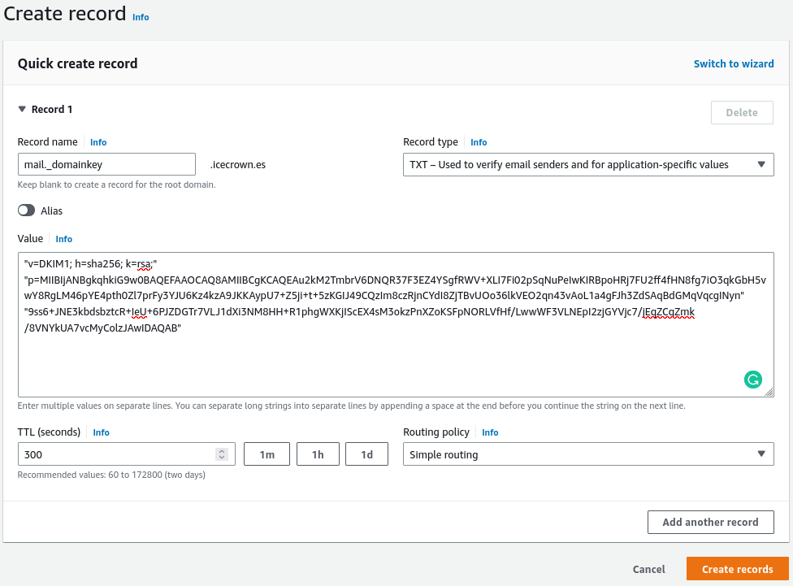
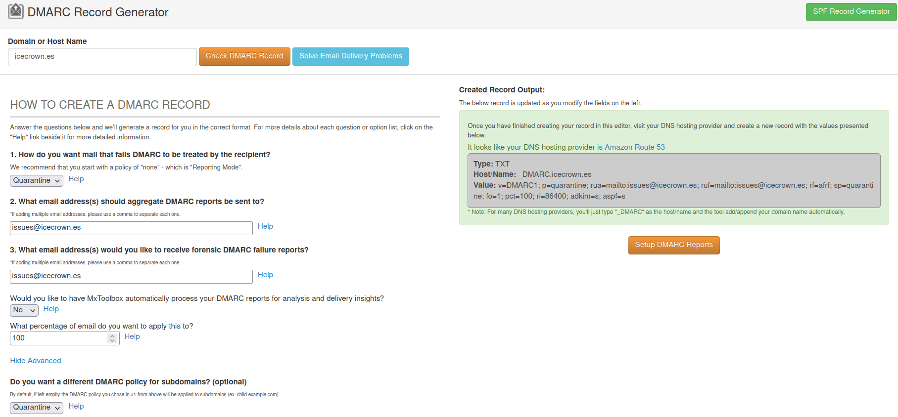
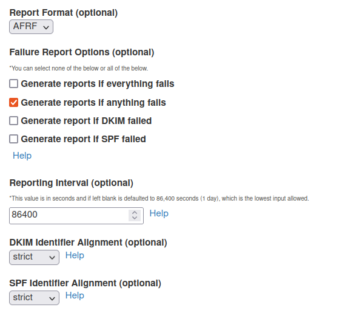
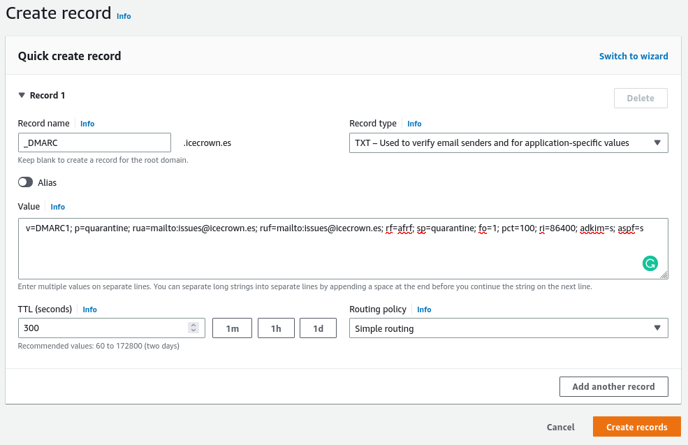
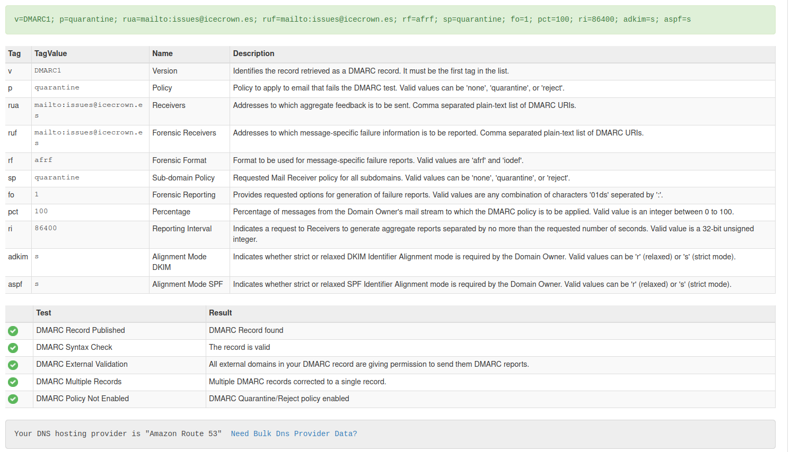

---

tags:
  - Zentyal

---

# Hardening

On this page, a series of implementations will be carried out in several modules whose purpose is to increase their security.

The modules on which these improvements will be applied are:

* Domain controller
* Mail
* Webmail

## Domain Controller module

The additional security configurations that will be implemented in the domain controller module are:

* Password policies.

### Password policy

We will establish password policies through the `samba-tool domain passwordsettings` command for domain users, in this way, we will reduce the possibility of weak passwords being used.

Additionally, it should be mentioned that starting from Samba 4.9, it is possible to define more particular password policies as explained in [this](https://wiki.samba.org/index.php/Password_Settings_Objects) link. However, using this functionality has a resource increase as mentioned in the link, so I will not use this specific functionality in my particular case.

The policies that I will define are:

* I will enable password complexity.
* I will set a minimum of 8 characters that passwords must have.
* A password will have a maximum validity period of 6 months.

The following are the actions to be performed to apply these policies:

1. We verify the default policies in use:

    ```sh linenums="1"
    sudo samba-tool domain passwordsettings show
    ```

    The result obtained in my case is:

    ```text linenums="1"
    Password information for domain 'DC=icecrown,DC=es'

    Password complexity: off
    Store plaintext passwords: off
    Password history length: 24
    Minimum password length: 0
    Minimum password age (days): 0
    Maximum password age (days): 365
    Account lockout duration (mins): 30
    Account lockout threshold (attempts): 0
    Reset account lockout after (mins): 30
    ```

2. We establish the new policies:

    ```sh linenums="1"
    sudo samba-tool domain passwordsettings \
        set \
        --complexity=on \
        --min-pwd-length=8 \
        --max-pwd-age=180
    ```

3. We show the configuration again to make sure that the policies were applied:

    ```sh linenums="1"
    sudo samba-tool domain passwordsettings show
    ```

    The result obtained in my case is:

    ```text linenums="1"
    Password information for domain 'DC=icecrown,DC=es'

    Password complexity: on
    Store plaintext passwords: off
    Password history length: 24
    Minimum password length: 8
    Minimum password age (days): 0
    Maximum password age (days): 180
    Account lockout duration (mins): 30
    Account lockout threshold (attempts): 0
    Reset account lockout after (mins): 30
    ```

4. Finally, we try to create a user with a weak password to confirm that the policies are in operation:

    

## Mail module

For this module, we will implement the following features to significantly increase the security of our mail service:

* SPF
* DKIM
* DMARC

### SPF

[SPF] will be the first one we will implement. The goal that SPF tries to cover is to protect our domain against spoofing and phishing attacks. Basically, we will create a record in our DNS which will indicate which servers can send emails from our domain. For more information, see [this] link.

[SPF]: https://support.google.com/a/answer/33786?hl=en-419
[this]: https://www.mimecast.com/content/sender-policy-framework/

1. Through [this](https://www.spfwizard.net/) website, we will generate the necessary DNS record to implement this authentication method:

    

2. We create the `TXT` record both in the DNS module and in the DNS provider - in my case, Route53 -:

    For Zentyal, we go to `DNS -> Domains -> TXT records`:

    

    For Route 53:

    

3. We check the resolution of the new record both internally and externally:

    ```sh linenums="1"
    dig TXT icecrown.es
    dig @8.8.8.8 icecrown.es
    ```

    The result obtained in my case:

    ```text linenums="1"
    ## Internal query (from Zentyal)
    ; <<>> DiG 9.16.1-Ubuntu <<>> TXT icecrown.es
    ;; global options: +cmd
    ;; Got answer:
    ;; ->>HEADER<<- opcode: QUERY, status: NOERROR, id: 8888
    ;; flags: qr aa rd ra; QUERY: 1, ANSWER: 1, AUTHORITY: 0, ADDITIONAL: 1

    ;; OPT PSEUDOSECTION:
    ; EDNS: version: 0, flags:; udp: 4096
    ; COOKIE: f1292e180a5d3b430100000063f25f4ddf828c60e1a71af2 (good)
    ;; QUESTION SECTION:
    ;icecrown.es.			IN	TXT

    ;; ANSWER SECTION:
    icecrown.es.		259200	IN	TXT	"v=spf1 mx ip4:15.237.168.75 ~all"

    ;; Query time: 204 msec
    ;; SERVER: 127.0.0.1#53(127.0.0.1)
    ;; WHEN: Sun Feb 19 18:41:33 CET 2023
    ;; MSG SIZE  rcvd: 113


    ## External query
    ; <<>> DiG 9.16.1-Ubuntu <<>> @8.8.8.8 TXT icecrown.es
    ; (1 server found)
    ;; global options: +cmd
    ;; Got answer:
    ;; ->>HEADER<<- opcode: QUERY, status: NOERROR, id: 5656
    ;; flags: qr rd ra; QUERY: 1, ANSWER: 1, AUTHORITY: 0, ADDITIONAL: 1

    ;; OPT PSEUDOSECTION:
    ; EDNS: version: 0, flags:; udp: 512
    ;; QUESTION SECTION:
    ;icecrown.es.			IN	TXT

    ;; ANSWER SECTION:
    icecrown.es.		300	IN	TXT	"v=spf1 mx ip4:15.237.168.75 ~all"

    ;; Query time: 16 msec
    ;; SERVER: 8.8.8.8#53(8.8.8.8)
    ;; WHEN: Sun Feb 19 18:42:07 CET 2023
    ;; MSG SIZE  rcvd: 85
    ```

4. We will also use [MXtoolbox](https://mxtoolbox.com/spf.aspx) to check the record:

    

5. Finally, we will send an email to an external account - GMail in my case - and verify the headers:

    

### DKIM

[DKIM] will be the next security implementation we will carry out. The objective of DKIM is that the receiver can verify that the received email is legitimate. The necessary configuration steps have been taken from [here](https://doc.zentyal.org/en/mail.html#hardening-the-mail-server).

[DKIM]: https://www.mimecast.com/content/dkim/

1. We install the necessary packages for the implementation of DKIM:

    ```sh linenums="1"
    sudo apt update
    sudo apt install -y opendkim opendkim-tools
    ```

2. We create the directory where the OpenDKIM keys will be stored:

    ```sh linenums="1"
    sudo mkdir -vp /etc/opendkim/keys
    ```

3. We generate the private key that will be used to sign the emails and set it as `mail`:

    ```sh linenums="1"
    sudo opendkim-genkey -s mail -d icecrown.es -D /etc/opendkim/keys
    ```

4. We set the correct permissions for the files generated by the previous command:

    ```sh linenums="1"
    sudo chown -R opendkim:opendkim /etc/opendkim/
    sudo chmod 0640 /etc/opendkim/keys/*.private
    ```

5. We create the `/etc/opendkim/TrustedHosts` configuration file and set the trusted domain and IP addresses in it:

    ```sh linenums="1"
    127.0.0.1
    localhost
    15.237.168.75/32
    mail.icecrown.es
    ```

6. We create the configuration file `/etc/opendkim/SigningTable` which will contain the domain to be signed by OpenDKIM.

    ```text linenums="1"
    *@icecrown.es mail._domainkey.icecrown.es
    ```

7. We create the configuration file `/etc/opendkim/KeyTable` which will have the selector name and the path to the private key responsible for signing the emails.

    ```text linenums="1"
    mail._domainkey.icecrown.es icecrown.es:mail:/etc/opendkim/keys/mail.private
    ```

8. We create the main configuration file named `/etc/opendkim.conf` and set the configuration of the OpenDKIM service.

    ```text linenums="1"
    Syslog			        yes
    LogWhy			        yes
    UMask			        007
    Mode			        sv
    SubDomains		        no
    Canonicalization	    relaxed/simple
    Socket                  inet:8891@127.0.0.1
    PidFile                 /run/opendkim/opendkim.pid
    OversignHeaders		    From
    TrustAnchorFile         /usr/share/dns/root.key
    UserID                  opendkim
    AutoRestart			    yes
    AutoRestartRate		    10/1M
    Background			    yes
    DNSTimeout			    5
    SignatureAlgorithm	    rsa-sha256
    ExternalIgnoreList      refile:/etc/opendkim/TrustedHosts
    InternalHosts           refile:/etc/opendkim/TrustedHosts
    KeyTable                refile:/etc/opendkim/KeyTable
    Signingtable            refile:/etc/opendkim/SigningTable
    ```

9. We set the socket configuration in the configuration file `/etc/default/opendkim`:

    ```text linenums="1"
    ## Custom configuration created on 19-02-2023 by Daniel
    # SOCKET=local:$RUNDIR/opendkim.sock
    SOCKET=inet:8891@127.0.0.1
    ```

10. We enable, restart, and verify the OpenDKIM service:

    ```sh linenums="1"
    sudo systemctl enable opendkim
    sudo systemctl restart opendkim
    sudo systemctl status opendkim
    ```

11. The content of the `TXT` record that we need to create in the domain is located in the configuration file `/etc/opendkim/keys/mail.txt`.

    In my case, the content is:

    ```text linenums="1"
    mail._domainkey	IN	TXT	( "v=DKIM1; h=sha256; k=rsa; "
	  "p=MIIBIjANBgkqhkiG9w0BAQEFAAOCAQ8AMIIBCgKCAQEAu2kM2TmbrV6DNQR37F3EZ4YSgfRWV+XLI7Fi02pSqNuPeIwKIRBpoHRj7FU2ff4fHN8fg7iO3qkGbH5vwY8RgLM46pYE4pth0Zl7prFy3YJU6Kz4kzA9JKKAypU7+Z5ji+t+5zKGIJ49CQzIm8czRjnCYdI8ZjTBvUOo36lkVEO2qn43vAoL1a4gFJh3ZdSAqBdGMqVqcgINyn"
	  "9ss6+JNE3kbdsbztcR+IeU+6PJZDGTr7VLJ1dXi3NM8HH+R1phgWXKjIScEX4sM3okzPnXZoKSFpNORLVfHf/LwwWF3VLNEpI2zjGYVjc7/jEqZCqZmk/8VNYkUA7vcMyColzJAwIDAQAB" )  ; ----- DKIM key mail for icecrown.es
    ```

12. We create the DNS record of type `TXT` both on the Zentyal server and on the DNS provider.

    To create the record on the Zentyal server, we will have to use the CLI due to Zentyal's character limitation in the graphical environment:

    ```sh linenums="1"
    sudo samba-tool dns add \
        127.0.0.1 \
        icecrown.es \
        mail._domainkey.icecrown.es \
        TXT \
        'v=DKIM1; h=sha256; k=rsa;
        "p=MIIBIjANBgkqhkiG9w0BAQEFAAOCAQ8AMIIBCgKCAQEAu2kM2TmbrV6DNQR37F3EZ4YSgfRWV+XLI7Fi02pSqNuPeIwKIRBpoHRj7FU2ff4fHN8fg7iO3qkGbH5vwY8RgLM46pYE4pth0Zl7prFy3YJU6Kz4kzA9JKKAypU7+Z5ji+t+5zKGIJ49CQzIm8czRjnCYdI8ZjTBvUOo36lkVEO2qn43vAoL1a4gFJh3ZdSAqBdGMqVqcgINyn"
        "9ss6+JNE3kbdsbztcR+IeU+6PJZDGTr7VLJ1dXi3NM8HH+R1phgWXKjIScEX4sM3okzPnXZoKSFpNORLVfHf/LwwWF3VLNEpI2zjGYVjc7/jEqZCqZmk/8VNYkUA7vcMyColzJAwIDAQAB"' \
        -U zenadmin
    ```

    For Route53:

    

    !!! warning

        We must pay attention to the quotation marks when creating the TXT record.

13. We check the resolution of the new record both internally and externally.

    ```sh linenums="1"
    dig TXT mail._domainkey.icecrown.es
    dig @8.8.8.8 TXT mail._domainkey.icecrown.es
    ```

    The result obtained in my case is:

    ```text linenums="1"
    ## Internal query (from Zentyal)
    ; <<>> DiG 9.16.1-Ubuntu <<>> TXT mail._domainkey.icecrown.es
    ;; global options: +cmd
    ;; Got answer:
    ;; ->>HEADER<<- opcode: QUERY, status: NOERROR, id: 47343
    ;; flags: qr aa rd ra; QUERY: 1, ANSWER: 1, AUTHORITY: 0, ADDITIONAL: 1

    ;; OPT PSEUDOSECTION:
    ; EDNS: version: 0, flags:; udp: 4096
    ; COOKIE: e524c5bb228993ae0100000063f26951777512932a30cbc1 (good)
    ;; QUESTION SECTION:
    ;mail._domainkey.icecrown.es.	IN	TXT

    ;; ANSWER SECTION:
    mail._domainkey.icecrown.es. 900 IN	TXT	"v=DKIM1;" "h=sha256;" "k=rsa;" "p=MIIBIjANBgkqhkiG9w0BAQEFAAOCAQ8AMIIBCgKCAQEAu2kM2TmbrV6DNQR37F3EZ4YSgfRWV+XLI7Fi02pSqNuPeIwKIRBpoHRj7FU2ff4fHN8fg7iO3qkGbH5vwY8RgLM46pYE4pth0Zl7prFy3YJU6Kz4kzA9JKKAypU7+Z5ji+t+5zKGIJ49CQzIm8czRjnCYdI8ZjTBvUOo36lkVEO2qn43vAoL1a4gFJh3ZdSAqBdGMqVqcgINyn" "9ss6+JNE3kbdsbztcR+IeU+6PJZDGTr7VLJ1dXi3NM8HH+R1phgWXKjIScEX4sM3okzPnXZoKSFpNORLVfHf/LwwWF3VLNEpI2zjGYVjc7/jEqZCqZmk/8VNYkUA7vcMyColzJAwIDAQAB"

    ;; Query time: 4 msec
    ;; SERVER: 127.0.0.1#53(127.0.0.1)
    ;; WHEN: Sun Feb 19 19:24:17 CET 2023
    ;; MSG SIZE  rcvd: 518


    ## External query
    ; <<>> DiG 9.16.1-Ubuntu <<>> @8.8.8.8 TXT mail._domainkey.icecrown.es
    ; (1 server found)
    ;; global options: +cmd
    ;; Got answer:
    ;; ->>HEADER<<- opcode: QUERY, status: NOERROR, id: 58941
    ;; flags: qr rd ra; QUERY: 1, ANSWER: 2, AUTHORITY: 0, ADDITIONAL: 1

    ;; OPT PSEUDOSECTION:
    ; EDNS: version: 0, flags:; udp: 512
    ;; QUESTION SECTION:
    ;mail._domainkey.icecrown.es.	IN	TXT

    ;; ANSWER SECTION:
    mail._domainkey.icecrown.es. 300 IN	TXT	"9ss6+JNE3kbdsbztcR+IeU+6PJZDGTr7VLJ1dXi3NM8HH+R1phgWXKjIScEX4sM3okzPnXZoKSFpNORLVfHf/LwwWF3VLNEpI2zjGYVjc7/jEqZCqZmk/8VNYkUA7vcMyColzJAwIDAQAB"
    mail._domainkey.icecrown.es. 300 IN	TXT	"v=DKIM1; h=sha256; k=rsa;" "p=MIIBIjANBgkqhkiG9w0BAQEFAAOCAQ8AMIIBCgKCAQEAu2kM2TmbrV6DNQR37F3EZ4YSgfRWV+XLI7Fi02pSqNuPeIwKIRBpoHRj7FU2ff4fHN8fg7iO3qkGbH5vwY8RgLM46pYE4pth0Zl7prFy3YJU6Kz4kzA9JKKAypU7+Z5ji+t+5zKGIJ49CQzIm8czRjnCYdI8ZjTBvUOo36lkVEO2qn43vAoL1a4gFJh3ZdSAqBdGMqVqcgINyn"

    ;; Query time: 16 msec
    ;; SERVER: 8.8.8.8#53(8.8.8.8)
    ;; WHEN: Sun Feb 19 19:25:24 CET 2023
    ;; MSG SIZE  rcvd: 502
    ```

14. We will also use [MXtoolbox] to check the record:

    

15. Once the DNS record is confirmed, we will proceed to configure the Postfix (SMTP) service to make use of this service. To do this, we add the following lines at the end of the stub `/etc/zentyal/stubs/mail/main.cf.mas`.

    ```text linenums="1"
    ## DKIM Configuration created on 19-02-2023 by Daniel
    milter_protocol = 6
    milter_default_action = accept
    smtpd_milters = inet:127.0.0.1:8891
    non_smtpd_milters = inet:127.0.0.1:8891
    ```

    If we do not have this file, we will have to execute the following commands:

    ```sh linenums="1"
    sudo mkdir -v /etc/zentyal/stubs/mail/
    sudo cp -v /usr/share/zentyal/stubs/mail/main.cf.mas /etc/zentyal/stubs/mail/main.cf.mas
    ```

16. We restart the mail module to apply the changes.

    ```sh linenums="1"
    sudo zs mail restart
    ```

17. Finally, we will send an email to an external account - GMail in my case - and verify the headers.

    

[MXtoolbox]: https://mxtoolbox.com/dkim.aspx

### DMARC

The last implementation we will perform will be [DMARC]. This authentication mechanism will integrate with SPF and DKIM, so it will be necessary to have them previously implemented.

[DMARC]: https://www.dmarcanalyzer.com/es/dmarc-3/

1. Through [this](https://mxtoolbox.com/DMARCRecordGenerator.aspx) website, we will generate the necessary DNS record to implement this authentication method:

    
    

2. We create the DNS record of type `TXT` on both the Zentyal server and the DNS provider:

    For the Zentyal server, we go to `DNS -> Domains -> TXT records`:

    

    For Route53:

    

3. We check the resolution of the new record both internally and externally:

    ```sh linenums="1"
    dig TXT _DMARC.icecrown.es
    dig @8.8.8.8 TXT _DMARC.icecrown.es
    ```

    The result obtained in my case:

    ```text linenums="1"
    ## Internal query (from Zentyal)
    ; <<>> DiG 9.16.1-Ubuntu <<>> TXT _DMARC.novadevs.com
    ;; global options: +cmd
    ;; Got answer:
    ;; ->>HEADER<<- opcode: QUERY, status: NOERROR, id: 37988
    ;; flags: qr rd ra; QUERY: 1, ANSWER: 1, AUTHORITY: 0, ADDITIONAL: 1

    ;; OPT PSEUDOSECTION:
    ; EDNS: version: 0, flags:; udp: 4096
    ; COOKIE: 035a971807e4de9f0100000063f27c0e87c3ffcc2d62887c (good)
    ;; QUESTION SECTION:
    ;_DMARC.novadevs.com.		IN	TXT

    ;; ANSWER SECTION:
    _DMARC.novadevs.com.	14400	IN	TXT	"v=DMARC1; p=quarantine; sp=quarantine; adkim=s; aspf=s; rua=mailto:webmaster@novadevs.com; ruf=mailto:webmaster@novadevs.com; rf=afrf; pct=100; ri=86400"

    ;; Query time: 40 msec
    ;; SERVER: 127.0.0.1#53(127.0.0.1)
    ;; WHEN: Sun Feb 19 20:44:14 CET 2023
    ;; MSG SIZE  rcvd: 241


    ## External query
    ; <<>> DiG 9.16.1-Ubuntu <<>> @8.8.8.8 TXT _DMARC.icecrown.es
    ; (1 server found)
    ;; global options: +cmd
    ;; Got answer:
    ;; ->>HEADER<<- opcode: QUERY, status: NOERROR, id: 42645
    ;; flags: qr rd ra; QUERY: 1, ANSWER: 1, AUTHORITY: 0, ADDITIONAL: 1

    ;; OPT PSEUDOSECTION:
    ; EDNS: version: 0, flags:; udp: 512
    ;; QUESTION SECTION:
    ;_DMARC.icecrown.es.		IN	TXT

    ;; ANSWER SECTION:
    _DMARC.icecrown.es.	300	IN	TXT	"v=DMARC1; p=quarantine; rua=mailto:issues@icecrown.es; ruf=mailto:issues@icecrown.es; rf=afrf; sp=quarantine; fo=1; pct=100; ri=86400; adkim=s; aspf=s"

    ;; Query time: 16 msec
    ;; SERVER: 8.8.8.8#53(8.8.8.8)
    ;; WHEN: Sun Feb 19 20:44:48 CET 2023
    ;; MSG SIZE  rcvd: 210
    ```

4. We will also use [MXtoolbox](https://mxtoolbox.com/DMARC.aspx) to check the record:

    

5. Finally, we will send an email to an external account - Gmail in my case - and verify the headers:

    

## Webmail module

The Webmail module serves its content through the Apache service, which by default displays too much information, which can be used for a possible attack.

### Apache

By default, it is possible to obtain the version of Ubuntu and Apache used by the web service. Additionally, the default Apache page is very characteristic. Therefore, we will proceed to reduce the information that is possible to obtain by querying the service and also create a very simple page.

1. We modify the following configuration parameters in the file `/etc/apache2/conf-enabled/security.conf` to reduce the service information:

    ```sh linenums="1"
    sed -i \
        -e 's/^ServerSignature.*/ServerSignature Off/' \
        -e 's/^ServerTokens.*/ServerTokens Prod/' \
        /etc/apache2/conf-enabled/security.conf
    ```

2. We restart the service to apply the changes:

    ```sh linenums="1"
    sudo systemctl restart apache2
    ```

3. Finally, we modify the default index:

    ```sh linenums="1"
    echo '<h1>Website not found</h1>' | sudo tee /var/www/html/index.html
    ```
