---

tags:
  - Zentyal

---

# Hardening

En esta página se realizarán una serie de implementaciones en varios módulos cuya finalidad es incrementar su seguridad.

Los módulos sobre los que aplicarán estas mejoras son:

* Domain controller
* Mail
* Webmail

## Módulo de controlador de dominio

Las configuraciones adicionales de seguridad que se implementarán en el módulo de controlador de dominio serán:

* Políticas de contraseña.

### Política de contraseñas

Vamos a establecer unas políticas de contraseñas mediante el comando `samba-tool domain passwordsettings` para los usuarios del dominio, de esta forma, reduciremos la posibilidad de que se usen contraseñas débiles.

Mencionar adicionalmente que a partir de Samba 4.9 es posible definir políticas de contraseña más particulares como se explican en [este](https://wiki.samba.org/index.php/Password_Settings_Objects) enlace, no obstante, usar esta funcionalidad tiene un aumento de recursos tal y como se menciona en el enlace, por lo que en mi caso concreto no haré uso de eas funcionalidad concreta.

Las políticas que definiré serán:

* Habilitaré la complejidad de las contraseñas.
* Estableceré un mínimo de 8 los caracteres que deberán tener las contraseñas.
* Una contraseña tendrá una vigencia máxima de 6 meses.

A continuación las acciones a realizar para aplicar dichas políticas:

1. Verificamos las políticas en uso configuradas por defecto:

    ```sh linenums="1"
    sudo samba-tool domain passwordsettings show
    ```

    El resultado obtenido en mi caso es:

    ```text linenums="1"
    Password information for domain 'DC=icecrown,DC=es'

    Password complexity: off
    Store plaintext passwords: off
    Password history length: 24
    Minimum password length: 0
    Minimum password age (days): 0
    Maximum password age (days): 365
    Account lockout duration (mins): 30
    Account lockout threshold (attempts): 0
    Reset account lockout after (mins): 30
    ```

2. Establecemos las nuevas políticas:

    ```sh linenums="1"
    sudo samba-tool domain passwordsettings \
        set \
        --complexity=on \
        --min-pwd-length=8 \
        --max-pwd-age=180
    ```

3. Volvemos a mostrar la configuración para cerciorarnos que se aplicaron las políticas:

    ```sh linenums="1"
    sudo samba-tool domain passwordsettings show
    ```

    El resultado obtenido en mi caso es:

    ```text linenums="1"
    Password information for domain 'DC=icecrown,DC=es'

    Password complexity: on
    Store plaintext passwords: off
    Password history length: 24
    Minimum password length: 8
    Minimum password age (days): 0
    Maximum password age (days): 180
    Account lockout duration (mins): 30
    Account lockout threshold (attempts): 0
    Reset account lockout after (mins): 30
    ```

4. Finalmente, tratamos de crear un usuario con una contraseña débil para confirmar que las políticas están en funcionamiento:

    

## Módulo de correo

Para este módulo vamos a implementar las siguientes funcionalidades para incrementar considerablemente la seguridad de nuestro servicio de correo:

* SPF
* DKIM
* DMARC

### SPF

[SPF] será el primero que implementaremos. El objetivo que trata de cubrir SPF es proteger nuestro dominio contra ataques de tipo spoofing y phishing. Básicamente crearemos un registro en nuestro DNS el cual indicará qué servidores pueden enviar correos desde nuestro dominio. Para más información, ver [este] otro enlace.

[SPF]: https://support.google.com/a/answer/33786?hl=es-419
[este]: https://www.dmarcanalyzer.com/es/spf-3/

1. A través de [esta](https://www.spfwizard.net/) web generaremos el registro DNS necesario para implementar este método de autenticación:

    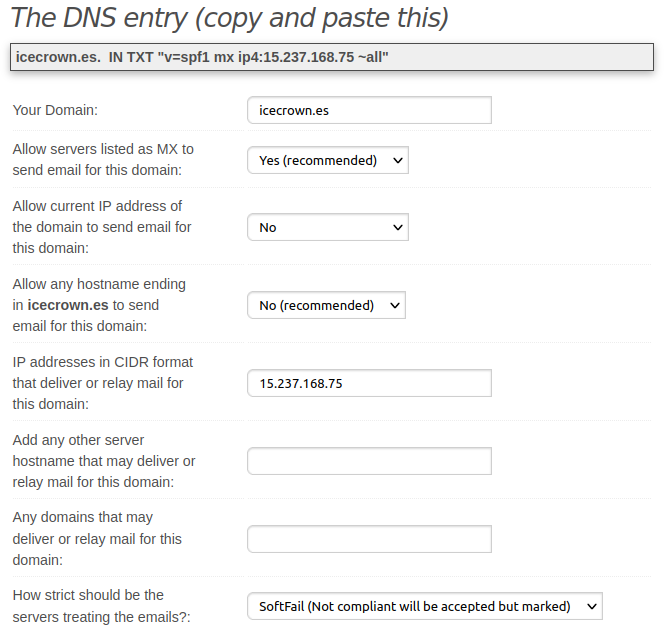

2. Creamos el registro de tipo `TXT` tanto en el módulo DNS como en el proveedor DNS - en mi caso, Route53 -:

    Para Zentyal, vamos a `DNS -> Domains -> TXT records`:

    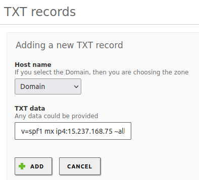

    Para Route 53:

    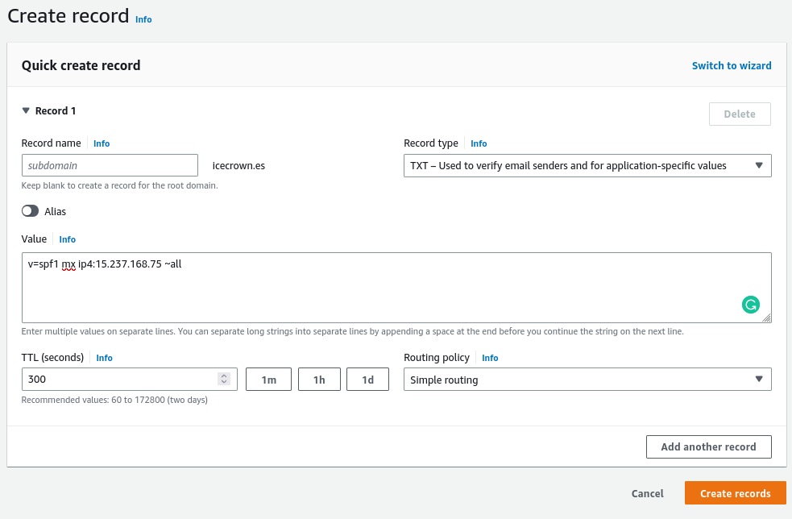

3. Comprobamos la resolución del nuevo registro tanto interna como externamente:

    ```sh linenums="1"
    dig TXT icecrown.es
    dig @8.8.8.8 icecrown.es
    ```

    El resultado obtenido en mi caso:

    ```text linenums="1"
    ## Consulta interna (desde Zentyal)
    ; <<>> DiG 9.16.1-Ubuntu <<>> TXT icecrown.es
    ;; global options: +cmd
    ;; Got answer:
    ;; ->>HEADER<<- opcode: QUERY, status: NOERROR, id: 8888
    ;; flags: qr aa rd ra; QUERY: 1, ANSWER: 1, AUTHORITY: 0, ADDITIONAL: 1

    ;; OPT PSEUDOSECTION:
    ; EDNS: version: 0, flags:; udp: 4096
    ; COOKIE: f1292e180a5d3b430100000063f25f4ddf828c60e1a71af2 (good)
    ;; QUESTION SECTION:
    ;icecrown.es.			IN	TXT

    ;; ANSWER SECTION:
    icecrown.es.		259200	IN	TXT	"v=spf1 mx ip4:15.237.168.75 ~all"

    ;; Query time: 204 msec
    ;; SERVER: 127.0.0.1#53(127.0.0.1)
    ;; WHEN: Sun Feb 19 18:41:33 CET 2023
    ;; MSG SIZE  rcvd: 113


    ## Consulta externa
    ; <<>> DiG 9.16.1-Ubuntu <<>> @8.8.8.8 TXT icecrown.es
    ; (1 server found)
    ;; global options: +cmd
    ;; Got answer:
    ;; ->>HEADER<<- opcode: QUERY, status: NOERROR, id: 5656
    ;; flags: qr rd ra; QUERY: 1, ANSWER: 1, AUTHORITY: 0, ADDITIONAL: 1

    ;; OPT PSEUDOSECTION:
    ; EDNS: version: 0, flags:; udp: 512
    ;; QUESTION SECTION:
    ;icecrown.es.			IN	TXT

    ;; ANSWER SECTION:
    icecrown.es.		300	IN	TXT	"v=spf1 mx ip4:15.237.168.75 ~all"

    ;; Query time: 16 msec
    ;; SERVER: 8.8.8.8#53(8.8.8.8)
    ;; WHEN: Sun Feb 19 18:42:07 CET 2023
    ;; MSG SIZE  rcvd: 85
    ```

4. Usaremos también [MXtoolbox](https://mxtoolbox.com/spf.aspx) para comprobar el registro:

    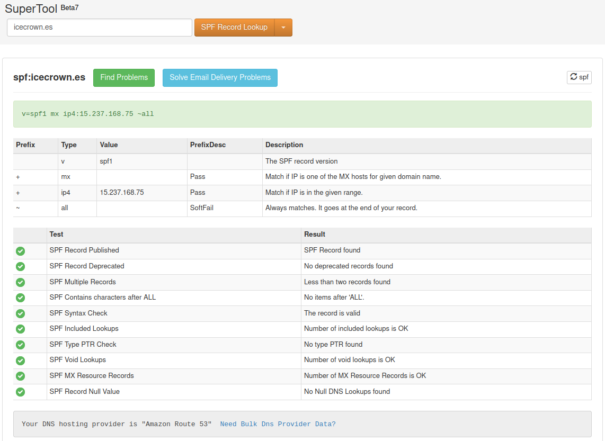

5. Finalmente, enviaremos un correo a una cuenta externa - GMail en mi caso - y verificaremos las cabeceras:

    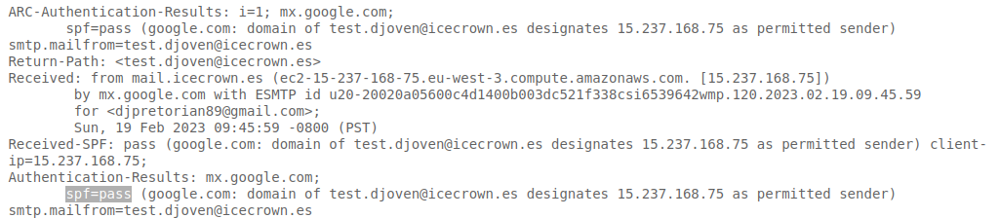

### DKIM

[DKIM] será la siguiente implementación de seguridad que realizaremos. El objetivo de DKIM es que el receptor pueda verificar que el email recibido es legítimo. Los pasos de configuración necesarias las he sacado de [aquí](https://doc.zentyal.org/es/mail.html#securizacion-del-servidor-de-correo).

[DKIM]: https://www.dmarcanalyzer.com/es/dkim-3/

1. Instalamos los paquetes necesarios para la implementación de DKIM:

    ```sh linenums="1"
    sudo apt update
    sudo apt install -y opendkim opendkim-tools
    ```

2. Creamos el directorio donde se almacenarán las claves de OpenDKIM:

    ```sh linenums="1"
    sudo mkdir -vp /etc/opendkim/keys
    ```

3. Generamos la clave privada que será usada para firmar los correos electrónicos y establecemos como `mail`:

    ```sh linenums="1"
    sudo opendkim-genkey -s mail -d icecrown.es -D /etc/opendkim/keys
    ```

4. Establecemos los permisos correctos a los archivos generados por el anterior comando:

    ```sh linenums="1"
    sudo chown -R opendkim:opendkim /etc/opendkim/
    sudo chmod 0640 /etc/opendkim/keys/*.private
    ```

5. Creamos el archivo de configuración `/etc/opendkim/TrustedHosts` y establecemos en él el dominio y direcciones IP confiables:

    ```sh linenums="1"
    127.0.0.1
    localhost
    15.237.168.75/32
    mail.icecrown.es
    ```

6. Creamos el archivo de configuración `/etc/opendkim/SigningTable` que contendrá el dominio a firmar por OpenDKIM:

    ```text linenums="1"
    *@icecrown.es mail._domainkey.icecrown.es
    ```

7. Creamos el archivo de configuración `/etc/opendkim/KeyTable` que tendrá el nombre del selector y la ruta a la clave privada encargada de firmar los correos electrónicos:

    ```text linenums="1"
    mail._domainkey.icecrown.es icecrown.es:mail:/etc/opendkim/keys/mail.private
    ```

8. Creamos el archivo de configuración principal llamado `/etc/opendkim.conf` y establecemos la configuración del servicio OpenDKIM:

    ```text linenums="1"
    Syslog			        yes
    LogWhy			        yes
    UMask			        007
    Mode			        sv
    SubDomains		        no
    Canonicalization	    relaxed/simple
    Socket                  inet:8891@127.0.0.1
    PidFile                 /run/opendkim/opendkim.pid
    OversignHeaders		    From
    TrustAnchorFile         /usr/share/dns/root.key
    UserID                  opendkim
    AutoRestart			    yes
    AutoRestartRate		    10/1M
    Background			    yes
    DNSTimeout			    5
    SignatureAlgorithm	    rsa-sha256
    ExternalIgnoreList      refile:/etc/opendkim/TrustedHosts
    InternalHosts           refile:/etc/opendkim/TrustedHosts
    KeyTable                refile:/etc/opendkim/KeyTable
    Signingtable            refile:/etc/opendkim/SigningTable
    ```

9. Establecemos la configuración del socket en el archivo de configuración `/etc/default/opendkim`:

    ```text linenums="1"
    ## Custom configuration created on 19-02-2023 by Daniel
    # SOCKET=local:$RUNDIR/opendkim.sock
    SOCKET=inet:8891@127.0.0.1
    ```

10. Habilitamos, reiniciamos y comprobamos el servicio de OpenDKIM:

    ```sh linenums="1"
    sudo systemctl enable opendkim
    sudo systemctl restart opendkim
    sudo systemctl status opendkim
    ```

11. El contenido del registro `TXT` que deberemos que crear en el dominio se encuentra en el archivo de configuración `/etc/opendkim/keys/mail.txt`:

    En mi caso, el contenido es:

    ```text linenums="1"
    mail._domainkey	IN	TXT	( "v=DKIM1; h=sha256; k=rsa; "
	  "p=MIIBIjANBgkqhkiG9w0BAQEFAAOCAQ8AMIIBCgKCAQEAu2kM2TmbrV6DNQR37F3EZ4YSgfRWV+XLI7Fi02pSqNuPeIwKIRBpoHRj7FU2ff4fHN8fg7iO3qkGbH5vwY8RgLM46pYE4pth0Zl7prFy3YJU6Kz4kzA9JKKAypU7+Z5ji+t+5zKGIJ49CQzIm8czRjnCYdI8ZjTBvUOo36lkVEO2qn43vAoL1a4gFJh3ZdSAqBdGMqVqcgINyn"
	  "9ss6+JNE3kbdsbztcR+IeU+6PJZDGTr7VLJ1dXi3NM8HH+R1phgWXKjIScEX4sM3okzPnXZoKSFpNORLVfHf/LwwWF3VLNEpI2zjGYVjc7/jEqZCqZmk/8VNYkUA7vcMyColzJAwIDAQAB" )  ; ----- DKIM key mail for icecrown.es
    ```

12. Creamos el registro DNS de tipo `TXT` tanto en el servidor Zentyal como en el proveedor DNS:

    Para el servidor Zentyal tendremos que hacer uso de la CLI debido a la limitación de caracteres de Zentyal en el entorno gráfico:

    ```sh linenums="1"
    sudo samba-tool dns add \
        127.0.0.1 \
        icecrown.es \
        mail._domainkey.icecrown.es \
        TXT \
        'v=DKIM1; h=sha256; k=rsa;
        "p=MIIBIjANBgkqhkiG9w0BAQEFAAOCAQ8AMIIBCgKCAQEAu2kM2TmbrV6DNQR37F3EZ4YSgfRWV+XLI7Fi02pSqNuPeIwKIRBpoHRj7FU2ff4fHN8fg7iO3qkGbH5vwY8RgLM46pYE4pth0Zl7prFy3YJU6Kz4kzA9JKKAypU7+Z5ji+t+5zKGIJ49CQzIm8czRjnCYdI8ZjTBvUOo36lkVEO2qn43vAoL1a4gFJh3ZdSAqBdGMqVqcgINyn"
        "9ss6+JNE3kbdsbztcR+IeU+6PJZDGTr7VLJ1dXi3NM8HH+R1phgWXKjIScEX4sM3okzPnXZoKSFpNORLVfHf/LwwWF3VLNEpI2zjGYVjc7/jEqZCqZmk/8VNYkUA7vcMyColzJAwIDAQAB"' \
        -U zenadmin
    ```

    Para Route53:

    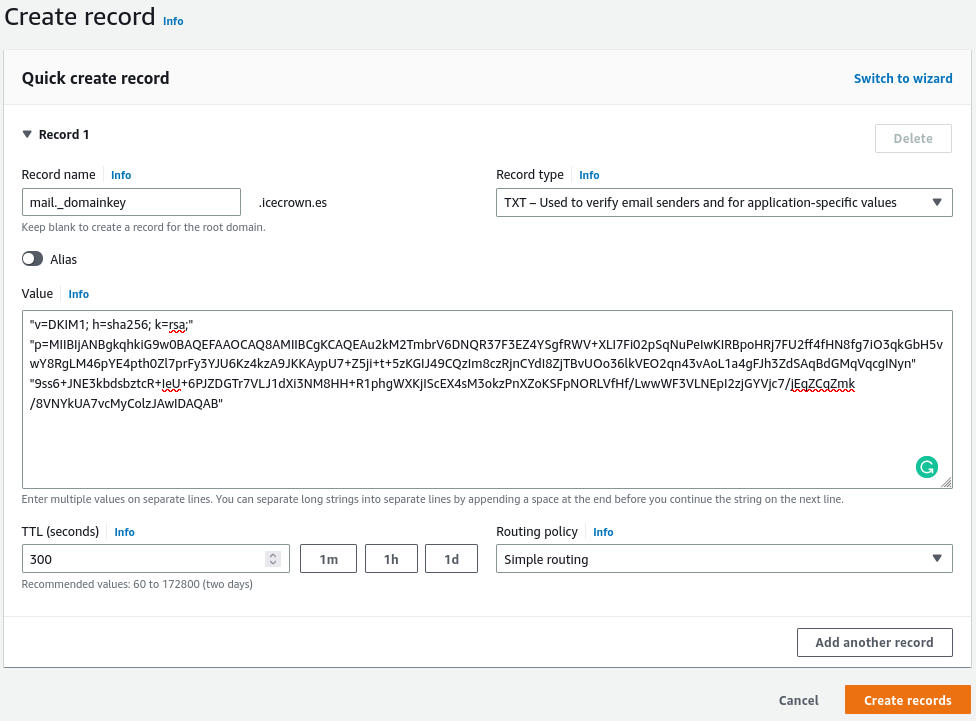

    !!! warning

        Deberemos de prestar atención a las comillas a la hora de crear el registro TXT.

13. Comprobamos la resolución del nuevo registro tanto interna como externamente:

    ```sh linenums="1"
    dig TXT mail._domainkey.icecrown.es
    dig @8.8.8.8 TXT mail._domainkey.icecrown.es
    ```

    El resultado obtenido en mi caso:

    ```text linenums="1"
    ## Consulta interna (desde Zentyal)
    ; <<>> DiG 9.16.1-Ubuntu <<>> TXT mail._domainkey.icecrown.es
    ;; global options: +cmd
    ;; Got answer:
    ;; ->>HEADER<<- opcode: QUERY, status: NOERROR, id: 47343
    ;; flags: qr aa rd ra; QUERY: 1, ANSWER: 1, AUTHORITY: 0, ADDITIONAL: 1

    ;; OPT PSEUDOSECTION:
    ; EDNS: version: 0, flags:; udp: 4096
    ; COOKIE: e524c5bb228993ae0100000063f26951777512932a30cbc1 (good)
    ;; QUESTION SECTION:
    ;mail._domainkey.icecrown.es.	IN	TXT

    ;; ANSWER SECTION:
    mail._domainkey.icecrown.es. 900 IN	TXT	"v=DKIM1;" "h=sha256;" "k=rsa;" "p=MIIBIjANBgkqhkiG9w0BAQEFAAOCAQ8AMIIBCgKCAQEAu2kM2TmbrV6DNQR37F3EZ4YSgfRWV+XLI7Fi02pSqNuPeIwKIRBpoHRj7FU2ff4fHN8fg7iO3qkGbH5vwY8RgLM46pYE4pth0Zl7prFy3YJU6Kz4kzA9JKKAypU7+Z5ji+t+5zKGIJ49CQzIm8czRjnCYdI8ZjTBvUOo36lkVEO2qn43vAoL1a4gFJh3ZdSAqBdGMqVqcgINyn" "9ss6+JNE3kbdsbztcR+IeU+6PJZDGTr7VLJ1dXi3NM8HH+R1phgWXKjIScEX4sM3okzPnXZoKSFpNORLVfHf/LwwWF3VLNEpI2zjGYVjc7/jEqZCqZmk/8VNYkUA7vcMyColzJAwIDAQAB"

    ;; Query time: 4 msec
    ;; SERVER: 127.0.0.1#53(127.0.0.1)
    ;; WHEN: Sun Feb 19 19:24:17 CET 2023
    ;; MSG SIZE  rcvd: 518


    ## Consulta externa
    ; <<>> DiG 9.16.1-Ubuntu <<>> @8.8.8.8 TXT mail._domainkey.icecrown.es
    ; (1 server found)
    ;; global options: +cmd
    ;; Got answer:
    ;; ->>HEADER<<- opcode: QUERY, status: NOERROR, id: 58941
    ;; flags: qr rd ra; QUERY: 1, ANSWER: 2, AUTHORITY: 0, ADDITIONAL: 1

    ;; OPT PSEUDOSECTION:
    ; EDNS: version: 0, flags:; udp: 512
    ;; QUESTION SECTION:
    ;mail._domainkey.icecrown.es.	IN	TXT

    ;; ANSWER SECTION:
    mail._domainkey.icecrown.es. 300 IN	TXT	"9ss6+JNE3kbdsbztcR+IeU+6PJZDGTr7VLJ1dXi3NM8HH+R1phgWXKjIScEX4sM3okzPnXZoKSFpNORLVfHf/LwwWF3VLNEpI2zjGYVjc7/jEqZCqZmk/8VNYkUA7vcMyColzJAwIDAQAB"
    mail._domainkey.icecrown.es. 300 IN	TXT	"v=DKIM1; h=sha256; k=rsa;" "p=MIIBIjANBgkqhkiG9w0BAQEFAAOCAQ8AMIIBCgKCAQEAu2kM2TmbrV6DNQR37F3EZ4YSgfRWV+XLI7Fi02pSqNuPeIwKIRBpoHRj7FU2ff4fHN8fg7iO3qkGbH5vwY8RgLM46pYE4pth0Zl7prFy3YJU6Kz4kzA9JKKAypU7+Z5ji+t+5zKGIJ49CQzIm8czRjnCYdI8ZjTBvUOo36lkVEO2qn43vAoL1a4gFJh3ZdSAqBdGMqVqcgINyn"

    ;; Query time: 16 msec
    ;; SERVER: 8.8.8.8#53(8.8.8.8)
    ;; WHEN: Sun Feb 19 19:25:24 CET 2023
    ;; MSG SIZE  rcvd: 502
    ```

14. Usaremos también [MXtoolbox] para comprobar el registro:

    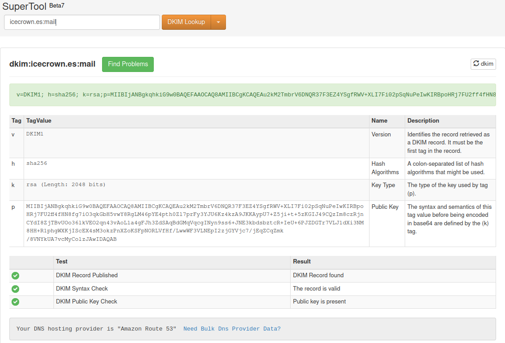

15. Una vez confirmado el registro DNS, procederemos a configurar el servicio Postfix (SMTP) para que haga uso de este servicio. Para ello, añadimos las siguientes líneas al final del stub `/etc/zentyal/stubs/mail/main.cf.mas`:

    ```text linenums="1"
    ## DKIM Configuration created on 19-02-2023 by Daniel
    milter_protocol = 6
    milter_default_action = accept
    smtpd_milters = inet:127.0.0.1:8891
    non_smtpd_milters = inet:127.0.0.1:8891
    ```

    En caso de no tener dicho archivo, tendremos que ejecutar los siguientes comandos:

    ```sh linenums="1"
    sudo mkdir -v /etc/zentyal/stubs/mail/
    sudo cp -v /usr/share/zentyal/stubs/mail/main.cf.mas /etc/zentyal/stubs/mail/main.cf.mas
    ```

16. Reiniciamos el módulo de correo para que se apliquen los cambios:

    ```sh linenums="1"
    sudo zs mail restart
    ```

17. Finalmente, enviaremos un correo a una cuenta externa - GMail en mi caso - y verificaremos las cabeceras:

    

[MXtoolbox]: https://mxtoolbox.com/dkim.aspx

### DMARC

La última implementación que realizaremos será [DMARC]. Este mecanismo de autenticación se integrará con SPF y DKIM, por lo que será necesario haberlos implementarlo previamente.

[DMARC]: https://www.dmarcanalyzer.com/es/dmarc-3/

1. A través de [esta](https://mxtoolbox.com/DMARCRecordGenerator.aspx) web generaremos el registro DNS necesario para implementar este método de autenticación:

    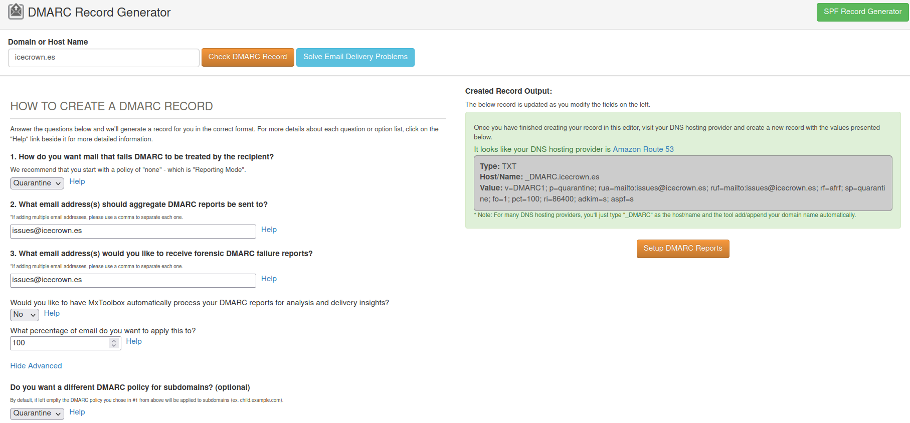
    

2. Creamos el registro DNS de tipo `TXT` tanto en el servidor Zentyal como en el proveedor DNS:

    Para el servidor Zentyal vamos a `DNS -> Domains -> TXT records`:

    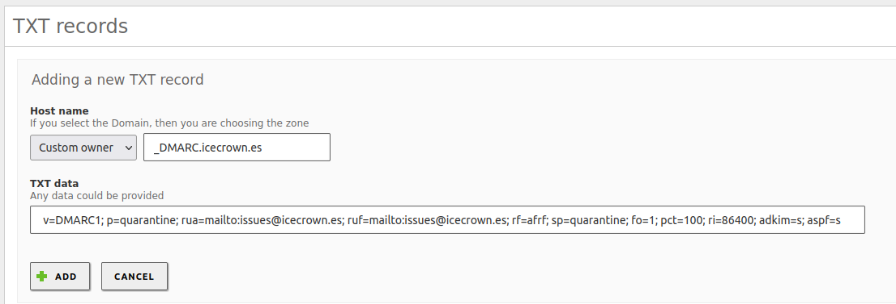

    Para Route53:

    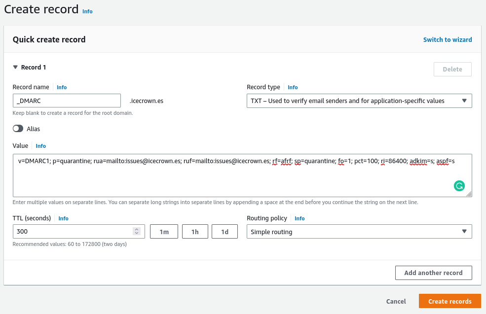

3. Comprobamos la resolución del nuevo registro tanto interna como externamente:

    ```sh linenums="1"
    dig TXT _DMARC.icecrown.es
    dig @8.8.8.8 TXT _DMARC.icecrown.es
    ```

    El resultado obtenido en mi caso:

    ```text linenums="1"
    ## Consulta interna (desde Zentyal)
    ; <<>> DiG 9.16.1-Ubuntu <<>> TXT _DMARC.novadevs.com
    ;; global options: +cmd
    ;; Got answer:
    ;; ->>HEADER<<- opcode: QUERY, status: NOERROR, id: 37988
    ;; flags: qr rd ra; QUERY: 1, ANSWER: 1, AUTHORITY: 0, ADDITIONAL: 1

    ;; OPT PSEUDOSECTION:
    ; EDNS: version: 0, flags:; udp: 4096
    ; COOKIE: 035a971807e4de9f0100000063f27c0e87c3ffcc2d62887c (good)
    ;; QUESTION SECTION:
    ;_DMARC.novadevs.com.		IN	TXT

    ;; ANSWER SECTION:
    _DMARC.novadevs.com.	14400	IN	TXT	"v=DMARC1; p=quarantine; sp=quarantine; adkim=s; aspf=s; rua=mailto:webmaster@novadevs.com; ruf=mailto:webmaster@novadevs.com; rf=afrf; pct=100; ri=86400"

    ;; Query time: 40 msec
    ;; SERVER: 127.0.0.1#53(127.0.0.1)
    ;; WHEN: Sun Feb 19 20:44:14 CET 2023
    ;; MSG SIZE  rcvd: 241


    ## Consulta externa
    ; <<>> DiG 9.16.1-Ubuntu <<>> @8.8.8.8 TXT _DMARC.icecrown.es
    ; (1 server found)
    ;; global options: +cmd
    ;; Got answer:
    ;; ->>HEADER<<- opcode: QUERY, status: NOERROR, id: 42645
    ;; flags: qr rd ra; QUERY: 1, ANSWER: 1, AUTHORITY: 0, ADDITIONAL: 1

    ;; OPT PSEUDOSECTION:
    ; EDNS: version: 0, flags:; udp: 512
    ;; QUESTION SECTION:
    ;_DMARC.icecrown.es.		IN	TXT

    ;; ANSWER SECTION:
    _DMARC.icecrown.es.	300	IN	TXT	"v=DMARC1; p=quarantine; rua=mailto:issues@icecrown.es; ruf=mailto:issues@icecrown.es; rf=afrf; sp=quarantine; fo=1; pct=100; ri=86400; adkim=s; aspf=s"

    ;; Query time: 16 msec
    ;; SERVER: 8.8.8.8#53(8.8.8.8)
    ;; WHEN: Sun Feb 19 20:44:48 CET 2023
    ;; MSG SIZE  rcvd: 210
    ```

4. Usaremos también [MXtoolbox](https://mxtoolbox.com/DMARC.aspx) para comprobar el registro:

    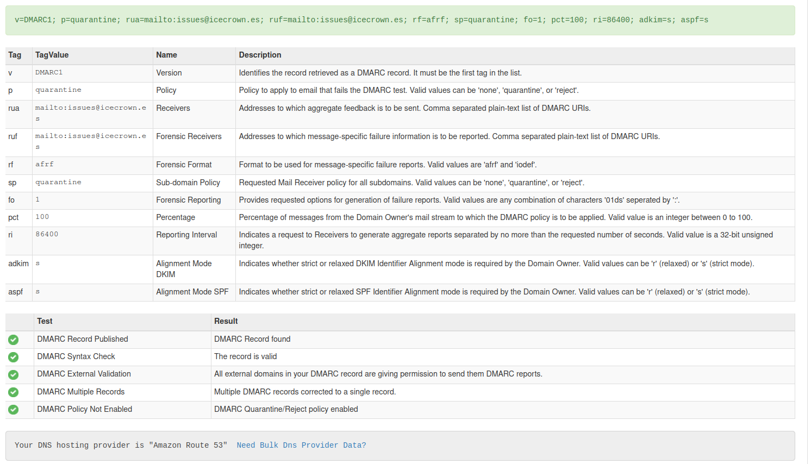

5. Finalmente, enviaremos un correo a una cuenta externa - GMail en mi caso - y verificaremos las cabeceras:

    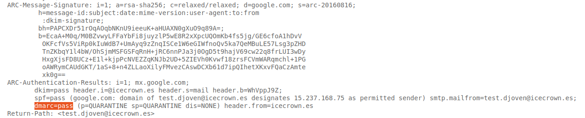

## Módulo de Webmail

El módulo de Webmail sirve su contenido a través del servicio Apache, el cual por defecto, muestra demasiada información, la cual puede ser usada para un posible ataque.

### Apache

Por defecto, es posible obtener la versión de Ubuntu y Apache que usa el servicio web. Además, que la página por defecto de Apache es muy característica. Por lo tanto, procederemos a reducir la información que es posible obtener consultando al servicio y también, crearemos una página muy sencilla.

1. Modificamos los siguientes parámetros de configuración del archivo `/etc/apache2/conf-enabled/security.conf` para reducir la información del servicio:

    ```sh linenums="1"
    sed -i \
        -e 's/^ServerSignature.*/ServerSignature Off/' \
        -e 's/^ServerTokens.*/ServerTokens Prod/' \
        /etc/apache2/conf-enabled/security.conf
    ```

2. Reiniciamos el servicio para que se apliquen los cambios:

    ```sh linenums="1"
    sudo systemctl restart apache2
    ```

3. Finalmente, modificamos el index por defecto:

    ```sh linenums="1"
    echo '<h1>Website not found</h1>' | sudo tee /var/www/html/index.html
    ```
