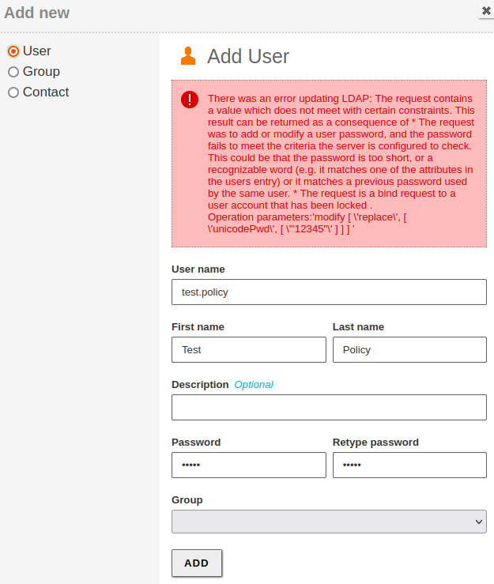
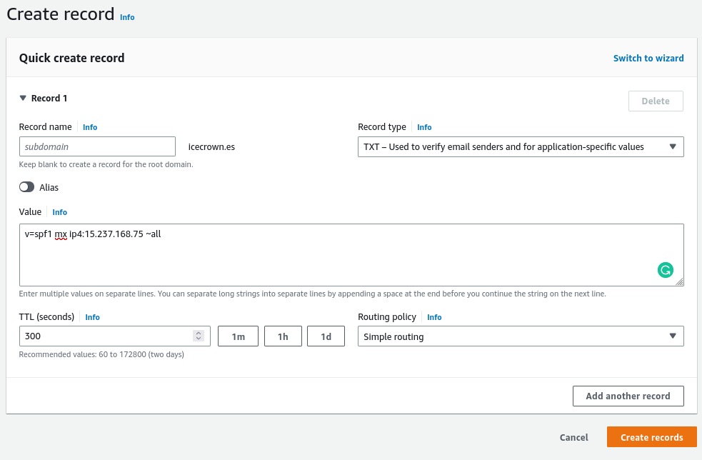
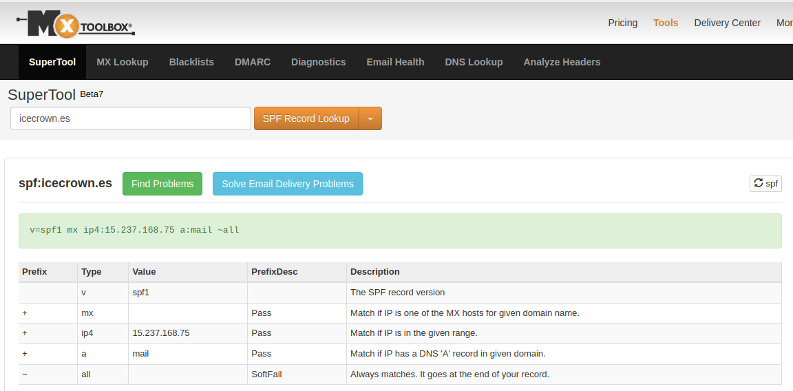
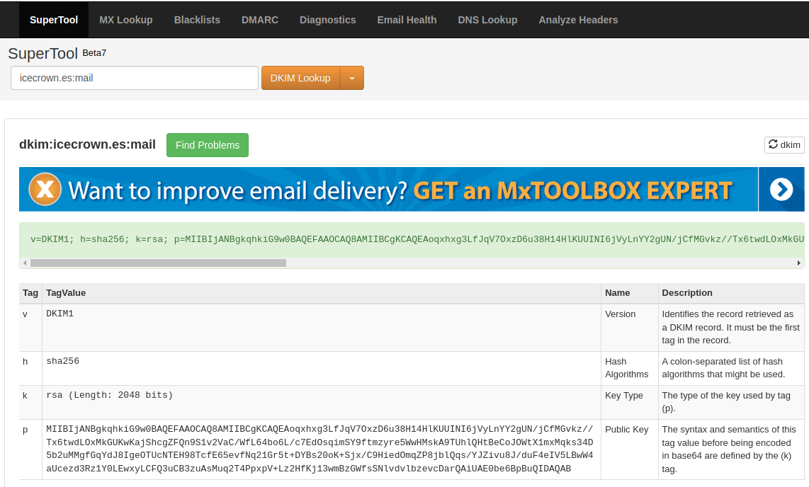

# Hardening

En esta documentación se realizarán una serie de implementaciones en varios módulos cuya finalidad es incrementar su seguridad.

Los módulos sobre los que aplicarán estas mejoras son:

* Domain controller
* Mail
* Webmail

## Módulo de controlador de dominio

Las configuraciones adicionales de seguridad que se implementarán en el módulo de controlador de dominio serán:

* Políticas de contraseña.

### Política de contraseñas

Vamos a establecer unas políticas de contraseñas mediante el comando `samba-tool domain passwordsettings` para los usuarios del dominio, de esta forma, reduciremos la posibilidad de que se usen contraseñas débiles.

Mencionar adicionalmente que a partir de Samba 4.9 es posible definir políticas de contraseña más particulares como se explican en [este] enlace, no obstante, usar esta funcionalidad tiene un aumento de recursos, por lo que en mi caso concreto no haré uso de ella.

[este]: (https://wiki.samba.org/index.php/Password_Settings_Objects)

Las políticas que definiré serán:

* Habilitaré la complejidad de las contraseñas.
* Estableceré un mínimo de 8 los caracteres que deberán tener las contraseñas.
* Una contraseña tendrá una vigencia máxima de 6 meses.

Las acciones a realizar son:

1. Verificamos las políticas por defecto:

    ```sh
    sudo samba-tool domain passwordsettings show
    ```

    El resultado obtenido en mi caso es:

    ```text
    Password information for domain 'DC=icecrown,DC=es'

    Password complexity: off
    Store plaintext passwords: off
    Password history length: 24
    Minimum password length: 0
    Minimum password age (days): 0
    Maximum password age (days): 365
    Account lockout duration (mins): 30
    Account lockout threshold (attempts): 0
    Reset account lockout after (mins): 30
    ```

2. Establecemos las nuevas políticas:

    ```sh
    sudo samba-tool domain passwordsettings \
        set \
        --complexity=on \
        --min-pwd-length=8 \
        --max-pwd-age=180
    ```

3. Volvemos a mostrar la configuración para cerciorarnos que se aplicaron las políticas:

    ```sh
    sudo samba-tool domain passwordsettings show
    ```

    El resultado obtenido en mi caso es:

    ```text
    Password information for domain 'DC=icecrown,DC=es'

    Password complexity: on
    Store plaintext passwords: off
    Password history length: 24
    Minimum password length: 8
    Minimum password age (days): 0
    Maximum password age (days): 180
    Account lockout duration (mins): 30
    Account lockout threshold (attempts): 0
    Reset account lockout after (mins): 30
    ```

4. Finalmente, tratamos de crear un usuario con una contraseña débil para confirmar que las políticas están en funcionamiento:

    

## Módulo de correo

Para este módulo vamos a implementar las siguientes funcionalidades para incrementar considerablemente la seguridad de nuestro servicio de correo:

* SPF
* DKIM
* DMARC

### SPF

[SPF] será el primero que implementaremos. El objetivo que trata de cubrir SPF es proteger nuestro dominio contra ataques de tipo spoofing y phishing. Básicamente crearemos un registro en nuestro DNS el cual indicará qué servidores pueden enviar correos desde nuestro dominio. Para más información, ver [este] otro enlace.

[SPF]: https://support.google.com/a/answer/33786?hl=es-419
[este]: https://www.dmarcanalyzer.com/es/spf-3/

1. A través de [esta](https://www.spfwizard.net/) web generaremos el registro DNS necesario para implementar este método de autenticación:

    

2. Creamos el registro de tipo `TXT` tanto en el módulo DNS como en el proveedor DNS - en mi caso, Route53 -:

    Para Zentyal, vamos a `DNS -> Domains -> TXT records`:

    

    Para Route 53:

    

3. Comprobamos la resolución del nuevo registro tanto interna como externamente:

    ```bash
    dig TXT icecrown.es
    dig @8.8.8.8 icecrown.es
    ```

    El resultado obtenido en mi caso:

    ```text
    ## Consulta interna (desde Zentyal)
    ; <<>> DiG 9.16.1-Ubuntu <<>> TXT icecrown.es
    ;; global options: +cmd
    ;; Got answer:
    ;; ->>HEADER<<- opcode: QUERY, status: NOERROR, id: 8888
    ;; flags: qr aa rd ra; QUERY: 1, ANSWER: 1, AUTHORITY: 0, ADDITIONAL: 1

    ;; OPT PSEUDOSECTION:
    ; EDNS: version: 0, flags:; udp: 4096
    ; COOKIE: f1292e180a5d3b430100000063f25f4ddf828c60e1a71af2 (good)
    ;; QUESTION SECTION:
    ;icecrown.es.			IN	TXT

    ;; ANSWER SECTION:
    icecrown.es.		259200	IN	TXT	"v=spf1 mx ip4:15.237.168.75 ~all"

    ;; Query time: 204 msec
    ;; SERVER: 127.0.0.1#53(127.0.0.1)
    ;; WHEN: Sun Feb 19 18:41:33 CET 2023
    ;; MSG SIZE  rcvd: 113


    ## Consulta externa
    ; <<>> DiG 9.16.1-Ubuntu <<>> @8.8.8.8 TXT icecrown.es
    ; (1 server found)
    ;; global options: +cmd
    ;; Got answer:
    ;; ->>HEADER<<- opcode: QUERY, status: NOERROR, id: 5656
    ;; flags: qr rd ra; QUERY: 1, ANSWER: 1, AUTHORITY: 0, ADDITIONAL: 1

    ;; OPT PSEUDOSECTION:
    ; EDNS: version: 0, flags:; udp: 512
    ;; QUESTION SECTION:
    ;icecrown.es.			IN	TXT

    ;; ANSWER SECTION:
    icecrown.es.		300	IN	TXT	"v=spf1 mx ip4:15.237.168.75 ~all"

    ;; Query time: 16 msec
    ;; SERVER: 8.8.8.8#53(8.8.8.8)
    ;; WHEN: Sun Feb 19 18:42:07 CET 2023
    ;; MSG SIZE  rcvd: 85
    ```

4. Usaremos también [MXtoolbox](https://mxtoolbox.com/spf.aspx) para comprobar el registro:

    

5. Finalmente, enviaremos un correo a una cuenta externa - GMail en mi caso - y verificaremos las cabeceras:

    

### DKIM

[DKIM]: https://www.dmarcanalyzer.com/es/dkim-3/

DKIM será el próximo elemento a implementar, las acciones que realizaremos serán las mismas que se describen [aquí](https://doc.zentyal.org/es/mail.html#securizacion-del-servidor-de-correo).

1. Instalamos el paquete necesario para la implementación de está técnica de autenticación para los correos electrónicos:

    ```bash
    sudo apt update
    sudo apt install opendkim opendkim-tools
    ```

2. Creamos el directorio donde se almacenerán las claves de OpenDKIM:

    ```bash
    sudo mkdir -vp /etc/opendkim/keys
    ```

3. Generamos la clave privada que será usada para firmar los correos electrónicos:

    ```bash
    sudo opendkim-genkey -s mail -d icecrown.es -D /etc/opendkim/keys
    ```

4. Establecemos los permisos correctos a los archivos generados por el anterior comando:

    ```bash
    sudo chown -R opendkim:opendkim /etc/opendkim/
    sudo chmod 0640 /etc/opendkim/keys/*.private
    ```

5. Creamos el archivo de configuración `/etc/opendkim/TrustedHosts` y establecemos en él, los dominios e IPs confiables:

    ```bash
    127.0.0.1
    localhost
    15.237.168.75/32
    mail.icecrown.es
    ```

6. Creamos el archivo de configuración `/etc/opendkim/SigningTable` que contendrá el dominio a firmar por OpenDKIM:

    ```bash
    *@icecrown.es
    ```

7. Creamos el archivo de configuración `/etc/opendkim/KeyTable` que tendrá el selector y la ruta a la clave privada encargada de firmar los correos electrónicos:

    ```bash
    mail icecrown.es:mail:/etc/opendkim/keys/mail.private
    ```

8. Creamos el archivo de configuración pricipal llamado `/etc/opendkim.conf` y establecemos la configuración del servicio OpenDKIM:

    ```bash
    Mode                    sv
    PidFile                 /var/run/opendkim/opendkim.pid
    UserID                  opendkim:opendkim
    Socket                  inet:8891@127.0.0.1
    SignatureAlgorithm      rsa-sha256
    AutoRestart             Yes
    AutoRestartRate         10/1h
    Syslog                  yes
    SyslogSuccess           yes
    LogWhy                  Yes
    UMask                   002
    OversignHeaders         From
    Canonicalization        relaxed/simple

    ExternalIgnoreList      refile:/etc/opendkim/TrustedHosts
    InternalHosts           refile:/etc/opendkim/TrustedHosts
    KeyTable                refile:/etc/opendkim/KeyTable
    Signingtable            refile:/etc/opendkim/SigningTable
    ```

9. Establecemos la configuración del socket en el archivo de configuración `/etc/default/opendkim`:

    ```bash
    ## Custom configuration
    SOCKET="inet:8891@127.0.0.1"
    ```

10. Habilitamos, reiniciamos y comprobamos el servicio de OpenDKIM:

    ```bash
    sudo systemctl enable opendkim
    sudo systemctl restart opendkim
    sudo systemctl status opendkim
    ```

11. Obtenemos el contenido del registro `TXT` que deberemos que crear en el dominio, para ello, abrimos el archivo de configuración `/etc/opendkim/keys/mail.txt`:

    ```bash
    mail._domainkey	IN	TXT	( "v=DKIM1; h=sha256; k=rsa; "
        "p=MIIBIjANBgkqhkiG9w0BAQEFAAOCAQ8AMIIBCgKCAQEAoqxhxg3LfJqV7OxzD6u38H14HlKUUINI6jVyLnYY2gUN/jCfMGvkz//Tx6twdLOxMkGUKwKajShcgZFQn9S1v2VaC/WfL64bo6L/c7EdOsqimSY9ftmzyre5WwHMskA9TUhlQHtBeCoJOWtX1mxMqks34D5b2uMMgfGqYdJ8IgeOTUcNTEH98TcfE65evfNq21Gr5t+DYBs20o"
        "K+Sjx/C9HiedOmqZP8jblQqs/YJZivu8J/duF4eIV5LBwW4aUcezd3Rz1Y0LEwxyLCFQ3uCB3zuAsMuq2T4PpxpV+Lz2HfKj13wmBzGWfsSNlvdvlbzevcDarQAiUAE0be6BpBuQIDAQAB" )  ; ----- DKIM key mail for icecrown.es
    ```

12. Creamos el registro TXT en el dominio. A diferencia de SPF, para este registro habrá que usar la CLI:

    ```bash
    sudo samba-tool dns add \
        127.0.0.1 \
        icecrown.es \
        mail._domainkey.icecrown.es \
        TXT \
        '"v=DKIM1; h=sha256; k=rsa; "
        "p=MIIBIjANBgkqhkiG9w0BAQEFAAOCAQ8AMIIBCgKCAQEAoqxhxg3LfJqV7OxzD6u38H14HlKUUINI6jVyLnYY2gUN/jCfMGvkz//Tx6twdLOxMkGUKwKajShcgZFQn9S1v2VaC/WfL64bo6L/c7EdOsqimSY9ftmzyre5WwHMskA9TUhlQHtBeCoJOWtX1mxMqks34D5b2uMMgfGqYdJ8IgeOTUcNTEH98TcfE65evfNq21Gr5t+DYBs20o"
        "K+Sjx/C9HiedOmqZP8jblQqs/YJZivu8J/duF4eIV5LBwW4aUcezd3Rz1Y0LEwxyLCFQ3uCB3zuAsMuq2T4PpxpV+Lz2HfKj13wmBzGWfsSNlvdvlbzevcDarQAiUAE0be6BpBuQIDAQAB"' \
        -U zenadmin
    ```

13. Revisamos desde [MXtoolbox] el registro añadido:

    

14. Una vez que hayamos terminado de configurar DKIM, procederemos a configurar Postfix para que haga uso de este servicio. Para ello, modificamos el stub `/etc/zentyal/stubs/mail/main.cf.mas` que creamos anteriormente:

    ```bash
    ## DKIM Configuration
    milter_protocol = 6
    milter_default_action = accept
    smtpd_milters = inet:127.0.0.1:8891
    non_smtpd_milters = inet:127.0.0.1:8891
    ```

15. Reiniciamos el módulo de correo para que se apliquen los cambios:

    ```bash
    sudo zs mail restart
    ```

16. Finalmente, enviamos un email desde una cuenta de correo interna a un dominio externo para verificar las cabeceras del correo electrónico enviado por Zentyal:

    

### DMARC

[DMARC]: https://www.dmarcanalyzer.com/es/dmarc-3/

## Módulo de Webmail

### Apache
