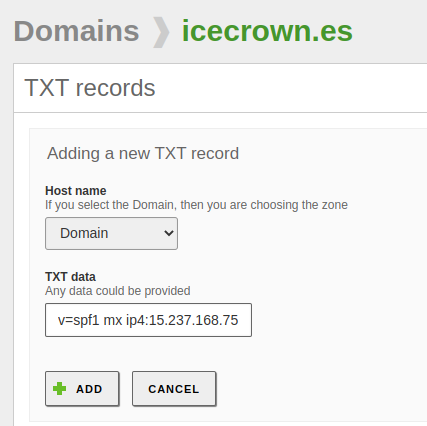

# Hardening

Las últimas implementaciones que realizaremos sobre el servicio de correo será añadir [SPF], [DKIM] y [DMARC] para incrementar la seguridad.

[SPF]: https://www.dmarcanalyzer.com/es/spf-3/
[DKIM]: https://www.dmarcanalyzer.com/es/dkim-3/
[DMARC]: https://www.dmarcanalyzer.com/es/dmarc-3/

## Módulo de controlador de dominio

TODO

* [link](https://wiki.samba.org/index.php/Password_Settings_Objects)

usar 'pso' tiene cierto impacto a nivel de recursos como menciona la documentación.

```sh
sudo samba-tool domain passwordsettings show
```

```sh
Password complexity: off
Store plaintext passwords: off
Password history length: 24
Minimum password length: 0
Minimum password age (days): 0
Maximum password age (days): 365
Account lockout duration (mins): 30
Account lockout threshold (attempts): 0
Reset account lockout after (mins): 30
```

```sh
sudo samba-tool domain passwordsettings set \
    --complexity=on \
    --min-pwd-length=8 \
```

**NOTA:** history-length sólo puede establecerte un máximo de 24.

```sh
Password complexity: on
Store plaintext passwords: off
Password history length: 24
Minimum password length: 8
Minimum password age (days): 0
Maximum password age (days): 365
Account lockout duration (mins): 30
Account lockout threshold (attempts): 0
Reset account lockout after (mins): 30
```

Podríamos establecer un tiempo máximo de duración de contraseña, aunque tiene la contra de que se requerirá de que el administrador de sistemas les recuerde el cambio de contraseña, sino tendrá que establecer la contraseña y que luego el usuario, se encargue de cambiarla por una que él mismo decida (a través de Sogo).

## Módulo de correo

### SPF

SPF será lo primero que implementaron, para ello, realizaremos las siguientes acciones:

1. Generaremos el registro DNS a través de un generador [este](https://www.spfwizard.net/).

    

2. Creamos el registro de tipo `TXT` en nuestro dominio:

    

3. Comprobamos que el registro haya sido añadido usando la CLI:

    ```bash
    sudo samba-tool dns query 127.0.0.1 icecrown.es @ TXT -U zenadmin

        Name=, Records=1, Children=0
        TXT: "v=spf1 mx ip4:15.237.168.75 a:mail ~all" (flags=600000f0, serial=15, ttl=259200)
    ```

4. Finalmente, comprobamos desde [MXtoolbox](https://mxtoolbox.com/spf.aspx):

    

### DKIM

DKIM será el próximo elemento a implementar, las acciones que realizaremos serán las mismas que se describen [aquí](https://doc.zentyal.org/es/mail.html#securizacion-del-servidor-de-correo).

1. Instalamos el paquete necesario para la implementación de está técnica de autenticación para los correos electrónicos:

    ```bash
    sudo apt update
    sudo apt install opendkim opendkim-tools
    ```

2. Creamos el directorio donde se almacenerán las claves de OpenDKIM:

    ```bash
    sudo mkdir -vp /etc/opendkim/keys
    ```

3. Generamos la clave privada que será usada para firmar los correos electrónicos:

    ```bash
    sudo opendkim-genkey -s mail -d icecrown.es -D /etc/opendkim/keys
    ```

4. Establecemos los permisos correctos a los archivos generados por el anterior comando:

    ```bash
    sudo chown -R opendkim:opendkim /etc/opendkim/
    sudo chmod 0640 /etc/opendkim/keys/*.private
    ```

5. Creamos el archivo de configuración `/etc/opendkim/TrustedHosts` y establecemos en él, los dominios e IPs confiables:

    ```bash
    127.0.0.1
    localhost
    15.237.168.75/32
    mail.icecrown.es
    ```

6. Creamos el archivo de configuración `/etc/opendkim/SigningTable` que contendrá el dominio a firmar por OpenDKIM:

    ```bash
    *@icecrown.es
    ```

7. Creamos el archivo de configuración `/etc/opendkim/KeyTable` que tendrá el selector y la ruta a la clave privada encargada de firmar los correos electrónicos:

    ```bash
    mail icecrown.es:mail:/etc/opendkim/keys/mail.private
    ```

8. Creamos el archivo de configuración pricipal llamado `/etc/opendkim.conf` y establecemos la configuración del servicio OpenDKIM:

    ```bash
    Mode                    sv
    PidFile                 /var/run/opendkim/opendkim.pid
    UserID                  opendkim:opendkim
    Socket                  inet:8891@127.0.0.1
    SignatureAlgorithm      rsa-sha256
    AutoRestart             Yes
    AutoRestartRate         10/1h
    Syslog                  yes
    SyslogSuccess           yes
    LogWhy                  Yes
    UMask                   002
    OversignHeaders         From
    Canonicalization        relaxed/simple

    ExternalIgnoreList      refile:/etc/opendkim/TrustedHosts
    InternalHosts           refile:/etc/opendkim/TrustedHosts
    KeyTable                refile:/etc/opendkim/KeyTable
    Signingtable            refile:/etc/opendkim/SigningTable
    ```

9. Establecemos la configuración del socket en el archivo de configuración `/etc/default/opendkim`:

    ```bash
    ## Custom configuration
    SOCKET="inet:8891@127.0.0.1"
    ```

10. Habilitamos, reiniciamos y comprobamos el servicio de OpenDKIM:

    ```bash
    sudo systemctl enable opendkim
    sudo systemctl restart opendkim
    sudo systemctl status opendkim
    ```

11. Obtenemos el contenido del registro `TXT` que deberemos que crear en el dominio, para ello, abrimos el archivo de configuración `/etc/opendkim/keys/mail.txt`:

    ```bash
    mail._domainkey	IN	TXT	( "v=DKIM1; h=sha256; k=rsa; "
        "p=MIIBIjANBgkqhkiG9w0BAQEFAAOCAQ8AMIIBCgKCAQEAoqxhxg3LfJqV7OxzD6u38H14HlKUUINI6jVyLnYY2gUN/jCfMGvkz//Tx6twdLOxMkGUKwKajShcgZFQn9S1v2VaC/WfL64bo6L/c7EdOsqimSY9ftmzyre5WwHMskA9TUhlQHtBeCoJOWtX1mxMqks34D5b2uMMgfGqYdJ8IgeOTUcNTEH98TcfE65evfNq21Gr5t+DYBs20o"
        "K+Sjx/C9HiedOmqZP8jblQqs/YJZivu8J/duF4eIV5LBwW4aUcezd3Rz1Y0LEwxyLCFQ3uCB3zuAsMuq2T4PpxpV+Lz2HfKj13wmBzGWfsSNlvdvlbzevcDarQAiUAE0be6BpBuQIDAQAB" )  ; ----- DKIM key mail for icecrown.es
    ```

12. Creamos el registro TXT en el dominio. A diferencia de SPF, para este registro habrá que usar la CLI:

    ```bash
    sudo samba-tool dns add \
        127.0.0.1 \
        icecrown.es \
        mail._domainkey.icecrown.es \
        TXT \
        '"v=DKIM1; h=sha256; k=rsa; "
        "p=MIIBIjANBgkqhkiG9w0BAQEFAAOCAQ8AMIIBCgKCAQEAoqxhxg3LfJqV7OxzD6u38H14HlKUUINI6jVyLnYY2gUN/jCfMGvkz//Tx6twdLOxMkGUKwKajShcgZFQn9S1v2VaC/WfL64bo6L/c7EdOsqimSY9ftmzyre5WwHMskA9TUhlQHtBeCoJOWtX1mxMqks34D5b2uMMgfGqYdJ8IgeOTUcNTEH98TcfE65evfNq21Gr5t+DYBs20o"
        "K+Sjx/C9HiedOmqZP8jblQqs/YJZivu8J/duF4eIV5LBwW4aUcezd3Rz1Y0LEwxyLCFQ3uCB3zuAsMuq2T4PpxpV+Lz2HfKj13wmBzGWfsSNlvdvlbzevcDarQAiUAE0be6BpBuQIDAQAB"' \
        -U zenadmin
    ```

13. Revisamos desde [MXtoolbox] el registro añadido:

    

14. Una vez que hayamos terminado de configurar DKIM, procederemos a configurar Postfix para que haga uso de este servicio. Para ello, modificamos el stub `/etc/zentyal/stubs/mail/main.cf.mas` que creamos anteriormente:

    ```bash
    ## DKIM Configuration
    milter_protocol = 6
    milter_default_action = accept
    smtpd_milters = inet:127.0.0.1:8891
    non_smtpd_milters = inet:127.0.0.1:8891
    ```

15. Reiniciamos el módulo de correo para que se apliquen los cambios:

    ```bash
    sudo zs mail restart
    ```

16. Finalmente, enviamos un email desde una cuenta de correo interna a un dominio externo para verificar las cabeceras del correo electrónico enviado por Zentyal:

    

### DMARC

TODO
