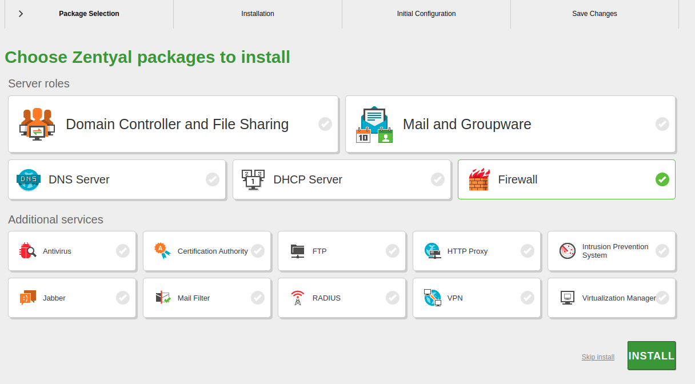
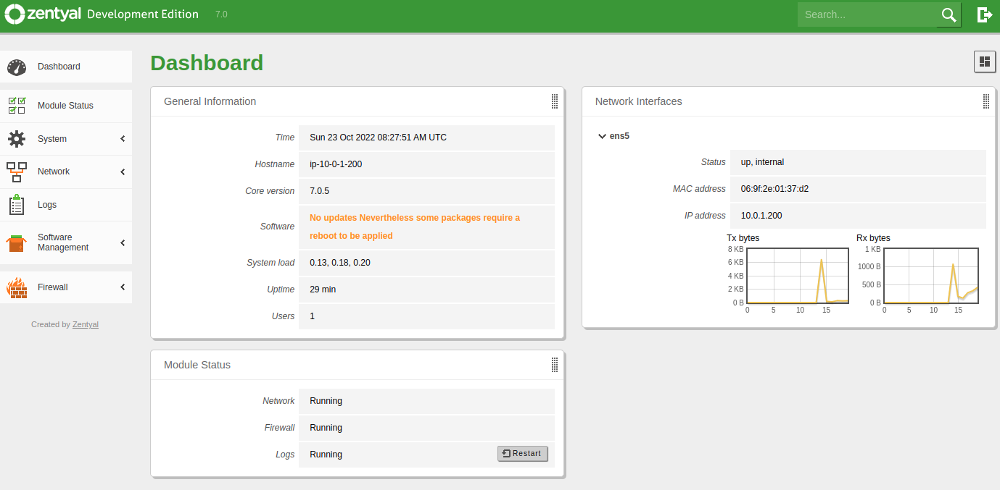

---

tags:
  - Zentyal

---

# Instalación de Zentyal

En esta página se explicará como instalar Zentyal 7.0 sobre un Ubuntu Server 20.04 en una instancia EC2 del proveedor cloud AWS. El objetivo es simplemente instalar Zentyal 7.0 con sólo los módulos esenciales y confirmar que no hay incidencias a nivel de red ante un reinicio.

Para la instalación, usaremos [este] script disponible por parte de Zentyal. Mencionar que instalaremos Zentyal sin entorno gráfico, ya que queremos reducir el uso de recursos que necesita el servidor.

[este]: https://doc.zentyal.org/es/installation.html#instalacion-sobre-ubuntu-20-04-lts-server-o-desktop

Los datos del entorno que crearé para el proyecto son:

* **Nombre del servidor**: arthas
* **Dominio**: icecrown.es
* **IP:** 10.0.1.200/24
* **Tipo de red:** Interna
* **Nombre de un usuario administrador adicional:** djoven

## Requisitos

* El sistema operativo **debe** ser **Ubuntu 20.04 LTS**.
* El servidor tiene que tener un mínimo de 4GB de RAM.
* Se necesita un usuario con permisos de administrador (grupo `sudo`).

## Consideraciones

* Los pasos descritos a continuación son idénticos tantos en entornos cloud como en entornos on-premise.
* En caso de no tener conocimientos robustos sobre Linux, es recomendable usar la versión comercial, ya que se puede contratar acceso a soporte, lo cual puede ser muy útil ante incidencias o actualizaciones de versiones.
* En caso de instalar el servidor en un proveedor cloud o en una ubicación sin acceso físico al servidor, la estabilidad del módulo de red será crítica. A continuación se indican algunas recomendaciones al respecto:
    * Definir previamente la configuración que se establecerá.
    * Asignar una IP concreta a la interfaz de red de la instancia (en caso de usarse un proveedor cloud).
    * Establecer la IP de la instancia como estática en Zentyal.
    * Se recomienda configurar la tarjeta de red en Zentyal como interna, así se evita bloquearse a uno mismo durante la configuración inicial.

## Configuración previa

Antes de proceder a instalar Zentyal, realizaremos las siguientes acciones:

1. Nos conectamos a la instancia a través de SSH usando la clave privada que nos hemos descargado cuando creamos el Key pair:

    ```bash
    ssh -i KP-Prod-Zentyal.pem ubuntu@arthas.icecrown.es
    ```

2. Establecemos una contraseña para los usuarios: `root` y `ubuntu`:

    ```bash
    sudo passwd root
    sudo passwd ubuntu
    ```

3. Actualizamos los paquetes del servidor:

    ```bash
    sudo apt update
    sudo apt dist-upgrade -y
    ```

4. Nos creamos un usuario administrador adicional, el cual usaremos para administrar Zentyal desde la interfaz de administración:

    ```bash
    sudo useradd -m -d /home/djoven -G sudo -s /bin/bash -c 'Sysadmin' djoven
    sudo passwd djoven
    ```

    !!! warning

        Es importante que el usuario pertenezca al grupo `sudo`, de lo contrario no podremos usarlo para acceder a la interfaz de administración.

5. Nos logeamos con el usuario recién creado:

    ```bash
    su - djoven
    ```

6. Creamos el directorio y el archivo necesarios para alojar nuestra clave pública para poder conectarnos vía SSH:

    ```bash
    mkdir -v .ssh
    touch .ssh/authorized_keys
    ```

7. Finalmente, añadimos el contenido de nuestra clave pública al archivo recién creado `.ssh/authorized_keys`.

## Instalación

A partir de este momento, el servidor estará listo para instalar Zentyal 7.0. A continuación las acciones a realizar para su instalación:

1. Creamos un directorio donde almacenaremos el script de instalación de Zentyal:

    ```bash
    sudo mkdir /opt/zentyal-install
    ```

2. Nos descargamos el script y le damos los permisos adecuados:

    ```bash
    sudo wget -O /opt/zentyal-install/zentyal_installer.sh https://zentyal.com/zentyal_installer.sh
    sudo chmod 0750 /opt/zentyal-install/zentyal_installer.sh
    ```

3. Instalamos Zentyal a través del script:

    ```bash
    sudo bash /opt/zentyal-install/zentyal_installer.sh
    ```

    !!! nota

        Contestaremos `n` a la pregunta: '*Do you want to install the Zentyal Graphical environment?*', ya que no queremos instalar el entorno gráfico.

    Los paquetes de Zentyal que nos instalará el script serán:

    * zentyal (meta-paquete)
    * zentyal-core
    * zentyal-software

    !!! warning

        Llegados a este punto, no podemos reiniciar el servidor hasta haber instalado y configurado el módulo de red, de lo contrario, el servidor se iniciará sin una dirección IP y por lo tanto, perderemos el acceso a través de SSH.

4. Una vez que el script haya terminado, nos logeamos al panel de administración de Zentyal: <https://arthas.icecrown.es:8443>

    !!! info

        En caso de que no hayamos creado el registro `A` en el DNS, usaremos la dirección IP pública de la instancia.

5. Nos logeamos con el usuario administrador que hemos creado previamente, en mi caso es `djoven`.

6. En el wizard de configuración inicial, únicamente instalaremos el módulo de [firewall], de esta forma se nos instalará como dependencia el módulo de [network] a su vez.

    

7. Configuramos la tarjeta de red como `internal` y `estática`:

    
    

    !!! warning

        Es posible que al terminar de configurarse la red, se nos reproduzca el bug reportado [aquí]. Si es el caso, seguir los pasos descritos en la página `Bug fixing` (ver menú superior de navegación) o simplemente modificamos la URL por: <https://arthas.icecrown.es:8443>

8. Una vez que se haya terminado de guardar cambios, podremos empezar a gestionar Zentyal a través del dashboard.

    

9. Finalmente, antes de procedes a configurar el servidor, realizaremos las siguientes comprobaciones para confirmar la estabilidad del servidor:

    1. Nos aseguramos que todos los módulos estén habilitados (`Modules Status`).
    2. Que la máquina tenga acceso a Internet.

        ```bash
        ping -c4 8.8.8.8
        ping -c4 google.es
        ```

    3. Que no haya habido ningún error en el log `/var/log/zentyal/zentyal.log`. A continuación un ejemplo del logs sin ningún error:

        ```bash
        2022/10/23 08:17:51 DEBUG> PAM.pm:83 Authen::Simple::PAM::check - Successfully authenticated user 'djoven' using service 'zentyal'.
        2022/10/23 08:20:29 INFO> install-packages:61 main:: - Starting package installation process
        2022/10/23 08:20:39 INFO> Base.pm:256 EBox::Module::Base::saveConfig - Saving config for module: network
        2022/10/23 08:20:39 INFO> Base.pm:256 EBox::Module::Base::saveConfig - Saving config for module: network
        2022/10/23 08:20:40 INFO> Service.pm:965 EBox::Module::Service::restartService - Restarting service for module: network
        2022/10/23 08:20:43 INFO> Base.pm:256 EBox::Module::Base::saveConfig - Saving config for module: network
        2022/10/23 08:20:43 INFO> Base.pm:256 EBox::Module::Base::saveConfig - Saving config for module: firewall
        2022/10/23 08:20:43 INFO> Base.pm:231 EBox::Module::Base::save - Restarting service for module: firewall
        2022/10/23 08:20:44 INFO> Service.pm:965 EBox::Module::Service::restartService - Restarting service for module: firewall
        2022/10/23 08:20:49 INFO> install-packages:121 main:: - Package installation process finished
        2022/10/23 08:23:15 INFO> Network.pm:89 EBox::Network::CGI::Wizard::Network::_processWizard - Configuring ens5 as 10.0.1.200/255.255.255.0
        2022/10/23 08:23:15 INFO> Network.pm:93 EBox::Network::CGI::Wizard::Network::_processWizard - Adding gateway 10.0.1.1 for iface ens5
        2022/10/23 08:23:15 INFO> Network.pm:108 EBox::Network::CGI::Wizard::Network::_processWizard - Adding nameserver 1.1.1.1
        2022/10/23 08:23:15 INFO> Network.pm:114 EBox::Network::CGI::Wizard::Network::_processWizard - Adding nameserver 9.9.9.9
        2022/10/23 08:23:17 INFO> GlobalImpl.pm:571 EBox::GlobalImpl::saveAllModules - First installation, enabling modules: network firewall webadmin logs audit firewall
        2022/10/23 08:23:17 INFO> GlobalImpl.pm:574 EBox::GlobalImpl::saveAllModules - Enabling module network
        2022/10/23 08:23:17 INFO> GlobalImpl.pm:574 EBox::GlobalImpl::saveAllModules - Enabling module firewall
        2022/10/23 08:23:17 INFO> GlobalImpl.pm:574 EBox::GlobalImpl::saveAllModules - Enabling module webadmin
        2022/10/23 08:23:18 INFO> GlobalImpl.pm:574 EBox::GlobalImpl::saveAllModules - Enabling module logs
        2022/10/23 08:23:18 INFO> GlobalImpl.pm:574 EBox::GlobalImpl::saveAllModules - Enabling module audit
        2022/10/23 08:23:19 INFO> GlobalImpl.pm:574 EBox::GlobalImpl::saveAllModules - Enabling module firewall
        2022/10/23 08:23:19 INFO> Base.pm:231 EBox::Module::Base::save - Restarting service for module: network
        2022/10/23 08:23:23 INFO> Base.pm:231 EBox::Module::Base::save - Restarting service for module: firewall
        2022/10/23 08:23:23 INFO> Base.pm:231 EBox::Module::Base::save - Restarting service for module: logs
        2022/10/23 08:23:23 INFO> Base.pm:231 EBox::Module::Base::save - Restarting service for module: audit
        2022/10/23 08:23:23 INFO> Base.pm:231 EBox::Module::Base::save - Restarting service for module: firewall
        2022/10/23 08:23:24 INFO> Base.pm:231 EBox::Module::Base::save - Restarting service for module: sysinfo
        2022/10/23 08:23:25 INFO> GlobalImpl.pm:660 EBox::GlobalImpl::saveAllModules - Saving configuration: webadmin
        2022/10/23 08:23:25 INFO> Base.pm:231 EBox::Module::Base::save - Restarting service for module: webadmin
        2022/10/23 08:24:51 INFO> Index.pm:187 EBox::Dashboard::CGI::Index::masonParameters - dashboard1
        ```

    4. Reiniciamos el servidor para asegurarnos de que es capaz de iniciar sin ningún tipo de problema de red.

        ```bash
        sudo reboot
        ```

    5. Verificamos que podemos conectarnos a través de SSH y a la interfaz de administración de Zentyal.

[firewall]: https://doc.zentyal.org/es/firewall.html
[network]: https://doc.zentyal.org/es/firststeps.html#configuracion-basica-de-red-en-zentyal
[aquí]: https://github.com/zentyal/zentyal/issues/2100
