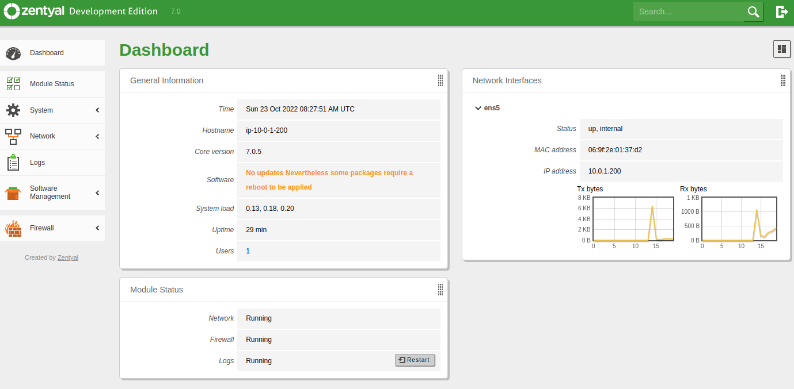
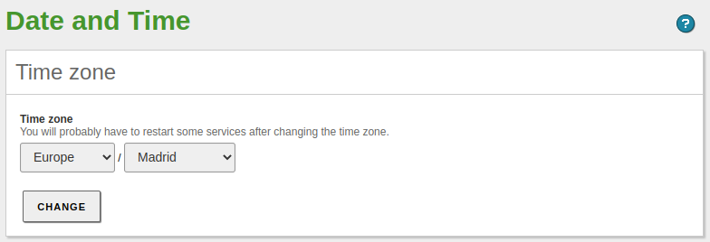

# Zentyal

A continuación se detalla tanto la instalación como configuración del sistema operativo así como de los módulos.


## Objetivo

El objetivo principal de este servidor es configurar como servidor de correo, aunque también se usará para compartir recursos compartidos, los cuales serán accesibles a través del módulo de OpenVPN.

Las acciones que se realizarán son:

1. Instalación del sistema operativo.
2. Instalación y configuración de los siguientes módulos:
    * Network
    * Logs
    * Firewall
    * Software
    * NTP
    * DNS
    * Controlador de dominio
    * Correo
    * Webmail
    * Antivirus
    * Mailfilter
3. Configuración de varios volúmenes EBS (discos) adicionales para los buzones de correo así como para los recursos compartidos.
4. Se securizará el servicio de correo usando: SPF, DKIM y DMARC.

Adicionalmente, mencionar que la información que estableceré para la configuración del servidor será:

* **Nombre del servidor**: arthas
* **Dominio**: icecrown.es
* **IP:** 10.0.1.200/24
* **Tipo de red:** Interna


## Requisitos

* Antes de proceder a realizar las acciones que se explican en las siguientes secciones, es recomendable tener configurado el entorno de AWS tal y como se describe en [este] enlace. Si bien es cierto que no es necesario, es recomendable.
* El despliegue que se explica en este documento sólo ha sido probado sobre el proveedor cloud de Amazon (AWS).
* Se requiere que la instancia (servidor) tenga un mínimo de 2vCPU y 4GB de RAM, ya que el módulo de Antivirus consume bastante recursos.
* El sistema operativo **debe** de la instancia tiene que ser **Ubuntu 20.04 LTS**.


## Consideraciones

* En caso de no tener conocimientos robustos sobre Linux, es recomendable usar la versión comercial, ya que suele venir con acceso a soporte, lo cual puede ser muy útil ante incidencias o actualizaciones de versiones.
* La estabilidad del módulo de red es imperativa, ya que no se tiene acceso físico al servidor para resolver incidencias de dicha índole. Algunas recomendaciones son:
    * Definir previamente la configuración que se establecerá.
    * Asignar una IP concreta a la interfaz de red de la instancia.
    * Establecer la IP de la instancia como estática en Zentyal.
    * Se recomienda configurar la tarjeta de red en Zentyal como interna, así se evita bloquearse a uno mismo durante la configuración inicial.


## Instalación

Para la instalación, se usará [este] script disponible por parte de Zentyal. Mencionar que como es lógico, se instalará Zentyal sin entorno gráfico, ya que no tenemos acceso físico a la instancia.

[este]: https://doc.zentyal.org/es/installation.html#instalacion-sobre-ubuntu-20-04-lts-server-o-desktop

Las acciones a realizar son:

1. Nos conectamos a la instancia usando la clave privada que nos hemos descargado (key pair):

    ```
    ssh -i ~/.aws/keys/KP-Prod-Zentyal.pem ubuntu@arthas.icecrown.es
    ```

2. Actualizamos el sistema:

    ```
    sudo apt update
    sudo apt dist-upgrade -y
    ```

3. Nos creamos un usuario administrador adicional, el cual usaremos para administrar Zentyal - al menos inicialmente - :

    ```
    sudo useradd -m -d /home/djoven -G sudo -s /bin/bash djoven
    sudo passwd djoven
    ```

4. Nos logeamos con dicho usuario y le añadimos nuestra clave pública de SSH para que podamos conectarnos a través de SSH:

    ```
    su - djoven
    mkdir -v .ssh
    touch .ssh/authorized_keys
    vim .ssh/authorized_keys
    ```

5. Creamos un directorio donde almacenaremos el script de instalación de Zentyal:

    ```
    mkdir /opt/zentyal-install
    cd /opt/zentyal-install
    ```

6. Nos descargamos el script y le damos los permisos adecuados:

    ```
    sudo wget https://zentyal.com/zentyal_installer.sh
    sudo chmod 0750 zentyal_installer.sh
    ```

7. Instalamos Zentyal a través del script, contestando `n` a la pregunta sobre la instalación del entorno gráfico:

    ```
    ./zentyal_installer.sh
    Do you want to install the Zentyal Graphical environment? (n|y) n
    ```

    El script nos instalará los siguientes paquetes:

    * zentyal (meta-paquete)
    * zentyal-core
    * zentyal-software

8. Una vez que el script haya terminado, nos logearemos al panel de administración de Zentyal: <https://arthas.icecrown.es:8443>

9. Nos logeamos con el usuario administrador que hemos creado previamente, que en mi caso es `djoven`.

10. En el wizard de configuración inicial, únicamente instalaremos el módulo de [firewall], de esta forma se nos instalará como dependencia el módulo de [network] a su vez.


[firewall]: https://doc.zentyal.org/es/firewall.html
[network]: https://doc.zentyal.org/es/firststeps.html#configuracion-basica-de-red-en-zentyal

11. Configuramos la red como `estática` e `internal` tal y como se ha explicado en el apartado de *consideraciones*.

    **NOTA:** Es posible que al terminar de configurarse la red, se nos reproduzca el bug reportado [aquí]. Si es el caso, simplemente modificar la URL por: <https://arthas.icecrown.es:8443>


12. Una vez que se haya terminado de guardar cambios, podremos empezar a gestionar Zentyal a través del dashboard.



13. Finalmente, antes de procedes a la configuración, realizaremos las siguientes comprobaciones para confirmar la estabilidad del servidor en AWS:

    1. Que los módulos estén habilitados.
    2. Que la máquina tiene acceso a Internet.

        ```
        ping google.es
        ```

    3. Que no haya habido ningún error en el log `/var/log/zentyal/zentyal.log`. A continuación un ejemplo de los registros que fueron registrados en nuestro archivo de log:

        ```
        2022/10/23 08:17:51 DEBUG> PAM.pm:83 Authen::Simple::PAM::check - Successfully authenticated user 'djoven' using service 'zentyal'.
        2022/10/23 08:20:29 INFO> install-packages:61 main:: - Starting package installation process
        2022/10/23 08:20:39 INFO> Base.pm:256 EBox::Module::Base::saveConfig - Saving config for module: network
        2022/10/23 08:20:39 INFO> Base.pm:256 EBox::Module::Base::saveConfig - Saving config for module: network
        2022/10/23 08:20:40 INFO> Service.pm:965 EBox::Module::Service::restartService - Restarting service for module: network
        2022/10/23 08:20:43 INFO> Base.pm:256 EBox::Module::Base::saveConfig - Saving config for module: network
        2022/10/23 08:20:43 INFO> Base.pm:256 EBox::Module::Base::saveConfig - Saving config for module: firewall
        2022/10/23 08:20:43 INFO> Base.pm:231 EBox::Module::Base::save - Restarting service for module: firewall
        2022/10/23 08:20:44 INFO> Service.pm:965 EBox::Module::Service::restartService - Restarting service for module: firewall
        2022/10/23 08:20:49 INFO> install-packages:121 main:: - Package installation process finished
        2022/10/23 08:23:15 INFO> Network.pm:89 EBox::Network::CGI::Wizard::Network::_processWizard - Configuring ens5 as 10.0.1.200/255.255.255.0
        2022/10/23 08:23:15 INFO> Network.pm:93 EBox::Network::CGI::Wizard::Network::_processWizard - Adding gateway 10.0.1.1 for iface ens5
        2022/10/23 08:23:15 INFO> Network.pm:108 EBox::Network::CGI::Wizard::Network::_processWizard - Adding nameserver 8.8.8.8
        2022/10/23 08:23:15 INFO> Network.pm:114 EBox::Network::CGI::Wizard::Network::_processWizard - Adding nameserver 8.8.4.4
        2022/10/23 08:23:17 INFO> GlobalImpl.pm:571 EBox::GlobalImpl::saveAllModules - First installation, enabling modules: network firewall webadmin logs audit firewall
        2022/10/23 08:23:17 INFO> GlobalImpl.pm:574 EBox::GlobalImpl::saveAllModules - Enabling module network
        2022/10/23 08:23:17 INFO> GlobalImpl.pm:574 EBox::GlobalImpl::saveAllModules - Enabling module firewall
        2022/10/23 08:23:17 INFO> GlobalImpl.pm:574 EBox::GlobalImpl::saveAllModules - Enabling module webadmin
        2022/10/23 08:23:18 INFO> GlobalImpl.pm:574 EBox::GlobalImpl::saveAllModules - Enabling module logs
        2022/10/23 08:23:18 INFO> GlobalImpl.pm:574 EBox::GlobalImpl::saveAllModules - Enabling module audit
        2022/10/23 08:23:19 INFO> GlobalImpl.pm:574 EBox::GlobalImpl::saveAllModules - Enabling module firewall
        2022/10/23 08:23:19 INFO> Base.pm:231 EBox::Module::Base::save - Restarting service for module: network
        2022/10/23 08:23:23 INFO> Base.pm:231 EBox::Module::Base::save - Restarting service for module: firewall
        2022/10/23 08:23:23 INFO> Base.pm:231 EBox::Module::Base::save - Restarting service for module: logs
        2022/10/23 08:23:23 INFO> Base.pm:231 EBox::Module::Base::save - Restarting service for module: audit
        2022/10/23 08:23:23 INFO> Base.pm:231 EBox::Module::Base::save - Restarting service for module: firewall
        2022/10/23 08:23:24 INFO> Base.pm:231 EBox::Module::Base::save - Restarting service for module: sysinfo
        2022/10/23 08:23:25 INFO> GlobalImpl.pm:660 EBox::GlobalImpl::saveAllModules - Saving configuration: webadmin
        2022/10/23 08:23:25 INFO> Base.pm:231 EBox::Module::Base::save - Restarting service for module: webadmin
        2022/10/23 08:24:51 INFO> Index.pm:187 EBox::Dashboard::CGI::Index::masonParameters - dashboard1
        ```

    4. Reiniciamos el servidor para asegurarnos de que es capaz de iniciar sin ningún tipo de problema de red.

        ```
        reboot
        ```

    5. Finalmente, volvemos a conectarnos tanto vía SSH como desde la GUI de Zentyal para confirmar que la instalación de Zentyal fue exitosa y que es estable.


### General

Antes de proceder a instalar y configurar los módulos, lo que haremos será establecer un serie de configuraciones generales.

1. Lo primero que haremos será desde el panel de administración de Zentyal el idioma, puerto. Para ello iremos a `System -> General`:


2. Después, desde el mismo lugar, establecemos el nombre del servidor y su dominio:

    **NOTA:** En el momento que habilitemos el módulo de controlador de dominio, estos 2 valores no podrán cambiar.


A continuación, procederemos a crear las particiones y el sistema de archivo para los volúmenes EBS adicionales que añadimos para los buzones de correo y recursos compartidos.

**NOTA:** En caso que sólo uséis un único volumen EBS, omitid las siguientes acciones.

1. Listamos los volúmenes:

    ```
    lsblk
        NAME         MAJ:MIN RM  SIZE RO TYPE MOUNTPOINT
        nvme1n1      259:0    0   10G  0 disk
        nvme0n1      259:1    0   30G  0 disk
        ├─nvme0n1p1  259:2    0 29.9G  0 part /
        ├─nvme0n1p14 259:3    0    4M  0 part
        └─nvme0n1p15 259:4    0  106M  0 part /boot/efi
        nvme2n1      259:5    0   10G  0 disk
    ```

2. En los volúmenes `nvme1n1` y `nvme2n1` creamos una única partición que ocupe todo el disco:

    ```
    for disk in nvme1n1 nvme2n1; do
        echo -e 'n\np\n\n\n\nt\n8e\nw' | sudo fdisk /dev/$disk
    done
    ```

3. Revisamos que se hayan creado las particiones correctamente:

    ```
    lsblk
        NAME         MAJ:MIN RM  SIZE RO TYPE MOUNTPOINT
        nvme1n1      259:0    0   10G  0 disk
        └─nvme1n1p1  259:7    0   10G  0 part
        nvme0n1      259:1    0   30G  0 disk
        ├─nvme0n1p1  259:2    0 29.9G  0 part /
        ├─nvme0n1p14 259:3    0    4M  0 part
        └─nvme0n1p15 259:4    0  106M  0 part /boot/efi
        nvme2n1      259:5    0   10G  0 disk
        └─nvme2n1p1  259:8    0   10G  0 part
    ```

4. Establecemos como sistema de archivos `ext4` a cada partición:

    ```
    for disk in nvme1n1p1 nvme2n1p1; do
        sudo mkfs -t ext4 /dev/$disk
    done
    ```

5. Finalmente, volvemos a revisar que todo haya ido bien:

    ```
    lsblk -f
        NAME         FSTYPE LABEL           UUID                                 FSAVAIL FSUSE% MOUNTPOINT
        nvme1n1
        └─nvme1n1p1  ext4                   28e5471e-8fc1-48b5-8729-778c56a19b90
        nvme0n1
        ├─nvme0n1p1  ext4   cloudimg-rootfs 418a4763-c829-4fb6-b538-9a38158da803   26.8G     7% /
        ├─nvme0n1p14
        └─nvme0n1p15 vfat   UEFI            CBF7-D252                              99.2M     5% /boot/efi
        nvme2n1
        └─nvme2n1p1  ext4                   e903ff6f-c431-4e3a-92a1-9f476c66b3be
    ```

Por último, realizaremos una serie de acciones adicionales **opcionales** para optimizar recursos así como mejorar la administración del servidor a través de la CLI.

1. Desinstalaremos SNAP, ya que no se utiliza en Zentyal:

    1. Paramos el servicio:

        ```
        sudo systemctl stop snapd snapd.socket
        ```

    2. Eliminamos el paquete:

        ```
        sudo apt remove --purge snapd
        ```

    3. Eliminamos los directorios que quedan en el sistema de archivos:

        ```
        sudo rm -vf /root/snap/
        ```

2. Habilitamos el color del prompt para mejorar la legibilidad mientras realizamos tareas desde la CLI.

    1. Para habilitar el color en los usuarios existentes:

        ```
        for user in /root /home/ubuntu /home/djoven; do sudo sed -i 's/#force_color_prompt/force_color_prompt/' $user/.bashrc; done
        ```

    2. Para habilitar el color para futuros usuarios que creemos:

        ```
        sudo sed -i 's/#force_color_prompt/force_color_prompt/' /etc/skel/.bashrc
        ```

3. Establecemos una serie de opciones adicionales relativas al historial de los usuarios (comando history).

    1. Añadimos las opciones a los usuarios existentes del sistema:

        ```
        for user in /root /home/ubuntu /home/djoven; do

        sudo cat <<EOF >> $user/.bashrc
        ## Custom options
        HISTTIMEFORMAT="%F %T  "
        PROMPT_COMMAND='history -a'
        HISTIGNORE='clear:history'
        EOF

            sudo sed -i -e 's/HISTCONTROL=.*/HISTCONTROL=ignoreboth/' \
                        -e 's/HISTSIZE=.*/HISTSIZE=1000/' \
                        -e 's/HISTFILESIZE=.*/HISTFILESIZE=2000/' \
                    $user/.bashrc
        done
        ```

    2. Realizamos las mismas acciones pero para los futuros usuarios:

        ```
        sudo cat <<EOF >> /etc/skel/.bashrc
        ## Custom options
        HISTTIMEFORMAT="%F %T  "
        PROMPT_COMMAND='history -a'
        HISTIGNORE='clear:history'
        EOF

        sudo sed -i -e 's/HISTCONTROL=.*/HISTCONTROL=ignoreboth/' \
                        -e 's/HISTSIZE=.*/HISTSIZE=1000/' \
                        -e 's/HISTFILESIZE=.*/HISTFILESIZE=2000/' \
                    /etc/skel/.bashrc
        ```

4. Añadimos una configuración personalizada sencilla para el editor de textos `vim` tanto para los usuarios existentes como futuros:

    ```
    for user in /root /home/ubuntu /home/djoven /etc/skel; do

    sudo cat <<EOF > $user/.vimrc
    set tabstop=2
    syntax on
    set number
    color desert
    set shiftwidth=2
    auto FileType yaml,yml setlocal ai ts=2 sw=2 et
    EOF

    done
    ```


### Logs

Inicialmente, simplemente habilitaremos los dos 'dominios' que hay, aunque cambiaremos el tiempo de retención a 30 días para el firewall y 90 para los cambios del panel de administración así como login de los administradores.


### Firewall

Para la configuración de red que tenemos (interna) y los módulos que usaremos, las secciones del firewall que usaremos son:

* Filtering rules from internal networks to Zentyal
* Filtering rules from traffic comming out from Zentyal

Las políticas definidas por defecto en ambas secciones del firewall son seguras, no obstante, procederemos a añadir una regla de tipo `LOG` para las conexiones por SSH, ya que siempre es buena idea tener la mayor información posible sobre este servicio tan crítico. Para ello, iremos a `Firewall -> Packet Filter -> Filtering rules from internal networks to Zentyal`.


**Consideraciones:**

1. Es importante que la nueva regla vaya por encima de la regla que acepta la conexión SSH, de lo contrario nunca se ejecutará, ya que cuando una regla se cumple, no se siguen analizando el resto.
2. Recordad que a parte de este firewall, también tenemos el de AWS (Security Group asociado a la instancia), por lo que tendremos que asegurarnos que ambos firewall tienen las mismas reglas, aunque también se podría configurar en uno de ellos que se permita todo y que el otro se haga cargo de las reglas.


### Software

Una vez que tenemos la base del sistema configurado, procederemos a programar la hora de las actualizaciones automáticas así como a instalar todos los módulos que usaremos.

1. Desde el panel de administración, iremos a `Software Management -> Settings`, habilitaremos las actualizaciones automáticas e indicaremos una hora para las actualizaciones.

**NOTA:** Es conveniente que la hora sea posterior a posibles snapshots del servidor, así tenemos un punto de restauración estable, ya que hay posibilidades de que una actualización pudiera causar una incidencia.


Después, procederemos a instalar **únicamente** los módulos que vayamos a usar, para ello vamos a `Software Management -> Zentyal Components`.


### NTP

El primero de los módulos que hemos instalado que vamos a configurar es [NTP], en el estableceremos la zona horaria y los servidores NTP oficiales más próximos geográficamente.

1. Vamos a `System -> Date/Time` y establecemos la zona horaria.



2. Habilitamos la opción que permite sincronizar la hora con servidores externos.


3. Modificamos los servidores NTP establecidos por defecto, por los oficiales que tenemos disponibles en [esta](https://www.pool.ntp.org/en) web.


4. Finalmente, habilitamos el módulo de NTP desde `Modules Status`.


### DNS

### Controlador de dominio

### Correo

### Webmail

### Antivirus

### Mailfilter

### OpenVPN
