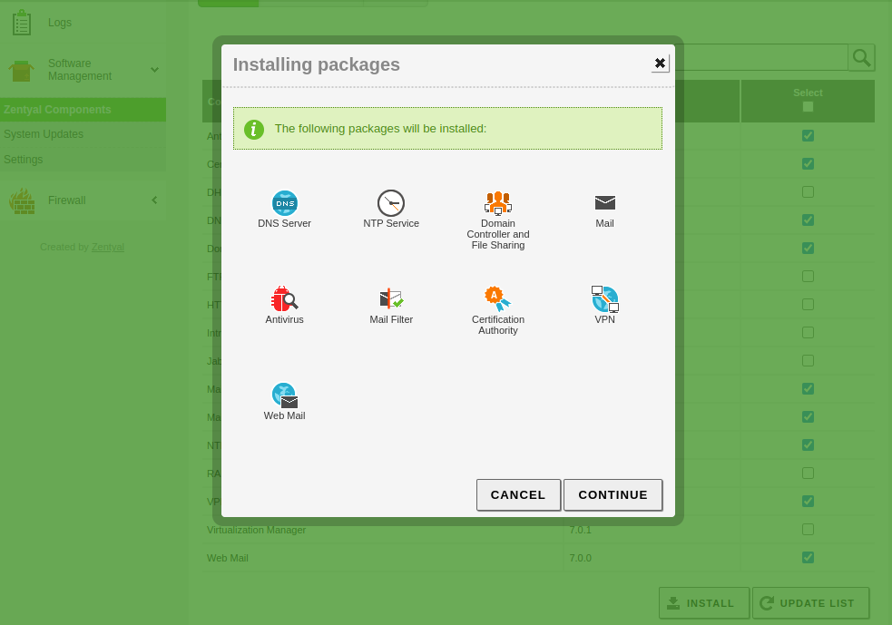
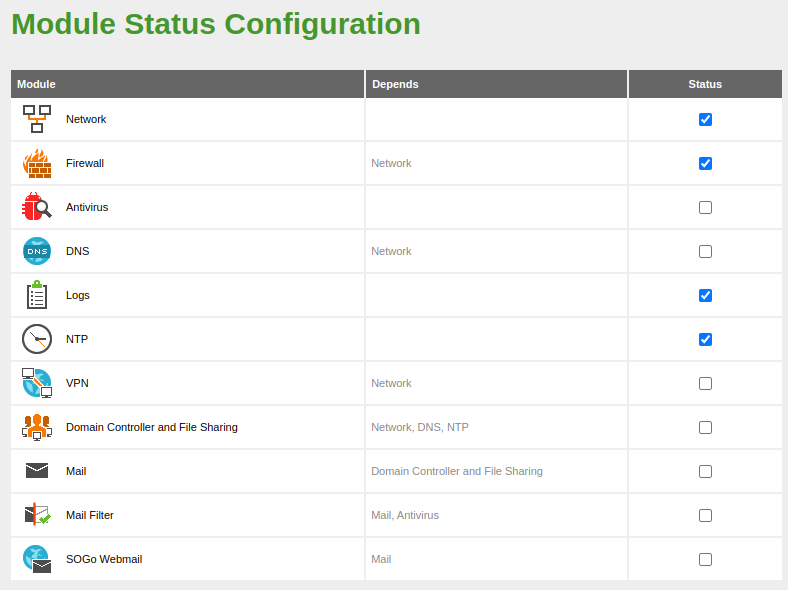
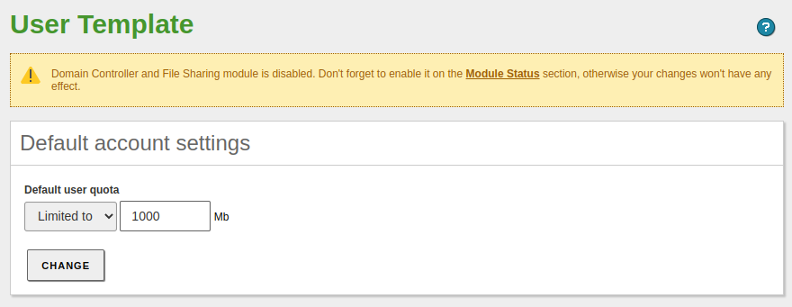
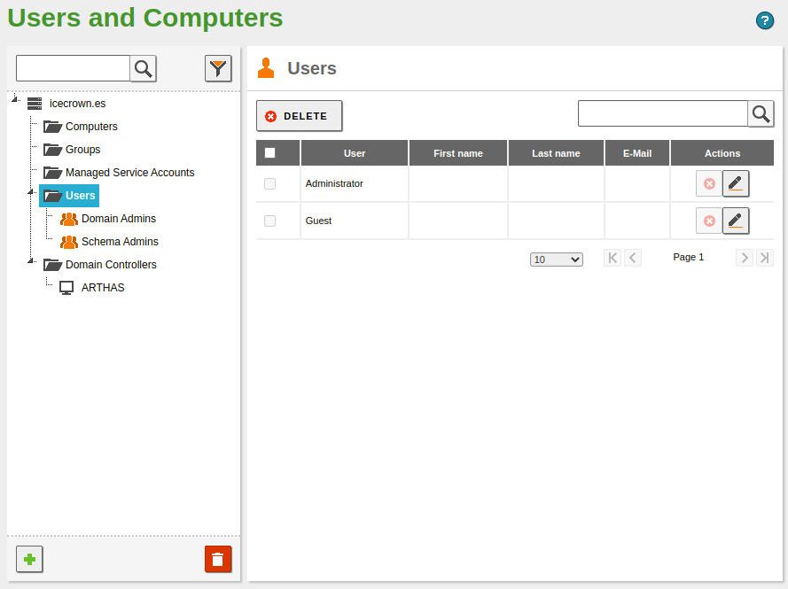
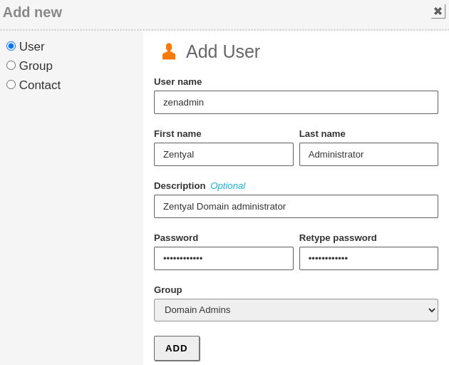
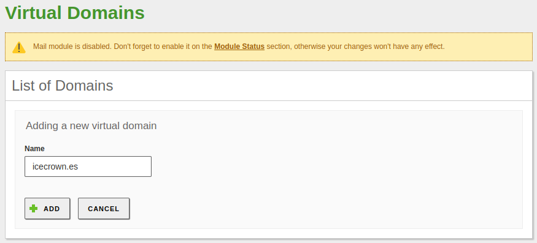
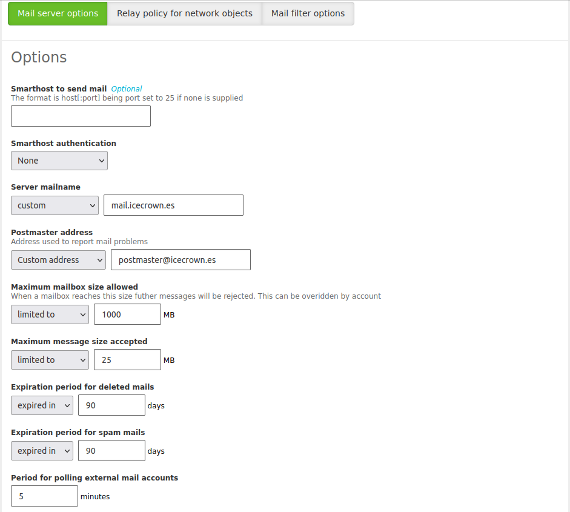
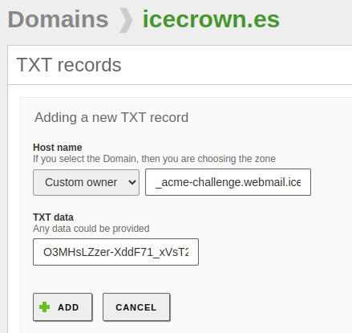

# Zentyal

A continuación se detalla tanto la instalación como configuración del sistema operativo así como de los módulos.


## Objetivo

El objetivo principal de este servidor es configurar como servidor de correo, aunque también se usará para compartir recursos compartidos, los cuales serán accesibles a través del módulo de OpenVPN.

Las acciones que se realizarán son:

1. Instalación del sistema operativo.
2. Instalación y configuración de los siguientes módulos:
    * Network
    * Logs
    * Firewall
    * Software
    * NTP
    * DNS
    * Controlador de dominio
    * Correo
    * Webmail
    * Antivirus
    * Mailfilter
3. Configuración de varios volúmenes EBS (discos) adicionales para los buzones de correo así como para los recursos compartidos.
4. Se securizará el servicio de correo usando: SPF, DKIM y DMARC.

Adicionalmente, mencionar que la información que estableceré para la configuración del servidor será:

* **Nombre del servidor**: arthas
* **Dominio**: icecrown.es
* **IP:** 10.0.1.200/24
* **Tipo de red:** Interna


## Requisitos

* Antes de proceder a realizar las acciones que se explican en las siguientes secciones, es recomendable tener configurado el entorno de AWS tal y como se describe en [este] enlace. Si bien es cierto que no es necesario, es recomendable.
* El despliegue que se explica en este documento sólo ha sido probado sobre el proveedor cloud de Amazon (AWS).
* Se requiere que la instancia (servidor) tenga un mínimo de 2vCPU y 4GB de RAM, ya que el módulo de Antivirus consume bastante recursos.
* El sistema operativo **debe** de la instancia tiene que ser **Ubuntu 20.04 LTS**.


## Consideraciones

* En caso de no tener conocimientos robustos sobre Linux, es recomendable usar la versión comercial, ya que suele venir con acceso a soporte, lo cual puede ser muy útil ante incidencias o actualizaciones de versiones.
* La estabilidad del módulo de red es imperativa, ya que no se tiene acceso físico al servidor para resolver incidencias de dicha índole. Algunas recomendaciones son:
    * Definir previamente la configuración que se establecerá.
    * Asignar una IP concreta a la interfaz de red de la instancia.
    * Establecer la IP de la instancia como estática en Zentyal.
    * Se recomienda configurar la tarjeta de red en Zentyal como interna, así se evita bloquearse a uno mismo durante la configuración inicial.


## Instalación

Para la instalación, se usará [este] script disponible por parte de Zentyal. Mencionar que como es lógico, se instalará Zentyal sin entorno gráfico, ya que no tenemos acceso físico a la instancia.

[este]: https://doc.zentyal.org/es/installation.html#instalacion-sobre-ubuntu-20-04-lts-server-o-desktop

Las acciones a realizar son:

1. Nos conectamos a la instancia usando la clave privada que nos hemos descargado (key pair):

    ```
    ssh -i ~/.aws/keys/KP-Prod-Zentyal.pem ubuntu@arthas.icecrown.es
    ```

2. Actualizamos el sistema:

    ```
    sudo apt update
    sudo apt dist-upgrade -y
    ```

3. Nos creamos un usuario administrador adicional, el cual usaremos para administrar Zentyal - al menos inicialmente - :

    ```
    sudo useradd -m -d /home/djoven -G sudo -s /bin/bash djoven
    sudo passwd djoven
    ```

4. Nos logeamos con dicho usuario y le añadimos nuestra clave pública de SSH para que podamos conectarnos a través de SSH:

    ```
    su - djoven
    mkdir -v .ssh
    touch .ssh/authorized_keys
    vim .ssh/authorized_keys
    ```

5. Creamos un directorio donde almacenaremos el script de instalación de Zentyal:

    ```
    mkdir /opt/zentyal-install
    cd /opt/zentyal-install
    ```

6. Nos descargamos el script y le damos los permisos adecuados:

    ```
    sudo wget https://zentyal.com/zentyal_installer.sh
    sudo chmod 0750 zentyal_installer.sh
    ```

7. Instalamos Zentyal a través del script, contestando `n` a la pregunta sobre la instalación del entorno gráfico:

    ```
    ./zentyal_installer.sh
    Do you want to install the Zentyal Graphical environment? (n|y) n
    ```

    El script nos instalará los siguientes paquetes:

    * zentyal (meta-paquete)
    * zentyal-core
    * zentyal-software

8. Una vez que el script haya terminado, nos logearemos al panel de administración de Zentyal: <https://arthas.icecrown.es:8443>

9. Nos logeamos con el usuario administrador que hemos creado previamente, que en mi caso es `djoven`.

10. En el wizard de configuración inicial, únicamente instalaremos el módulo de [firewall], de esta forma se nos instalará como dependencia el módulo de [network] a su vez.


[firewall]: https://doc.zentyal.org/es/firewall.html
[network]: https://doc.zentyal.org/es/firststeps.html#configuracion-basica-de-red-en-zentyal

11. Configuramos la red como `estática` e `internal` tal y como se ha explicado en el apartado de *consideraciones*.

    **NOTA:** Es posible que al terminar de configurarse la red, se nos reproduzca el bug reportado [aquí]. Si es el caso, simplemente modificar la URL por: <https://arthas.icecrown.es:8443>


12. Una vez que se haya terminado de guardar cambios, podremos empezar a gestionar Zentyal a través del dashboard.


13. Finalmente, antes de procedes a la configuración, realizaremos las siguientes comprobaciones para confirmar la estabilidad del servidor en AWS:

    1. Que los módulos estén habilitados.
    2. Que la máquina tiene acceso a Internet.

        ```
        ping google.es
        ```

    3. Que no haya habido ningún error en el log `/var/log/zentyal/zentyal.log`. A continuación un ejemplo de los registros que fueron registrados en nuestro archivo de log:

        ```
        2022/10/23 08:17:51 DEBUG> PAM.pm:83 Authen::Simple::PAM::check - Successfully authenticated user 'djoven' using service 'zentyal'.
        2022/10/23 08:20:29 INFO> install-packages:61 main:: - Starting package installation process
        2022/10/23 08:20:39 INFO> Base.pm:256 EBox::Module::Base::saveConfig - Saving config for module: network
        2022/10/23 08:20:39 INFO> Base.pm:256 EBox::Module::Base::saveConfig - Saving config for module: network
        2022/10/23 08:20:40 INFO> Service.pm:965 EBox::Module::Service::restartService - Restarting service for module: network
        2022/10/23 08:20:43 INFO> Base.pm:256 EBox::Module::Base::saveConfig - Saving config for module: network
        2022/10/23 08:20:43 INFO> Base.pm:256 EBox::Module::Base::saveConfig - Saving config for module: firewall
        2022/10/23 08:20:43 INFO> Base.pm:231 EBox::Module::Base::save - Restarting service for module: firewall
        2022/10/23 08:20:44 INFO> Service.pm:965 EBox::Module::Service::restartService - Restarting service for module: firewall
        2022/10/23 08:20:49 INFO> install-packages:121 main:: - Package installation process finished
        2022/10/23 08:23:15 INFO> Network.pm:89 EBox::Network::CGI::Wizard::Network::_processWizard - Configuring ens5 as 10.0.1.200/255.255.255.0
        2022/10/23 08:23:15 INFO> Network.pm:93 EBox::Network::CGI::Wizard::Network::_processWizard - Adding gateway 10.0.1.1 for iface ens5
        2022/10/23 08:23:15 INFO> Network.pm:108 EBox::Network::CGI::Wizard::Network::_processWizard - Adding nameserver 8.8.8.8
        2022/10/23 08:23:15 INFO> Network.pm:114 EBox::Network::CGI::Wizard::Network::_processWizard - Adding nameserver 8.8.4.4
        2022/10/23 08:23:17 INFO> GlobalImpl.pm:571 EBox::GlobalImpl::saveAllModules - First installation, enabling modules: network firewall webadmin logs audit firewall
        2022/10/23 08:23:17 INFO> GlobalImpl.pm:574 EBox::GlobalImpl::saveAllModules - Enabling module network
        2022/10/23 08:23:17 INFO> GlobalImpl.pm:574 EBox::GlobalImpl::saveAllModules - Enabling module firewall
        2022/10/23 08:23:17 INFO> GlobalImpl.pm:574 EBox::GlobalImpl::saveAllModules - Enabling module webadmin
        2022/10/23 08:23:18 INFO> GlobalImpl.pm:574 EBox::GlobalImpl::saveAllModules - Enabling module logs
        2022/10/23 08:23:18 INFO> GlobalImpl.pm:574 EBox::GlobalImpl::saveAllModules - Enabling module audit
        2022/10/23 08:23:19 INFO> GlobalImpl.pm:574 EBox::GlobalImpl::saveAllModules - Enabling module firewall
        2022/10/23 08:23:19 INFO> Base.pm:231 EBox::Module::Base::save - Restarting service for module: network
        2022/10/23 08:23:23 INFO> Base.pm:231 EBox::Module::Base::save - Restarting service for module: firewall
        2022/10/23 08:23:23 INFO> Base.pm:231 EBox::Module::Base::save - Restarting service for module: logs
        2022/10/23 08:23:23 INFO> Base.pm:231 EBox::Module::Base::save - Restarting service for module: audit
        2022/10/23 08:23:23 INFO> Base.pm:231 EBox::Module::Base::save - Restarting service for module: firewall
        2022/10/23 08:23:24 INFO> Base.pm:231 EBox::Module::Base::save - Restarting service for module: sysinfo
        2022/10/23 08:23:25 INFO> GlobalImpl.pm:660 EBox::GlobalImpl::saveAllModules - Saving configuration: webadmin
        2022/10/23 08:23:25 INFO> Base.pm:231 EBox::Module::Base::save - Restarting service for module: webadmin
        2022/10/23 08:24:51 INFO> Index.pm:187 EBox::Dashboard::CGI::Index::masonParameters - dashboard1
        ```

    4. Reiniciamos el servidor para asegurarnos de que es capaz de iniciar sin ningún tipo de problema de red.

        ```
        reboot
        ```

    5. Finalmente, volvemos a conectarnos tanto vía SSH como desde la GUI de Zentyal para confirmar que la instalación de Zentyal fue exitosa y que es estable.


### General

Antes de proceder a instalar y configurar los módulos, lo que haremos será establecer un serie de configuraciones generales.

1. Lo primero que haremos será desde el panel de administración de Zentyal el idioma, puerto. Para ello iremos a `System -> General`:


2. Después, desde el mismo lugar, establecemos el nombre del servidor y su dominio:

    **NOTA:** En el momento que habilitemos el módulo de controlador de dominio, estos 2 valores no podrán cambiar.


Por último, realizaremos una serie de acciones adicionales **opcionales** para optimizar recursos así como mejorar la administración del servidor a través de la CLI.

1. Desinstalaremos SNAP, ya que no se utiliza en Zentyal:

    1. Paramos el servicio:

        ```
        sudo systemctl stop snapd snapd.socket
        ```

    2. Eliminamos el paquete:

        ```
        sudo apt remove --purge snapd
        ```

    3. Eliminamos los directorios que quedan en el sistema de archivos:

        ```
        sudo rm -vf /root/snap/
        ```

2. Habilitamos el color del prompt para mejorar la legibilidad mientras realizamos tareas desde la CLI.

    1. Para habilitar el color en los usuarios existentes:

        ```
        for user in /root /home/ubuntu /home/djoven; do sudo sed -i 's/#force_color_prompt/force_color_prompt/' $user/.bashrc; done
        ```

    2. Para habilitar el color para futuros usuarios que creemos:

        ```
        sudo sed -i 's/#force_color_prompt/force_color_prompt/' /etc/skel/.bashrc
        ```

3. Establecemos una serie de opciones adicionales relativas al historial de los usuarios (comando history).

    1. Añadimos las opciones a los usuarios existentes del sistema:

        ```
        for user in /root /home/ubuntu /home/djoven; do

        sudo cat <<EOF >> $user/.bashrc
        ## Custom options
        HISTTIMEFORMAT="%F %T  "
        PROMPT_COMMAND='history -a'
        HISTIGNORE='clear:history'
        EOF

            sudo sed -i -e 's/HISTCONTROL=.*/HISTCONTROL=ignoreboth/' \
                        -e 's/HISTSIZE=.*/HISTSIZE=1000/' \
                        -e 's/HISTFILESIZE=.*/HISTFILESIZE=2000/' \
                    $user/.bashrc
        done
        ```

    2. Realizamos las mismas acciones pero para los futuros usuarios:

        ```
        sudo cat <<EOF >> /etc/skel/.bashrc
        ## Custom options
        HISTTIMEFORMAT="%F %T  "
        PROMPT_COMMAND='history -a'
        HISTIGNORE='clear:history'
        EOF

        sudo sed -i -e 's/HISTCONTROL=.*/HISTCONTROL=ignoreboth/' \
                        -e 's/HISTSIZE=.*/HISTSIZE=1000/' \
                        -e 's/HISTFILESIZE=.*/HISTFILESIZE=2000/' \
                    /etc/skel/.bashrc
        ```

4. Añadimos una configuración personalizada sencilla para el editor de textos `vim` tanto para los usuarios existentes como futuros:

    ```
    for user in /root /home/ubuntu /home/djoven /etc/skel; do

    sudo cat <<EOF > $user/.vimrc
    set tabstop=2
    syntax on
    set number
    color desert
    set shiftwidth=2
    auto FileType yaml,yml setlocal ai ts=2 sw=2 et
    EOF

    done
    ```


### Volúmenes EBS adicionales

En caso de que hayamos añadido volúmenes EBS adicionales como ha sido mi caso para los buzones de correo y recursos compartidos, procederemos a realizar las siguientes acciones.

1. Listamos los volúmenes:

    ```
    lsblk
        NAME         MAJ:MIN RM  SIZE RO TYPE MOUNTPOINT
        nvme1n1      259:0    0   10G  0 disk
        nvme0n1      259:1    0   30G  0 disk
        ├─nvme0n1p1  259:2    0 29.9G  0 part /
        ├─nvme0n1p14 259:3    0    4M  0 part
        └─nvme0n1p15 259:4    0  106M  0 part /boot/efi
        nvme2n1      259:5    0   10G  0 disk
    ```

2. En los volúmenes `nvme1n1` y `nvme2n1` creamos una única partición que ocupe todo el disco:

    ```
    for disk in nvme1n1 nvme2n1; do
        echo -e 'n\np\n\n\n\nt\n8e\nw' | sudo fdisk /dev/$disk
    done
    ```

3. Revisamos que se hayan creado las particiones correctamente:

    ```
    lsblk
        NAME         MAJ:MIN RM  SIZE RO TYPE MOUNTPOINT
        nvme1n1      259:0    0   10G  0 disk
        └─nvme1n1p1  259:7    0   10G  0 part
        nvme0n1      259:1    0   30G  0 disk
        ├─nvme0n1p1  259:2    0 29.9G  0 part /
        ├─nvme0n1p14 259:3    0    4M  0 part
        └─nvme0n1p15 259:4    0  106M  0 part /boot/efi
        nvme2n1      259:5    0   10G  0 disk
        └─nvme2n1p1  259:8    0   10G  0 part
    ```

4. Establecemos como sistema de archivos `ext4` a cada partición:

    ```
    for disk in nvme1n1p1 nvme2n1p1; do
        sudo mkfs -t ext4 /dev/$disk
    done
    ```

5. Volvemos a revisar que todo haya ido bien:

    ```
    lsblk -f
        NAME         FSTYPE LABEL           UUID                                 FSAVAIL FSUSE% MOUNTPOINT
        nvme1n1
        └─nvme1n1p1  ext4                   28e5471e-8fc1-48b5-8729-778c56a19b90
        nvme0n1
        ├─nvme0n1p1  ext4   cloudimg-rootfs 418a4763-c829-4fb6-b538-9a38158da803   26.8G     7% /
        ├─nvme0n1p14
        └─nvme0n1p15 vfat   UEFI            CBF7-D252                              99.2M     5% /boot/efi
        nvme2n1
        └─nvme2n1p1  ext4                   e903ff6f-c431-4e3a-92a1-9f476c66b3be
    ```

6. Creamos los directorios donde se montarán ambos volúmenes EBS:

    ```
    sudo mkdir -v /home/samba /var/vmail
    ```

7. Obtenemos el identificador (UUID) de los volúmenes:

    ```
    sudo sudo blkid | egrep "nvme[12]n1p1"
        /dev/nvme2n1p1: UUID="28e5471e-8fc1-48b5-8729-778c56a19b90" TYPE="ext4" PARTUUID="558dd3b7-01"
        /dev/nvme1n1p1: UUID="e903ff6f-c431-4e3a-92a1-9f476c66b3be" TYPE="ext4" PARTUUID="446d2929-01"
    ```

8. Establecemos en el archivo `/etc/fstab` el montaje de los volúmenes EBS:

    ```
    ## AWS EBS - Shares
    UUID=e903ff6f-c431-4e3a-92a1-9f476c66b3be	/home/samba	ext4	defaults,noexec,nodev,nosuid,usrquota,grpquota 0 2

    ## AWS EBS - Mailboxes
    UUID=28e5471e-8fc1-48b5-8729-778c56a19b90	/var/vmail	ext4	defaults,noexec,nodev,nosuid,usrquota,grpquota 0 2
    ```

9. Montamos los volúmenes:

    ```
    sudo mount -a
    ```

10. Confirmamos que se hayan montado bien: **TODO:** NO ESTÁ LA OPCIÓN DE QUOTAS

    ```
    mount | egrep 'nvme[12]n1p1'
        /dev/nvme2n1p1 on /var/vmail type ext4 (rw,nosuid,nodev,noexec,relatime)
        /dev/nvme1n1p1 on /home/samba type ext4 (rw,nosuid,nodev,noexec,relatime)
    ```


### Logs

Inicialmente, simplemente habilitaremos los dos 'dominios' que hay, aunque cambiaremos el tiempo de retención a 30 días para el firewall y 90 para los cambios del panel de administración así como login de los administradores.


### Firewall

Para la configuración de red que tenemos (interna) y los módulos que usaremos, las secciones del firewall que usaremos son:

* Filtering rules from internal networks to Zentyal
* Filtering rules from traffic comming out from Zentyal

Las políticas definidas por defecto en ambas secciones del firewall son seguras, no obstante, procederemos a añadir una regla de tipo `LOG` para las conexiones por SSH, ya que siempre es buena idea tener la mayor información posible sobre este servicio tan crítico. Para ello, iremos a `Firewall -> Packet Filter -> Filtering rules from internal networks to Zentyal`.


**Consideraciones:**

1. Es importante que la nueva regla vaya por encima de la regla que acepta la conexión SSH, de lo contrario nunca se ejecutará, ya que cuando una regla se cumple, no se siguen analizando el resto.
2. Recordad que a parte de este firewall, también tenemos el de AWS (Security Group asociado a la instancia), por lo que tendremos que asegurarnos que ambos firewall tienen las mismas reglas, aunque también se podría configurar en uno de ellos que se permita todo y que el otro se haga cargo de las reglas.


### Software

Una vez que tenemos la base del sistema configurado, procederemos a programar la hora de las actualizaciones automáticas así como a instalar todos los módulos que usaremos.

1. Desde el panel de administración, iremos a `Software Management -> Settings`, habilitaremos las actualizaciones automáticas e indicaremos una hora para las actualizaciones.

**NOTA:** Es conveniente que la hora sea posterior a posibles snapshots del servidor, así tenemos un punto de restauración estable, ya que hay posibilidades de que una actualización pudiera causar una incidencia.


Después, procederemos a instalar **únicamente** los módulos que vayamos a usar, para ello vamos a `Software Management -> Zentyal Components`.




### NTP

El primero de los módulos que hemos instalado que vamos a configurar es [NTP], en el estableceremos la zona horaria y los servidores NTP oficiales más próximos geográficamente.

[NTP]: https://doc.zentyal.org/es/ntp.html

1. Vamos a `System -> Date/Time` y establecemos la zona horaria.


2. Habilitamos la opción que permite sincronizar la hora con servidores externos.


3. Modificamos los servidores NTP establecidos por defecto, por los oficiales que tenemos disponibles en [esta](https://www.pool.ntp.org/en) web.


4. Finalmente, habilitamos el módulo de NTP desde `Modules Status`.




### DNS

El siguiente módulo que procederemos a configurar será el [DNS].

[DNS]: https://doc.zentyal.org/es/dns.html

1. Creamos el dominio, el cual deberá ser el mismo que el que configuramos inicialmente desde `System -> General`. Para ello, vamos desde el menú lateral derecha a `DNS`.


2. Después, comprobaremos que la IP se haya creado con éxito al dominio, para ello vamos al campo `Domain IP Addresses` del dominio recién creado:


3. Lo siguiente que revisaremos será que la IP del nombre del servidor también haya sido creado con éxito. En este caso, el campo es `Hostnames -> IP Address`:


4. A continuación, en mi caso concreto crearé un alias varios alias para el nombre del servidor, que serán: `mail`,  `webmail` y `ns01`. La ubicación para su creación es: `Hostnames -> Alias`.


5. En mi caso, como DNS forwarders estableceré los de Google.


6. Con todo lo anterior, el módulo quedaría configurado inicialmente, por lo que podemos habilitarlo.


7. Lo siguiente que haremos será comprobar que podemos resolver los registros DNS configurados desde el propio servidor.

    ```
    ## Para el dominio
    dig icecrown.es

        ## Ejemplo de resultado:
        ; <<>> DiG 9.16.1-Ubuntu <<>> icecrown.es
        ;; global options: +cmd
        ;; Got answer:
        ;; ->>HEADER<<- opcode: QUERY, status: NOERROR, id: 38170
        ;; flags: qr aa rd ra; QUERY: 1, ANSWER: 1, AUTHORITY: 0, ADDITIONAL: 1

        ;; OPT PSEUDOSECTION:
        ; EDNS: version: 0, flags:; udp: 4096
        ; COOKIE: 8e30e37c82f9261b01000000635d864ec4a39fbb0eda9559 (good)
        ;; QUESTION SECTION:
        ;icecrown.es.			IN	A

        ;; ANSWER SECTION:
        icecrown.es.		259200	IN	A	10.0.1.200

        ;; Query time: 0 msec
        ;; SERVER: 127.0.0.1#53(127.0.0.1)
        ;; WHEN: Sat Oct 29 22:00:14 CEST 2022
        ;; MSG SIZE  rcvd: 84

    ## Para el hostname del servidor
    dig arthas.icecrown.es

        ## Ejemplo de resultado:
        ; <<>> DiG 9.16.1-Ubuntu <<>> arthas.icecrown.es
        ;; global options: +cmd
        ;; Got answer:
        ;; ->>HEADER<<- opcode: QUERY, status: NOERROR, id: 38137
        ;; flags: qr aa rd ra; QUERY: 1, ANSWER: 1, AUTHORITY: 0, ADDITIONAL: 1

        ;; OPT PSEUDOSECTION:
        ; EDNS: version: 0, flags:; udp: 4096
        ; COOKIE: 771f8d7c27361c9f01000000635d8666cd4a4f18e568f925 (good)
        ;; QUESTION SECTION:
        ;arthas.icecrown.es.		IN	A

        ;; ANSWER SECTION:
        arthas.icecrown.es.	259200	IN	A	10.0.1.200

        ;; Query time: 0 msec
        ;; SERVER: 127.0.0.1#53(127.0.0.1)
        ;; WHEN: Sat Oct 29 22:00:38 CEST 2022
        ;; MSG SIZE  rcvd: 91

    ## Para los alias
    for domain in mail webmail ns01; do dig @127.0.0.1 $domain.icecrown.es; done

        ## Ejemplo de resultado:
        ; <<>> DiG 9.16.1-Ubuntu <<>> @127.0.0.1 mail.icecrown.es
        ; (1 server found)
        ;; global options: +cmd
        ;; Got answer:
        ;; ->>HEADER<<- opcode: QUERY, status: NOERROR, id: 4824
        ;; flags: qr aa rd ra; QUERY: 1, ANSWER: 2, AUTHORITY: 0, ADDITIONAL: 1

        ;; OPT PSEUDOSECTION:
        ; EDNS: version: 0, flags:; udp: 4096
        ; COOKIE: bc091efa7b76142d01000000635d86ddaca37ee3537ce8c1 (good)
        ;; QUESTION SECTION:
        ;mail.icecrown.es.		IN	A

        ;; ANSWER SECTION:
        mail.icecrown.es.	259200	IN	CNAME	arthas.icecrown.es.
        arthas.icecrown.es.	259200	IN	A	10.0.1.200

        ;; Query time: 0 msec
        ;; SERVER: 127.0.0.1#53(127.0.0.1)
        ;; WHEN: Sat Oct 29 22:02:37 CEST 2022
        ;; MSG SIZE  rcvd: 110


        ; <<>> DiG 9.16.1-Ubuntu <<>> @127.0.0.1 webmail.icecrown.es
        ; (1 server found)
        ;; global options: +cmd
        ;; Got answer:
        ;; ->>HEADER<<- opcode: QUERY, status: NOERROR, id: 64018
        ;; flags: qr aa rd ra; QUERY: 1, ANSWER: 2, AUTHORITY: 0, ADDITIONAL: 1

        ;; OPT PSEUDOSECTION:
        ; EDNS: version: 0, flags:; udp: 4096
        ; COOKIE: ec57e8bf6ff0a2b201000000635d86dd3786d805fd489b98 (good)
        ;; QUESTION SECTION:
        ;webmail.icecrown.es.		IN	A

        ;; ANSWER SECTION:
        webmail.icecrown.es.	259200	IN	CNAME	arthas.icecrown.es.
        arthas.icecrown.es.	259200	IN	A	10.0.1.200

        ;; Query time: 0 msec
        ;; SERVER: 127.0.0.1#53(127.0.0.1)
        ;; WHEN: Sat Oct 29 22:02:37 CEST 2022
        ;; MSG SIZE  rcvd: 113


        ; <<>> DiG 9.16.1-Ubuntu <<>> @127.0.0.1 ns01.icecrown.es
        ; (1 server found)
        ;; global options: +cmd
        ;; Got answer:
        ;; ->>HEADER<<- opcode: QUERY, status: NOERROR, id: 31130
        ;; flags: qr aa rd ra; QUERY: 1, ANSWER: 2, AUTHORITY: 0, ADDITIONAL: 1

        ;; OPT PSEUDOSECTION:
        ; EDNS: version: 0, flags:; udp: 4096
        ; COOKIE: a140667468c77ab801000000635d86dd5cab7a79b2a70aa0 (good)
        ;; QUESTION SECTION:
        ;ns01.icecrown.es.		IN	A

        ;; ANSWER SECTION:
        ns01.icecrown.es.	259200	IN	CNAME	arthas.icecrown.es.
        arthas.icecrown.es.	259200	IN	A	10.0.1.200

        ;; Query time: 0 msec
        ;; SERVER: 127.0.0.1#53(127.0.0.1)
        ;; WHEN: Sat Oct 29 22:02:37 CEST 2022
        ;; MSG SIZE  rcvd: 110
    ```

8. Finalmente, en caso de que queramos que Zentyal sea el servidor DNS autoritarivo para el dominio, tendremos que establecer en el proveedor donde gestionemos nuestro dominio los registos `NS`, de lo contrario, tendremos que crear los registros DNS que queremos que sean públicos en dicho proveedor.

En mi caso, tengo el dominio contratado y gestionado por AWS Route 53. Además, he usado los siguientes registros: `arthas` y `ns01` como registros `NS`.

Desde `Registered domains` en AWS Route53 hay que establecer los registros `NS` mencionados.


Y después, modificar los de la propia zona. **NOTA:** Pueden tardar varios minutos en actualizarse los registros indicados en la información de la zona.

**TODO**


### Controlador de dominio

Una vez tenemos el módulo de DNS configurado, es el turno de configurar el [controlador de dominio]. En mi caso concreto, haré las siguientes ajustes, aunque son totalmente opciones y se puede directamente habilitar el módulo (paso 4).

[controlador de dominio]: https://doc.zentyal.org/es/directory.html

1. Modificaré la descripción del servidor desde `Domain -> Server description`.


2. Después, estableceré como quota por defecto para los directorios personales de los usuarios 1GB.



3. Me aseguraré de que la opción que permite a los usuarios acceder a través de SSH usando PAM está deshabilitada.


4. Habilitamos el módulo:


5. Una vez que el módulo haya sido guardado y por ende, el controlador de dominio provisionado, comprobaremos que la estructura por defecto se nos ha creado con éxito. Para ello, vamos a `Users and Computers -> Manage`



6. La última acción que realizaré sobre este módulo por el momento será crear un nuevo usuario administrador del dominio, en mi caso se llamará `zenadmin` y será miembro del grupo de administradores `Domain Admins`.




### Correo

Teniendo configurado el módulo de controlador de dominio, ya podremos configurar el módulo de [correo], ya que por dependencia requiere que el anterior esté habilitado previamente.

[correo]: https://doc.zentyal.org/es/mail.html

1. Lo primero que haremos será crear el dominio virtual de correo, que será el mismo que el dominio. Desde el menú lateral izquierdo iremos a `Mail -> Virtual Mail Domains`.



2. Después, desde `Mail -> General`  estableceré una serie de configuraciones restrictivas que afectarán a los usuarios, aunque son opciones.



3. Opcionalmente, también estableceré que sólo pueda POP3 e IMAP con TLS y deshabilitaré los scripts de Sieve.


4. Nuevamente, de forma opcional, incrementaré la seguridad del servicio, habilitaré la lista gris. Para ello, iremos a `Mail -> Greylist`.


5. Lo siguiente que haremos será habilitar el módulo.


6. Crearé el usuario postmaster especificado en el paso 2 desde `Users and Computers -> Manage`.


Finalmente, probaremos con un cliente de correo (Thunderbird en mi caso) a que podemos configurar la cuenta del usuario `postmaster`, no obstante, hasta que no tengamos el servicio de correo totalmente securizado, omitiremos la creación del resto de usuarios así como las pruebas de envio y recepción de emails tanto desde cuentas internas como externas.

1. Configuramos una nueva cuenta en Thunderbird:


2. Establecemos los datos de conexión con el servicio SMTP e IMAP:


3. Tras confirmar la configuración, nos saldrá un mensaje de advertencia por el certificado, el cual es normal, ya que es un certificado auto-firmado por Zentyal.


4. Finalmente, tras confirmar la excepción de seguridad, debería de cargarnos nuestra cuenta.


### Webmail

El siguiente módulo a configurar será el Webmail (Sogo). Este módulo es muy sencillo de configurar.

[Webmail]: https://doc.zentyal.org/es/mail.html#cliente-de-webmail

1. Opcionalmente, habilitamos [ActiveSync]. Para ello iremos a `Mail -> ActiveSync`.


[ActiveSync]: https://doc.zentyal.org/es/mail.html#soporte-activesync

2. Habilitamos el módulo:


3. Comprobamos que tenemos acceso a la página de login. **Importante**, al usar el protocolo HTTPS y tener configurado por defecto un certificado auto-firmado, nos mostrará un mensaje de advertencia.


4. Finalmente, nos logeamos con el usuario `postmaster` para confirmar que la conexión es estable.


Opcionalmente, habilitaré la configuración de los mensajes automáticos de las vacaciones, ya que por defecto está deshabilitado.

1. Creamos el diretorio que hará de los cambios sobre las plantillas de configuración (stubs) sean permanentes:

    ```
    sudo mkdir -vp /etc/zentyal/stubs/sogo
    ```

2. Copiamos la plantilla de configuración:

    ```
    sudo cp -v /usr/share/zentyal/stubs/sogo/sogo.conf.mas /etc/zentyal/stubs/sogo/
    ```

3. Establecemos el parámetro `SOGoVacationEnabled` a `YES` en la plantilla recién copiada:

    ```
    sudo sed -i 's/SOGoVacationEnabled.*/SOGoVacationEnabled = YES;/' /etc/zentyal/stubs/sogo/sogo.conf.mas
    ```

4. Reiniciamos el módulo de Webmail para aplicar el cambio:

    ```
    sudo zs sogo restart
    ```

5. Finalmente, nos logeamos con el usuario nuevamente en el Webmail y comprobamos como desde `Preferences -> Mail -> ` ya tenemos disponible la opción.


También, de forma opcional, estableceré 8 workers en lugar de 15 en Sogo, así reduciré el uso de recursos. No obstante, dependiendo del número de usuarios recurrentes que usen el Webmail será necesario incrementar dicho valor, por lo que si preferís dejarlo por defecto por el momento también está bien.

1. Establecemos el valor, que en mi caso será `8` en el archivo de configuración `/etc/zentyal/sogo.conf`:

    ```
    sed -i 's/#sogod_prefork.*/sogod_prefork=8/' /etc/zentyal/sogo.conf
    ```

2. Reiniciamos el módulo de Webmail para aplicar el cambio:

    ```
    sudo zs sogo restart
    ```

3. Finalmente, comprobamos que únicamente se hayan creado 8 procesos para Sogo:

    ```
    ps -ef | grep sogod | head -1
        sogo       24430       1  0 00:40 ?        00:00:00 /usr/sbin/sogod -WOWorkersCount 8 -WOPidFile /var/run/sogo/sogo.pid -WOLogFile /var/log/sogo/sogo.log
    ```


### Certificados

Llegados a este punto y antes de proceder a la securización del servicio de correo, lo que haremos será generar los certificados de los módulos: `Webadmin`, `Correo` y `Webmail` usando una entidad certificadora (CA) reconocida, que en mi caso será [Let's Encrypt].

En mi caso concreto, en lugar de generar un único certificado que contenga los tres subdominios, generaré un certificado por subdominio, de esta forma, en caso de haber un problema con la renovación o de querer cambiar de subdominio para un módulo concreto, las acciones a realizar serán menos complejas.

Mencionar addicionalmente que en mi caso concreto, procederé a expedir los certificados usando un registro `TXT` en el DNS en lugar de usar el protocolo `HTTP`.

A continuación se indican las acciones a realizar antes de proceder a la generación de los certificados.

1. Instalaremos el paquete necesario para la generación de los certificados:

    ```
    sudo apt update
    sudo apt install certbot
    ```

2. Comprobaremos que desde el exterior podemos resolver los subdominios:

    ```
    dig arthas.icecrown.es @8.8.8.8
    dig mail.icecrown.es @8.8.8.8
    dig webmail.icecrown.es @8.8.8.8
    ```

Para generar el certificado para el **Webadmin (panel de administración)** realizaremos lo siguiente:

1. Generaremos el certificado:

    ```
    certbot certonly --manual --preferred-challenges dns -m it.infra@icecrown.es -d arthas.icecrown.es --agree-tos
    ```

    Un ejemplo del resultado:

    ```
    Saving debug log to /var/log/letsencrypt/letsencrypt.log
    Plugins selected: Authenticator manual, Installer None
    Obtaining a new certificate
    Performing the following challenges:
    dns-01 challenge for arthas.icecrown.es

    - - - - - - - - - - - - - - - - - - - - - - - - - - - - - - - - - - - - - - - -
    NOTE: The IP of this machine will be publicly logged as having requested this
    certificate. If you're running certbot in manual mode on a machine that is not
    your server, please ensure you're okay with that.

    Are you OK with your IP being logged?
    - - - - - - - - - - - - - - - - - - - - - - - - - - - - - - - - - - - - - - - -
    (Y)es/(N)o: yes

    - - - - - - - - - - - - - - - - - - - - - - - - - - - - - - - - - - - - - - - -
    Please deploy a DNS TXT record under the name
    _acme-challenge.arthas.icecrown.es with the following value:

    E4arl9mX3nv4ljiIySbZtZmzA_8vC7dN1Nbg9RmT6AQ

    Before continuing, verify the record is deployed.
    - - - - - - - - - - - - - - - - - - - - - - - - - - - - - - - - - - - - - - - -
    Press Enter to Continue
    ```

2. Sin cerrar la terminal donde nos pide que creemos el registro `TXT`, vamos al panel de administración de Zentyal y añadimos el registro desde `DNS -> icecrown.es -> TXT records`:

    

3. Revisamos que se pueda resolver desde fuera el nuevo registro:

    ```
    dig TXT _acme-challenge.webmail.icecrown.es @8.8.8.8 +short
        "E4arl9mX3nv4ljiIySbZtZmzA_8vC7dN1Nbg9RmT6AQ"
    ```

4. De vuelta a la terminal, confirmamos la validación del certificado. Si todo va bien, nos mostrará un resultado como el siguiente:

    ```
    IMPORTANT NOTES:
    - Congratulations! Your certificate and chain have been saved at:
    /etc/letsencrypt/live/arthas.icecrown.es/fullchain.pem
    Your key file has been saved at:
    /etc/letsencrypt/live/arthas.icecrown.es/privkey.pem
    Your cert will expire on 2023-01-28. To obtain a new or tweaked
    version of this certificate in the future, simply run certbot
    again. To non-interactively renew *all* of your certificates, run
    "certbot renew"
    - If you like Certbot, please consider supporting our work by:

    Donating to ISRG / Let's Encrypt:   https://letsencrypt.org/donate
    Donating to EFF:                    https://eff.org/donate-le
    ```

5. Después, tendremos que modificar una plantilla de configuración ([stub](https://doc.zentyal.org/en/appendix-c.html#stubs)) del módulo, para que dicho cambio sea persistente ante futuras actualizaciones del módulo por parte de Zentyal. Para ello, crearemos el siguiente directorio:

    ```
    mkdir -vp /etc/zentyal/stubs/core
    ```

6. Copiaremos la plantilla a modificar:

    ```
    cp -v /usr/share/zentyal/stubs/core/nginx.conf.mas /etc/zentyal/stubs/core/
    ```

7. Modificaremos los siguientes parámetros de configuración de la plantilla copiada:

    ```
    ssl_certificate  /etc/letsencrypt/live/arthas.icecrown.es/fullchain.pem;
    ssl_certificate_key /etc/letsencrypt/live/arthas.icecrown.es/privkey.pem;
    ```

6. Opcionalmente, también podremos modificar algunos parámetros de configuración adicionales. El valor de estos parámetros han sido generados desde [esta](https://ssl-config.mozilla.org/#server=nginx&version=1.17.7&config=intermediate&openssl=1.1.1k&hsts=false&ocsp=false&guideline=5.6) página web.

    ```
    ## https://ssl-config.mozilla.org/#server=nginx&version=1.17.7&config=intermediate&openssl=1.1.1k&hsts=false&ocsp=false&guideline=5.6
    ## intermediate configuration
    ssl_protocols TLSv1.2 TLSv1.3;
    ssl_ciphers ECDHE-ECDSA-AES128-GCM-SHA256:ECDHE-RSA-AES128-GCM-SHA256:ECDHE-ECDSA-AES256-GCM-SHA384:ECDHE-RSA-AES256-GCM-SHA384:ECDHE-ECDSA-CHACHA20-POLY1305:ECDHE-RSA-CHACHA20-POLY1305:DHE-RSA-AES128-GCM-SHA256:DHE-RSA-AES256-GCM-SHA384;
    ssl_prefer_server_ciphers off;
    ```

7. Recargaremos Systemd y reiniciamos el módulo para que se apliquen los cambios:

    ```
    sudo systemctl daemon-reload
    sudo zs webadmin restart
    ```

8. Finalmente, nos logeamos al Webmail para confirmar que el certificado cargue correctamente.

    

Para generar el certificado para el **Webmail** realizaremos lo siguiente:

1. Generaremos el certificado:

    ```
    certbot certonly --manual --preferred-challenges dns -m it.infra@icecrown.es -d webmail.icecrown.es --agree-tos
    ```

    Un ejemplo del resultado:

    ```
    Saving debug log to /var/log/letsencrypt/letsencrypt.log
    Plugins selected: Authenticator manual, Installer None
    Obtaining a new certificate
    Performing the following challenges:
    dns-01 challenge for webmail.icecrown.es

    - - - - - - - - - - - - - - - - - - - - - - - - - - - - - - - - - - - - - - - -
    NOTE: The IP of this machine will be publicly logged as having requested this
    certificate. If you're running certbot in manual mode on a machine that is not
    your server, please ensure you're okay with that.

    Are you OK with your IP being logged?
    - - - - - - - - - - - - - - - - - - - - - - - - - - - - - - - - - - - - - - - -
    (Y)es/(N)o: yes

    - - - - - - - - - - - - - - - - - - - - - - - - - - - - - - - - - - - - - - - -
    Please deploy a DNS TXT record under the name
    _acme-challenge.webmail.icecrown.es with the following value:

    O3MHsLZzer-XddF71_xVsT2tjAMVw6Jzri2pfzI5umk

    Before continuing, verify the record is deployed
    ```

2. Sin cerrar la terminal donde nos pide que creemos el registro `TXT`, vamos al panel de administración de Zentyal y añadimos el registro desde `DNS -> icecrown.es -> TXT records`:

    

3. Revisamos que se pueda resolver desde fuera:

    ```
    dig TXT _acme-challenge.webmail.icecrown.es @8.8.8.8 +short
        "O3MHsLZzer-XddF71_xVsT2tjAMVw6Jzri2pfzI5umk"
    ```

4. De vuelta a la terminal, confirmamos la validación del certificado. Si todo va bien, nos mostrará un resultado como el siguiente:

    ```
    IMPORTANT NOTES:
    - Congratulations! Your certificate and chain have been saved at:
    /etc/letsencrypt/live/webmail.icecrown.es/fullchain.pem
    Your key file has been saved at:
    /etc/letsencrypt/live/webmail.icecrown.es/privkey.pem
    Your cert will expire on 2023-01-28. To obtain a new or tweaked
    version of this certificate in the future, simply run certbot
    again. To non-interactively renew *all* of your certificates, run
    "certbot renew"
    - If you like Certbot, please consider supporting our work by:

    Donating to ISRG / Let's Encrypt:   https://letsencrypt.org/donate
    Donating to EFF:                    https://eff.org/donate-le
    ```

5. Después, modificaremos los siguientes parámetros en el archivo de configuración `/etc/apache2/sites-available/default-ssl.conf` para establecer el nuevo certificado:

    ```
    SSLCertificateFile  /etc/letsencrypt/live/webmail.icecrown.es/fullchain.pem
    SSLCertificateKeyFile /etc/letsencrypt/live/webmail.icecrown.es/privkey.pem
    ```

6. Opcionalmente, también podremos modificar algunos parámetros de configuración adicionales. El valor de estos parámetros han sido generados desde [esta](https://ssl-config.mozilla.org/#server=apache&version=2.4.41&config=intermediate&openssl=1.1.1k&hsts=false&ocsp=false&guideline=5.6) página web.

    ```
    # https://ssl-config.mozilla.org/#server=apache&version=2.4.41&config=intermediate&openssl=1.1.1k&hsts=false&ocsp=false&guideline=5.6
    # intermediate configuration
    SSLProtocol             all -SSLv3 -TLSv1 -TLSv1.1
    SSLCipherSuite          ECDHE-ECDSA-AES128-GCM-SHA256:ECDHE-RSA-AES128-GCM-SHA256:ECDHE-ECDSA-AES256-GCM-SHA384:ECDHE-RSA-AES256-GCM-SHA384:ECDHE-ECDSA-CHACHA20-POLY1305:ECDHE-RSA-CHACHA20-POLY1305:DHE-RSA-AES128-GCM-SHA256:DHE-RSA-AES256-GCM-SHA384
    SSLHonorCipherOrder     off
    SSLSessionTickets       off
    ```

7. Reiniciamos el servicio para que se apliquen los cambios:

    ```
    sudo systemctl restart apache2
    ```

    **NOTA:** No es necesario reiniciar el módulo de Sogo, ya que Zentyal por el momento no gestiona este archivo de configuración.

8. Finalmente, nos logeamos al Webmail para confirmar que el certificado cargue correctamente.

    

Para generar el certificado para el **Correo** realizaremos lo siguiente:

1. Generaremos el certificado:

    ```
    certbot certonly --manual --preferred-challenges dns -m it.infra@icecrown.es -d mail.icecrown.es --agree-tos
    ```

    Un ejemplo del resultado:

    ```
    Saving debug log to /var/log/letsencrypt/letsencrypt.log
    Plugins selected: Authenticator manual, Installer None
    Obtaining a new certificate
    Performing the following challenges:
    dns-01 challenge for mail.icecrown.es

    - - - - - - - - - - - - - - - - - - - - - - - - - - - - - - - - - - - - - - - -
    NOTE: The IP of this machine will be publicly logged as having requested this
    certificate. If you're running certbot in manual mode on a machine that is not
    your server, please ensure you're okay with that.

    Are you OK with your IP being logged?
    - - - - - - - - - - - - - - - - - - - - - - - - - - - - - - - - - - - - - - - -
    (Y)es/(N)o: yes

    - - - - - - - - - - - - - - - - - - - - - - - - - - - - - - - - - - - - - - - -
    Please deploy a DNS TXT record under the name
    _acme-challenge.mail.icecrown.es with the following value:

    jAnF0WkwOjf9aGn-PjxGFh2_yYJf2SkbuR2yag7elks

    Before continuing, verify the record is deployed
    ```

2. Sin cerrar la terminal donde nos pide que creemos el registro `TXT`, vamos al panel de administración de Zentyal y añadimos el registro desde `DNS -> icecrown.es -> TXT records`:

    

3. Revisamos que se pueda resolver desde fuera:

    ```
    dig TXT _acme-challenge.mail.icecrown.es @8.8.8.8 +short
        "O3MHsLZzer-PjxGFh2_yYJf2SkbuR2yag7elks"
    ```

4. De vuelta a la terminal, confirmamos la validación del certificado. Si todo va bien, nos mostrará un resultado como el siguiente:

    ```
    IMPORTANT NOTES:
    - Congratulations! Your certificate and chain have been saved at:
    /etc/letsencrypt/live/mail.icecrown.es/fullchain.pem
    Your key file has been saved at:
    /etc/letsencrypt/live/mail.icecrown.es/privkey.pem
    Your cert will expire on 2023-01-28. To obtain a new or tweaked
    version of this certificate in the future, simply run certbot
    again. To non-interactively renew *all* of your certificates, run
    "certbot renew"
    - If you like Certbot, please consider supporting our work by:

    Donating to ISRG / Let's Encrypt:   https://letsencrypt.org/donate
    Donating to EFF:                    https://eff.org/donate-le
    ```

5. Después, tendremos que modificar un par de plantillas de configuración ([stubs](https://doc.zentyal.org/en/appendix-c.html#stubs)) del módulo, para que dicho cambio sea persistente ante futuras actualizaciones del módulo por parte de Zentyal. Para ello, crearemos el siguiente directorio:

    ```
    mkdir -vp /etc/zentyal/stubs/mail
    ```

6. Copiaremos las plantillas a modificar:

    ```
    sudo cp -v /usr/share/zentyal/stubs/mail/dovecot.conf.mas /etc/zentyal/stubs/mail/
    sudo cp -v /usr/share/zentyal/stubs/mail/main.cf.mas /etc/zentyal/stubs/mail/
    ```

7. Modificaremos los siguientes parámetros de configuración de las plantillas copiadas:

    ```
    ## Archivo: /etc/zentyal/stubs/mail/main.cf.mas
    my $certFile = '/etc/letsencrypt/live/mail.icecrown.es/fullchain.pem';
    my $keyFile  = '/etc/letsencrypt/live/mail.icecrown.es/privkey.pem';

    ## Archivo: /etc/zentyal/stubs/mail/dovecot.conf.mas
    ssl_cert =</etc/letsencrypt/live/mail.icecrown.es/fullchain.pem
    ssl_key =</etc/letsencrypt/live/mail.icecrown.es/privkey.pem
    ```

8. Reiniciaremos el módulo para aplicar estos cambios:

    ```
    sudo zs mail restart
    ```

9. Finalmente, confirmaremos que tanto el servicio de Postfix (SMTP) como Dovecot (IMAP/POP3) del módulo de correo están usando los certificados. Para realizar dicha acción, podremos usar cliente de correo como Thunderbird o el comando `openssl`:

    ```
    openssl s_client -showcerts -connect mail.icecrown.es:993 -servername mail.icecrown.es
        ## Resultado de ejemplo
        CONNECTED(00000003)
        depth=2 C = US, O = Internet Security Research Group, CN = ISRG Root X1
        verify return:1
        depth=1 C = US, O = Let's Encrypt, CN = R3
        verify return:1
        depth=0 CN = mail.icecrown.es
        verify return:1
        ---
        Certificate chain
        0 s:CN = mail.icecrown.es
        i:C = US, O = Let's Encrypt, CN = R3

    openssl s_client -starttls smtp -showcerts -connect mail.icecrown.es:25 -servername mail.icecrown.es
        ## Resultado de ejemplo
        CONNECTED(00000003)
        depth=2 C = US, O = Internet Security Research Group, CN = ISRG Root X1
        verify return:1
        depth=1 C = US, O = Let's Encrypt, CN = R3
        verify return:1
        depth=0 CN = mail.icecrown.es
        verify return:1
        ---
        Certificate chain
        0 s:CN = mail.icecrown.es
        i:C = US, O = Let's Encrypt, CN = R3
    ```


### Antivirus

### Mailfilter

### Securización adicional del correo

### OpenVPN
